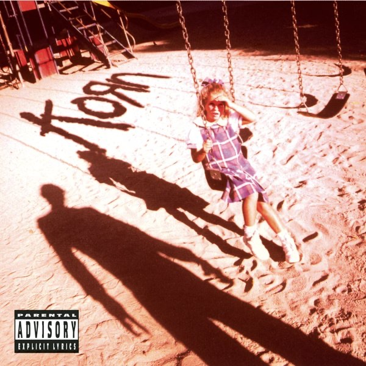
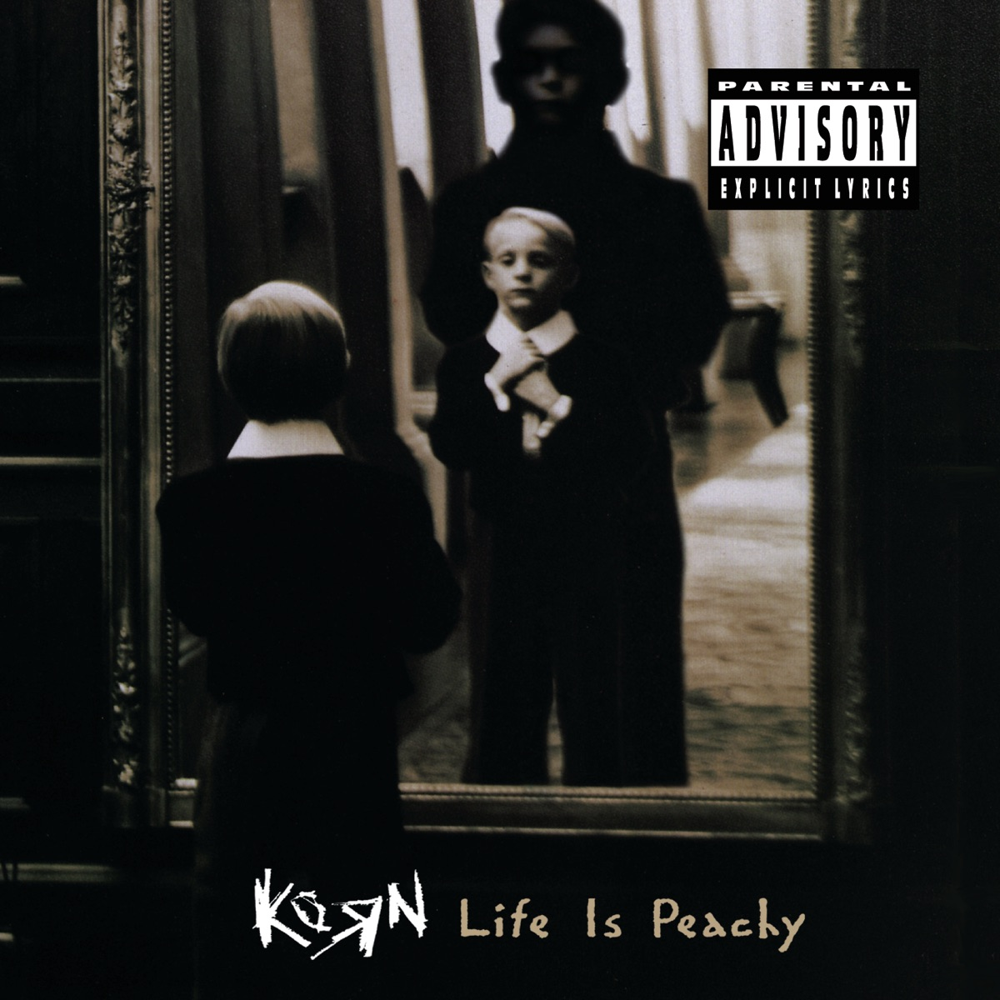
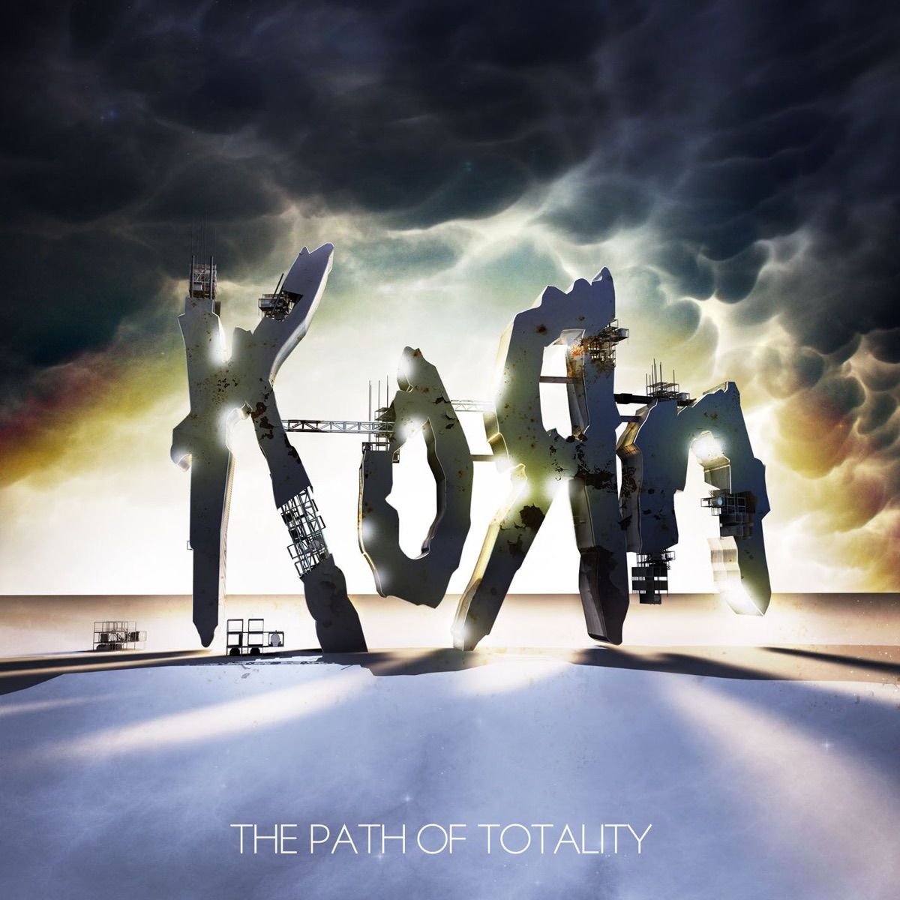
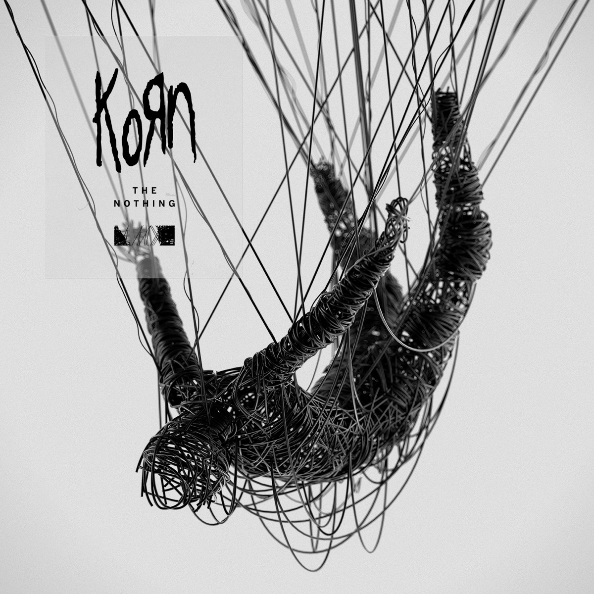
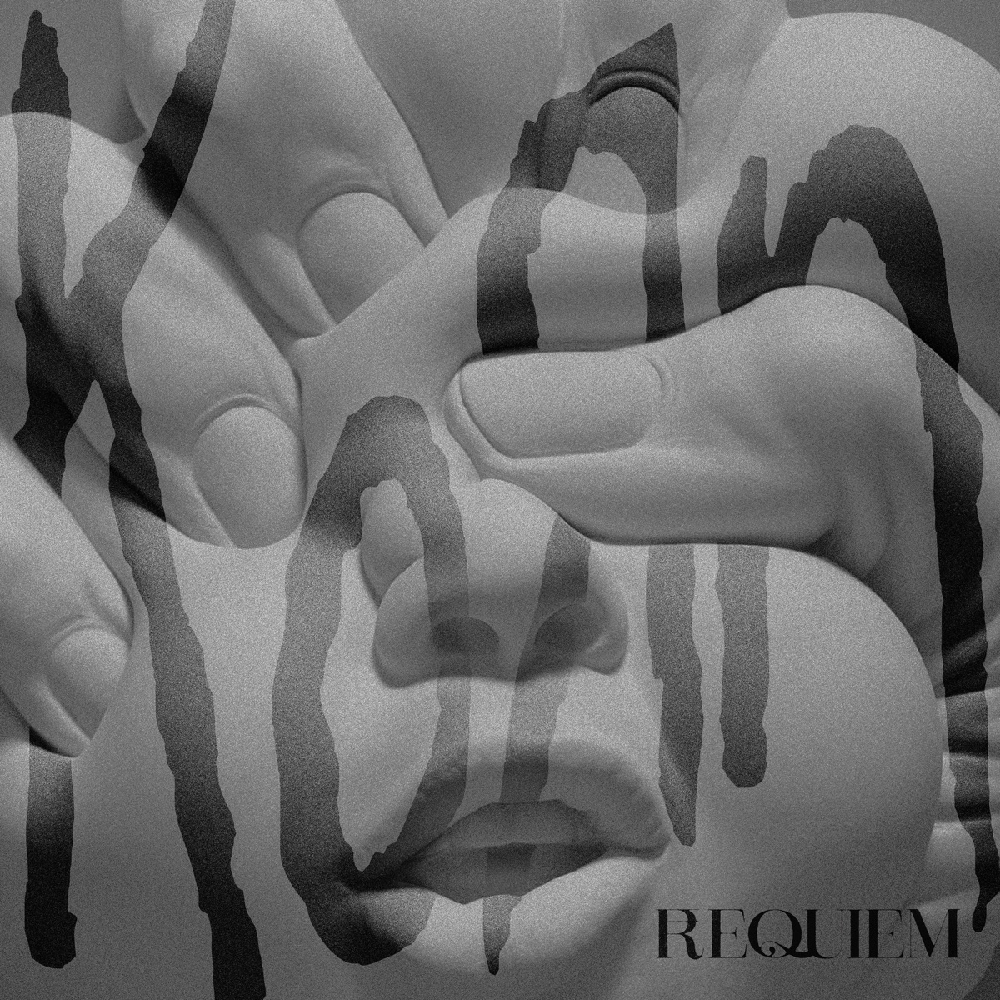

# 地下室里的野兽：Korn与失真的童年

*图：Korn 1994年同名首张专辑封面。图片取自 [Apple Music 公开唱片页](https://music.apple.com/us/album/korn/423045626)。*

先是一声钹，接着吉他像锈死的铁门被人从里面撞开，然后乔纳森·戴维斯（Jonathan Davis）用近乎询问的声音说：`Are you ready?`——这不是演唱会主持人的客套，它更像午夜高速公路旁一间废弃仓库发出的审讯。你准备好听见身体里的东西了吗，准备好承认羞耻、愤怒、被欺凌的童年、无法向任何人解释的恐惧了吗？

随后 `Blind` 落下来，沉得像整栋房子塌进地下室。

Korn——常见中文译名“科恩”——最重要的地方，不是他们后来被戴上“新金属祖师”这顶王冠，而是他们在九十年代初发明了一种身体语言：金属不再只是速度、独奏和英雄姿态，它可以佝偻着背，可以穿运动服，可以像嘻哈一样摇摆，可以让七弦吉他在最低处发出牲口般的喘息，也可以让一个成年男人在麦克风前哭、咆哮、呢喃，甚至把语言打碎成没有词义的音节。

## 贝克斯菲尔德：尘土、油田与五个怪人

Korn 于1993年在加州贝克斯菲尔德成立。吉他手詹姆斯·“Munky”·谢弗（James Shaffer）、吉他手布莱恩·“Head”·韦尔奇（Brian Welch）、贝斯手雷吉纳德·“Fieldy”·阿维祖（Reginald Arvizu）和鼓手大卫·西尔维里亚（David Silveria）中的几位曾在 L.A.P.D. 活动；他们后来遇见当时为 Sexart 演唱的乔纳森·戴维斯，于是那支真正改变重型音乐走向的阵容逐渐成形。

贝克斯菲尔德不是好莱坞。那里有内陆热浪、农业、公路、油田和一种被海岸繁华遗忘的粗砺。Korn 的音乐也不像从镀铬录音棚里开出来的跑车，更像一辆底盘过低、车门松动的旧车：低频一路摩擦地面，零件彼此碰撞，却拥有无法模仿的震动。

两把七弦吉他是骨架。Munky 与 Head 不把额外低音弦当作炫技工具，而是制造错位的切分、刮擦、噪点和骤然下沉的重击；Fieldy 的贝斯则故意保留琴弦撞击指板的咔哒声，像骷髅在空罐里跳舞。戴维斯的嗓音游走在耳语、哭喊、尖叫与节奏化吐字之间，风笛偶尔从墙角升起——一个曾在学校乐队里吹奏风笛的孩子，把古老乐器带进了现代噪声。

他们把放克、嘻哈、工业音乐和另类金属拧在一起。“nu metal”后来成为市场标签，装下无数穿宽裤的乐队；但Korn最初的声音不是配方，而像五个人在同一间屋里发现了一种此前没有名字的病症。

## 首张专辑：门后的孩子

1994年10月11日，制作人罗斯·罗宾逊（Ross Robinson）操刀的 **《Korn》** 发行。封面上，秋千旁的女孩被一个成年人的阴影笼罩；那不是用来取悦商店货架的图像，而是整张唱片的入口。`Blind`、`Clown`、`Faget`、`Shoots and Ladders` 与结尾的 `Daddy` 把欺凌、排斥、童年恐惧和性创伤带进重型音乐，拒绝以强者口吻包装自己。

`Shoots and Ladders` 从风笛进入，把英语童谣还原为隐含暴力的怪诞文本；`Daddy` 则以极难承受的情绪崩溃结束唱片。听者不应把真实创伤浪漫化成“伟大音乐必须支付的代价”。真正值得看见的，是一个人试图为过去找到声音，以及其他四名乐手没有用技巧遮住他的脆弱，而是围绕那道裂缝搭起沉重的墙。

1996年的 **《Life Is Peachy》** 更急、更脏、更像排练室直接起火。`A.D.I.D.A.S.` 把少年式欲望变成粗俗而上口的口号，`Twist` 则几乎抛弃词义，只剩喉咙、气息和节拍。Korn证明人声不必始终“表达一句话”，它也可以像鼓和失真器一样工作。

*图：《Life Is Peachy》（1996）封面。图片取自 [Apple Music 公开唱片页](https://music.apple.com/us/album/life-is-peachy/967389561)。*

## 跟随领袖：怪胎进入主流

1998年的 **《Follow the Leader》** 把Korn推到全球主流中心。唱片既保留他们的低沉怪响，又让嘻哈关系更加公开：Ice Cube、Tre Hardson 和 Fred Durst 等人参与其中。`Got the Life` 带着反常的舞池弹性，`Freak on a Leash` 则把压抑、爆发与戴维斯标志性的无词吟唱压缩成一首时代歌曲。那段“boom-da-da”不是语言失败，而是语言抵达极限之后，身体接管了叙述。

同年，Korn 发起首届 **Family Values Tour**，把重型音乐、说唱与年轻亚文化装进同一辆巡演巴士；1999年7月23日，他们又在 Woodstock ’99 面对巨大人海演出。那场音乐节后来因暴力、火灾和组织灾难留下阴影，Korn的现场却仍展示了一个时代的规模：曾躲在卧室里听怪音乐的人，原来足以填满地平线。

1999年的 **《Issues》** 没有简单复制胜利。`Falling Away from Me` 以反复下坠的吉他描绘无法逃离的压迫，`Make Me Bad` 则让阴暗情绪进入更精密的电子空间。封面那只破损布偶像乐队的缩影：针脚外露，身体不完整，却被无数听众抱在怀里。

## 声音继续变形

Korn没有停在世纪之交。2002年的 **《Untouchables》** 制作庞大而冰冷，开场 `Here to Stay` 像液压机反复压下，并为乐队赢得格莱美“最佳金属表演”；此前 `Freak on a Leash` 的音乐录像已获得格莱美“最佳短篇音乐录影带”。2003年的 **《Take a Look in the Mirror》** 重新收紧拳头，`Did My Time` 与 `Right Now` 粗暴直接。

2005年是断裂点。Head 离开乐队，后来公开谈及成瘾、信仰和照顾女儿的需要；同年 **《See You on the Other Side》** 用 `Twisted Transistor`、`Coming Undone` 打开更工业化、更易进入的节奏。大卫·西尔维里亚随后离开，雷·卢齐尔（Ray Luzier）最终成为稳定鼓手。Korn不再是原始五人，却没有停止寻找新的身体。

2011年的 **《The Path of Totality》** 是最冒险的转弯之一。他们与 Skrillex、Kill the Noise、Noisia 等电子制作人合作，把dubstep的低频坠落接入七弦吉他的沟壑。`Narcissistic Cannibal` 像夜店音响和金属扩音箱在城市地下相撞。有人把它视为背叛，有人听见的却是Korn一贯的本能：既然九十年代可以把嘻哈带进金属，为什么新的电子低频不能再次进入？

*图：《The Path of Totality》（2011）封面。图片取自 [Apple Music 公开唱片页](https://music.apple.com/us/album/the-path-of-totality/474039306)。*

2013年，Head 回归并参与 **《The Paradigm Shift》**，两把吉他重新咬合。之后的 **《The Serenity of Suffering》**（2016）以 `Rotting in Vain` 找回粗粝重量。但“找回”不是回到1994年——他们已经换过成员、厂牌、制作方式，也穿过成瘾、疾病、家庭变故与漫长巡演，旧声音只能在新身体里重生。

## 空无，以及安魂

2019年的 **《The Nothing》** 是Korn后期最沉重的作品之一。戴维斯在妻子Deven去世后面对哀痛，开场风笛像葬礼队伍从远处接近，`Cold` 把死亡金属般的低吼、电子纹理和Korn式律动压在一起。专辑封面的线绳人形蜷缩、悬吊，像一个被悲伤控制的木偶。

*图：《The Nothing》（2019）封面。图片取自 [Apple Music 公开唱片页](https://music.apple.com/us/album/the-nothing/1470004964)。*

这里同样不能说痛苦“成就”了唱片。丧失不是创作燃料，而是一场真实灾难；音乐只是幸存者在灾难之后仍能完成的动作。Korn最可贵的传统从来不是展示伤口，而是拒绝假装伤口不存在。

2021年，Fieldy 因个人原因暂离巡演；他并未被简单宣布永久离队。2022年的第十四张录音室专辑 **《Requiem》** 在疫情时期较少巡演压力的环境中完成，篇幅更紧凑。`Start the Healing` 没有宣告痊愈，只提出开始：让低频仍然压在胸口，但给呼吸留下几秒钟。

*图：《Requiem》（2022）封面。图片取自 [Apple Music 公开唱片页](https://music.apple.com/us/album/requiem/1591131379)。*

2024年，Korn 为同名首专三十周年举行纪念演出。三十年足以让一种曾被嘲笑的噪声变成传统，让当年被视为怪胎的孩子成为父母，也足以让“新金属”从贬义标签变成一代人重新挖掘的遗产。可当 `Blind` 的开头再次响起，那些历史名词都会暂时退场，只剩同一个问题。

你准备好了吗？

## 野兽没有被治愈

Korn的音乐不是胜利者音乐。它不教人昂首走出房间，不保证明天更好，也不把创伤整理成一句漂亮格言。它更像在封闭车厢里拧开一扇小窗：外面仍是贝克斯菲尔德的热浪和尘土，发动机仍在抖，伤口仍然存在，但你终于听见别人的身体也发出相似噪声。

这就是Korn留下的东西。两把七弦吉他像生锈机械彼此啃咬，贝斯敲着空骨头，鼓点让地板移动，风笛从废墟后面升起，而乔纳森·戴维斯站在那支著名的H.R. Giger麦克风架前，把一句话唱到碎裂，再把碎片变成节奏。

野兽没有被治愈。

它只是终于有了名字。

---

## 录音室专辑目录

以下仅列Korn正式录音室专辑，不把现场、精选及混音唱片混入：

1. *Korn*（1994）
2. *Life Is Peachy*（1996）
3. *Follow the Leader*（1998）
4. *Issues*（1999）
5. *Untouchables*（2002）
6. *Take a Look in the Mirror*（2003）
7. *See You on the Other Side*（2005）
8. *Untitled*（2007）
9. *Korn III: Remember Who You Are*（2010）
10. *The Path of Totality*（2011）
11. *The Paradigm Shift*（2013）
12. *The Serenity of Suffering*（2016）
13. *The Nothing*（2019）
14. *Requiem*（2022）

## 主要资料与图片来源

1. [MusicBrainz：Korn 艺人及发行数据](https://musicbrainz.org/artist/ac865b2e-bba8-4f5a-8756-dd40d5e39f46)
2. [Apple Music：Korn 艺人页面](https://music.apple.com/us/artist/korn/466532)
3. [Billboard：Korn 艺人、榜单与新闻档案](https://www.billboard.com/artist/korn/)
4. [GRAMMY.com：首张专辑三十周年与新金属影响回顾](https://www.grammy.com/news/korn-debut-album-anniversary-nu-metal-impact/)
5. [Rolling Stone：Korn 1994年首张专辑口述史](https://www.rollingstone.com/music/music-news/korns-1994-debut-lp-the-oral-history-of-the-most-important-metal-record-of-the-last-20-years-44821/)
6. [Rolling Stone：2024年三十周年巡演报道](https://www.rollingstone.com/music/music-news/korn-tour-dates-1234994497/)
7. [Rolling Stone：Fieldy于2021年暂离巡演](https://www.rollingstone.com/music/music-news/korn-bassist-fieldy-hiatus-1187242/)
8. [Billboard：Head回归及《The Paradigm Shift》](https://www.billboard.com/music/music-news/korn-cleans-up-and-evolves-on-the-paradigm-shift-the-bands-12th-top-10-album-5755783/)
9. [Billboard：1998年Korn与新金属主流化历史](https://www.billboard.com/music/music-news/biggest-day-nu-metal-history-1998-korn-kid-rock-8458565/)
10. [Apple Music：《Korn》](https://music.apple.com/us/album/korn/423045626)
11. [Apple Music：《Life Is Peachy》](https://music.apple.com/us/album/life-is-peachy/967389561)
12. [Apple Music：《Follow the Leader》](https://music.apple.com/us/album/follow-the-leader/1165630592)
13. [Apple Music：《Issues》](https://music.apple.com/us/album/issues/193152832)
14. [Apple Music：《Untouchables》](https://music.apple.com/us/album/untouchables/271792930)
15. [Apple Music：《Take a Look in the Mirror》](https://music.apple.com/us/album/take-a-look-in-the-mirror/521246150)
16. [Apple Music：《The Path of Totality》](https://music.apple.com/us/album/the-path-of-totality/474039306)
17. [Apple Music：《The Nothing》](https://music.apple.com/us/album/the-nothing/1470004964)
18. [Apple Music：《Requiem》](https://music.apple.com/us/album/requiem/1591131379)

> 图片仅用于音乐史评论与作品识别。专辑封面取自 Apple Music 公开唱片页。涉及成瘾、童年创伤和丧亲的段落只概述公开资料，不把苦难解释为创造力的必然来源。