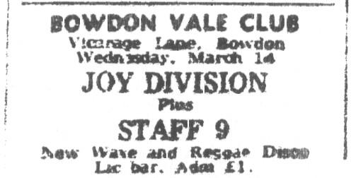
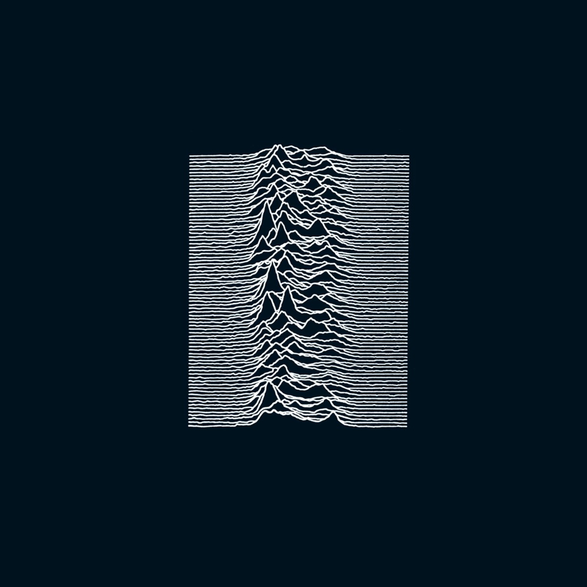
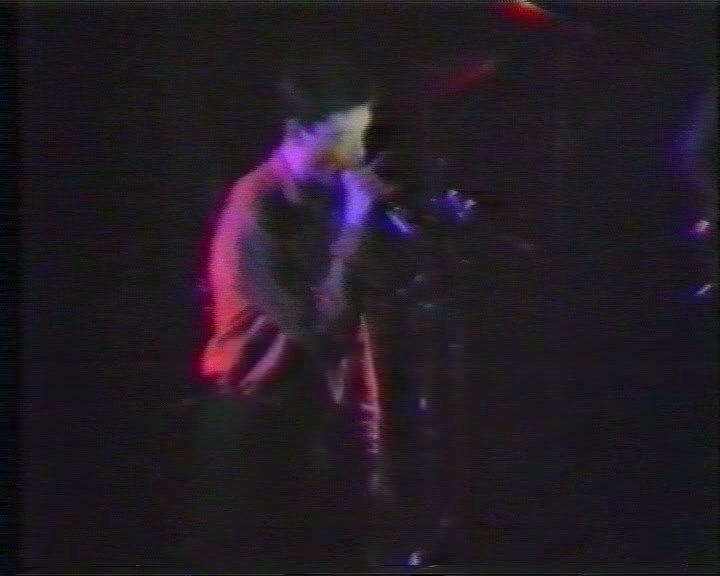
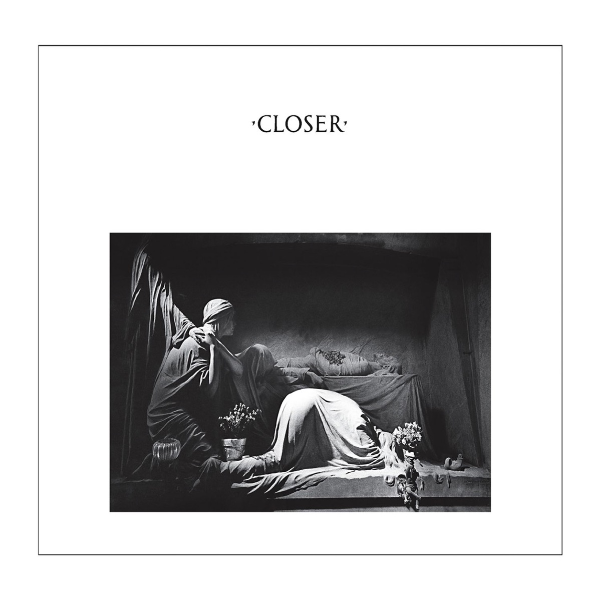
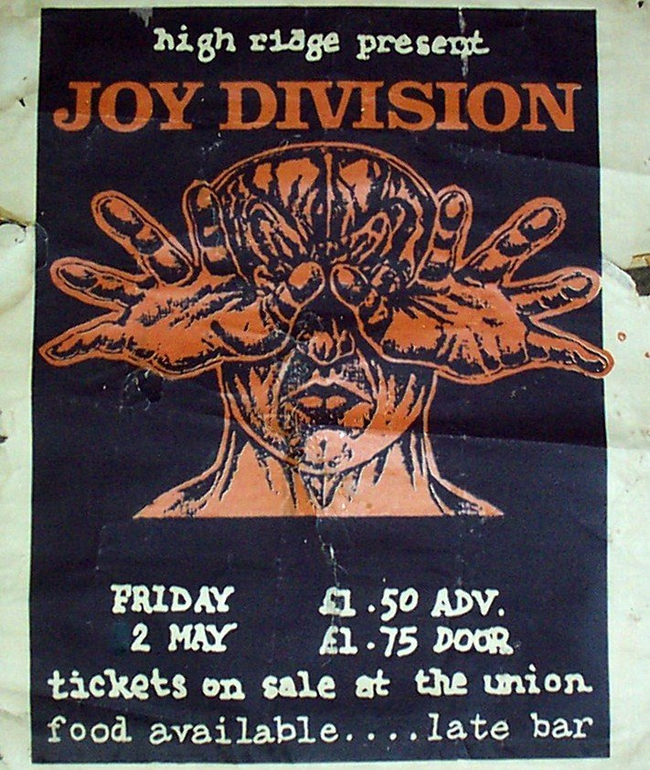
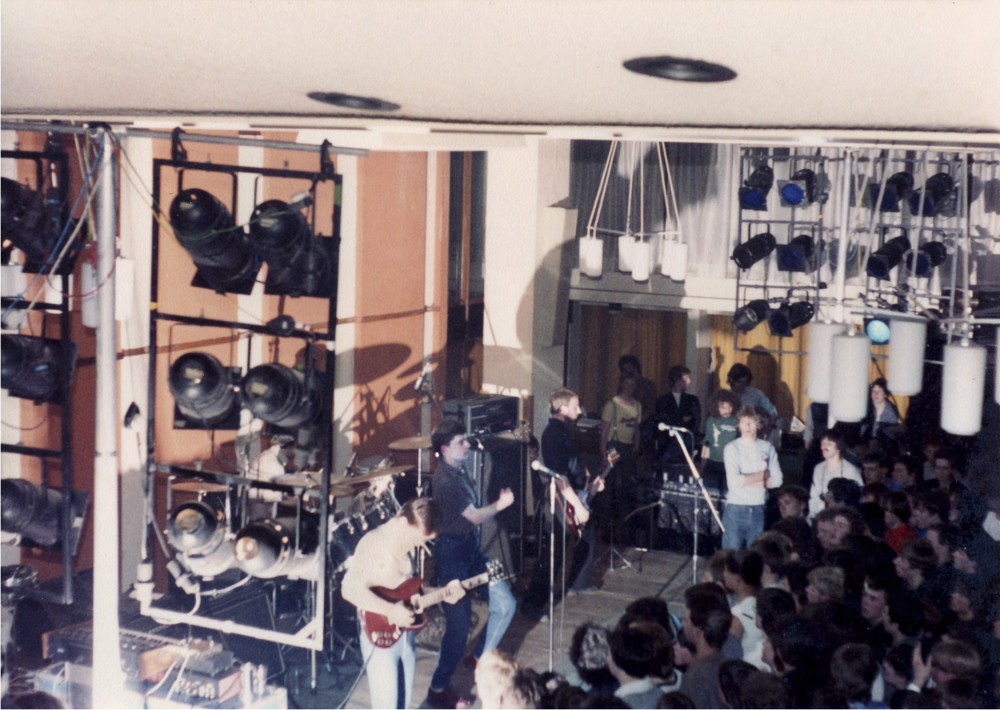
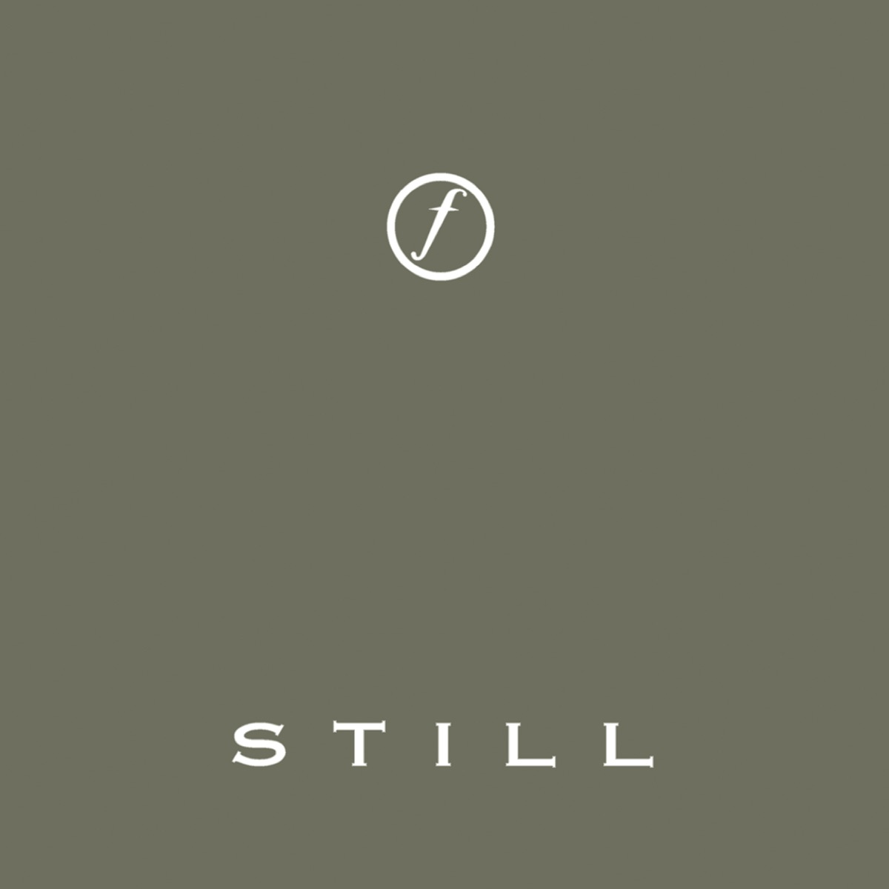

# 大梦JoyDivision

*图：伊安·柯蒂斯（Ian Curtis）。图片由 [Joy Division Central 的人物资料页](https://www.joydiv.org/iancurtis.htm)收录，原页链接至 New Wave Photos。*

有些乐队像夏天，门一开，阳光和年轻人的叫喊就全部涌进来；Joy Division 不是。Joy Division 像凌晨四点的曼彻斯特，工厂停工，砖墙吸饱雨水，路灯照着一条没有人的高架桥，而远处仍有机器没有关掉——它发出低沉、稳定、不能解释的轰鸣。

这支乐队真正存在的时间短得令人难以置信。从1976年的几名朋克青年，到1980年伊安·柯蒂斯去世后结束，不过三年多；以 Joy Division 之名活动，更只有两年多。他们留下两张录音室专辑、一批单曲和数量有限的演出，却为后朋克、哥特摇滚、独立音乐乃至后来整片冷峻的电子声场挖出一条地下河。无数人沿着它走进黑暗，又从黑暗里学会辨认微光。

## 从 Warsaw 出发：四个年轻人与一座工业城市

故事通常从1976年6月4日和7月20日、Sex Pistols 在曼彻斯特 Lesser Free Trade Hall 的两场演出讲起。伯纳德·萨姆纳（Bernard Sumner）、彼得·胡克（Peter Hook）和后来担任巡演事务的特里·梅森（Terry Mason）受到刺激，决定组建乐队；伊安·柯蒂斯也受到这两场曼彻斯特演出的影响，并在不久后成为主唱——不过，不同回忆对他具体参加了其中哪一场并不完全一致。朋克给予他们的不是一套必须遵守的声音，而是一张准许证：不会演奏也可以开始，城市不肯给你的东西，可以自己制造。

乐队最初叫 **Warsaw**，名字来自大卫·鲍伊《Low》中的 `Warszawa`。1977年5月29日，他们在曼彻斯特 Electric Circus 首次登台；几次更换鼓手后，斯蒂芬·莫里斯（Stephen Morris）加入，经典的四人阵容终于形成：柯蒂斯唱歌并写词，萨姆纳弹吉他和合成器，胡克把贝斯弹得像一件高亢的主奏乐器，莫里斯则用近乎机械的精准建立骨架。

1978年初，为避免与 Warsaw Pakt 混淆，他们改名 **Joy Division**。这个名字取自卡罗尔·切廷斯基的小说《玩偶之屋》，指向纳粹集中营中遭受性奴役的女性囚犯，因此从来不是一个可以轻巧略过的名字。它为乐队带来长期的政治误读，也把战争、控制、屈辱与人的异化提前压进了他们的历史。1月25日，他们在曼彻斯特 Pips Disco 完成改名后的首演。

*图：1979年3月14日 Bowdon Vale Club 演出广告，票价一英镑。图片来源：[Joy Division Central 演出档案](https://www.joydiv.org/c140379.htm)。*

那时他们还不是后来唱片封面上冷静的黑白符号。他们挤在小俱乐部、青年会和酒吧里，器材粗陋，观众靠得很近，声音带着朋克尚未脱落的铁锈。1978年4月14日，柯蒂斯在 Rafters 的比赛演出中逼问 Granada 电视主持人托尼·威尔逊，为什么不给他们上电视。那股近乎冒犯的急切奏效了：威尔逊和后来成为经理人的罗布·格雷顿（Rob Gretton）都被现场能量击中。同年6月，乐队登上 Russell Club 的 Factory 之夜；9月20日，他们在 Granada Reports 演奏 `Shadowplay`，第一次让电视机前的人看见伊安那种仿佛身体被无形电流牵引的舞蹈。

## 未知的欢愉：把房间里的空气也录下来

1979年4月，Joy Division 与制作人马丁·汉内特（Martin Hannett）在斯托克波特的 Strawberry Studios 录制首张专辑。**《Unknown Pleasures》** 于同年6月15日由 Factory Records 发行。彼得·萨维尔（Peter Saville）的封面没有乐队名：黑色宇宙中，一组白色脉冲依次升起——那是脉冲星 CP 1919 的射电脉冲图像。它后来成为被复制无数次的图腾，可真正令人上瘾的仍是唱针落下后的空间。

*图：《Unknown Pleasures》（1979）封面。唱片封面图片取自 [Apple Music 公开唱片页](https://music.apple.com/us/album/unknown-pleasures-2019-digital-master/1476702180)。*

汉内特没有照搬乐队凶猛、拥挤的现场。他抽走一部分热量，把鼓放进冰冷回声里，让胡克的贝斯悬在高处，让吉他像工厂窗户上一道苍白反光；据成员后来回忆，乐队起初并不完全喜欢这种处理。可也正是他录下了乐器之间的空白，仿佛连房间里的湿气、远处电梯的下降和城市被掏空后的寂静都进入磁带。

`Disorder` 奔跑，却不知道出口；`New Dawn Fades` 像一个人在黎明前承认自己已经走不动；`She’s Lost Control` 源于柯蒂斯工作中接触过的一位癫痫患者，而命运随后把同一种疾病交还给他。1979年初，柯蒂斯被诊断患有癫痫。频闪灯、疲劳、睡眠不足和密集巡演都可能诱发发作，药物也带来沉重副作用。他那抽动、挥臂的舞台语言在确诊以前已经形成；随着病情加重，编排过的动作与真实发作之间出现了观众难以辨认的危险重叠。不能把二者浪漫地画上等号：那既是表演语言，也是一个年轻人对失控身体的挣扎，不是一场为后世准备的漂亮神话。

## 伊安·柯蒂斯：站在两扇门之间的人

伊安1956年7月15日出生，成长于麦克尔斯菲尔德。他迷恋大卫·鲍伊、伊吉·波普，也阅读J.G.巴拉德和威廉·巴勒斯。他的歌词很少像日记那样解释自己，更像从封闭房间传出的报告：孤立、服从、欲望、羞耻、崩塌，以及人与人之间那块无法跨越的空地。他声音低沉，不是因为他知道所有答案，而像一个太早听见问题的人。

舞台上的他完全不同。他抓住麦克风，手臂切开空气，双腿骤然弹跳、折叠，仿佛有人从黑暗里操作他的关节。1979年9月15日，Joy Division 登上 BBC2 的 *Something Else*，演奏 `Transmission` 与 `She’s Lost Control`；10月至11月，他们随 Buzzcocks 完成英国巡演；10月16日，又在布鲁塞尔 Plan K 登台。低清录像中的红光像火警，人物只剩晃动的轮廓，但节奏仍穿过四十多年的磁带噪点冲到眼前。

*图：据档案页标注，画面来自1979年10月16日布鲁塞尔 Plan K 演出录像。图片来源：[Joy Division Central 演出档案](https://www.joydiv.org/c161079.htm)。原始影像清晰度有限，不据画面单独辨认人物。*

1979年12月18日，他们在巴黎 Les Bains Douches 演出；1980年1月又穿过荷兰、比利时和德国，在阿姆斯特丹 Paradiso、埃因霍温 Effenaar 等地留下后来广泛流传的现场录音。那些夜晚，胡克的贝斯像探照灯，莫里斯的鼓像轨道，萨姆纳的吉他像金属门被风反复撞击，而伊安站在中间，不像明星，更像一根正在承受整栋建筑重量的梁。

与此同时，他的现实生活不断收紧：癫痫及治疗、日间工作与巡演的疲惫、婚姻危机、与比利时记者阿妮克·奥诺雷（Annik Honoré）的亲密关系、即将到来的美国巡演，以及一个二十多岁的人无法向任何一边完成交代的恐惧。我们可以列出这些压力，却不能假装已经替他解释死亡。人的绝望不是一道供传记作者轻易解出的方程。

## 《Closer》：不是遗书，是四个人共同抵达的边界

1980年3月，Joy Division 在伦敦 Britannia Row Studios 录制第二张专辑 **《Closer》**。如果《Unknown Pleasures》是一座夜间工厂，《Closer》就是工厂熄灯之后仍留在墙里的回声。合成器更多，节奏更仪式化，声音从摇滚乐的房间走向某种冰冷、辽阔的精神建筑。`Atrocity Exhibition` 像机械游行，`Isolation` 在电子节拍中发出求救，`Twenty Four Hours` 一再冲锋又一再坠落，最后的 `Decades` 则像一队年轻人走进他们尚不能理解的荒原。

*图：《Closer》（1980）封面，彼得·萨维尔设计，照片取自热那亚斯塔列诺公墓的阿皮亚尼家族墓。唱片封面图片取自 [Apple Music 公开唱片页](https://music.apple.com/us/album/closer-collectors-edition/266610001)。*

`Love Will Tear Us Apart` 没有收进这两张录音室专辑，却成了他们最著名的歌。它的旋律甚至称得上明亮，歌词却看着亲密关系在日常生活中变冷：不是一声宏大的爆炸，而是床铺、语气和沉默一点点把两个人分开。它之所以长久，并非因为柯蒂斯后来的死亡替它镀了金，而是因为活着的人都可能在其中认出自己。

1980年4月，柯蒂斯的健康与精神状态已经严重恶化，部分演出被取消。5月2日，Joy Division 在伯明翰大学 High Hall 完成最后一场演出，首次公开演奏 `Ceremony`。唱到 `Decades` 时，伊安倒下并被扶离舞台，之后仍回来演唱安可曲 `Digital`。现场录音后来收入1981年的遗作集 **《Still》**。

*图：1980年5月2日伯明翰大学 High Hall 演出海报。海报曾将日期误印为“22 May”，后划去第一个数字2。图片来源：[Joy Division Central：最后一场演出档案](https://www.joydiv.org/c020580.htm)。*

*图：据档案页标注，画面来自1980年5月2日 High Hall 演出。来源同上；该页说明照片曾见于 Peter Hook 藏品拍卖，原摄影者／权利人未确定，本文仅作历史评论配图。*

5月18日，距离乐队计划启程赴美只有两天，23岁的伊安·柯蒂斯在麦克尔斯菲尔德家中自杀离世。7月18日，《Closer》在他死后发行。萨姆纳、胡克与莫里斯依照过去的约定，不再沿用 Joy Division 之名，后来与吉莉安·吉尔伯特组成 New Order。那不是简单的续集，而是幸存者把悲伤接入鼓机与合成器之后，重新发明活下去的速度。

我们不该把伊安的死亡称为“完成作品”，也不该把疾病当作天才必须缴纳的费用。死亡切断的是更多可能：更多唱片、更多争吵、更多失败，也可能有康复、衰老和某个平凡早晨。他留下的伟大来自生前的写作、声音和四个人的共同创造，而不是生命停止的方式。

## 大梦醒来以前

Joy Division 的音乐为什么仍然年轻？也许因为它从未许诺治愈。它只承认：人与城市之间有裂缝，人与爱人之间有裂缝，身体与意志之间也有裂缝；然后四件乐器走到裂缝边上，朝里面发出声音。

我把《Unknown Pleasures》放进深夜，白色脉冲在黑暗中一层层升起；再把《Closer》翻到最后，`Decades` 的合成器像雾中的钟。曼彻斯特已经不是1979年的曼彻斯特，旧厂房会改成公寓，俱乐部会拆除，年轻人会被照片固定成永不变老的面孔。可是 `Transmission` 仍命令我们跳舞，`Atmosphere` 仍劝我们不要走开，`Love Will Tear Us Apart` 仍在每一间失眠的卧室里，把爱与分离放到同一张床上。

Joy Division 是一场大梦。梦里没有彩色高速公路，只有雨、砖墙、低垂电线和四个年轻人；他们沿着城市最暗的边缘往前开，车灯坏了一盏，油表不断下降，却把收音机拧得更响。后来梦突然断了，醒来的人站在1980年5月的清晨，不知道该怎样继续。

于是他们继续。

于是我们也继续。

---

## 文中涉及与推荐聆听的唱片

### 两张核心录音室专辑

- *Unknown Pleasures*（1979）
- *Closer*（1980）

### 重要单曲、EP与遗作整理

- *An Ideal for Living*（1978，EP）
- *Transmission*（1979，单曲）
- *Licht und Blindheit*（1980，限量单曲，收录 `Atmosphere` 与 `Dead Souls`）
- *Love Will Tear Us Apart*（1980，单曲）
- *Still*（1981，遗作／现场合辑）
- *Substance*（1988，单曲与非专辑曲目合辑）
- *Heart and Soul*（1997，生涯盒装精选）
- *Les Bains Douches 18 December 1979*（2001，现场专辑）

*图：《Still》（1981）封面。唱片封面图片取自 [Apple Music 公开唱片页](https://music.apple.com/us/album/still-collectors-edition/275968300)。*

## 主要资料与图片来源

1. [Joy Division Central：乐队历史第一部分](https://www.joydiv.org/hist2.htm)
2. [Joy Division Central：乐队历史第二部分](https://www.joydiv.org/hist3.htm)
3. [Joy Division Central：Ian Curtis 生平资料](https://www.joydiv.org/iancurtis.htm)
4. [Joy Division Central：成员与关联人物](https://www.joydiv.org/members.htm)
5. [Joy Division Central：录音与 BBC Session 档案](https://www.joydiv.org/sessions.htm)
6. [Joy Division Central：演出总档案](https://www.joydiv.org/concerts.htm)
7. [MusicBrainz：Joy Division 艺人及发行数据](https://musicbrainz.org/artist/9a58fda3-f4ed-4080-a3a5-f457aac9fcdd)
8. [Apple Music：Joy Division 艺人页面](https://music.apple.com/us/artist/joy-division/722383)
9. [Factory Records Catalogue：《Unknown Pleasures》（FACT 10）发行资料](https://factoryrecords.org/cerysmatic/fact10.php)
10. [Factory Records Catalogue：《Closer》（FACT 25）发行资料](https://factoryrecords.org/cerysmatic/fact25.php)
11. [Rock & Roll Hall of Fame：Joy Division／New Order 乐队简史](https://rockhall.com/inductees/joy-division-new-order/)

> 图片仅用于音乐史评论、作品识别与资料说明。专辑封面来自 Apple Music 公开唱片页；历史照片、录像帧和演出印刷品来自正文标注的 Joy Division Central 档案页。原摄影者或权利状态无法从来源页确认的图片，已在图注中明确说明。