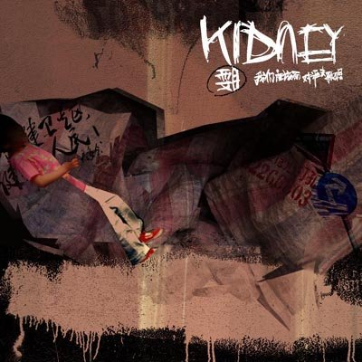
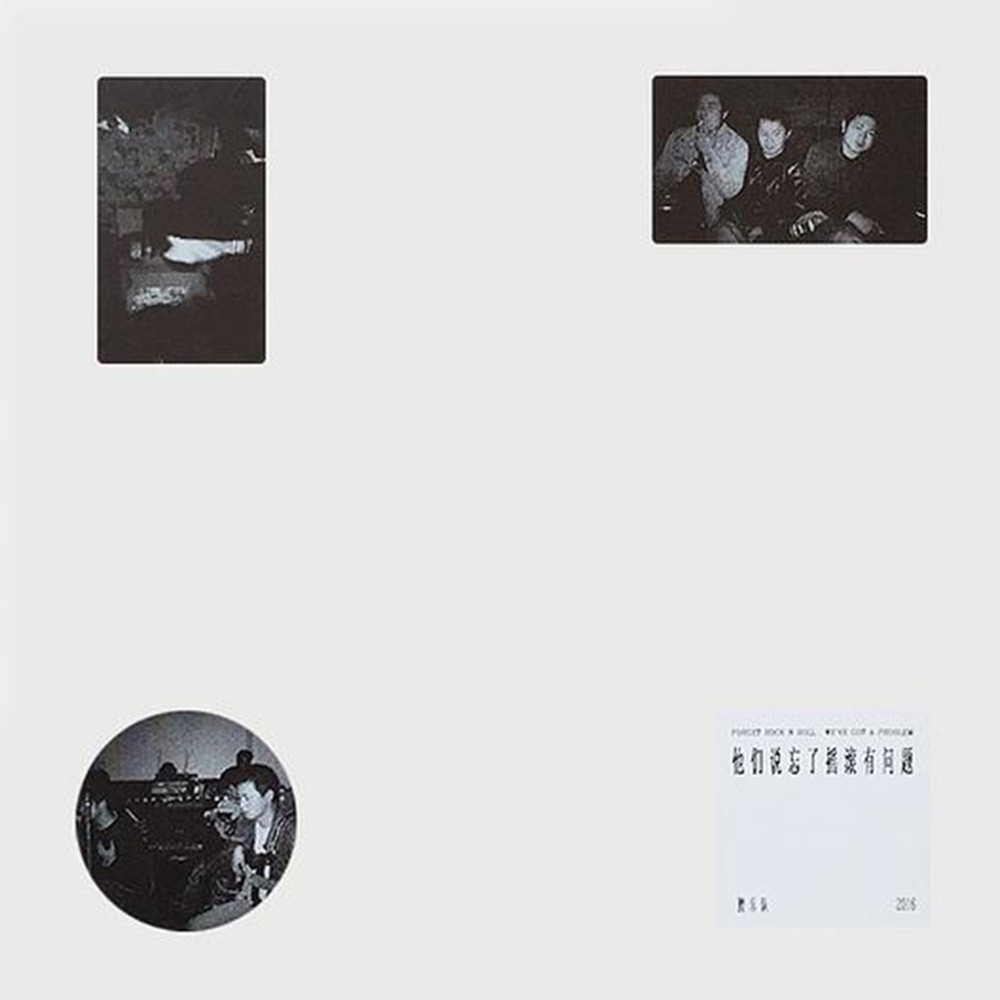
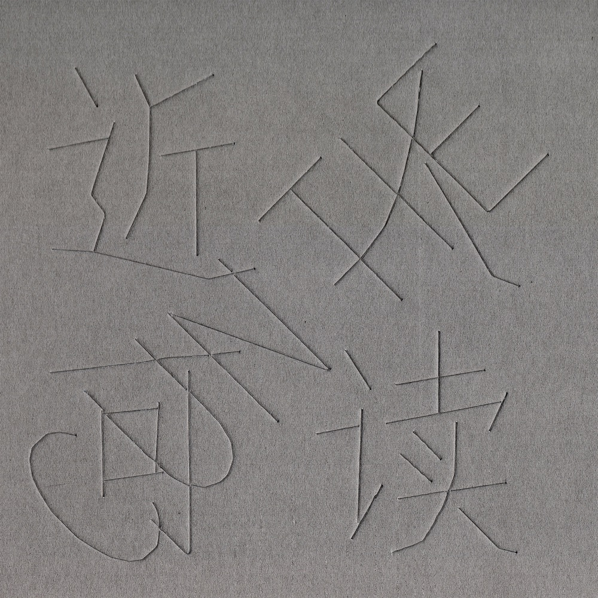

# 寸铁靠腰，谁在替沉默歌唱

*图：《我们究竟应该面对谁去歌唱》（2005，摩登天空）封面。暗色 DIY 拼贴，揉皱的纸堆间散落着手写汉字与"KIDNEY"涂鸦——腰乐队英文名的直译，腰即肾，一个器官，一句双关。图片来源：[网易云音乐](https://music.163.com/#/album?id=38697)。*

云南没有摇滚。这句话不是抱怨，是刘弢自己说的。他说他们是云南的怪胎，一切都靠直觉。

昭通在云南东北角，乌蒙山腹地，一座五线小城。一九九八年冬天，烟厂工人刘弢和几个有正经工作的年轻人凑在一起，组了一支业余乐队，取名叫腰。不是比喻，不是缩写，就是身体上的那个部位——撑住上半身和下半身的那一段。后来他们把这个名字译成英文，叫 Kidney，肾。荒诞、具体、带着体温，像他们的歌。

二〇二六年回头去看，腰乐队只剩三张录音室专辑，一个现场记录，和无数拒绝：拒绝采访，拒绝商演，拒绝音乐节，拒绝微博，拒绝成为任何人想象中的那支乐队。他们存在了十六年，然后在一个普通的夏天，宣布"腰就到站"。四年后，刘弢带着新的伙伴回来，改名叫寸铁。

寸铁，手无寸铁的铁。腰没了，剩下铁。这个命名本身就是一首诗。

## 一、面对谁去歌唱

二〇〇五年，腰乐队的第一张专辑发行，名字是一个问句：《我们究竟应该面对谁去歌唱》。

这个问题的来历，后来被反复讲述：他们说想为民工、为底层的人民写歌，写来写去发现，民工和底层人民并不听他们的歌，听他们歌的是先锋，是知识分子，是另一群坐在房间里的人。这个错位滑稽又残酷，于是他们把它写进了专辑的名字。

专辑由摩登天空发行——据网易订阅的文章回忆，这被当地视为一件大事，有传闻说腰是摩登天空在中国签下地理位置最遥远的乐队之一。首张专辑收录十一首歌：`紧张`、`民族`、`日常`、`歌唱`、`小城`、`严肃`、`可乐`、`致敬`、`再见`、`不哭`。其中`致敬`的完整名字是"致敬 Joy Division"。一支云南小城的乐队，把第一句致敬送给曼彻斯特的黑暗——这件事本身就说明了一切。

那是"腰"最粗糙、最阴冷、最不好听的时期。豆瓣上有乐迷后来补标说，早期的腰"十颗星都不够给"，歌词隐晦却充满反思，音乐在那个年代做到先锋；也有人直言内容一般，专辑名比内容加分。两种声音都真实。第一张专辑的豆瓣评分是 8.3，四千多人评价。它不是被广泛承认的神作，它是被少数人死死攥住的信物。

专辑在云南做了首发演出。一个只能装两百人的酒吧，座无虚席。乐队五个人几乎全程坐着演完了整场，观众没有喊叫，没有蹦跳，只是听。在一个普遍认为摇滚乐就是吵闹的年代，这场面近乎一种行为艺术。

首专发行那年，这张唱片获得了第六届华语音乐传媒大奖年度最佳新乐队提名。对一支昭通乐队来说，这是北京第一次朝他们的方向看了一眼。

## 二、忘了摇滚有问题

二〇〇八年一月二十八日，腰乐队的第二张专辑《他们说忘了摇滚有问题》全国发行。简介里说，这是进入二〇〇八年以来，中国大陆乐队公开出版的第一张专辑。

这一次他们没有留在摩登天空。专辑以他们自己的"局部娱乐"制作机构的名义，联合广州独立厂牌元音唱片出版。全部录制和混音在昭通完成，花了半年。精装限量版，全国只卖一千张。

一千张。这个数字后来成了传说的一部分。

专辑的豆瓣条目简介里有一段话，出自厂牌手笔："在这张专辑中，这支五线城市的业余乐队不再似以往粗糙阴冷的地下之声，转变成一个表面深情款款、实则暗流汹涌的家庭录音室项目。"从第一张的刀，变成了第二张的鞘。刀还在，只是收起来了。

有人评价这张唱片是"这世上最难唱的一曲悲歌"。这句话被写进再版简介，被无数乐迷引用，成了关于这张专辑最著名的一句判词。豆瓣原版条目 8.9 分，一万多人评价。

二〇一六年，大福唱片把这张专辑做成双张黑胶再版，请美国 Treelady Studio 的母带工程师 Garrett Haines 重新母带，原版设计师白冈冈重新设计——整个包装盒没有使用任何专业设计软件。再版条目的评分涨到 9.5，一千七百多人评价。一张绝版多年的唱片，靠再版在八年后的评分反超了原版，这在中国独立音乐里并不多见。

时间没有把这张专辑吹散。风往回吹了。

## 三、相见恨晚，然后分手

二〇一四年七月二十四日，《相见恨晚》发行，出版者是"局部娱乐"。豆瓣 9.4 分，两万多人评价，五星接近八成。这是腰乐队评分最高、传播最广的一张唱片，也是最后一张。

专辑文案是刘弢写的，像一封告别信："我们有幸存活的时空早已精彩过头，我们心情经常不好；以至于我们还有兴致来完成这一张甜腻黑暗的唱片……因为唱片出来，'腰'就到站，所以一直拖着，想和你们多玩玩。如果这是一场磨人的爱情……那么现在就要分手。他们已谢幕，你们接着演。"

唱片出来之日，就是乐队解散之时。他们把解散做成了专辑的最后一首歌。

《相见恨晚》收录八首歌：`情书`、`不只是南方`、`一个短篇`、`暑夜`、`不是情书`、`我爱你`、`硬汉`、`晚春`。`一个短篇`后来成为他们最广为流传的歌，歌词被乐迷整段抄录在豆瓣上："旋转，跳跃喔，他感到每条路都在头痛……那些男人爱的男人爱市政，市政爱市民，市民爱流连。"刘弢的词在这里抵达了一种罕见的质地：戏谑的、悲壮的、每个名词都像在站岗。

豆瓣上有一条二〇一四年八月的高赞短评写道："这真的是我买过最贵的碟了。"实体稀缺、定价高昂、乐队几乎不演出——腰乐队的唱片在二手市场上逐年涨价，成了中国独立摇滚最贵的一批收藏品之一。他们越沉默，东西越贵；他们越拒绝，传说越长。

乐迷在豆瓣短评里写："把所有的赞美献给腰。"另一条写："你消失在时代中，然后跑进永恒里。"

## 四、寸铁演腰，下不为例

二〇一七年六月，刘弢重组乐队，改名寸铁。九月十七日，杭州内耳音乐节，寸铁登台，演的全是腰的歌。这场演出后来以现场专辑的形式发布，名字只有八个字：《寸铁演腰，下不为例》。豆瓣 9.5 分，六百多人评价。

下不为例。演一次，就是告别一次。

《寸铁演腰，下不为例》的曲目单像一份遗嘱：`情归何处`、`我爱你`、`暑夜`、`硬汉`、`不只是南方`、`高山下的花环`、`晚春`。腰乐队解散三年后，这些歌由一支新乐队重新唱出。乐迷的短评写得克制："错过了现场，算得上这二十年最遗憾的事之一。"

二〇一九年七月到十二月，寸铁录制了他们的第一张专辑《近人可读》，二〇二〇年六月由太合乐人出版。阵容完全换了：钢琴与键盘杨绍昆、电吉他洪宇、贝斯胡尚洪、鼓贺正超，木吉他与人声是刘涛（刘弢），词全部出自刘涛，曲多为杨绍昆。老腰的吉他曹丹平、贝斯饶飞、鼓杨阳，都不在名单里。

《近人可读》豆瓣 8.6 分，一万三千多人评价，是寸铁目前唯一的录音室专辑。它的接受是分裂的。有人觉得它像《相见恨晚》的 B 面，旋律进一步降低，诗意进一步收紧；有短评毫不留情："腰已经腐烂成了寸铁"；也有人把五星投给那种更冷、更慢、更接近念白的新声音。腰的歌迷和寸铁的听众，不完全是同一群人——这大概就是刘弢想要的。

二〇二一年，寸铁宣布巡演，海报上的城市名层层叠叠，像重影。二〇二三年十一月，网上传出寸铁解散的消息，吉他手曹丹平出面回应，刘弢在十二月一日凌晨发文辟谣：乐队没有解散。二〇二四年，一张现场专辑《aLIVE IN CHINA 2017-2023》上线，收录他们七年间的现场。

寸铁还在。只是他们仍然不接受采访，仍然很少说话。

## 五、替沉默歌唱的人

刘弢的词是这一切的核心。

他写`硬汉`，写低收入的不安全感，写"什么才是幸福"这个被时代删掉的问题；他写`公路之光`，写"当所有的诗意都被你我搞过之后，那野的花在路口，像谜一样的脸红了"；他写小城，写晚春，写暑夜，写一个男人爱市政、市政爱市民、市民爱流连的循环。他的句子从不呐喊，却比呐喊更响，因为每一句都压着具体的人和具体的日子。

音乐上，腰的第一张是地下噪音与民族乐器的混合——有乐迷特别提到《民族》里的笛子，"凛冽，萧瑟，甚至邪门"。第二张开始转向家庭录音室式的深情与暗流。到《相见恨晚》，乐迷的共识是"音乐性上的薄弱终究臻于完美"——歌词的诗化处理让他们没有沦为口号，而旋律终于配得上那些句子。从腰到寸铁，编曲越来越安静，人声越来越近，像在耳边念一封不打算寄出的信。

他们对中国独立摇滚的影响，多半不在声音的模仿，而在姿态的示范：一支乐队可以不出现在任何综艺里，可以拒绝所有能拒绝的东西，可以只靠唱片和极少数现场活着，仍然被记住。《乐队的夏天》办了三季，推荐名单上年年有他们的名字，他们年年不在。网易有篇文章的标题替很多人说出了那句话：《〈乐夏〉请不到的他们，值得所有的赞美》。

还有一件事值得记下：《相见恨晚》的豆瓣长评里，有乐迷回忆二〇一二年末刘弢去办通行证被拒的遭遇，以及那条"被限制出境"的备注。这个故事只在乐迷的转述里流传，真假无从独立核验，但它与他们的歌一起，构成了关于这支乐队的那部分想象——一座小城的一个人，写下的歌比他的护照能去的地方远得多。

## 六、腰到站了，铁还在

二〇一四年，刘弢在文案里写："他们已谢幕，你们接着演。"

十年过去，这句话反过来成了他们自己的写照。谢幕的人又回来了，换了名字，换了伙伴，换了更安静的声音，接着演。腰的唱片在二手市场上越来越贵，寸铁的《近人可读》限量上架时被两分钟抢光。昭通还在乌蒙山里，刘弢还在那里写词。

我们究竟应该面对谁去歌唱？

这个问题他们问了三十年，没有给出答案。也许答案从来不在听众那边，而在唱歌这件事本身：在一座没有摇滚的小城里，有人决定靠直觉组一支乐队；在一个人人都在表演的时代里，有人决定拒绝表演；在腰到站之后，有人决定把手无寸铁的铁，继续磨下去。

*图：《他们说忘了摇滚有问题》（2008，元音唱片）封面。大面积留白中散落四角的小幅黑白影像，中央白色标签印着专辑名。图片来源：[Apple Music](https://music.apple.com/cn/album/%E4%BB%96%E5%80%91%E8%AA%AA%E5%BF%98%E4%BA%86%E6%90%96%E6%BB%BE%E6%9C%89%E5%95%8F%E9%A1%8C/1481432266)。*

*图：《相见恨晚》（2014，局部娱乐）封面。黑白条码般的竖直条纹里嵌着"BETTER LATE THAN NEVER"——相见恨晚的英文注解。图片来源：[Apple Music](https://music.apple.com/cn/album/%E7%9B%B8%E8%A6%8B%E6%81%A8%E6%99%9A/1468245546)。*

*图：《近人可读》（2020，太合乐人）封面。灰纸上盲压出"近人可读"四个字，无油墨，靠凹凸显形——像这支乐队本身。图片来源：[Apple Music](https://music.apple.com/cn/album/%E8%BF%91%E4%BA%BA%E5%8F%AF%E8%AE%80/1519218381)。*

## 唱片一览

| 唱片 | 乐队 | 年份 | 出版 | 豆瓣评分 |
|---|---|---:|---|---|
| 《我们究竟应该面对谁去歌唱》 | 腰 | 2005 | 摩登天空 | 8.3 |
| 《他们说忘了摇滚有问题》 | 腰 | 2008 | 局部娱乐/元音唱片 | 8.9 |
| 《相见恨晚》 | 腰 | 2014 | 局部娱乐 | 9.4 |
| 《寸铁演腰，下不为例》（现场） | 寸铁 | 2017 | 自发行 | 9.5 |
| 《近人可读》 | 寸铁 | 2020 | 太合乐人 | 8.6 |
| 《aLIVE IN CHINA 2017-2023》（现场） | 寸铁 | 2024 | — | — |

另：《他们说忘了摇滚有问题》2016 年大福唱片黑胶再版，豆瓣 9.5；腰乐队另有早期小样《unknown》（2002 前后）与 EP《情归何处》等。

## 推荐聆听路线

1. **从告别听起：**《相见恨晚》——`一个短篇`、`不只是南方`、`晚春`、`硬汉`
2. **回到悲歌：**《他们说忘了摇滚有问题》——`公路之光`、`今夜还吹着风`
3. **直面粗粝：**《我们究竟应该面对谁去歌唱》——`民族`、`小城`、`致敬（Tribute To Joy Division）`
4. **听一次现场：**《寸铁演腰，下不为例》
5. **听新的沉默：**《近人可读》——`若你心年轻`、`旅途愉快`

## 资料与图片来源

- 豆瓣音乐：[《我们究竟应该面对谁去歌唱》](https://music.douban.com/subject/1432472/)；[《他们说忘了摇滚有问题》2008 原版](https://music.douban.com/subject/2972633/)与[2016 黑胶再版](https://music.douban.com/subject/26806914/)；[《相见恨晚》](https://music.douban.com/subject/25893150/)；[《近人可读》](https://music.douban.com/subject/35101591/)；[《寸铁演腰，下不为例》](https://music.douban.com/subject/34946526/)
- MusicBrainz：[腰（1998-12-06 — 2014-07-24，昭通）](https://musicbrainz.org/artist/d50bc054-2179-464b-8bd1-8b43761a52e3)；[寸铁（2017-06-06 至今）](https://musicbrainz.org/artist/02a6171e-495c-4cc2-a5b1-acf17e2ab3a5)
- Apple Music：[腰乐队唱片目录](https://music.apple.com/cn/artist/腰乐队/970839340)；[寸铁唱片目录](https://music.apple.com/cn/artist/寸铁/1519218382)
- 网易云音乐：[《我们究竟应该面对谁去歌唱》专辑页](https://music.163.com/#/album?id=38697)
- 网易订阅：[《乐夏》请不到的他们，值得所有的赞美](https://www.163.com/dy/article/IJM2F4UF0523HQ07.html)
