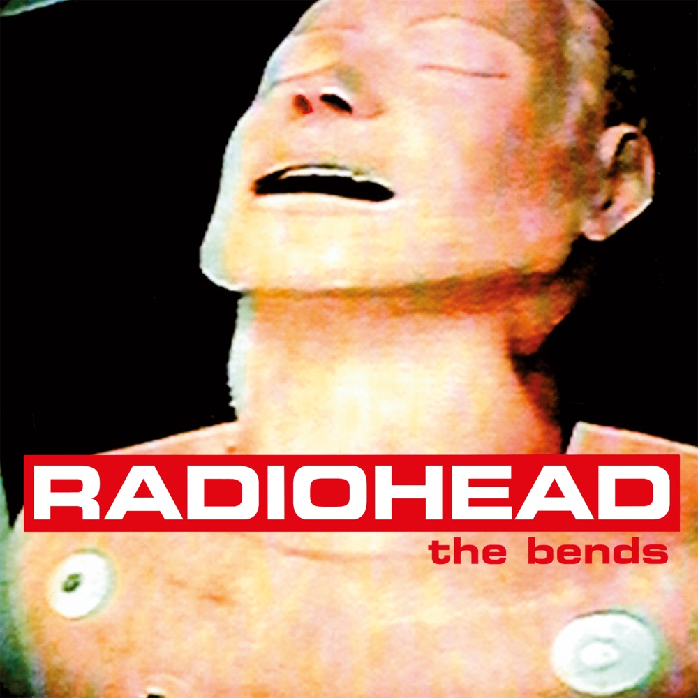
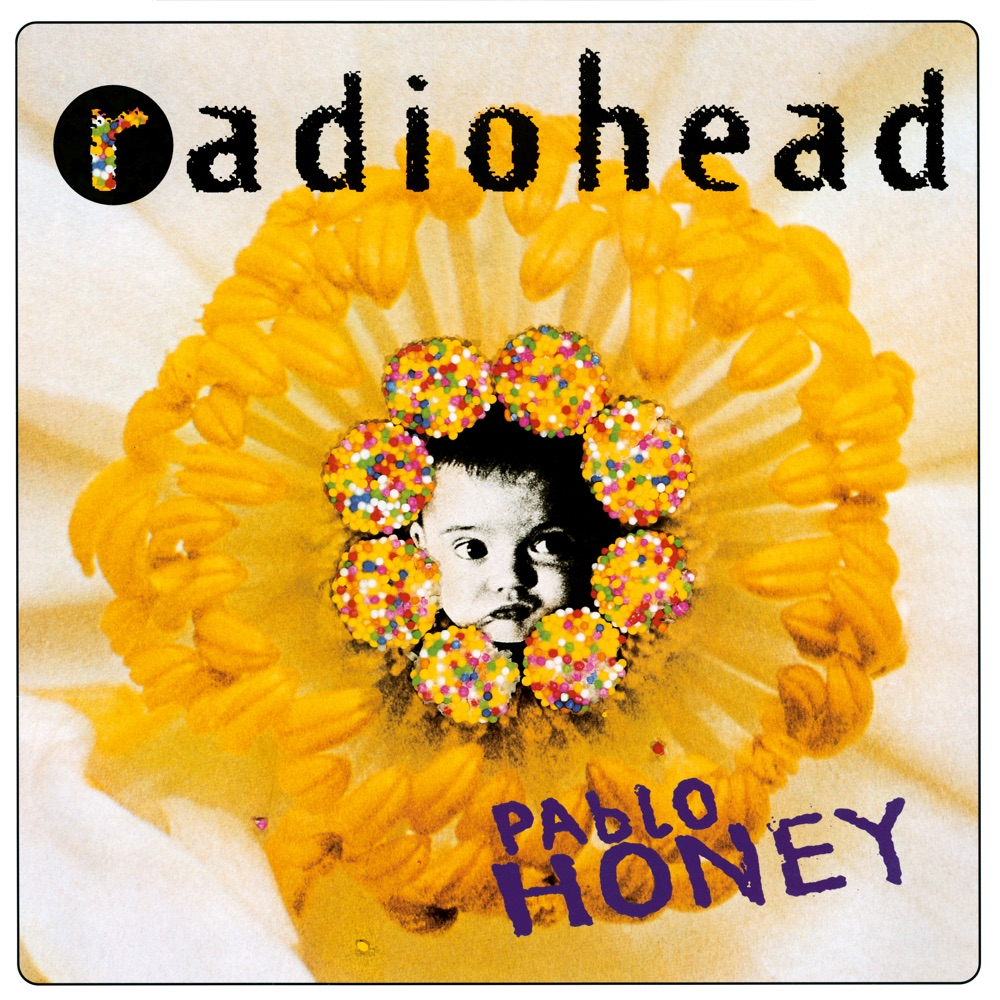
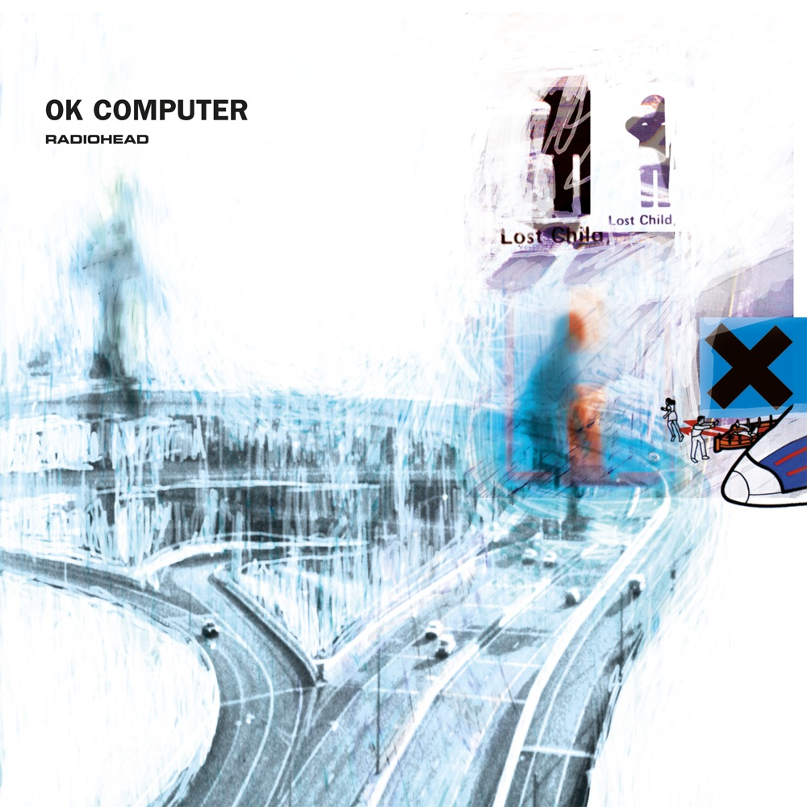
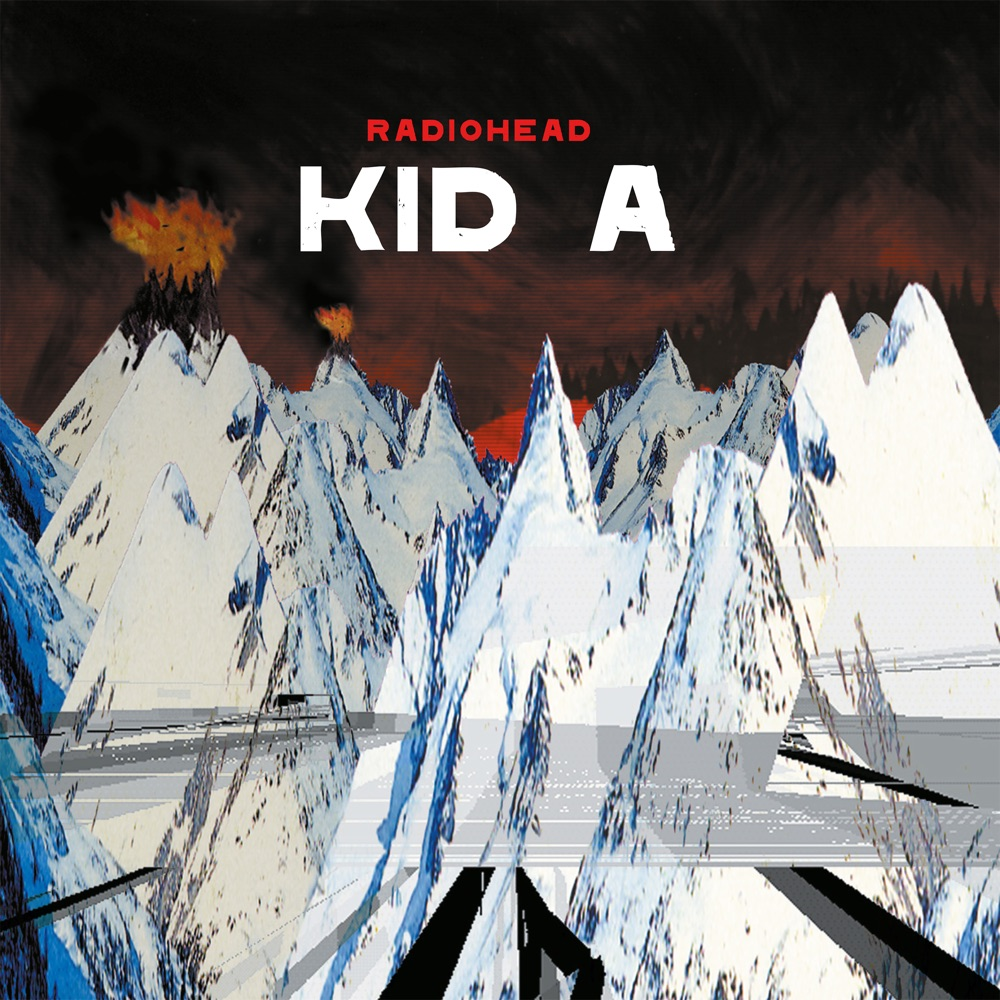
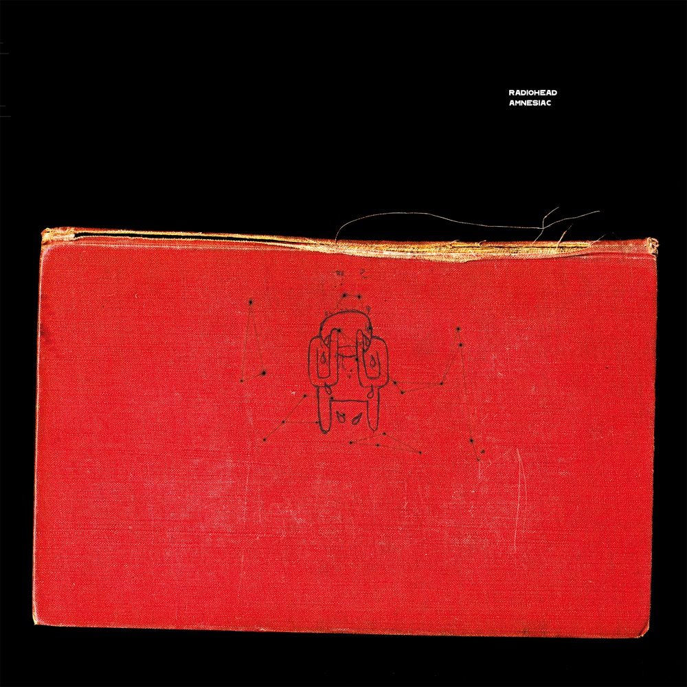
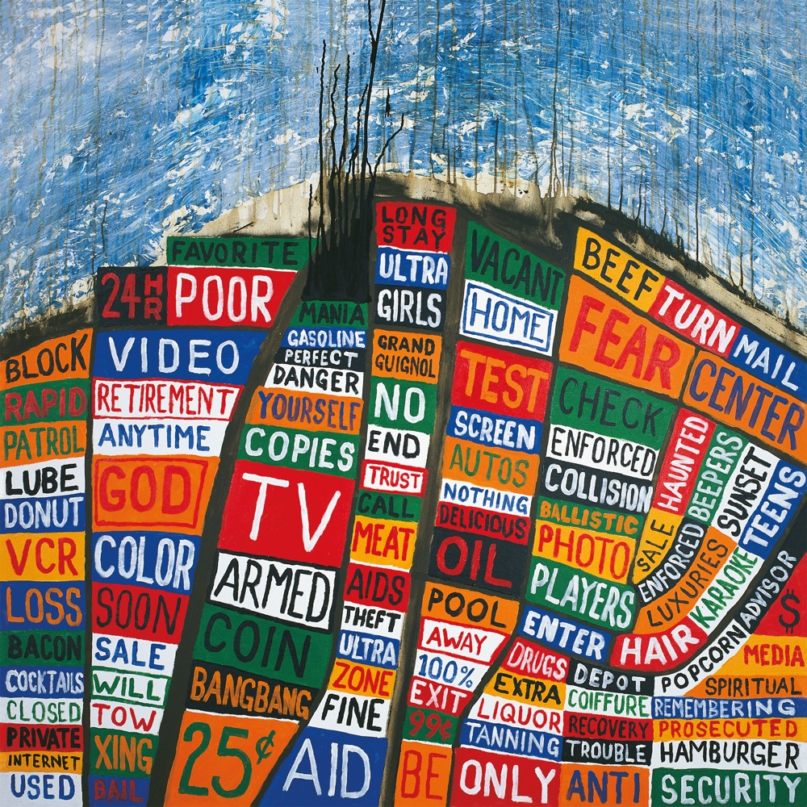
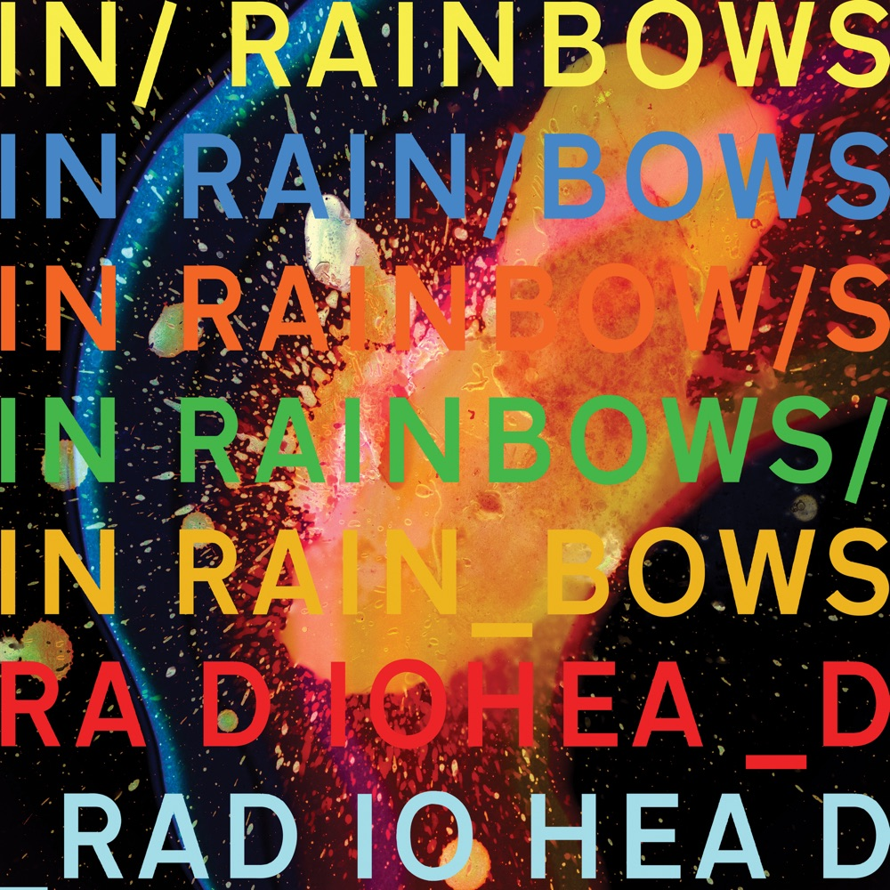
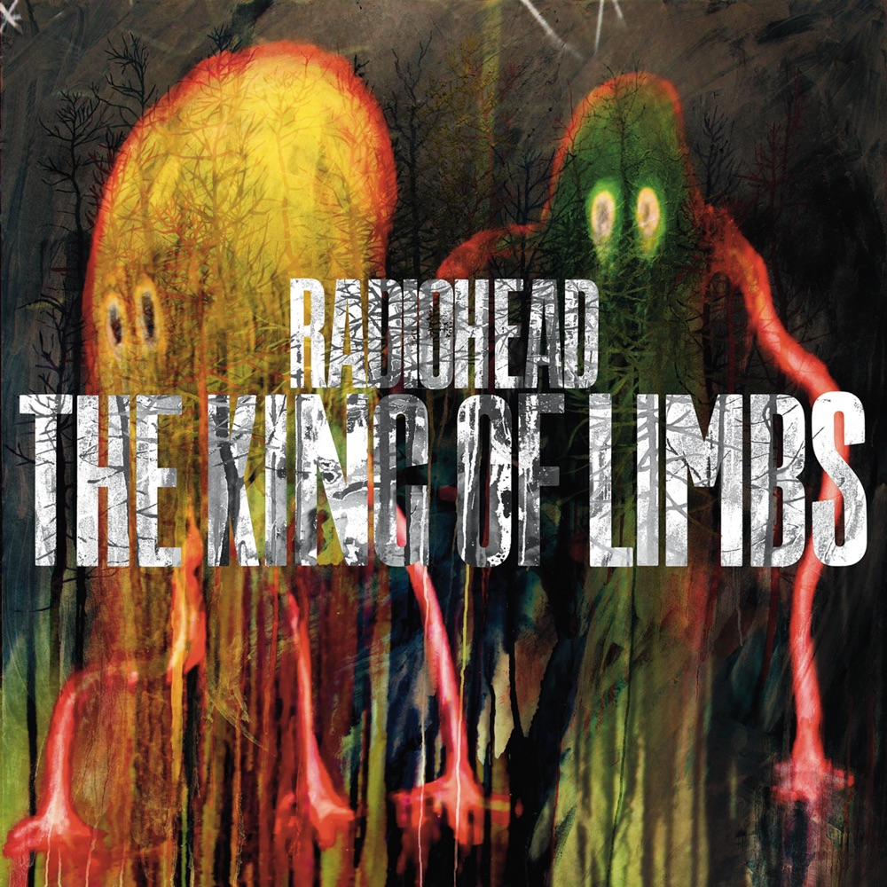
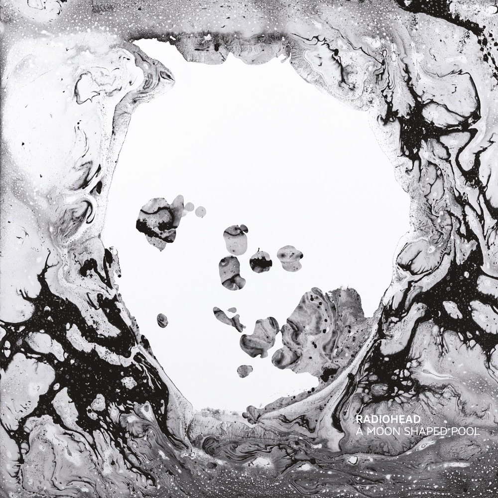
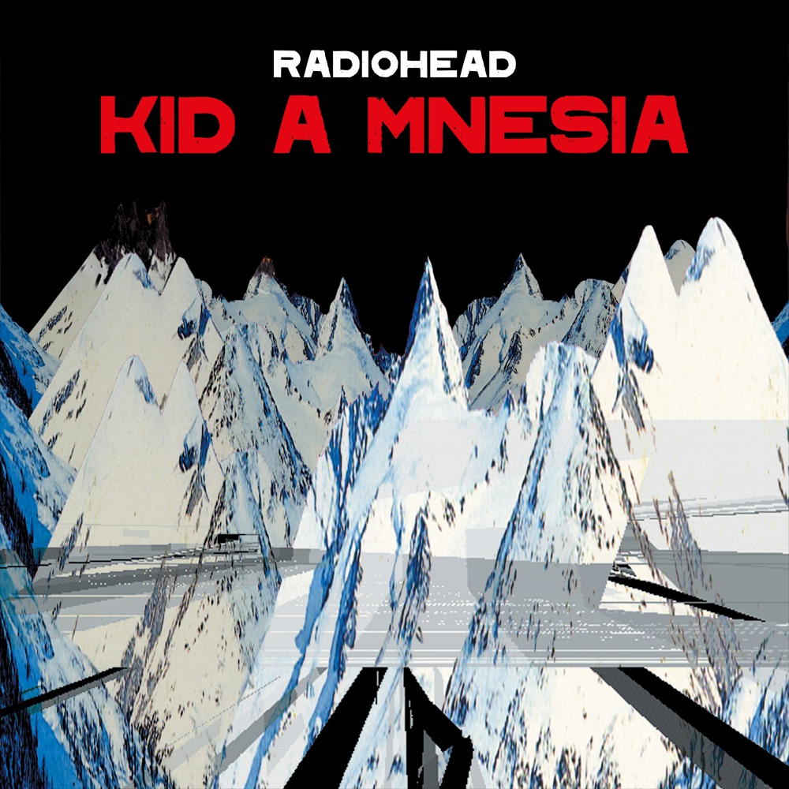

# 弯曲的空气里：Radiohead 与被未来追赶的四十年

*图：《The Bends》（1995，Parlophone）封面。Stanley Donwood 与 Thom Yorke 原想拍摄铁肺，后来在牛津 John Radcliffe 医院找到一具心肺复苏训练假人；他们把录像机画面显示在电视上，再拍下失真的屏幕。图片来源：[Apple Music 公开唱片页](https://music.apple.com/us/album/the-bends/1097862703)。*

那张脸正在承受什么？氧气，电流，疼痛，还是复活。

《The Bends》的封面上，一个急救训练假人仰起头，嘴张开，胸口贴着电极。它不是 Thom Yorke，也不是某个真正濒死的人；它只是医院里供人反复练习抢救的塑料身体。可是摄影机先拍它，电视机再扭曲它，最后照片把它冻在红黑色的空气里，于是它拥有了比真人更真实的表情：像缺氧，像狂喜，像一支原本可能死在第一首热门单曲里的乐队，突然被电流击中，又活了过来。

Radiohead 的故事当然可以从《Creep》开始，从 1992 年那两下粗暴的吉他闸门开始；也可以从《OK Computer》上空的高速公路，从《Kid A》的燃烧雪山，从《In Rainbows》让听众自己填写价格的下载页面开始。但如果想看清他们怎样从五个英国学生变成一种持续四十年的天气，最合适的入口仍是《The Bends》。那是他们第一次真正成为 Radiohead 的地方：吉他还没有被电脑拆解，歌还保留主歌、副歌与可以万人合唱的轮廓，可未来已经从裂缝里透进来。你听见一支摇滚乐队在自己的皮肤下面，开始长出另一副身体。

## 一、星期五的乐队

1985 年，牛津郡 Abingdon School。Thom Yorke 和 Ed O’Brien 先组队，找来同年级的 Colin Greenwood 弹贝斯；第一次演出用过鼓机，之后请高两个年级的 Philip Selway 坐上鼓凳；Colin 的弟弟 Jonny Greenwood 小三岁，最后加入，起初拉中提琴、吹口琴、弹键盘，等候自己闯进吉他前线的时机。五个人把排练安排在星期五，于是队名就叫 **On a Friday**。

这所男校管理严格，校长甚至曾因他们星期日使用排练室而收费。音乐教室却是一条秘密通道，老师把爵士、电影配乐、战后先锋音乐和二十世纪古典乐介绍给他们。多年后，Radiohead 看似相互冲突的语言——吉他噪音、电子节拍、弦乐、爵士铜管、合成器、法国电子乐器 ondes Martenot——都能在那间教室里找到幼小的影子。

他们上大学，周末和假期再集合；Yorke 在埃克塞特认识了后来负责几乎全部 Radiohead 视觉的 Stanley Donwood。1991 年，五人回到牛津共同生活、排练，录制《Manic Hedgehog》小样。Colin Greenwood 在唱片店偶遇 EMI 的 A&R Keith Wozencroft，把磁带递给他。12 月 21 日，On a Friday 签下 EMI 六张专辑合约。唱片公司嫌原队名难听，要求更改；他们从 Talking Heads 1986 年专辑《True Stories》中的歌曲 `Radio Head` 取走两个词，把中间的空格抹掉。Yorke 后来解释，这名字关乎人如何接收信息、又如何回应被置入的环境。

这恰好成了预言。Radiohead 此后一再书写信息如何穿过人，机器如何重塑感觉，环境如何在身体里留下噪音。

*图：《Pablo Honey》（1993，Parlophone／Capitol）封面。糖果、花朵和婴儿脸构成一种艳丽而略显不安的早期视觉。图片来源：[Apple Music](https://music.apple.com/us/album/pablo-honey/1097862062)。*

## 二、《Creep》：一首歌变成一间牢房

1992 年 9 月，Radiohead 发行《Creep》。Jonny Greenwood 在副歌之前猛砍琴弦的两下噪音，像企图破坏一首他嫌太软的歌，结果反而成了全曲的标志。英国本土起初反应冷淡，BBC Radio 1 认为它“太令人沮丧”；首张专辑《Pablo Honey》（1993）也被一些媒体视为追赶美国另类摇滚的产物。可《Creep》先在以色列被电台 DJ 推热，随后在美国成为热门，重发后冲进英国单曲榜前十。

成功来得像一张只印着一个词的身份证：Creep。怪胎。唱片公司、电视、观众似乎只需要他们重复那种自厌、那种骤然爆炸的强弱对比。Pitchfork 后来的回顾承认，《Creep》的自我厌弃歌词与强弱结构精准嵌进后 Nirvana 年代，但也指出，Radiohead 没有让白金销量把自己钉死在那一刻；他们开始把后摇、Mo’ Wax 厂牌周围的声音、IDM 与 trip-hop 的世纪末紧张感带进创作。

转折先出现在 1994 年的 EP《My Iron Lung》。标题就是判词：那首热门歌既让他们呼吸，又成为维生设备。他们仍使用安静／爆炸的结构，却已不再照抄；Jonny 的 Whammy 移调踏板把开场 riff 拉成故障般的高频，乐队把普通另类摇滚拆开，再以更奇怪的方式装回去。录音工程师 Nigel Godrich 和视觉艺术家 Stanley Donwood 也在这一时期进入故事，此后分别成为 Radiohead 的“第六位成员”和长期视觉共谋者。

## 三、《The Bends》：缺氧时仍然歌唱

《The Bends》于 1994 年 2 月开始录音。主制作人 John Leckie 曾为 Magazine 等乐队工作，是 Radiohead 敬重的人。但敬重没有带来轻松。EMI 给他们九周，要求交出能够接替《Creep》的热门歌；RAK Studios 里的所有人把注意力压在《The Bends》《(Nice Dream)》《Just》等潜在单曲上，越想制造成功，越无法动弹。Leckie 回忆，大家都在拔头发，反复说“不够好”；Yorke 则形容那是两个月的彻底崩溃。

他们离开录音室巡演，再回到 Abbey Road 和牛津郡 The Manor 工作。长期积压的矛盾最终爆开：争吵、哭泣、把不愿说的东西全部说完。奇怪的是，崩溃之后，唱片才开始成立。

*图：《The Bends》封面细看：电视屏幕的二次拍摄制造颗粒、色偏和拉伸，使塑料假人的急救姿态接近痛苦与狂喜的临界点。*

这张唱片的美不在于“吉他很大”，而在于五个人学会何时不弹。Ed O’Brien 后来回忆：如果 Thom 的木吉他、Colin 的贝斯和 Selway 的鼓已经足够好，为什么一定要再加东西？于是三把吉他不再争夺同一块墙面——一把搭骨架，一把制造天气，一把在高处划伤空气。

开场《Planet Telex》来自循环与录音室处理，像未来先伸进来的一只手；《High and Dry》把宽阔旋律送上体育场，后来成了 Travis、Coldplay 等乐队最常被追溯的蓝图；《Fake Plastic Trees》表面温柔，写的却是消费主义如何把城市、关系和身体都做成塑料。Yorke 录制人声后情绪崩溃，Leckie 保留了那次演唱。它不靠高音炫耀脆弱，而像一个人终于承认自己在假世界里仍有痛觉。

《Just》则是 Jonny Greenwood 的实验场：跨越数个八度的八音音阶、受 Magazine《Shot by Both Sides》启发的推进、Whammy 踏板制造的刺耳攀升。整首歌像有人在楼梯间追赶你。《My Iron Lung》把成名写成呼吸器；《Bullet Proof... I Wish I Was》几乎悬浮；最后的《Street Spirit (Fade Out)》用持续的分解和弦把时间变成一条没有出口的隧道。它在 1996 年进入英国单曲榜前五，超过《Creep》，在商业意义上也证明他们不是“一曲乐队”。

《The Bends》身处 Britpop 高潮，却始终站在庆典之外。当 Oasis 与 Blur 把英国性格写成酒吧、街道、阶级、幽默和胜负，Radiohead 写的是没有固定地址的人。制作人 Paul Q. Kolderie 后来称它既不是英国唱片，也不是美国唱片，而是诞生于巡演和漂泊的真空——“我们不住在任何地方，也不属于任何地方”。Pitchfork 的回顾把它概括为几组对立：温暖与紧张，riff 与质地，摇滚与后摇。Radiohead 还没有离开吉他，却已发现吉他不是国旗，它可以是雾、警报、电梯钢索和心电图。

唱片在英国榜最高第四，销量不是爆炸而是缓慢生长；后来获英国四白金、美国白金认证。NME 与 Melody Maker 都把它列入 1995 年年度十佳。与此同时，美国早期评价并非一致：有人仍批评 Yorke 自我沉溺、音乐夸张。重要的是，这些分歧没有妨碍唱片继续扩大。它不仅解除“一首歌”的诅咒，也制造了新的问题：无数后来的英国乐队学会了它的假声、上升副歌与拥抱式大歌，却常常只复制安慰，没有复制其中的危险。Yorke 为此苦恼过——他觉得别人完全错过了重点。

《The Bends》的真正遗产不是“忧郁英摇模板”，而是允许一支乐队在可亲近的歌曲内部开始自我拆除。它给了 Radiohead 制作《OK Computer》的信心，也给了他们将来背叛《The Bends》的权利。

## 四、《OK Computer》：高速公路上没有驾驶员

*图：《OK Computer》（1997，Parlophone／Capitol）封面。Stanley Donwood 与 Yorke 用蓝白高速公路、人物、文字碎片和交通图层制造冷漠的信息过载。图片来源：[Apple Music](https://music.apple.com/us/album/ok-computer/1097861387)。*

1996 年，Radiohead 与 Nigel Godrich 决定自己制作下一张唱片。他们先在牛津郡一座改造的苹果棚录音，随后搬进 Bath 附近十五世纪庄园 St Catherine’s Court；房间不是隔音盒，而是乐器，走廊、楼梯、石墙都进入录音。《OK Computer》（1997）不讲一个明确故事，却像一套关于世纪末生活的仪表盘：高速公路、飞机、办公室、政客、广告、计算机声音、人类被流程化之后剩下的呼吸。

《Airbag》让一次车祸成为重生；《Paranoid Android》把多个段落焊成六分多钟的现代怪物；《Karma Police》先像钢琴民谣，最后让磁带般的声音吞掉自己；《No Surprises》的钟琴甜得像摇篮，歌词却请求一份没有警报、没有意外的生活。音乐并非预言智能手机，它捕捉的是更早、更根本的事：人开始按照机器与组织的节奏理解自己。

唱片成为 Radiohead 第一张英国冠军专辑，赢得其首座格莱美——最佳另类音乐表演，并获年度专辑提名。Rock Hall 后来将他们概括为不断突破摇滚边界、推动数字革命的乐队，但在 1997 年，革命还以一张宏大的吉他唱片出现。巡演和宣传随即把他们掏空。纪录片《Meeting People Is Easy》记录的不是胜利，而是采访室、机场、酒店和同一个问题被问到失去意义。Yorke 与 O’Brien 陷入抑郁，乐队一度接近解散。

他们必须再次逃跑。这一次，要逃离的是自己刚刚制造的杰作。

## 五、《Kid A》：把吉他藏进雪里

*图：《Kid A》（2000，Parlophone／Capitol）封面。黑红天空下的锯齿雪山像正在燃烧的国家边界。图片来源：[Apple Music](https://music.apple.com/us/album/kid-a/1097862870)。*

《Kid A》（2000）没有按照《OK Computer》继续变大。Radiohead 买下一座谷仓改为工作室，又在巴黎、哥本哈根和英国多地录音，十八个月里几乎失去方向。Yorke 厌倦吉他，听 Warp Records 的 Aphex Twin、Autechre，也听 Can、Talking Heads、Charles Mingus、Olivier Messiaen；Jonny Greenwood 把 ondes Martenot 带进乐队，弦乐、爵士铜管、采样与程序节拍挤走传统摇滚中心。

开场《Everything in Its Right Place》用 Prophet 合成器把 Yorke 的声音切开、循环；标题像秩序，声音却证明一切正在错位。《The National Anthem》的贝斯像一条不肯停的公路，铜管最终拥堵成灾；《How to Disappear Completely》以弦乐和 ondes Martenot 包围一句自我保护的咒语；《Idioteque》把电子节拍变成避难警报。专辑没有正式单曲，只有短小的“blips”影像在电视和网络中闪现。

当时的听众确实分裂：有人认为他们抛弃摇滚，有人把它视为勇气。Pitchfork 在发行日给出 10.0，原评写到听众在现场第一次听见新材料时的震动；多年后特别版仍获 10.0。更重要的是，它登上美国专辑榜冠军——一张没有传统单曲、充满抽象电子与爵士噪音的唱片，竟成为他们第一张美国冠军专辑。Yorke 否认乐队故意刁难观众：“我们不是在试图变得困难……我们其实在试图沟通。”

2001 年的《Amnesiac》来自同一批录音，却不是废料合集。红书封面里的哭泣米诺陶像《Kid A》走失的兄弟。《Pyramid Song》的钢琴让拍号失去地面，弦乐和 Humphrey Lyttelton 的爵士乐队让《Life in a Glasshouse》像末日酒馆。《Kid A》是雪山外部，《Amnesiac》则像走进山腹。

*图：《Amnesiac》（2001，Parlophone／Capitol）封面：一本受损红书与哭泣的米诺陶。图片来源：[Apple Music](https://music.apple.com/us/album/amnesiac/1097864180)。*

## 六、贼、战争与重新成为乐队

*图：《Hail to the Thief》（2003，Parlophone／Capitol）封面。Stanley Donwood 把洛杉矶地图改造成由 FEAR、OIL、TV、SECURITY 等词组成的商品化政治地貌。图片来源：[Apple Music](https://music.apple.com/us/album/hail-to-the-thief/1097863576)。*

2003 年《Hail to the Thief》把吉他和电子方法重新放进同一房间。乐队与 Godrich 在洛杉矶 Ocean Way 用大约两周录下主体，追求比《Kid A》《Amnesiac》更直接的现场感。标题常被理解为对 2000 年美国总统选举争议的影射，Yorke 的歌词则来自 George W. Bush 时代、反恐战争及其“无知、不宽容、恐慌与愚蠢”的总体气氛。

《2 + 2 = 5》从细小节拍烧成集体爆发；《There There》以多层鼓声把森林变成政治寓言；《A Wolf at the Door》让 Yorke 接近半说半唱，像债务、暴力和家庭恐惧在门外轮流报数。它是 Radiohead 为 EMI 交付的最后一张录音室专辑。六张合约完成，门终于打开。

但自由不等于自动产生音乐。下一张唱片起初进展艰难，他们一度离开 Godrich 与制作人 Spike Stent 尝试，最终仍回到 Godrich 身边。2006 年巡演使新歌重新获得身体，五个人不再以“应该向哪里前进”互相审判，而是重新学习同时呼吸。

## 七、《In Rainbows》：价格栏里的彩虹

*图：《In Rainbows》（2007，自行数字发行；后由 XL／TBD 实体发行）封面。彩色蜡与化学反应般的爆裂图像上叠着手写文字。图片来源：[Apple Music](https://music.apple.com/us/album/in-rainbows/1109714933)。*

2007 年 10 月 1 日，Jonny Greenwood 在网站上发出一句近乎随意的通知：新专辑十天后发行。数字下载页面没有固定价格，听众可以自行输入金额，包括 £0。这不是“完全免费发行”，而是一次定价权的转移。Radiohead 没有公布完整平均支付金额与总收入，因此网络上流传的精确利润神话需要谨慎；公开资料通常引用首日约 120 万次下载的估计。Colin Greenwood 解释，他们希望绕开广播与电视的固定格式，让全球听众同时听见，也避免正式发行前泄漏。

机制抢走了新闻标题，音乐最后把标题抢回来。Pitchfork 给《In Rainbows》9.3 与 Best New Music，原评写到数十万听众在同一个清晨坐到电脑前，重新拥有“大家正同时第一次听一张唱片”的共同感。可唱片的真正变化比商业实验更安静：Radiohead 不再只写系统如何异化人，而开始触摸身体、欲望和接近另一个人的风险。

《15 Step》的五拍节奏轻盈又不稳定；《Nude》像一条被时间保存十年的呼吸；《Weird Fishes/Arpeggi》中，吉他不是墙，而是相互错开的水流，Selway 的鼓稳步向深处走，和声把“被鱼吃掉”唱成近乎自由的下沉；《All I Need》的低频像压在胸口，结尾钢琴与镲片突然打开白光；《Videotape》用错位节拍把告别藏进看似简单的钢琴。

实体版随后由 XL Recordings 在英国发行，在英美都登上榜首；它获得格莱美最佳另类音乐专辑。Recording Academy 的官方页面统计 Radiohead 至今共获 **3 次格莱美、18 次提名**。那些奖项并不解释作品，但至少说明：他们不必在实验和大众之间选择一个阵营。

## 八、循环、月池与迟到的歌曲

*图：《The King of Limbs》（2011，自行数字发行／XL）封面。森林精怪从暗处浮出，对应唱片围绕循环、采样与自然节律的探索。图片来源：[Apple Music](https://music.apple.com/us/album/the-king-of-limbs/1109714965)。*

《The King of Limbs》（2011）只有八首、约三十七分钟。乐队先录下大量演奏，再用循环与采样重新组织，像把树木切成年轮，再按另一种季节拼回去。Pitchfork 给出 7.9：评价不及前作一致，但《Bloom》的多层节拍、《Lotus Flower》的身体感和《Separator》的清澈尾声逐渐在现场获得第二生命。为演奏复杂节律，他们请来第二位鼓手 Clive Deamer；《From the Basement》版本让许多听众第一次看见这些循环如何由真人身体完成。

五年后，《A Moon Shaped Pool》（2016）像潮水退去后留下的深色水面。制作仍由 Godrich 主导，Jonny Greenwood 的弦乐与伦敦当代管弦乐团居于中心。《Burn the Witch》用弦弓击打琴弦，制造文明礼貌下的集体恐慌；《Daydreaming》缓慢穿过一间又一间门；最后，《True Love Waits》终于进入录音室专辑——它从 1990 年代现场时代漂流而来，不再是木吉他恳求，而是几架钢琴彼此错开的残影。

*图：《A Moon Shaped Pool》（2016，XL）封面。Donwood 在户外让颜料、水与天气共同作用，留下黑白流体般的抽象痕迹。图片来源：[Apple Music](https://music.apple.com/us/album/a-moon-shaped-pool/1111577743)。*

Pitchfork 给它 9.1 与 Best New Music，评论写道：Radiohead 一直理解深刻真理如何轻易硬化成陈词滥调，而这一次 Yorke 放下部分讥讽，进入“惊奇与赞叹”这样过去较少探索的情绪。那不是突然乐观，而是承认个人力量有限之后的开放。

2019 年，Radiohead 以表演者类别进入摇滚名人堂，由 Talking Heads 的 David Byrne 引荐——队名绕行二十八年，回到了来源。2020 年，乐队开放 **Radiohead Public Library**，把音乐录像、现场演出、艺术品、网站实验和纪录片整理为公共档案。2021 年，《Kid A Mnesia》把《Kid A》《Amnesiac》与未发行材料合并，并伴随一座可免费进入的数字展览。

*图：《Kid A Mnesia》（2021，XL）封面。这是《Kid A》《Amnesiac》二十周年纪念合辑，不属于九张录音室专辑。图片来源：[Apple Music](https://music.apple.com/us/album/kid-a-mnesia/1581785974)。*

同年，Yorke 与 Jonny Greenwood 和鼓手 Tom Skinner 组成 The Smile。那不是正式宣布 Radiohead 结束，而是另一条较轻、较快、混入更多爵士与 krautrock 的支流。Radiohead 的意义从来不在于五个人必须永远站在同一间房里，而在于他们四十年前选择的关系仍未被轻易取消。

## 九、五个人，四十年

Radiohead 最罕见的地方也许不是某一张 10 分专辑，而是阵容从未更换。五个在学校里因星期五排练而组队的人，经历一首全球热门、唱片工业衰落、数字下载、流媒体、个人计划、家庭变故与漫长停顿，仍然保留彼此。制作人 Nigel Godrich 自《The Bends》时期进入核心；Stanley Donwood 与 Yorke 从训练假人开始，共同建立一套从医院屏幕、高速公路、燃烧山峰、红书、文字地图、彩色蜡到月池的视觉宇宙。Radiohead 并不是 Thom Yorke 加四位伴奏者，而是一套相互制约的系统：Yorke 带来恐惧和旋律，Jonny 把音乐理论与新机器推入房间，Colin 让低音保持人性，O’Brien 把空间和和声铺开，Selway 让最不规则的想法仍能行走。

他们影响了大量后来者。《The Bends》扩大了英国抒情吉他摇滚的语言；《OK Computer》让世纪末异化成为主流文化的共同图像；《Kid A》向体育场观众打开电子、爵士和先锋音乐的侧门；《In Rainbows》迫使行业重新讨论一张数字专辑值多少钱。可是如果只列影响，Radiohead 会像博物馆说明牌一样死去。

真正活着的是听觉经验：Jonny 在《Creep》副歌前砍下的两刀；《Fake Plastic Trees》最后一段声音承受不住自己；《Street Spirit》不肯停止的分解和弦；《Paranoid Android》半途降下的雨；《How to Disappear Completely》四周弦乐逐渐失去重力；《Pyramid Song》的钢琴让时间忘记怎样计数；《There There》的鼓从树林里靠近；《Weird Fishes》一层层下潜；《Daydreaming》推开最后一扇门。

回到《The Bends》封面。假人不会死，所以也谈不上复活。它只会在训练中一次次被按压、通电、灌入空气。Radiohead 的四十年也像这种反复：每当一种声音变得安全，他们就让它缺氧；每当乐队似乎无法继续，他们又寻找另一种呼吸法。

不是为了永远领先未来。

只是为了不被已经完成的自己杀死。

## 九张录音室专辑

| 专辑 | 年份 | 初始发行体系 | 方向 |
|---|---:|---|---|
| 《Pablo Honey》 | 1993 | Parlophone／Capitol | 后 grunge 与另类摇滚；《Creep》成为全球热门 |
| 《The Bends》 | 1995 | Parlophone／Capitol | 三吉他、抒情曲与录音室质地形成独立语言 |
| 《OK Computer》 | 1997 | Parlophone／Capitol | 世纪末异化、复杂制作与宏观叙事 |
| 《Kid A》 | 2000 | Parlophone／Capitol | 电子、爵士、古典、krautrock；主动离开吉他中心 |
| 《Amnesiac》 | 2001 | Parlophone／Capitol | 与《Kid A》同期录制，走向爵士、幽灵民谣与红书迷宫 |
| 《Hail to the Thief》 | 2003 | Parlophone／Capitol | 摇滚与电子合流，回应反恐战争年代 |
| 《In Rainbows》 | 2007 | 自行数字发行；XL／TBD 实体 | 自由定价、身体感、亲密与节奏 |
| 《The King of Limbs》 | 2011 | 自行数字发行；XL 实体 | 循环、采样、节律与森林意象 |
| 《A Moon Shaped Pool》 | 2016 | XL | 弦乐、合唱、旧歌重生与克制的哀伤 |

## 推荐聆听路线

1. **从《The Bends》（1995）进入**：`Planet Telex` → `Fake Plastic Trees` → `Just` → `Street Spirit (Fade Out)`，听吉他如何从墙变成天气。
2. **转向《OK Computer》（1997）**：完整播放，不要跳过《Fitter Happier》，它是系统发出的冷声。
3. **把《Kid A》（2000）与《Amnesiac》（2001）连续听**：前者是雪山，后者是山腹；两张不是主专辑和废料的关系。
4. **夜里听《In Rainbows》（2007）**：重点是 `Weird Fishes/Arpeggi`、`All I Need`、`Reckoner`、`Videotape`。
5. **最后听《A Moon Shaped Pool》（2016）**：从 `Burn the Witch` 到 `True Love Waits`，看几十年的旧歌怎样改变年龄。
6. **补充影像**：《Meeting People Is Easy》（1998）、《In Rainbows – From the Basement》（2008）、《The King of Limbs: Live from the Basement》（2011）、《Kid A Mnesia Exhibition》（2021）。

## 资料与图片来源

- Radiohead 官方：[Radiohead Public Library](https://www.radiohead.com/library/)（各时期音乐、影像、现场与视觉档案）
- Rock & Roll Hall of Fame：[Radiohead 入选页](https://rockhall.com/inductees/radiohead/)（2019 年、表演者类别、David Byrne 引荐及官方历史评价）
- Recording Academy：[Radiohead Grammy 页面](https://www.grammy.com/artists/radiohead/8042/)（3 次获奖、18 次提名及逐项记录）
- Wikipedia（配合条目引用链交叉核验）：[Radiohead](https://en.wikipedia.org/wiki/Radiohead)、[The Bends](https://en.wikipedia.org/wiki/The_Bends_(album))、[OK Computer](https://en.wikipedia.org/wiki/OK_Computer)、[Kid A](https://en.wikipedia.org/wiki/Kid_A)、[In Rainbows](https://en.wikipedia.org/wiki/In_Rainbows)、[A Moon Shaped Pool](https://en.wikipedia.org/wiki/A_Moon_Shaped_Pool)
- Pitchfork 原始／回顾乐评：[三张 1990 年代专辑合集再版回顾](https://pitchfork.com/reviews/albums/12938-pablo-honey-collectors-edition-the-bends-collectors-edition-ok-computer-collectors-edition/)、[Kid A（10.0）](https://pitchfork.com/reviews/albums/6656-kid-a/)、[Amnesiac（9.0）](https://pitchfork.com/reviews/albums/6659-amnesiac/)、[In Rainbows（9.3，Best New Music）](https://pitchfork.com/reviews/albums/10785-in-rainbows/)、[The King of Limbs（7.9）](https://pitchfork.com/reviews/albums/15149-the-king-of-limbs/)、[A Moon Shaped Pool（9.1，Best New Music）](https://pitchfork.com/reviews/albums/21907-a-moon-shaped-pool/)
- The Guardian Open Platform：[Radiohead 主题报道索引](https://content.guardianapis.com/search?tag=music/radiohead&api-key=test&page-size=20)（《In Rainbows》发行、专辑评论与历史报道检索）
- 唱片日期与封面元数据：Apple Music Radiohead 官方目录（artist ID `657515`）；各图注链接指向相应公开唱片页
