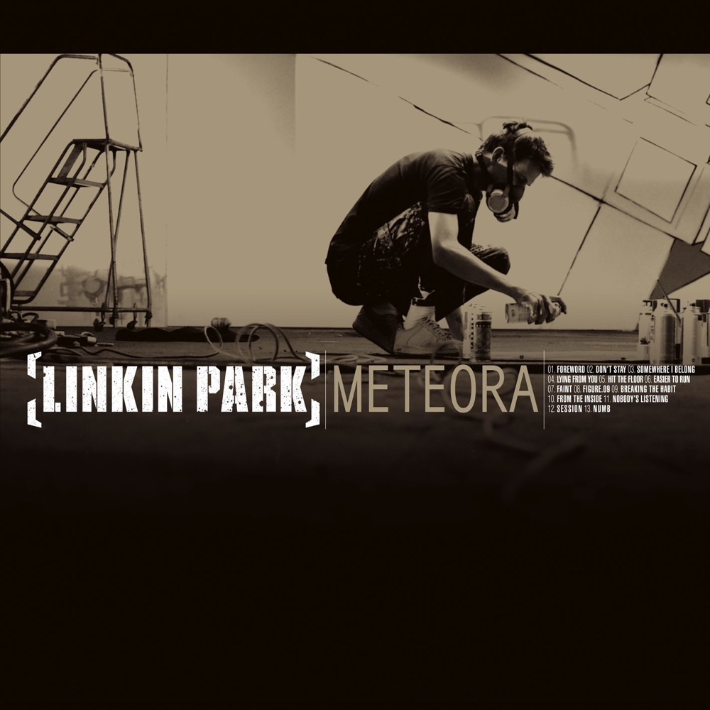
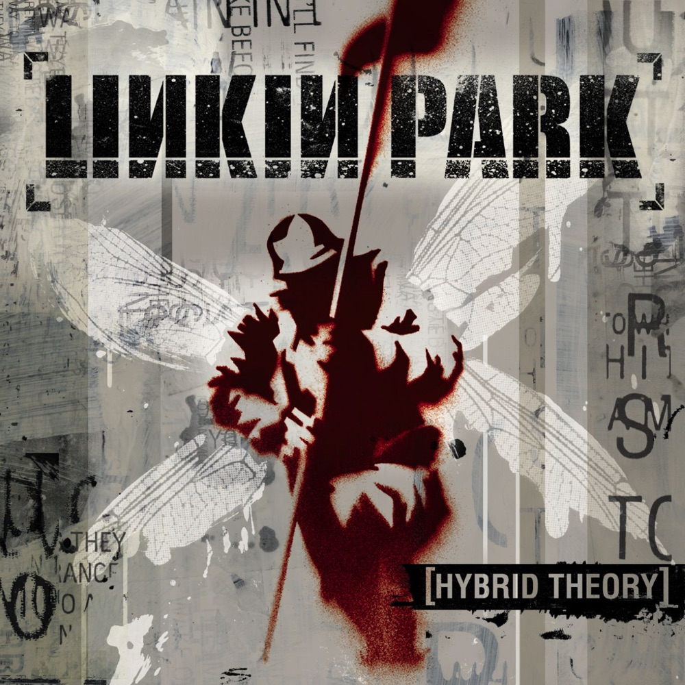
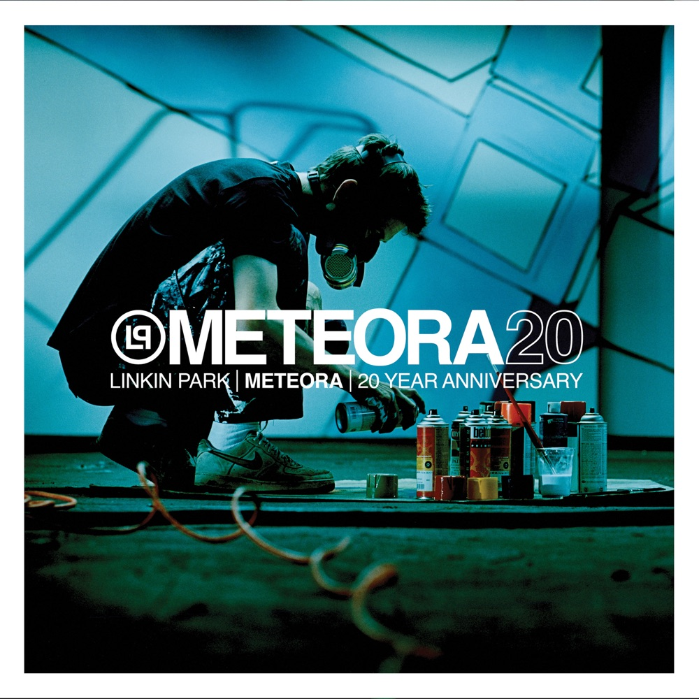
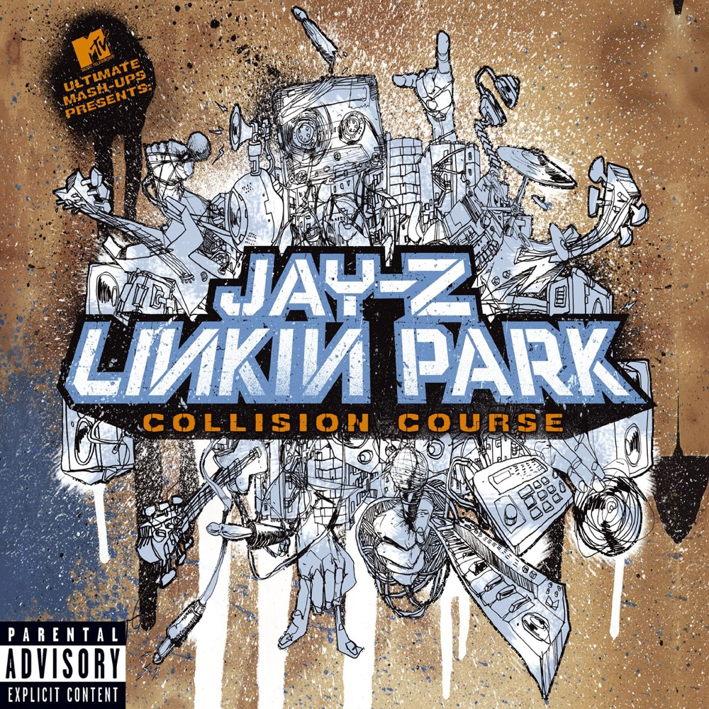
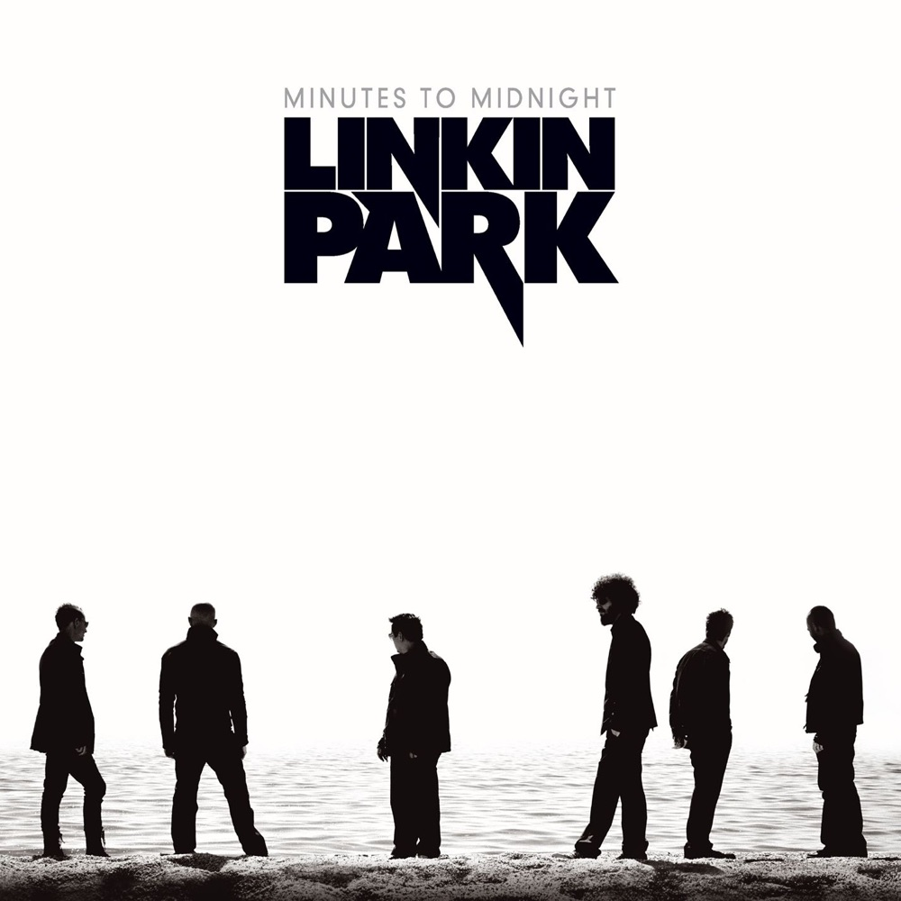
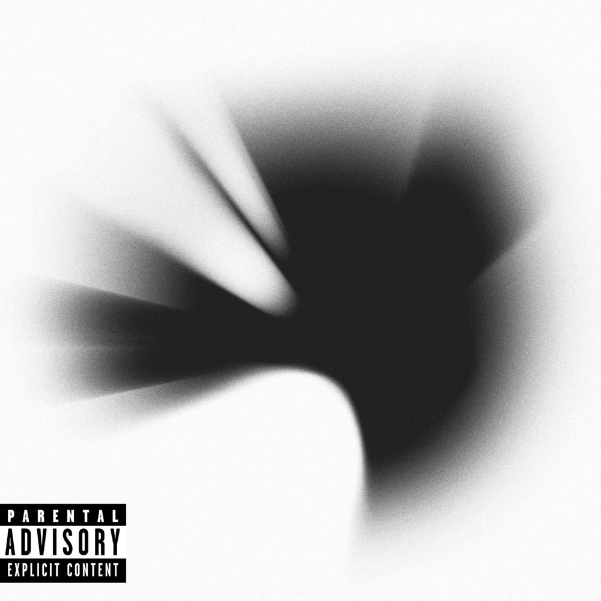
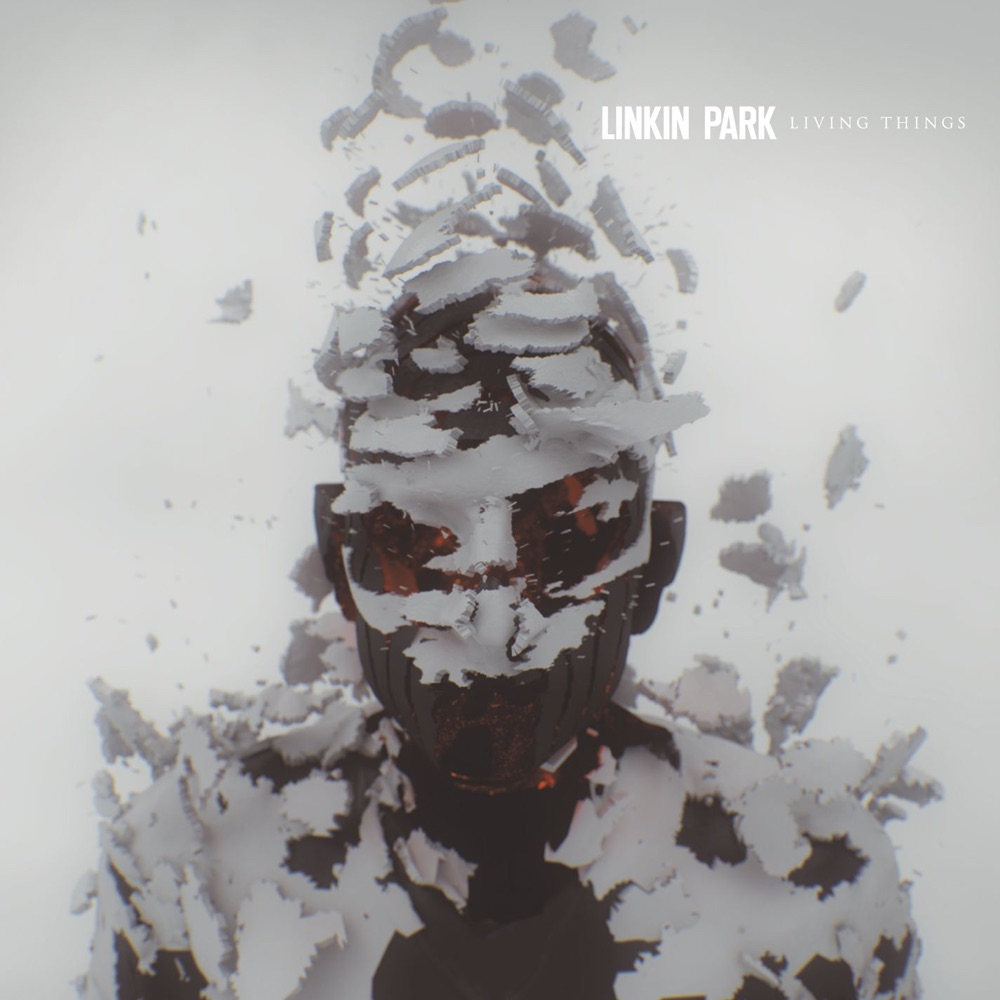
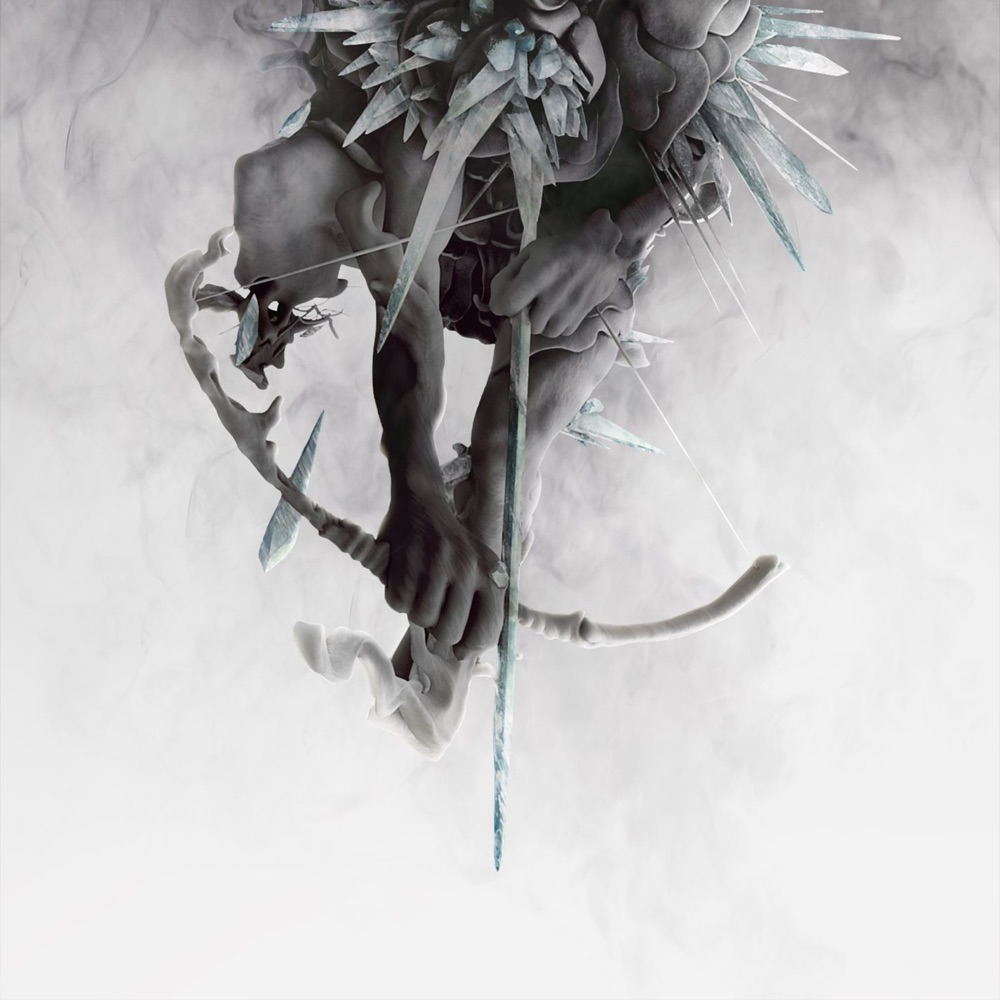
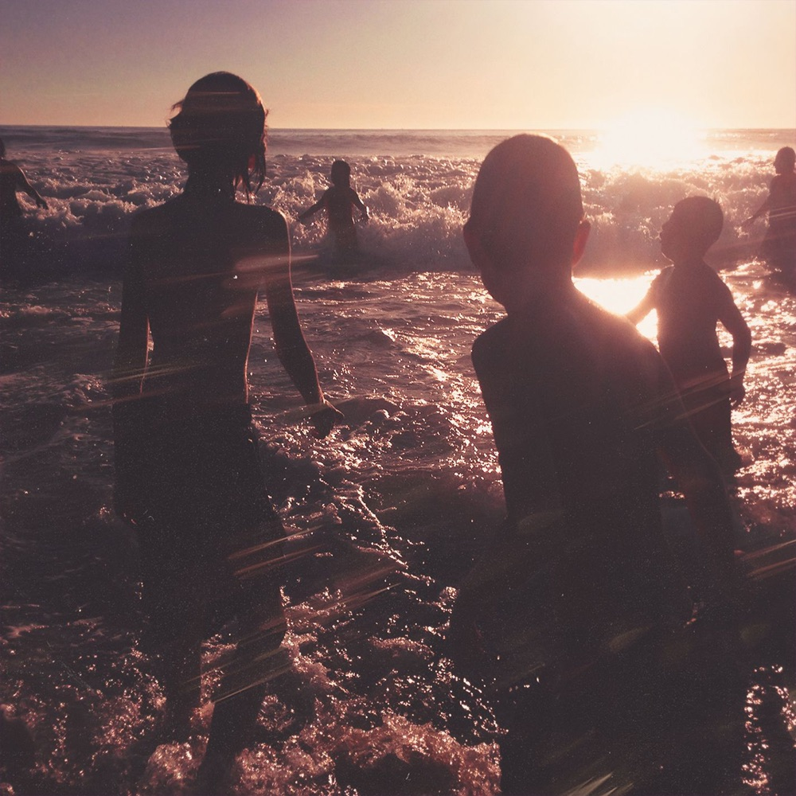
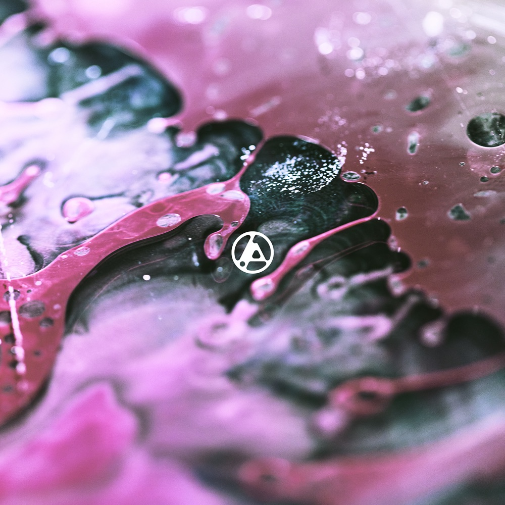

# 悬在半空的回声：Linkin Park 与《Meteora》的千禧年

*图：《Meteora》（2003，Warner Bros.／Machine Shop）封面。荷兰涂鸦艺术家 Boris “Delta” Tellegen 俯身作画，身体几乎被棕灰色墙面吞没；James Minchin III 摄影，Frank Maddocks 负责艺术指导。图片来源：[Apple Music 公开唱片页](https://music.apple.com/us/album/meteora/528435845)。*

先有一阵刮擦声，像磁带倒转，像城市在凌晨把自己的废墟吸回墙里。然后钢琴和合成器升起来，鼓点落下，Mike Shinoda 开始说唱，Chester Bennington 的声音从另一侧撞进来——不是替他回答，而是把同一句困惑推到更高、更亮、更接近断裂的地方。

这是《Somewhere I Belong》，也是《Meteora》的入口。二〇〇三年，许多人的卧室里还摆着台式电脑，MP3 正在从拨号网络和校园网里流动，电视上的 MTV 倒计时与盗版光盘仍共同管理着青春。Linkin Park 的歌就在那种媒体交接的缝隙里出现：一半来自唱片工业最后的巨型机器，一半已经属于论坛签名、游戏剪辑、手机铃声、YouTube 和后来无穷无尽的算法推荐。

批评家说它公式化。他们没有完全说错。

听众说它救过自己。他们也没有说错。

《Meteora》最值得谈论的地方，正是这两句话可以同时成立。

## 一、车库里的六个人

一九九六年，加利福尼亚州 Agoura Hills。Mike Shinoda、Brad Delson 和 Rob Bourdon 从高中时期的友谊出发，组建了 **Xero**。Joe Hahn 带来唱盘、采样与影像思维，Dave “Phoenix” Farrell 弹贝斯，Mark Wakefield 担任主唱。那时他们没有后来那个简洁得像交通标志的六边形标识，只有小样、车库、朋友家的临时录音空间，以及一个边界很模糊的念头：为什么嘻哈的节拍、重型吉他的重量、电子采样的冷光和流行歌曲的副歌，不能在同一间屋子里发生？

Wakefield 离开后，乐队经历了漫长的试唱与拒绝。来自亚利桑那州凤凰城的 Chester Bennington 此前在 Grey Daze 唱歌。一九九九年，他接到试唱材料，在生日当天录完人声寄回洛杉矶；他的声音里既有清晰、受伤的旋律，也有仿佛能把胸腔撕开的嘶吼。那不是在 Mike 的说唱之外简单增加一名“摇滚主唱”，而是完成了一套双声部机械：Mike 负责节奏、叙述、内部独白；Chester 负责旋律、爆发，以及语言到达不了的疼痛。

组合一度改名 **Hybrid Theory**，后来又成为 **Linkin Park**。官方乐队传记没有把它描述成某个类型标签的胜利，而强调一种“没有边界的愿景”：六个人把不同文化、品味、声音和视觉经验混在一起。这个说法比“新金属乐队”更接近事实。nu metal 是他们进入历史的门牌，却从来不是整栋房子。

*图：《Hybrid Theory》（2000）封面。Mike Shinoda 参与设计：手持旗杆的士兵与透明蜻蜓翅膀相叠，硬度和脆弱性从一开始就在同一具身体里。图片来源：[Apple Music](https://music.apple.com/us/album/hybrid-theory/528436018)。*

二〇〇〇年十月二十四日，《Hybrid Theory》发行。Don Gilmore 制作，Andy Wallace 混音。《Papercut》开场二十秒就把受 Timbaland 启发的节拍、新金属吉他和 drum and bass 的速度感挤进一个空间；《Crawling》把失控感交给 Chester 单独承担；《In the End》则以钢琴动机、Mike 的说唱主歌和 Chester 的高空副歌，制造出 Linkin Park 最容易被识别的结构。

主流乐评起初并不热情。Rolling Stone 当年的评论肯定他们懂得写 hook，却批评歌词陈旧而模板化。二十年后，Pitchfork 给周年版 7.6 分，NME 的回顾特稿甚至称它为过去二十年最重要的摇滚唱片之一。评价的逆转并非因为唱片后来突然变得复杂，而是历史终于承认：那些被精英评论嫌弃的少年焦虑、说唱与金属混血、搓碟和巨大副歌，早已改变了流行音乐允许怎样谈论羞耻、愤怒、孤独和心理痛苦。

Recording Academy 的记录也留下当时的坐标：《Hybrid Theory》获最佳摇滚专辑提名，乐队获最佳新人提名，《Crawling》则拿下二〇〇二年格莱美最佳硬摇滚演奏奖。

## 二、《Meteora》：悬在空中的岩石

《Hybrid Theory》的成功不是一扇打开的门，更像一整座建筑突然压到六个人肩上。巡演、访问、广播、电视、全世界的观众，以及一个难以回答的问题：下一张要不要再做一次同样的事？

二〇〇二年四月至十二月，Linkin Park 录制第二张专辑。他们仍与 Don Gilmore 合作，乐队本身也共同担任制作；Andy Wallace 继续混音。创作并不是从十二首完整歌曲开始，而是从大量节拍、吉他片段、采样、旋律和名称组成的档案库开始。Mike 与 Joe 处理声音的电子骨架，Brad 寻找既沉重又不过度占满频谱的吉他，Rob 让机器般精确的编排仍有真人撞击感，Phoenix 把低频焊在鼓点下面，Chester 则一次次把旋律推到肉身边界。

专辑名称对应希腊中部的 **Meteora**：巨大的岩柱从平原升起，修道院建在几乎无法抵达的高处；其名称通常被解释为“悬在空中”。二〇〇三年 Billboard 的发行前报道确认乐队已经选定这一名称，但现有可访问原文没有完整保存命名经过。因此，更稳妥的说法是：这不是一张关于希腊的概念作品，地名却提供了一幅与音乐相合的图像——岩石巨大、古老、冷漠，人仍在上面留下建筑、线条和生活。

封面中的 Delta 也在做同一件事。他背对镜头，在一堵墙前喷画。画面没有传统乐队肖像，没有六个人摆出凶狠姿势；人物只是创造过程中的一个黑色轮廓。Linkin Park 把这张唱片当作完整视觉工程：照片、涂鸦、模板、手写字、工作室影像、动画与网页共同构成一个世界。Joe Hahn 不只是 DJ，他还是乐队内部的视觉导演；Mike 也从平面设计背景出发，让唱片“看起来”和“听起来”使用同一种语言。

## 三、三十六分钟的高压系统

*图：《Meteora》原版封面再次出现。人物没有面对观众，注意力全部留给尚未完成的墙；这也是专辑的隐秘主题——寻找一个能留下自己痕迹的位置。*

《Meteora》在二〇〇三年三月二十五日发行，十二首歌只运行大约三十六分钟。它几乎没有浪费动作：前一首的尾音、采样或环境声经常直接滑入下一首，像一台被严格校准的机器。

《Foreword》只有十三秒。某件硬物被砸碎的声音之后，《Don’t Stay》爆开；Brad 的吉他不是传统金属炫技，而是低沉、短促、服务于节奏的块面。《Somewhere I Belong》的前奏来自倒放的吉他录音，声音像从睡梦背面折回现实。Mike 的主歌不再只是展示押韵技巧，而在反复追问归属；Chester 的副歌把“我想疗愈、我想感受、我想找到我所属之地”唱成上万人可以共同喊出的句子。

《Lying from You》把 Joe 的采样、Mike 的说唱和近乎工业化的吉他切口压进同一节拍。《Hit the Floor》重而低，《Easier to Run》则把逃离写成缓慢升起的雾。《Faint》只有两分四十二秒：弦乐循环急促旋转，Mike 几乎一路向前冲，Chester 在副歌里要求“不要转身离开”。这首歌的精确不来自复杂，而来自删无可删。每一个停顿都在为下一次撞击蓄压。

然后是《Breaking the Habit》。

它没有 Mike 的说唱，也没有支配全曲的失真吉他 riff。电子节拍、弦乐和 Chester 的旋律构成一种内部奔跑。歌词由 Mike 长期写作、修改，交给 Chester 后，后者因其与自身经验过于接近而落泪；歌曲发行后很长一段时间，他都难以在现场演唱。Joe Hahn 执导音乐录像，日本动画师 Kazuto Nakazawa 以动画和转描完成影像：城市里每扇窗都是一段孤立的生活，镜头最终冲向天空，又倒着坠回房间。它证明 Linkin Park 的“公式”内部一直藏着逃生通道。

《From the Inside》让人群暴动与个人失信叠在一起；《Nobody’s Listening》使用尺八般的音色和嘻哈节拍；纯器乐《Session》把 Joe 与 Mike 的电子侧面推到前景，并获得二〇〇四年格莱美最佳摇滚器乐演奏提名。

最后是《Numb》。钢琴与合成器先建立一间冷房间，Chester 唱一个人如何被期待塑造成别人的样子。没有复杂叙事，甚至没有隐晦修辞，只有边界被反复侵犯后的麻木。它成为专辑最持久的歌曲之一，不是因为表达了罕见情绪，而是因为替无数人说出了最普通、也最难承认的一句：我已经厌倦成为你希望我成为的样子。

*图：《Meteora》20 周年纪念版（2023）封面，改用青蓝色制作现场照片并叠加“METEORA 20”。该版本是周年扩展发行，不是新的录音室专辑。图片来源：[Apple Music](https://music.apple.com/us/album/meteora-20th-anniversary-edition/1668484895)。*

## 四、公式化，为什么仍然有效

《Meteora》首周在美国售出约八十一万张，直接进入 Billboard 200 第一名。这个规模来自《Hybrid Theory》建立的巨大听众基础，也来自六支极其有效的单曲。但商业成功没有消除批评。

NME 的原页给出 3.5/5，Andy Capper 讽刺乐队仿佛只是重新编程制作首专的 Pro Tools 机器，改一点歌词与速度；他把《Breaking the Habit》视作摆脱惯常“搓碟、糟糕说唱和巨大副歌”公式的喘息。Rolling Stone 的原评同样指出，专辑很大部分仍遵循过于熟悉的说唱摇滚模板。

这些意见并不荒谬。《Meteora》的确没有像后来《Kid A》之于 Radiohead 那样摧毁前作语言。许多歌曲仍遵循 Mike 说唱主歌、Chester 演唱副歌、失真吉他进入、电子纹理填缝的布局；混音光洁，曲长紧凑，情绪峰值出现得准确到近乎工业生产。

但公式不是天然的罪。布鲁斯有十二小节，朋克有三个和弦，舞曲依赖重复；真正的问题是重复里还有没有人的体温。《Meteora》的体温来自六个人对职责的清醒：

- **Mike Shinoda** 把说唱、钢琴、采样、编程与制作变成叙事骨架；
- **Chester Bennington** 在清唱与嘶吼之间移动，不只提供音量，而让抽象痛苦拥有可辨认的身体；
- **Joe Hahn** 用唱盘、采样和影像把音乐接入 MTV 与数字视觉时代；
- **Brad Delson** 的吉他拒绝冗长独奏，更多时候像打击乐、墙面和压力阀；
- **Rob Bourdon** 的鼓让高度编辑的歌曲仍然向前奔跑；
- **Dave “Phoenix” Farrell** 的贝斯把电子低频与真实乐队黏合起来。

批评者听见的是可复制性，青少年听见的是可进入性。那些歌曲没有要求听众先掌握重金属谱系、嘻哈正统或电子音乐历史；它们把几种语言压缩成三分钟，让不知怎样说明自己的孩子立刻获得一个句型。公式因此成为公共设施，像城市里一条人人都能找到的地下通道。

《Meteora》也跨过了媒介世代。二〇〇三年，它属于 MTV、CD 和广播；二〇一八年，《Numb》成为 Linkin Park 第一支在 YouTube 突破十亿观看的录像；二〇二三年，周年档案中的《Lost》带着 Chester 留存的人声进入 Billboard Hot 100 前四十，并在多个摇滚电台榜夺冠。旧唱片没有只被怀旧收藏，它不断被新的播放技术重新发现。

## 五、撞上 Jay-Z，然后离开自己

*图：Jay-Z／Linkin Park《Collision Course》（2004）封面。Apple Music 当前版本采用棕色手绘拼贴，而非部分地区常见的蓝色线描包装。它是六曲合作 EP／mash-up 项目，不计入 Linkin Park 录音室专辑序列。图片来源：[Apple Music](https://music.apple.com/us/album/collision-course-ep/182601259)。*

二〇〇四年，MTV 的 Ultimate Mash-Ups 计划促成 Linkin Park 与 Jay-Z 合作。《Collision Course》不是把现成伴奏简单叠在一起：双方重新录制部分器乐和人声，让《Numb/Encore》《Dirt Off Your Shoulder/Lying from You》等混合物在舞台上成为新歌。该 EP 登上 Billboard 200 第一，《Numb/Encore》后来赢得格莱美最佳说唱／演唱合作。它把乐队内部一直存在的 hip-hop 血统公开放到舞台中央。

然而第三张录音室专辑没有继续复制《Meteora》。Rick Rubin 与 Mike 共同制作《Minutes to Midnight》（2007），说唱明显减少，吉他与鼓更接近未经层层叠录的摇滚乐队。《What I’ve Done》以钢琴和粗粝吉他告别旧身份，也通过电影《Transformers》进入更庞大的流行文化回路。

*图：《Minutes to Midnight》（2007）封面。六名成员站在盐湖般的空白景观中，视觉从涂鸦密度转向极简剪影。图片来源：[Apple Music](https://music.apple.com/us/album/minutes-to-midnight/528972236)。*

有些听众把改变视作背叛。Linkin Park 却继续向前。二〇一〇年的《A Thousand Suns》围绕核武器、技术、权力和人类自毁构成一张连续感很强的概念专辑；Oppenheimer、Martin Luther King Jr. 等档案声音进入曲序，吉他不再垄断中心。《Waiting for the End》把 reggae 式说唱、电子采样和巨大旋律放在一起，显示这支乐队真正的本领并非某一种音色，而是翻译。

*图：《A Thousand Suns》（2010）封面。黑白放射形态既像爆炸，也像被烧穿的摄影底片。图片来源：[Apple Music](https://music.apple.com/us/album/a-thousand-suns/528969611)。*

当时评论两极：有人赞赏他们拿商业成功冒险，有人觉得概念碎裂、过度建构。它后来逐渐被许多乐迷视为最有野心的作品。因为它完成了《Meteora》没有做的事——不是把公式磨得更亮，而是把公式拆成灰尘。

《Living Things》（2012）尝试把早期的说唱与重型动态带回电子框架；《Lost in the Echo》从冒泡的合成器迅速切入碾压吉他，像旧机器安装了新系统。

*图：《Living Things》（2012）封面：扫描般的人体在灰尘和数字碎片中瓦解。图片来源：[Apple Music](https://music.apple.com/us/album/living-things/518869932)。*

《The Hunting Party》（2014）则反向加重吉他，邀请 Rakim、Daron Malakian、Tom Morello 等人，把朋克、thrash 与硬摇滚重新推入房间。评论并不一致，却普遍承认 Rob Bourdon 的鼓和整张唱片的现场能量。

*图：《The Hunting Party》（2014）封面，幻想弓手从水墨与金属羽片般的纹理里现身。图片来源：[Apple Music](https://music.apple.com/us/album/the-hunting-party/873395041)。*

## 六、最轻的一张唱片，最沉的一年

二〇一七年的《One More Light》选择当代流行制作，合作者参与写歌，失真吉他和说唱退到边缘。《Heavy》承认人如何主动背负自己制造的问题；标题曲《One More Light》原本为纪念华纳唱片同事 Amy Zaret 而写，Mike 说它的用意是让失去过某人的人知道，还有人在乎。

*图：《One More Light》（2017）封面：夕阳照在水面，成人与孩子成为温暖而遥远的剪影。图片来源：[Apple Music](https://music.apple.com/us/album/one-more-light/1204427627)。*

首发评论严厉。NME 的现页给出 1/10，批评它是虚弱而刻意的商业动作；其他评论也指责乐队放弃摇滚身份。这里仍有一个熟悉的循环：当他们复制自己，批评家说公式化；当他们改变，听众又要求旧声音回来。

专辑发行两个月后，Chester Bennington 于二〇一七年七月二十日去世，享年四十一岁，官方裁定为自杀。本文不描述方法，也不猜测单一动机。Chester 生前公开谈过童年创伤、抑郁、焦虑与成瘾，也谈过《Crawling》如何来自失去控制的经验；但这些事实不能被串成一条宿命线。他的疾病和死亡不是歌曲质量的证明，更不是天才必须支付的价格。

巡演取消。十月二十七日，乐队与朋友们在 Hollywood Bowl 举行 *Celebrate Life in Honor of Chester Bennington*，不是复刻一场普通演出，而让不同歌手、乐手和全场观众共同承接那些歌里的空位。之后，Linkin Park 停了下来。

停顿有时比解散更难描述。它没有结论，只有人们不知道怎样再走进排练室。

## 七、从零不是从空白开始

二〇二四年，官方传记这样叙述重启：Mike、Brad、Phoenix 和 Joe 再次一起做音乐，在朋友关系与随意 jam 中遇见 Dead Sara 主唱 Emily Armstrong 和制作人、鼓手 Colin Brittain；录音逐渐形成《From Zero》。九月五日，Linkin Park 七年来第一次登台。

*图：《From Zero》（2024）封面：粉紫、黑色与白色形成液体和矿物般的微观结构，中央嵌着新的乐队标识。图片来源：[Apple Music](https://music.apple.com/us/album/from-zero/1766137049)。*

这里需要把语言放准确：Emily 不是“新的 Chester”，也不可能替代一个具体的人。她是新阶段的共同主唱；Colin 加入鼓与制作。Rob Bourdon 没有参加这次重启，Brad Delson 仍是创作与录音核心，但不参与巡演演出。新阵容不是消除过去，而是承认过去不可恢复之后，仍决定做音乐。

《The Emptiness Machine》最清楚地说明这种关系。Mike 先唱，Emily 进入时并不模仿 Chester 的音色，她用更粗粝、带朋克边缘的声音把歌曲推开。《Heavy Is the Crown》连接电竞场景与乐队传统的大副歌；《Good Things Go》则在专辑尾部收回力量。NME 给《From Zero》3/5，认为它有体育场级的高峰，也有明显短板；更多硬摇滚媒体给予较积极评价。争论并没有结束——它甚至证明 Linkin Park 仍是活的对象，而不是一座只准献花的纪念碑。

官方唱片目录目前包含八张核心录音室专辑；《Reanimation》是混音专辑，《Collision Course》是与 Jay-Z 的合作 EP，《Recharged》是混音专辑，《Papercuts》是单曲精选，《Meteora 20》是周年扩展版。把它们分开，不只是数据库洁癖，而是为了看清这支乐队真正改变方向的八次决定。

## 八、《Lost》从档案室回来

二〇二三年，《Meteora》二十周年版公布。主打曲《Lost》录于二〇〇二年，乐队当年认为它与《Numb》的位置和情绪过于接近，最终没有收入原专辑。二十一年后，Chester 的人声从硬盘和磁带档案里返回，却没有被包装成通灵奇迹；它是一份完成度很高的历史录音，一扇通向工作过程的门。

《Lost》进入美国单曲榜前四十，在摇滚与另类电台榜取得冠军。周年套装还收录《Fighting Myself》、其他 demo、现场录音和影像。它让人听见《Meteora》不是十二首歌曲凭空落下，而是从大量失败、替代版本、未完成段落和被放弃的旋律中筛出来的。

这也重新解释所谓公式。公式之所以精确，是因为他们丢弃了许多同样精确的歌。每一张最终曲目表，都是无数未被选择的道路留下的负片。

## 九、为什么回声还在

Linkin Park 的影响并不限于后来有多少乐队采用“说唱主歌＋嘶吼副歌”。真正广泛的遗产，是他们让几种长期被分区管理的听众住进同一首歌：听 hip-hop 的人可以从 Mike 和 Joe 进入，听金属的人从 Brad 与 Rob 进入，偏爱流行旋律的人从 Chester 进入，迷恋动画、游戏、涂鸦与数字设计的人从视觉进入。

他们也把男性脆弱从附注移到副歌中央。在世纪初相当强调阳刚姿态的重型场景中，Chester 可以大声唱害怕、羞耻、失控、被期待压迫；Mike 的说唱不是夸耀权力，而常是分析失败。后来横跨重型摇滚、嘻哈与主流流行的创作者不断回到这套声音，正因为 Linkin Park 提供的不是单一类型，而是一种跨类型表达情绪的方法。

《Meteora》仍是这套方法最紧凑的版本。它未必是最冒险的 Linkin Park 专辑——那个位置可以留给《A Thousand Suns》；也未必像《Hybrid Theory》那样具有第一次爆炸的历史震感。但它是最像城市公共建筑的一张：入口明显，内部坚固，几乎每个人都能在某条走廊里找到自己的旧脚步。

那些曾被说成面向市场的巨大副歌，后来被几代听众真正使用过：在卧室里，在公交车上，在考试失败的晚上，在不知道如何向家人解释自己的时候，在成年后偶然听见前奏、突然想起旧朋友的瞬间。

批评可以判断结构是否重复，却无法替听众决定一首歌曾经做过什么。

这不是豁免。只是音乐历史永远还包含使用史。

## 悼念 Chester Bennington

愿我们记住 Chester，不只记住那道能劈开体育场的声音，也记住他曾努力生活、求助、爱人并与痛苦相处。死亡没有完成他的作品，疾病也不是才华的代价。歌留下来，是为了让孤独的人知道痛苦可以被说出、被听见；愿所有仍在黑暗里的人，都能得到及时而真实的帮助。

> 如果你或身边的人正处于心理危机，请立即联系当地急救、危机干预热线或可信任的人；也可通过 [Find A Helpline](https://findahelpline.com/) 查询所在地区的专业支持。不要独自承担迫近的危险。

## 八张录音室专辑

| 专辑 | 年份 | 主要制作 | 声音转向 |
|---|---:|---|---|
| 《Hybrid Theory》 | 2000 | Don Gilmore | nu metal、rap rock、采样与双主唱结构定型 |
| 《Meteora》 | 2003 | Don Gilmore、Linkin Park | 将早期语言压缩、打磨至高密度 |
| 《Minutes to Midnight》 | 2007 | Rick Rubin、Mike Shinoda | 减少说唱与层叠人声，转向更直接的另类摇滚 |
| 《A Thousand Suns》 | 2010 | Rick Rubin、Mike Shinoda | 电子、概念叙事、核焦虑与连续曲序 |
| 《Living Things》 | 2012 | Rick Rubin、Mike Shinoda | 重新综合电子、说唱与重型动态 |
| 《The Hunting Party》 | 2014 | Mike Shinoda、Brad Delson | 重拾吉他、朋克和 thrash 能量 |
| 《One More Light》 | 2017 | 多位制作人；乐队主导 | 当代流行写作、亲密与脆弱 |
| 《From Zero》 | 2024 | Mike Shinoda 等 | 新阵容回归，连接旧语法与新声线 |

## 推荐聆听路线

1. **从原点出发：**《Hybrid Theory》——`Papercut`、`Crawling`、`In the End`
2. **进入核心：**《Meteora》——`Somewhere I Belong`、`Faint`、`Breaking the Habit`、`Numb`、`Session`
3. **听他们主动改变：**《Minutes to Midnight》——`What I’ve Done`、`Leave Out All the Rest`
4. **听最冒险的连续体：**《A Thousand Suns》——建议从头到尾完整播放，重点 `Waiting for the End`
5. **听重型回潮与流行转身：**《The Hunting Party》→《One More Light》
6. **听档案与新章节：**《Meteora 20》的 `Lost`、`Fighting Myself` →《From Zero》的 `The Emptiness Machine`
7. **补充合作：**Jay-Z／Linkin Park《Collision Course》中的 `Numb/Encore`

## 资料与图片来源

- Linkin Park 官方：[Official Band Biography](https://www.linkinpark.com/about)；[Official Music Archive](https://www.linkinpark.com/music)（乐队自述、Xero／Hybrid Theory／Linkin Park 演变、2017 停顿、2024 重启与官方唱片目录）
- Recording Academy：[Linkin Park Grammy Awards and Nominations](https://www.grammy.com/artists/linkin-park/4003/)（2 次获奖、8 次提名；《Crawling》《Numb/Encore》《Session》）
- Billboard 历史报道：[《Meteora》空降 Billboard 200 第一](https://www.billboard.com/music/music-news/linkin-parks-meteora-crashes-chart-at-no-1-71722/)（Nielsen SoundScan 首周约 81 万）；[Meteora 20 与《Lost》公布](https://www.billboard.com/music/rock/linkin-park-meteora-20th-anniversary-edition-lost-chester-bennington-1235251600/)；[《Lost》与《Meteora》的回归](https://www.billboard.com/music/rock/linkin-park-meteora-feature-interviews-lost-1235298905/)
- Rolling Stone：[《Meteora》原始评论](https://www.rollingstone.com/music/music-album-reviews/meteora-252684/)；[2001 年 Chester／Linkin Park 长访谈](https://www.rollingstone.com/music/music-features/linkin-park-david-fricke-talks-to-chester-bennington-about-hybrid-theory-success-67820/)；[2024 新阵容与《From Zero》公布](https://www.rollingstone.com/music/music-news/linkin-park-new-vocalist-emily-armstrong-tour-album-from-zero-1235096109/)
- NME：[《Meteora》评论，现页显示 3.5/5](https://www.nme.com/reviews/reviews-nme-7056-314154)；[《Hybrid Theory》20 周年回顾与 Mike Shinoda 访谈](https://www.nme.com/features/linkin-park-hybrid-theory-20th-anniversary-mike-shinoda-interview-2781348)；[《From Zero》评论，3/5](https://www.nme.com/reviews/album/linkin-park-from-zero-review-3811752)
- Cartoon Brew：[Linkin Park’s “Breaking the Habit”](https://www.cartoonbrew.com/old-brew/linkin-parks-breaking-the-habit-185.html)（Kazuto Nakazawa 与动画／转描制作）
- Entertainment Industry Foundation：[Music for Relief](https://www.eifoundation.org/fiscally-sponsored-funds/music-for-relief-linkin-park/)（乐队灾难救援公益项目）
- Billboard：[Chester Bennington 于 2017 年去世的报道](https://www.billboard.com/music/rock/linkin-park-chester-bennington-suicide-7873783/)；[纪念演出直播资料](https://www.billboard.com/music/rock/linkin-park-chester-bennington-tribute-live-stream-youtube-8006848/)
- MusicBrainz：[Linkin Park artist record](https://musicbrainz.org/artist/f59c5520-5f46-4d2c-b2c4-822eabf53419)；[《Meteora》发行记录](https://musicbrainz.org/release/714fa479-8e26-3cb1-8038-f36d47be2b6a)
- Discogs Public API：[《Meteora》2003 年发行与制作／美术名单](https://api.discogs.com/releases/567665)
- Billboard：[《Numb》成为乐队首支 YouTube 十亿观看音乐录像](https://www.billboard.com/music/rock/linkin-park-numb-video-1-billion-views-youtube-8484819/)
- Apple Music：[Linkin Park 官方唱片目录](https://music.apple.com/us/artist/linkin-park/148662)（本文十张封面及发行元数据）

*说明：RIAA 查询页在本次网络环境中持续返回访问限制，因此正文只采用 Linkin Park 官方传记已经明确确认的《Hybrid Theory》钻石认证，不写无法从 RIAA 原页重新核验的具体多白金倍数。关于 Chester 的死亡，仅采用可靠机构与主流报道核实日期和官方裁定，不描述方法、不推测动机，也不把创伤写成艺术成就的原因。*
