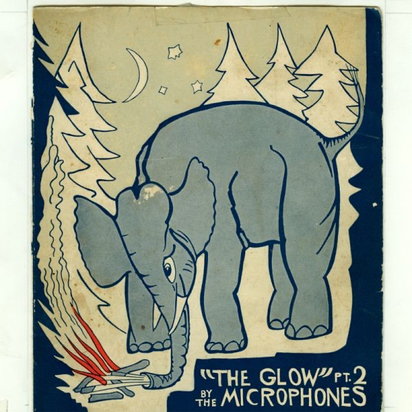
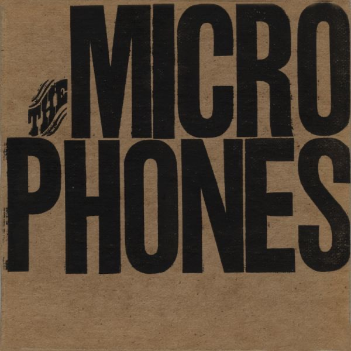
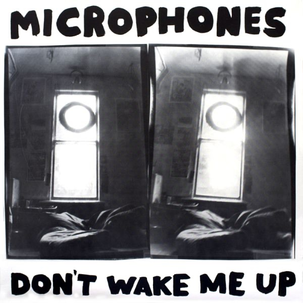
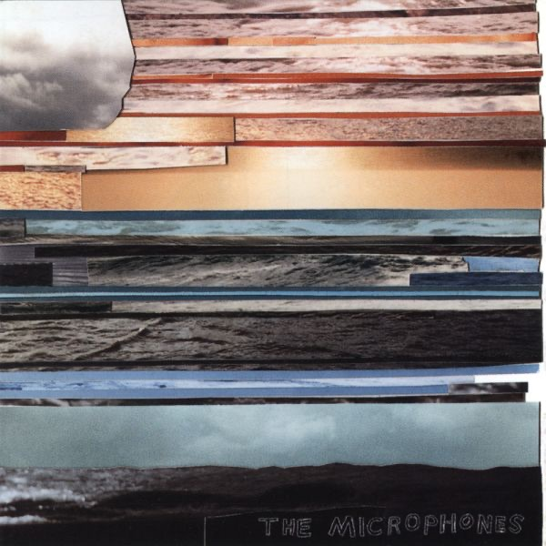
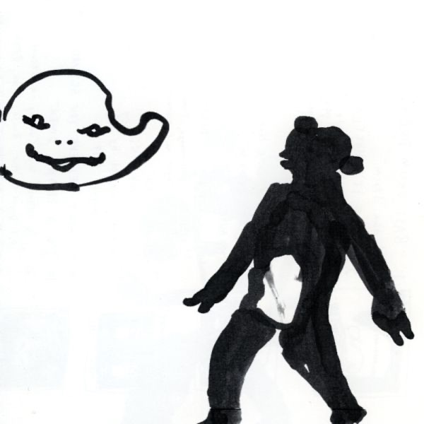
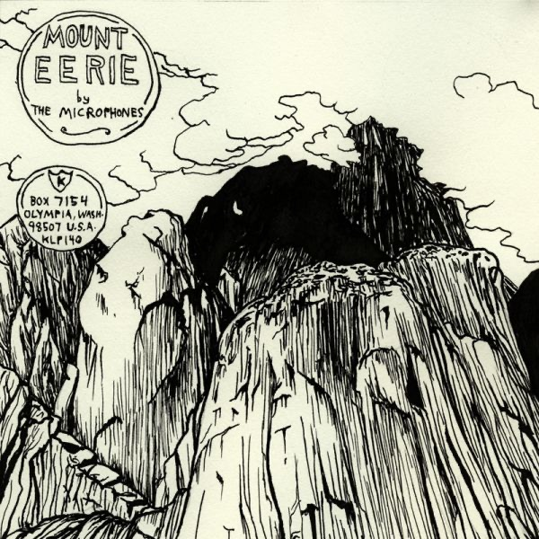
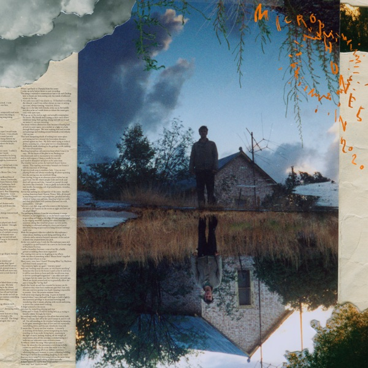

# 我要风吹过来：The Microphones 与他们的微光

*图：《The Glow Pt. 2》（2001，K Records）封面——大象用鼻子拨弄松林间的篝火，头顶弯月与星。图片取自一本 1933 年的荷兰古食谱《Calvé-Delft's Winterboekje》。图片来源：[Apple Music 公开唱片页](https://music.apple.com/us/album/the-glow-pt-2/483212192)。*

Phil Elverum 解释过「The Glow」是什么：是你在雪地里快要冻死时看见的那扇发光的窗，或者，是他们说人死的时候会走进去的那道光。2001 年，他把这个词做进一张专辑的名字里；更早一点，他在《It Was Hot, We Stayed in the Water》里用一首十一分钟的同名曲第一次点亮它。二十五年后，这个词仍然是理解他的最短路径——一个在录音室里制造微光的人，一个把冻僵、燃烧与岩石都写进歌里的人。

他的名字是 Philip Whitman Elverum，1978 年 5 月 26 日生于华盛顿州的小城 Anacortes。父亲给他做混音带，他先学大号再学鼓，十四岁组了第一支乐队。但真正的起点是一家唱片店：The Business，Anacortes 镇上唯一的另类音乐入口。十几岁的 Elverum 在店里打工，打烊之后钻进里间，用一台卡带录音机录自己的声音。店主 Bret Lunsford 不是普通人——他是传奇 lo-fi 乐队 Beat Happening 的成员。他让 Elverum 加入自己的乐队 D+ 打鼓，和另一个少年 Karl Blau 一起，又把 Elverum 最早的两盘小样《Microphone》（1996）与《Wires and Cords》（1997）放进自己运营的厂牌 KNW-YR-OWN 发行。一家唱片店的里间，就这样成了一整个声音世界的子宫。

1997 年夏天，Elverum 搬去 Olympia——华盛顿州另一座小城，K Records 的所在地。K 的老板 Calvin Johnson（Beat Happening 的另一位核心）注意到了他，让他进自己的 Dub Narcotic 录音棚。从那时起，「The Microphones」不再是一个人的卧室计划，而是一个以他为圆心旋转的流动集体：Karl Blau、Kyle Field（Little Wings）、Khaela Maricich（The Blow）、Mirah、Calvin Johnson 本人都在其中进出。关于队名，Elverum 后来说过一句大实话：「我最开始录歌的时候，真的在歌里唱麦克风、设备、录音这些事。」后来他不唱这些了，开始唱那些「古怪、黑暗、自然的主题」——名字却留了下来，像一件穿旧了不肯脱的外套。

*图：《Tests》（1998，Elsinor）——早期卡带歌曲与 Dub Narcotic 录音的合辑，牛皮纸底上盖着粗黑的 MICRO/PHONES 字样。图片来源：[Apple Music 公开唱片页](https://music.apple.com/us/album/tests/483216712)。*

*图：《Don't Wake Me Up》（1999，K Records）——第一张正式录音室专辑，黑白双联照片里一扇亮得发晕的窗。图片来源：[Apple Music 公开唱片页](https://music.apple.com/us/album/dont-wake-me-up/483247725)。*

## 一、水、火、岩石

The Microphones 的正式唱片史很短，短得像一次深呼吸：1998 年的合辑《Tests》收拢了卡带时期的零碎；1999 年 8 月，第一张录音室专辑《Don't Wake Me Up》在 K Records 出版，lo-fi 的房间里已经能听见后来的风暴。然后是三张专辑构成的元素三部曲——水、火、岩石。

*图：《It Was Hot, We Stayed in the Water》（2000，K Records）——木纹、海平线与灰天的拼贴，水的专辑。图片来源：[Apple Music 公开唱片页](https://music.apple.com/us/album/it-was-hot-we-stayed-in-the-water/483207720)。*

2000 年 9 月的《It Was Hot, We Stayed in the Water》是水。专辑名本身就是一个场景：天太热，我们待在水里。十一分钟的同名曲从浅滩一路走向噪音的深海，标题曲《The Glow》第一次点亮那扇发光的窗。Pitchfork 给出 9.2 分，评论人 Matt LeMay 写道：那些「精致、近乎民谣的旋律，被层层嗡鸣的失真吉他和风琴的浪包裹着」。这是 Elverum 第一次被全国性的耳朵听见。

2001 年 9 月 11 日的《The Glow Pt. 2》是火。下一节细说。

2003 年 1 月的《Mount Eerie》是岩石。三张专辑，三种元素，一条从水到火的升华之路，终点是一座具体的山。

*图：《Song Islands》（2002，K Records）——1998–2002 年单曲合辑，白底上两个马克笔涂鸦小人。图片来源：[Apple Music 公开唱片页](https://music.apple.com/us/album/song-islands/483208910)。*

## 二、微光：十个月的清晨

《The Glow Pt. 2》的录音时间是 2000 年 5 月 23 日到 2001 年 3 月 23 日，地点还是 Dub Narcotic。十个月里，Elverum 几乎总是一个人在清晨工作，用十六轨模拟磁带、纯立体声录制，歌是一边录一边写出来的。他后来揭秘过那些巨大失真声的来源：把吉他插进一台旧货店买来的卡带机的麦克风口，再从耳机口接进音箱——错误本身就是乐器。他说这张专辑受极端金属、氛围音乐、先锋派的影响，还有《双峰》（Twin Peaks）。

专辑有二十首歌，但它们不是二十首歌：它们互相渗入、互相接管，像二十段连成一片的潮水。开场的 `I Want Wind to Blow` 写于巡演路上的费城，Elverum 解释过标题的意思——「我想要疯狂的事发生在我身上。我厌倦了灰蒙蒙。」同名曲《The Glow Pt. 2》里那句「my blood flows harshly」被拉长了十四秒，像一个人按住自己的脉搏数心跳；《The Moon》来自他夜复一夜的散步；《I Felt Your Shape》讲「用敏感而共情的方式拥抱一个人，而不是占有」；结尾的《My Warm Blood》长达九分二十八秒，在一片环境声里结束于 Elverum 自己的心跳——下一次你再听见这个心跳，是在《Mount Eerie》的开篇。

Pitchfork 把它评为 2001 年的年度第一专辑，打分 9.2。LeMay 的评论至今仍是这张唱片最好的说明书：「它把海、天空和群山收进一幅声音的全景，那全景仿佛没有开始也没有结束」；「用普通音箱听这张唱片，就像透过立体视镜凝视大峡谷」。2008 年 K Records 再版时，评论人 Brian Howe 把分数升到 9.3，并写下：Elverum「把 Olympia 的 twee-pop 重造成更辽阔的东西，证明了亲密与恢弘并不互斥」——「这不是先构思再录制的唱片；Elvrum 是在把它录进磁带的同时，才弄清它要去哪里」。

时间是公正的。2009 年 Pitchfork 评选「2000 年代最佳 200 张专辑」，《The Glow Pt. 2》位列第 73，颁奖词引用了《Nature Boy》的歌词：「曾经有一个男孩，一个非常古怪、被施了魔法的男孩……」，说这张唱片「由泥土锻成、由石头雕出，粗粝、元素、朴实」。Tiny Mix Tapes 把它排在 2000 年代百佳第 5 位；Pitchfork 的「太平洋西北五十佳独立摇滚专辑」里它排第 3。Wild Nothing 的 Jack Tatum 说它「挑战了我对录音音乐应该是什么的全部认知」；Kevin Morby 的《Singing Saw》（2016）直接以它为灵感。一张在旧货店卡带机上制造失真的专辑，成了整整一代独立音乐的地下水。

## 三、山

然后是那座山。Mount Erie，Anacortes 近郊的孤峰，Elverum 说它「永远矗立在那里，尤其从我等校车的地方看过去」。2001 年 11 月到 2002 年 6 月，他在 Dub Narcotic 录出了以它命名的专辑：五首长曲，一部线性叙事。《I. The Sun》约十七分钟，从太阳写起；叙述者攀登、出生、行走，然后被「Big Black Death」杀死，被秃鹫啄食，最终看见宇宙的脸——「But Universe, I see your face / Looks just like mine」（可是宇宙，我看见你的脸 / 长得和我一模一样）。Calvin Johnson 为「宇宙」配音，Kyle Field 写下并念出死亡的段落，一支八人合唱团靠 Olympia 街头贴海报招募而来。Pitchfork 给出 8.9 分与 Best New Music。

*图：《Mount Eerie》（2003，K Records，KLP140）——墨线画出的峭壁与阴影中的巨物，圆形印章写着 Olympia 的地址。图片来源：[Apple Music 公开唱片页](https://music.apple.com/us/album/mount-eerie/483209747)。*

录完这张专辑，Elverum 做了一场名为「我要永远搬走、再也不回来」的巡演，然后真的去了挪威北部 Kjerringøy 的一间原木屋过冬，离最近的城市 Bodø 还有两小时车程。2003 年，他正式放下 The Microphones 这个名字：「我的音乐主题已经变了。」一个以麦克风为名的乐队，在唱完了风、光、血与山之后，死于一座山的名字——此后他的所有唱片都以 Mount Eerie 署名，第一张是 2005 年的《No Flashlight》。2004 年他创办自己的厂牌 P.W. Elverum & Sun，亲手印刷、包装、邮寄每一张唱片，亲手画每一张封面。

## 四、后来

Mount Eerie 时期的故事属于另一个名字，但有一段必须在这里克制地说：2004 年 Elverum 与漫画家、音乐人 Geneviève Castrée 结婚，两人定居 Anacortes；2015 年他们的女儿出生后不久，Castrée 被确诊无法手术的胰腺癌，2016 年 7 月 9 日去世。2017 年的专辑《A Crow Looked at Me》记录的正是这场丧恸——它不浪漫，它只是事实。

至于 The Microphones 本身：2019 年夏天，Elverum 在 Anacortes 以这个名字做了一场久违的演出，完整演奏了《The Glow Pt. 2》。2020 年 8 月 7 日，《Microphones in 2020》出版——一首四十四分四十四秒的长歌，关于创作、关于自我神话、关于无尽的意义搜寻。Pitchfork 8.5 分加 Best New Music，Metacritic 87 分。2022 年，盒套装《Completely Everything, 1996–2021》出版，被宣布为 The Microphones 的最后一张唱片。

*图：《Microphones in 2020》（2020，P.W. Elverum & Sun）——一首四十四分四十四秒的歌，封面是云下的房子与镜像倒影。图片来源：[Apple Music 公开唱片页](https://music.apple.com/us/album/microphones-in-2020/1518787480)。*

有人问 Elverum 怎么看自己的唱片被封为「经典」，他说：专辑分「好」「坏」「必听」或不是，「这完全是个神话，通常花贵一点的公关费就能买到」。他也说自己不太在意作品之间的排名。这很 Elverum：那个在唱片店里间录歌的少年，从未真的进入过「场景」。K Records 的 Olympia 世界给了他方法，Beat Happening 的天真给了他起点——Stereogum 的回顾文章说得准确：Elverum 把 Calvin Johnson 那种「以天真作为通往简单生活之无尽追求」的声音，「推离阳光灿烂的乐观，推进一个更黑暗、更激烈的世界」。

把音量拧小一点吧。这张唱片不适合最大声。它适合清晨，适合一个人，适合窗外有雾、有山、有还没亮起来的天。微光就是在这种时刻出现的：不是照耀，是透出。

## 唱片年表（核心录音室专辑与关键作品）

| 专辑 | 年份 | 厂牌 | 备注 |
|---|---|---|---|
| 《Tests》 | 1998 | Elsinor | 卡带歌曲 + Dub Narcotic 录音合辑 |
| 《Don't Wake Me Up》 | 1999 | K Records | 第一张录音室专辑 |
| 《It Was Hot, We Stayed in the Water》 | 2000 | K Records | 元素三部曲之一：水 |
| 《The Glow Pt. 2》 | 2001 | K Records | 元素三部曲之二：火；Pitchfork 2001 年度第一 |
| 《Song Islands》 | 2002 | K Records | 1998–2002 单曲合辑 |
| 《Mount Eerie》 | 2003 | K Records | 元素三部曲之三：岩石；此后队名退役 |
| 《Microphones in 2020》 | 2020 | P.W. Elverum & Sun | 一首 44:44 的长歌 |
| 《Completely Everything, 1996–2021》 | 2022 | P.W. Elverum & Sun | 盒装全集，宣布为最终作品 |

## 推荐聆听路线

1. **《The Glow Pt. 2》（2001）** —— 从 `I Want Wind to Blow` 到 `My Warm Blood`，不要跳歌，让它像潮水一样漫过你。
2. **《It Was Hot, We Stayed in the Water》（2000）** —— 水的专辑；听那首十一分钟的《The Glow》，看那扇窗怎么亮起来。
3. **《Mount Eerie》（2003）** —— 五首长曲一部叙事：出生、攀登、死亡、宇宙的脸。
4. **《Microphones in 2020》（2020）** —— 十七年后的一次回望，一首歌讲完所有。
5. **延伸**：《Don't Wake Me Up》（1999）、《Song Islands》（2002）、Mount Eerie 时期的《A Crow Looked at Me》（2017）。

## 资料与图片来源

- Wikipedia: [The Microphones](https://en.wikipedia.org/wiki/The_Microphones)、[Phil Elverum](https://en.wikipedia.org/wiki/Phil_Elverum)、[The Glow Pt. 2](https://en.wikipedia.org/wiki/The_Glow_Pt._2)、[Mount Eerie (album)](https://en.wikipedia.org/wiki/Mount_Eerie_(album))、[The Microphones discography](https://en.wikipedia.org/wiki/The_Microphones_discography)（生平、录音日期、曲目、榜单交叉核对）
- Pitchfork 乐评：[The Glow Pt. 2（2001，9.2）](https://pitchfork.com/reviews/albums/5269-the-glow-pt-2/)、[The Glow Pt. 2 再版（2008，9.3）](https://pitchfork.com/reviews/albums/11352-the-glow-pt-2/)、[It Was Hot, We Stayed in the Water（9.2）](https://pitchfork.com/reviews/albums/5268-it-was-hot-we-stayed-in-the-water/)、[Mount Eerie（8.9，Best New Music）](https://pitchfork.com/reviews/albums/5267-mount-eerie/)、[Microphones in 2020（8.5，Best New Music）](https://pitchfork.com/reviews/albums/the-microphones-microphones-in-2020/)
- Pitchfork 榜单：[2001 年度专辑榜（第 1 名）](https://pitchfork.com/features/lists-and-guides/5844-top-20-albums-of-2001/)、[2000 年代最佳 200 张专辑（第 73 名）](https://pitchfork.com/features/staff-lists/7708-the-top-200-albums-of-the-2000s-100-51/3/)、[太平洋西北五十佳独立摇滚专辑（第 3 名）](https://pitchfork.com/features/lists-and-guides/9932-the-50-best-indie-rock-albums-of-the-pacific-northwest/)
- Stereogum: [Backtrack 回顾：The Glow Pt. 2](https://www.stereogum.com/1273592/backtrack-the-microphones-the-glow-pt-2/franchises/backtrack/)；Tiny Mix Tapes：[2000 年代百佳（第 5 名）](https://www.tinymixtapes.com/features/favorite-100-albums-2000-2009-20-01)
- Exclaim!: [Phil Elverum 生涯回顾](https://exclaim.ca/music/article/microphones_mount_eerie_and_melancholy_the_career_of_phil_elverum)；Tape Op: [Phil Elvrum 录音访谈](https://tapeop.com/interviews/32/phil-elvrum)
- 专辑封面图片来源：Apple Music 公开唱片页（按唱片条目精确获取）
