# 永不熄火的公路：音速青年三十年

你没法用正常的音量讲 Sonic Youth。你得先把旋钮拧到底，拧到琴弦发烫、邻居砸墙，然后才能开口——这支乐队的全部意义，都藏在那堵用六根琴弦、几十种古怪调弦和三十年公路灰尘砌成的噪音之墙里。他们不是写歌的人，他们是把一条公路直接开进你客厅的人：引擎不熄，车窗不关，收音机同时放着三个频道。

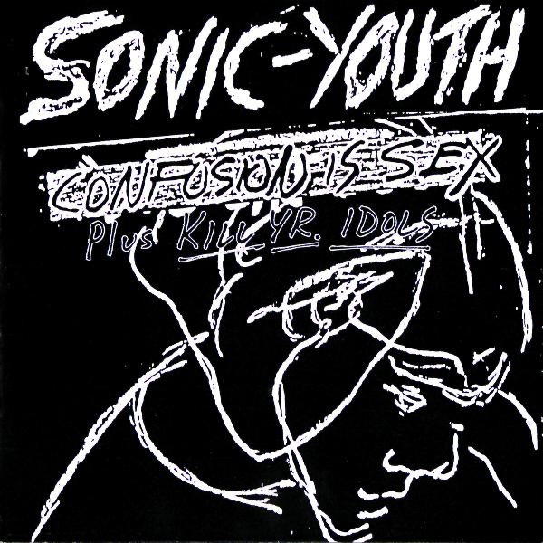

*图：《Confusion Is Sex》（1983，Neutral）——乐队首张录音室专辑，粗糙如砂纸的地下录音。图片取自 [Apple Music 公开唱片页](https://music.apple.com/us/artist/sonic-youth/36034)。*

1981 年的纽约是一台快报废的机器。房租便宜，街区危险，旧摇滚的尸体没凉透，no wave 的余烬还在冒烟。三年前，1978 年，Brian Eno 把 Teenage Jesus and the Jerks、DNA、Mars、Contortions 四支乐队塞进一张叫《No New York》的合辑，等于当众给整个摇滚乐开了一张死亡证明：别弹和弦了，别讲主歌副歌了，制造噪音吧——噪音才是这座城市唯一诚实的方言。

就在这个废墟上，三个年轻人各自游荡，然后在 Glenn Branca 的吉他乐团里撞到一起。Branca 指挥着十几把电吉他，把泛音拧成交响乐，像指挥一台声音的压路机。Thurston Moore，佛罗里达出生、康涅狄格长大，1977 年揣着朋克执念来到纽约，写地下刊物、追演出、把零花钱全换成黑胶；Kim Gordon，罗切斯特出生、洛杉矶长大，学艺术、混画廊，在洛杉矶朋克现场里学会用低音贝斯说话，1980 年才落脚纽约；Lee Ranaldo，长岛人，背着吉他和画板一路晃进曼哈顿，在 Branca 的乐团里第一次听见「声音」这个东西可以不受任何管制。

1981 年 6 月，White Columns 画廊办了一场噪音音乐节（Noise Fest），一支刚拼凑起来的乐队上台：Moore、Gordon、Ranaldo，外加一两位临时乐手。队名是拼出来的——MC5 的吉他手 Fred "Sonic" Smith 贡献了「Sonic」，牙买加雷鬼 DJ Big Youth 贡献了「Youth」，两个名字焊在一起，像一句来自底层的咒语：音速青年。从此，这个名字再没改过。

最初的 Sonic Youth，鼓手的位置像一扇旋转门。Richard Edson 来了又走，Jim Sclavunos 来了又走，Bob Bert 在 1983 到 1985 年间扛下了最吵的那几年。1983 年，他们在 Neutral 厂牌下出版首张专辑《Confusion Is Sex》——混乱即性感，标题就是宣言：录音粗粝得像砂纸，吉他像被拧断脖子的收音机，整个纽约地下场景为之侧目。

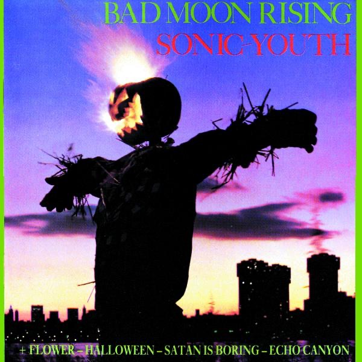

*图：《Bad Moon Rising》（1985，Homestead）。借用 Creedence Clearwater Revival 老歌名的第二张专辑，第一次露出歌的轮廓。图片取自 [Apple Music 公开唱片页](https://music.apple.com/us/artist/sonic-youth/36034)。*

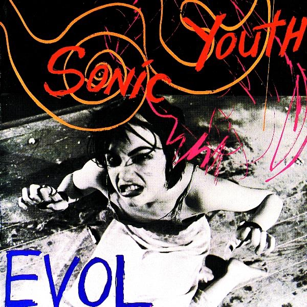

*图：《Evol》（1986，SST）——「love」倒写。旋律是斜的，和弦是歪的，可你分明听出了心跳。图片取自 [Apple Music 公开唱片页](https://music.apple.com/us/artist/sonic-youth/36034)。*

1985 年的《Bad Moon Rising》借用 Creedence Clearwater Revival 的老歌名，第一次露出歌的轮廓；1986 年转投 SST 厂牌，《Evol》把「love」倒过来写做专辑名——爱倒过来，就是他们这一时期全部的美学：旋律是斜的，和弦是歪的，可你分明听出了心跳。

真正的定盘星在 1985 年落位：来自密歇根朋克乐队 The Crucifucks 的 Steve Shelley 坐上鼓凳，从此三十年没挪过窝。四个人终于凑齐——两把互相撕咬的吉他、一条低音线、一台永动机一样的鼓。

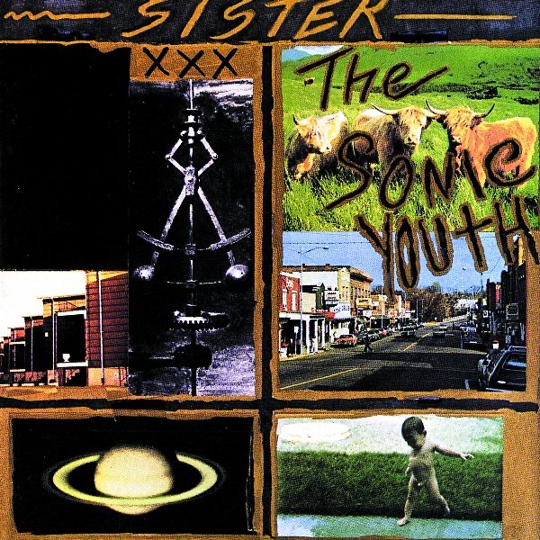

*图：《Sister》（1987，SST）。灵感部分来自科幻作家菲利普·K·迪克早夭的孪生姐姐 Jane。图片取自 [Apple Music 公开唱片页](https://music.apple.com/us/artist/sonic-youth/36034)。*

1987 年的《Sister》把科幻作家菲利普·K·迪克请进了录音室：专辑名来自迪克那个出生六周就夭折的孪生姐姐 Jane，整张唱片在迪克式的平行宇宙里游走，阴郁、偏执，却在《Schizophrenia》这样的歌里第一次显露出惊人的旋律感——噪音与旋律不再是敌人，而是共犯。

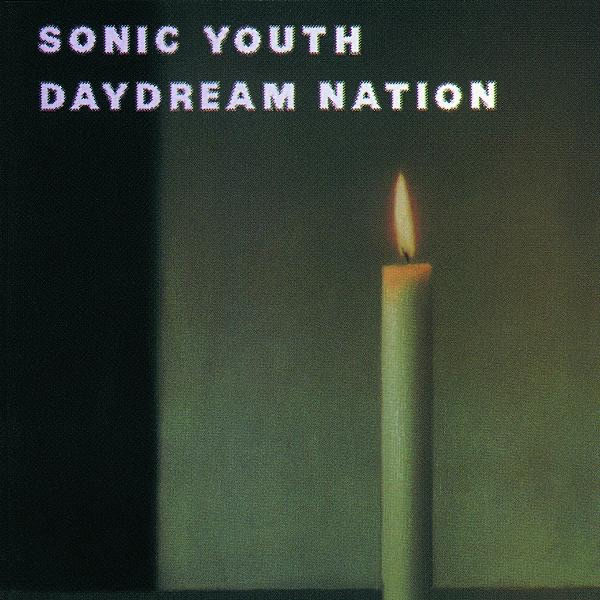

*图：《Daydream Nation》（1988，Enigma / Blast First）——2005 年度入选美国国会图书馆国家录音登记处。图片取自 [Apple Music 公开唱片页](https://music.apple.com/us/artist/sonic-youth/36034)。*

然后是 1988 年，一切被《Daydream Nation》点燃。双专辑，约七十分钟，Nick Sansano 操刀制作：《Teen Age Riot》像一列失控的青春列车冲在最前面，《Silver Rocket》把少年心气焊成推进器，《Eric's Trip》在反馈里打滚，《The Sprawl》把城市铺成一整块嗡嗡作响的混凝土，而 Kim Gordon 的《Kissability》从噪音深处站起来，低音不容置疑。这张唱片由 Enigma 在美国、Blast First 在英国发行，商业上不算什么大事，却像一枚深水炸弹。2005 年，美国国会图书馆把它选入国家录音登记处（National Recording Registry）——一支地下噪音乐队的专辑，和爵士、布鲁斯一起归档为美国文化遗产。体制终于承认：噪音也可以是遗产。

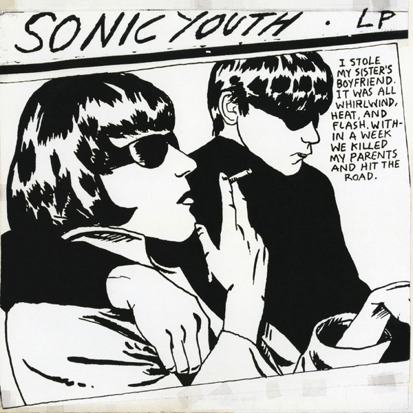

*图：《Goo》（1990，DGC）。封面为 Raymond Pettibon 标志性的黑白画作；《Kool Thing》有 Chuck D 客串。图片取自 [Apple Music 公开唱片页](https://music.apple.com/us/artist/sonic-youth/36034)。*

1990 年，Sonic Youth 做了一个让地下圈炸锅的决定：签约大公司 DGC。可《Goo》一响起来，所有质疑都哑了火。封面是 Raymond Pettibon 标志性的黑白画作，里面是更锋利的 riff、更清晰的歌：《Dirty Boots》一开场就踩下油门；《Kool Thing》请来嘻哈巨星 Chuck D 客串，Kim Gordon 在歌里质问偶像、质问男性、质问整个行业；《Tunic (Song For Karen)》写给早逝的 Karen Carpenter，温柔得像一把包着丝绒的刀。

在 Michael Azerrad 那本《Our Band Could Be Your Life》里，Moore 回忆当时的心态：「那时候根本不存在『以独立为荣』这回事。做独立音乐只是——好像也没有别的可做了，大厂牌根本没兴趣。」Ranaldo 后来说得更直白：他们在蒙大拿、怀俄明这些地方遇到歌迷，对方根本不知道去哪儿买他们的唱片。那就把唱片摆到 Guns N' Roses 和 Paula Abdul 旁边去吧——更精明的地方在于：如果你想在蒙大拿的青少年面前喊出「把女孩从白人男性企业压迫里解放出来」（《Kool Thing》），你得先让他们能走进唱片店。

他们把门踹开了。几年后 Nirvana 能签到同一家 DGC，正是沿着 Sonic Youth 蹚出来的路——1991 年他们带着 Nirvana 一起巡演，顺手把这批西雅图年轻人推荐给了大公司。Azerrad 的书里，Nirvana 的贝斯手 Krist Novoselic 说过大意如此的话：他们当年的目标，就是做到 Sonic Youth 那么好。

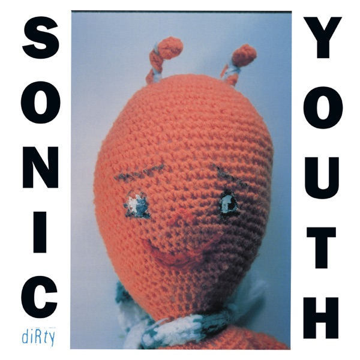

*图：《Dirty》（1992，DGC）——与 Nirvana 制作人 Butch Vig 合作，《100%》冲进 Billboard 另类榜前五。图片取自 [Apple Music 公开唱片页](https://music.apple.com/us/artist/sonic-youth/36034)。*

九十年代来了，grunge 爆了，世界终于追上 Sonic Youth。1992 年，他们请来 Nirvana 的制作人 Butch Vig 录制《Dirty》：《100%》冲进了 Billboard 另类榜前五，《Youth Against Fascism》喊出「I believe Anita Hill」，把轰动全美的听证会直接焊进摇滚乐。1995 年夏天，他们与 Hole 一起成为 Lollapalooza 音乐节的领衔阵容——地下噪音站上了最大的舞台。

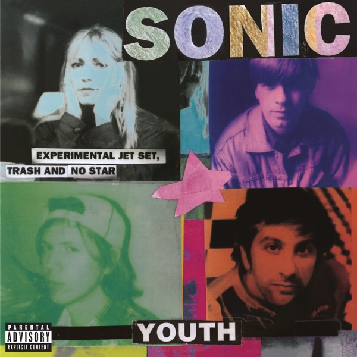

*图：《Experimental Jet Set, Trash and No Star》（1994，DGC）——名字像一句达达主义拼贴诗。图片取自 [Apple Music 公开唱片页](https://music.apple.com/us/artist/sonic-youth/36034)。*

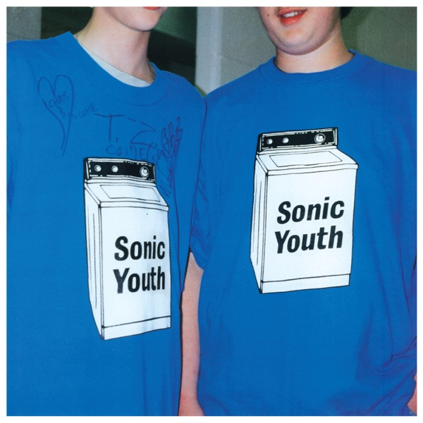

*图：《Washing Machine》（1995，DGC）——末尾的《The Diamond Sea》接近二十分钟，是九十年代最壮丽的器乐史诗之一。图片取自 [Apple Music 公开唱片页](https://music.apple.com/us/artist/sonic-youth/36034)。*

但他们从没真正属于 grunge。1994 年，名字长得像拼贴诗的《Experimental Jet Set, Trash and No Star》出版；1995 年，乐队跑到孟菲斯的 Easley 录音室，在 John Agnello 的制作下录出《Washing Machine》——末尾那首《The Diamond Sea》接近二十分钟，吉他像潮水涨了又涨，是整个九十年代最壮丽的器乐史诗之一。

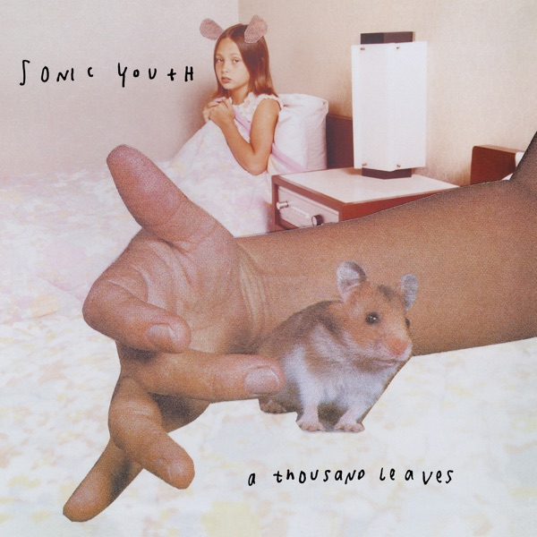

*图：《A Thousand Leaves》（1998，DGC）——第一张完全在乐队自建录音室 Echo Canyon 录制的专辑。图片取自 [Apple Music 公开唱片页](https://music.apple.com/us/artist/sonic-youth/36034)。*

1998 年，《A Thousand Leaves》成为第一张完全在乐队自建录音室 Echo Canyon 录制的专辑——他们终于有了自己的家。然后是 1999 年夏天，灾难降临：巡演途中，停在加州橙县的面包车被撬，几十把吉他、效果器、音箱被洗劫一空。那是几十种独门调弦、几十年噪音实验的全部家底。

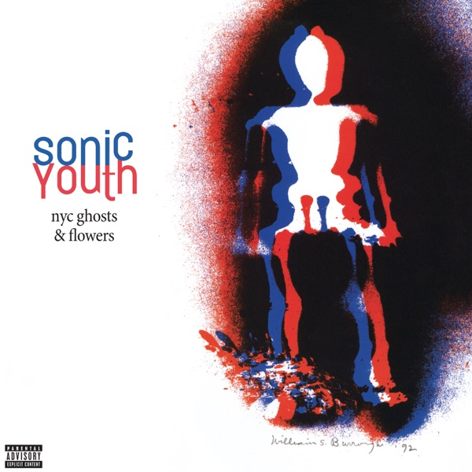

*图：《NYC Ghosts & Flowers》（2000，Geffen）——乐器被窃后重新买琴、重新调弦、重新发明自己的激进之作。图片取自 [Apple Music 公开唱片页](https://music.apple.com/us/artist/sonic-youth/36034)。*

可 Sonic Youth 的反应不像受害者，倒像重获自由的人。他们重新买琴、重新调弦、重新发明自己——2000 年的《NYC Ghosts & Flowers》因此成了他们最激进的唱片：Burroughs 和 Ginsberg 的垮掉派诗歌钻进歌词，念白代替歌唱。同一时期，他们创办了 SYR 厂牌（Sonic Youth Recordings），从 1997 年起把那些无法归类的即兴、实验与现场存档一张张放进编号系列。被偷走的是乐器，偷不走的是方言。

2001 年之后，Echo Canyon 所在的默里街（Murray Street）离世贸中心遗址只有几条街。2002 年的专辑就叫《Murray Street》——九一一之后的纽约在唱片里嗡嗡作响，没有一句口号。Jim O'Rourke 一度作为正式成员加入（1999–2005），贝斯与吉他的层次更密；《Sonic Nurse》（2004）与《Rather Ripped》（2006）证明：这支平均年龄五十岁的乐队，仍然比多数年轻人锋利。

2007 年 6 月，他们做了一件当时很少有西方另类乐队做过的事：去中国大陆巡演，在北京与上海开唱。

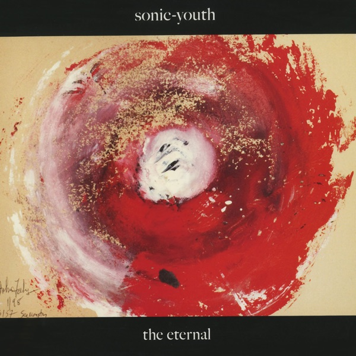

*图：《The Eternal》（2009，Matador）——转投独立厂牌 Matador 后冲上 Billboard 专辑榜第 18 名。图片取自 [Apple Music 公开唱片页](https://music.apple.com/us/artist/sonic-youth/36034)。*

2009 年，《The Eternal》转投 Matador 厂牌，开场曲《Sacred Trickster》干脆利落，整张专辑冲上 Billboard 专辑榜第 18 名——三十年了，他们还在往上走。

2011 年 10 月，Matador 发布声明：Moore 与 Gordon 二十七年婚姻走到尽头，乐队关系也一并结束。Sonic Youth 就此解散，没有告别巡演，没有最后一声轰鸣。最后一场演出留在 2011 年 11 月的巴西伊图（Itu），SWU 音乐节——一首歌也没少演，只是当时没人知道那是终点。

之后的故事各自展开。Kim Gordon 出版回忆录《Girl in a Band》（2015），以六十多岁的年纪连发两张先锋专辑《No Home Record》（2019）与《The Collective》（2024）；Thurston Moore 继续出版个人专辑，2023 年写出回忆录《Sonic Life》；Lee Ranaldo 与 Steve Shelley 也在录音与现场之间来回。2022 年，一张录于 2012 年的 EP《In/Out/In》出版——乐队留下的最后一段录音，像一封寄了十年才到的信。

会有重组吗？Moore 在近年的采访里说得明白：不会。有些公路开到尽头，就让它留在尽头。

最后说说那声音是怎么来的。几十种非常规调弦，螺丝刀和鼓棒别进琴弦之间，吉他变成打击乐、蜂鸣器、失控的收音机。Moore 与 Ranaldo 从不弹同一条旋律线，两把吉他像两条平行又互相渗漏的河；Gordon 的低音稳住大地，Shelley 的鼓把一切钉在节拍上。这种声音直接喂养了九十年代的另类摇滚：没有 Sonic Youth，就没有 Nirvana 的签约之路，也没有「既激进又职业」的独立音乐活法样本。

音速青年。这个名字他们扛了三十年——音速不是速度，是一种温度；青年不是年龄，是一种拒绝熄火的状态。公路还在，引擎还热。把音量拧大吧。

## 录音室专辑年表（16 张）

| 专辑 | 年份 | 厂牌 |
|---|---|---|
| 《混乱即性感》Confusion Is Sex | 1983 | Neutral |
| 《坏月升起》Bad Moon Rising | 1985 | Homestead |
| 《爱之倒写》Evol | 1986 | SST |
| 《姐妹》Sister | 1987 | SST |
| 《白日梦国度》Daydream Nation | 1988 | Enigma / Blast First |
| 《黏液》Goo | 1990 | DGC |
| 《肮脏》Dirty | 1992 | DGC |
| 《实验喷气机，垃圾与无星》Experimental Jet Set, Trash and No Star | 1994 | DGC |
| 《洗衣机》Washing Machine | 1995 | DGC |
| 《千叶》A Thousand Leaves | 1998 | DGC |
| 《纽约幽灵与花》NYC Ghosts & Flowers | 2000 | Geffen |
| 《默里街》Murray Street | 2002 | Geffen |
| 《音速护士》Sonic Nurse | 2004 | Geffen |
| 《相当撕裂》Rather Ripped | 2006 | Geffen |
| 《永恒》The Eternal | 2009 | Matador |

（另有 SYR 编号系列实验专辑与现场档案若干）

## 推荐聆听路线

1. **入门**：《Daydream Nation》——《Teen Age Riot》《Silver Rocket》《The Sprawl》
2. **流行时刻**：《Goo》——《Kool Thing》《Dirty Boots》；《Dirty》——《100%》《Sugar Kane》
3. **史诗**：《Washing Machine》——《The Diamond Sea》（接近 20 分钟，一首管够）
4. **晚期锋芒**：《The Eternal》——《Sacred Trickster》《Anti-Orgasm》
5. **谢幕信**：EP《In/Out/In》（2022）

## 资料来源

- Wikipedia: Sonic Youth、Daydream Nation（国家录音登记处条目核对）
- iTunes/Apple Music 官方唱片目录（artist id 36034）及专辑编辑文案
- MusicBrainz 艺术家条目（artist id `5cbef01b-cc35-4f52-af7b-d0df0c4f61b9`）：成员、活动区间、厂牌核对
- Michael Azerrad,《Our Band Could Be Your Life》（Goo 签约、Nirvana 引荐相关引述）
- 美国国会图书馆 National Recording Registry（Daydream Nation 入选 2005 年度登记批次）
- Rolling Stone：Thurston Moore 谈重组可能性的最新专访
- Kim Gordon,《Girl in a Band》；Thurston Moore,《Sonic Life》
