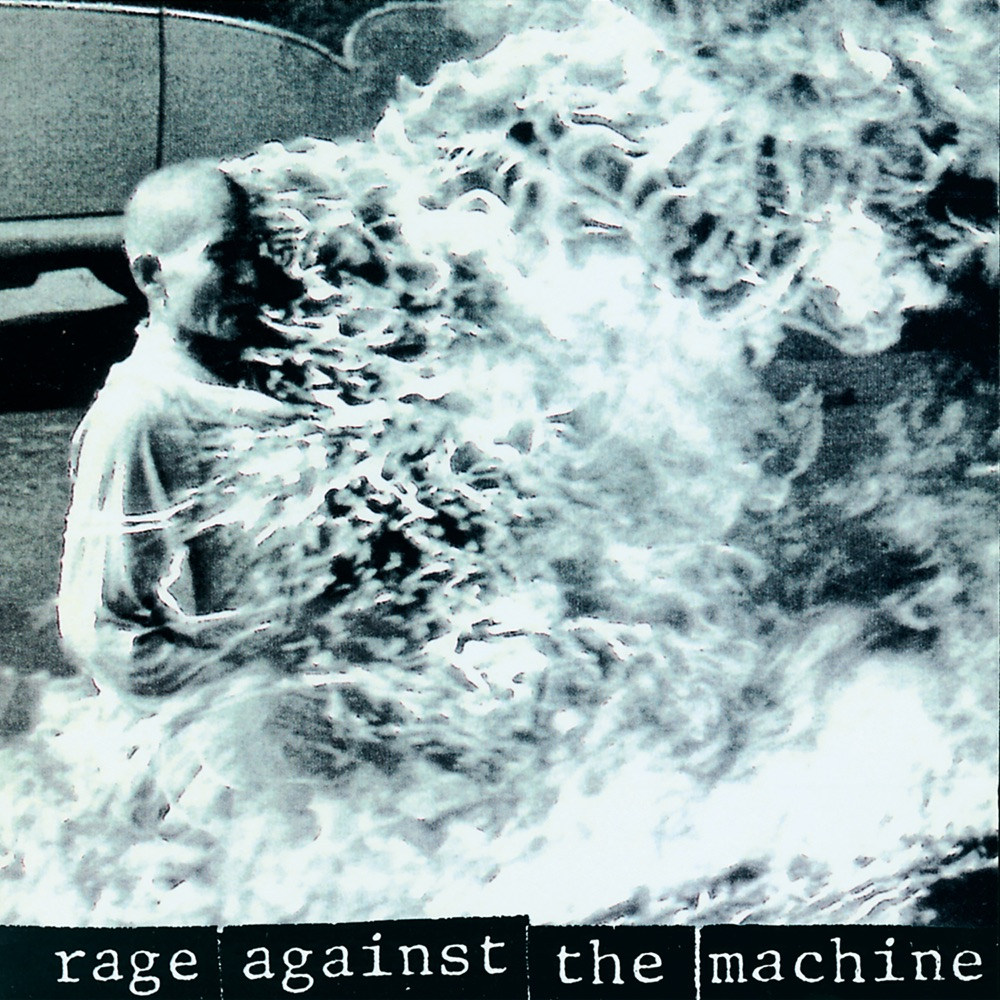
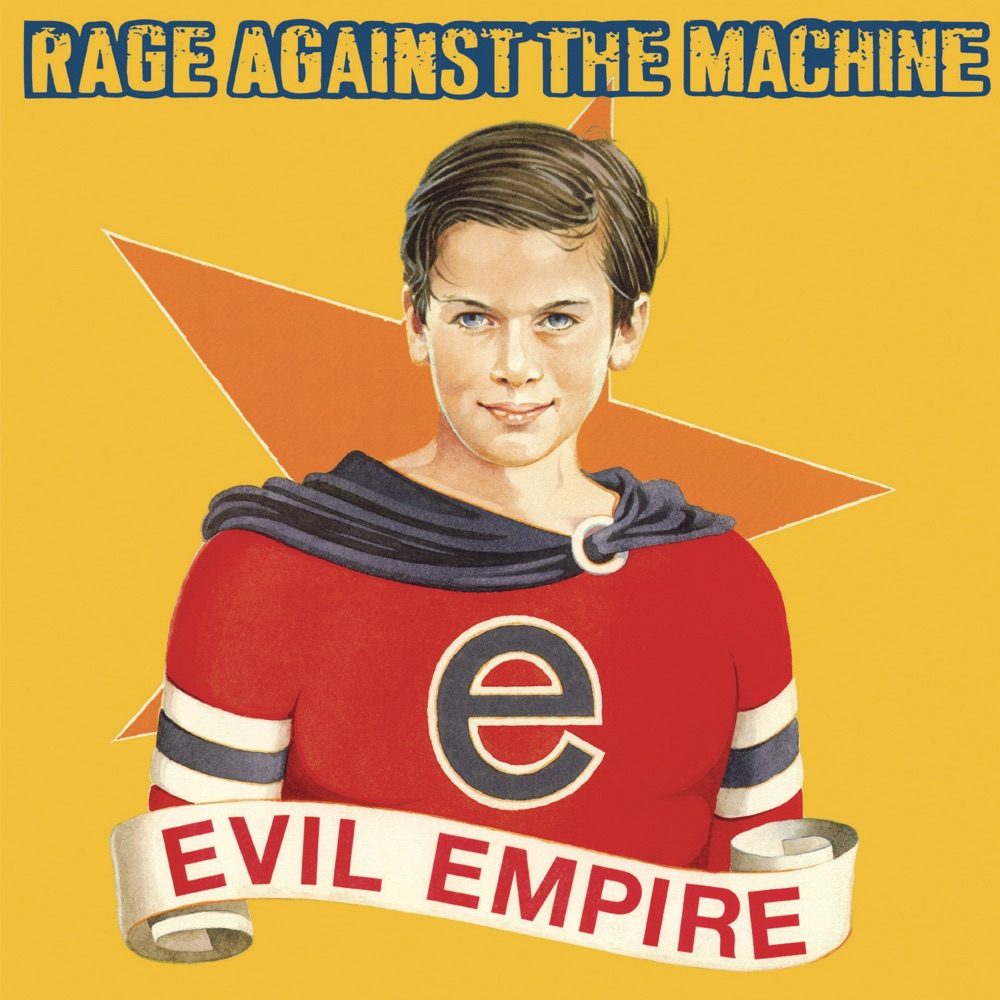
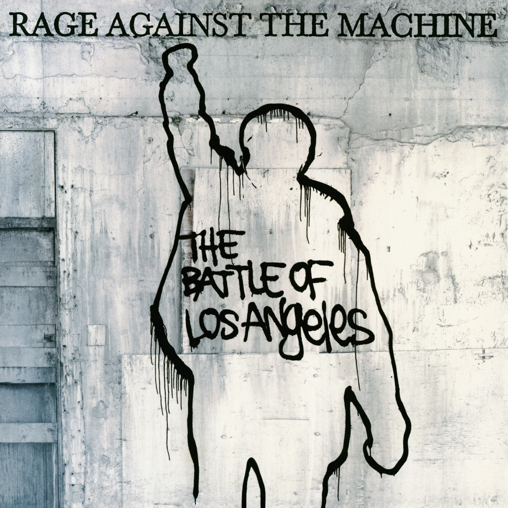
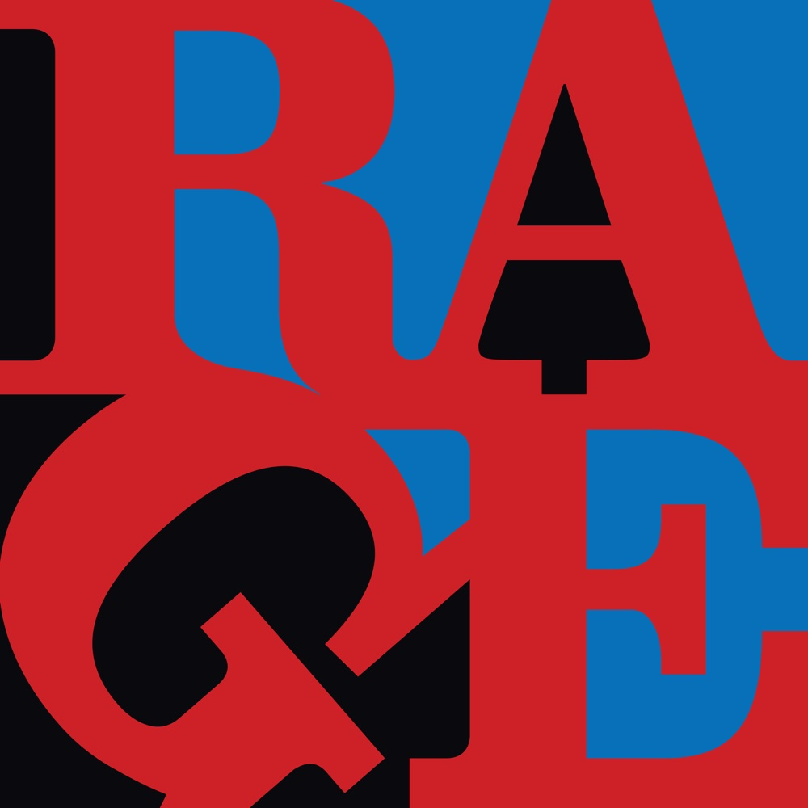
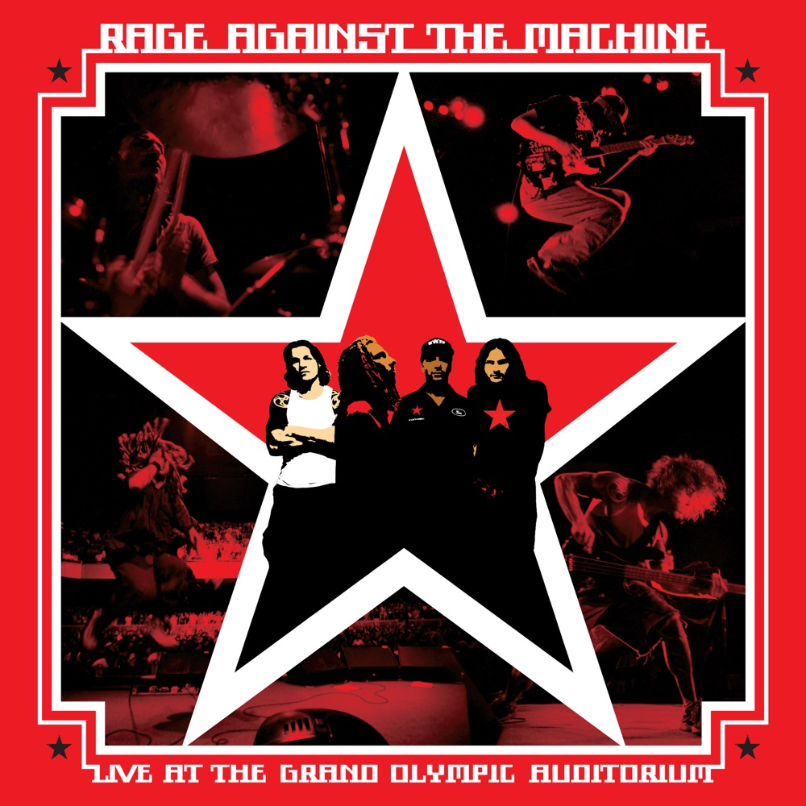

# 烧毁的照片里：Rage Against the Machine 与机器的噪音

*图：同名专辑《Rage Against the Machine》（1992，Epic）封面。Malcolm Browne 拍摄的释广德自焚照片，1963 年西贡，普利策奖获奖作品。图片来源：[Apple Music](https://music.apple.com/us/album/rage-against-the-machine/191450810)。*

一张照片。一九六三年六月十一日，西贡街头，一名越南佛教僧侣释广德盘腿坐下，被火焰吞没。摄影师 Malcolm Browne 按下快门。那张照片获得了普利策奖，震惊了世界，改变了越南战争的走向。

三十年后，两个洛杉矶的年轻人把这张照片印在一张专辑封面上。没有解释，没有道歉，没有折衷。照片下面只有一行字：Rage Against the Machine。

那是他们对整个世界发出的第一声怒吼。

## 一、机器的名字

一九九一年，洛杉矶。Tom Morello 是一个刚从哈佛大学社会研究系毕业的吉他手，在 Lock Up 乐队里弹吉他，日子过得紧巴巴。他想把海湾战争、种族隔离的终结、苏联解体搅动的时代情绪做成音乐——他登了一则招聘广告，要求"一个喜欢 Black Sabbath 和 Public Enemy 的社会主义主唱"。一年后他找到了 Zack de la Rocha：Inside Out 乐队的主唱，墨西哥著名壁画家的儿子，在东洛杉矶和尔湾之间长大的朋克。Lock Up 的吉他手把 Commerford 和 Zack 介绍给 Morello，四个人凑在一起。Morello 随后找来了 Brad Wilk——Wilk 之前给 Lock Up 试镜失败，也给后来成为 Pearl Jam 的那支乐队试镜失败。

乐队名取自 Zack 为 Inside Out 写的一首歌：Rage Against the Machine。那首歌没能录成专辑，但它的名字活了下来。独立厂牌老板、zine 出版人 Kent McClard 早在一九八九年就在他的刊物 No Answers 里用过这个词组。RATM 把它捡起来，变成了旗帜。

一九九二年十一月，同名专辑发行。制作人 Garth Richardson。厂牌 Epic Records——索尼的子厂牌。这个组合本身就带着讽刺：一支公开反对资本主义的乐队，签在一家跨国唱片巨头的旗下。Morello 后来解释："Epic 同意了我们所有的要求——只要保持创作控制权，我们就看不到意识形态冲突。"

专辑封面就是那张自焚照片。没有乐队名，没有标题，只有火焰。内页也没有歌词——Morello 说，他们想让听众先听到音乐，再去找歌词。

听一遍这张专辑，你会明白为什么它后来被视作 rap metal 的基石。它不是把说唱叠在金属上，也不是把金属垫在说唱下，而是把两者拧成一股绳。

`Bombtrack` 是开场。Morello 的吉他 riff 像一枚定时炸弹被拆开又装回去，drop-D 调弦让低音沉到地板下面。Zack 的第一句就把听众拽进战场。

`Take the Power Back` 的节奏更慢，更重。这首歌不是呐喊，是宣誓。Commerford 的贝斯线像一条铁链，Wilk 的鼓点像铁锤，一下一下，把"夺回权力"这四个字敲进骨头里。

`Know Your Enemy` 里，Zack 说唱，Morello 用吉他在副歌处制造出近乎刮擦的音色。歌词直接点名体制与压迫者，把"敌人"从抽象概念变成一个具体的存在。

`Wake Up` 是专辑的政治中心。它从一段沉重的 riff 开始，Zack 的声音逐渐升高，最后变成近乎尖叫的控诉。这首歌后来被放进电影《黑客帝国》的原声带，不是巧合——它本来就是一首唤醒的歌。

`Freedom` 是专辑的高潮。节奏突然放慢，Morello 的吉他变得空旷，Zack 的声音几乎是在低语。这首歌讲的是 Leonard Peltier——一名被定罪的政治活动家。乐队后来把这首歌的音乐录影带拍成了关于 Peltier 案的纪录片。

从第一秒到最后一秒，这张专辑没有一首歌是填充。十二首歌，十二次冲击。

## 二、Killing in the Name

专辑的第一首歌叫 `Killing in the Name`。歌词只有八行。

八行歌词，十七个"fuck"。

歌曲从一段 drop-D 调弦的吉他 riff 开始——Morello 后来回忆，这段 riff 是他在教学生调弦时随手录下的，第二天乐队把它发展成一首歌。Zack 的说唱从第一秒就带着指控，不是唱歌，是审问。副歌重复同一句话，重复，重复，直到最后爆发成一串脏话的洪水。

一九九三年二月二十一日，BBC Radio 1 的 DJ Bruno Brookes 在他的 Top 40 倒计时节目里意外播放了未删减版。一百三十八个投诉电话打了进来。Brookes 当时正在录制下一期节目的广告，歌已经在播了。

但真正的转折点是 Lollapalooza。一九九三年夏天，RATM 登上 Lollapalooza 音乐节的舞台。专辑销量从演出前的七万五千张，飙到年底的四十万张。

那一年在费城的 Lollapalooza，他们做了另一件事。四个人走上台，脱光衣服，嘴上贴着胶带，胸口用油漆写着 PMRC 三个字母——那是推动音乐审查的"家长音乐资源中心"的缩写。他们拒绝演奏，就那样站着，站了十五分钟。音箱里只有 Morello 和 Commerford 的放大器发出的反馈噪音。台下的观众等着，乐队沉默着，只有噪音。后来，他们为失望的歌迷补了一场免费演出。

这不是表演。这是他们的论点：当权力让你闭嘴，沉默本身就是最响的声音。

## 三、倒挂的国旗

一九九六年四月十六日，第二张专辑《Evil Empire》发行。首周二十四万九千张，空降 Billboard 200 榜首。后来获得三白金认证。

专辑发行后不久，乐队受邀上《Saturday Night Live》演出。他们计划演两首歌，但在排练时，他们试图在音箱上挂倒置的美国国旗——那是国际公认的遇险信号。节目组不允许。两首歌的演出被砍成一首。他们还是演了，只是没有国旗。

这张专辑的声音更重，更脏，更多 hip-hop 的影响。Morello 形容它是"Public Enemy 和 The Clash 的中间地带"。

`Bulls on Parade` 是这张专辑的拳头。Morello 的吉他 riff 简单到近乎粗暴，但正是这种简单让它像一把锤子。Zack 的说唱在副歌处变成呐喊，"Bulls on parade!" 这五个字被重复到近乎催眠。

`People of the Sun` 开头是一段墨西哥民谣的采样，然后 Morello 的吉他像日出一样升起。这首歌讲的是墨西哥革命，讲的是被压迫者的历史。Zack 的声音里有一种罕见的温柔——不是对听众的温柔，是对历史的温柔。

`Tire Me` 是专辑里最短的歌，也是最重的。两分多钟，没有副歌，只有 Zack 的控诉和 Morello 的吉他。这首歌后来获得了格莱美最佳金属演奏奖。

一九九七年，他们给 U2 的 PopMart 巡演做开场嘉宾。利润捐给了工会组织和萨帕塔民族解放军。

## 四、洛杉矶之战

一九九九年十一月二日，第三张专辑《The Battle of Los Angeles》发行。首周四十五万张，再次空降 Billboard 200 榜首。双白金认证。

专辑名来自一九九二年洛杉矶暴动——Rodney King 被判无罪后，这座城市燃烧了六天。RATM 的音乐里一直有那种暴动的声音，只是这一次，他们把它放进了专辑标题。

`Guerrilla Radio` 是这张专辑的宣言。Morello 的吉他 riff 像一台收音机在不同频道之间切换，Zack 的声音在副歌处变成口号——改变要从这里开始，要从此刻开始。这首歌后来获得了格莱美最佳硬摇滚演奏奖，副歌的精神也被印在无数件 T 恤上。

`Sleep Now in the Fire` 的 riff 是 Morello 最简洁的作品之一，但正是这种简洁让它像一把刀。Zack 的声音在副歌处变得近乎温柔，但歌词讲的是资本主义的暴力。

`Calm Like a Bomb` 是专辑里最被低估的歌。它的结构像一枚炸弹被慢慢组装，从安静的 intro 到爆炸的副歌。这首歌后来出现在电影《黑客帝国：重装上阵》里。

`Testify` 的吉他音色是 Morello 的标志性手法——他用 whammy pedal 制造出近乎人声的尖叫，然后用 toggle switch 切断信号，制造出类似 DJ 搓盘的效果。这不是吉他独奏，这是吉他在说唱。

那一年，RATM 的声音成了世纪末反叛的官方配乐：《Wake Up》进了《黑客帝国》原声带，《Calm Like a Bomb》进了续集《黑客帝国：重装上阵》。

二〇〇〇年一月二十六日，Michael Moore 执导《Sleep Now in the Fire》的音乐录影带。拍摄地点：纽约证券交易所门口。没有许可证。乐队开始演奏，警察冲过来，Moore 被带走，他冲着乐队喊："拿下纽约证券交易所！"

那扇大门，关上了。

同年八月，民主党全国大会在洛杉矶召开。RATM 在斯台普斯中心对面的合法抗议区搭起一个小舞台，对着会场开了一场免费演唱会。Zack 站在台上说："兄弟姐妹们，我们的民主被劫持了！"那是乐队七年沉寂之前的最后一场演出。

## 五、翻唱与解散

二〇〇〇年，乐队发行了翻唱专辑《Renegades》——翻唱了 Afrika Bambaataa、The Rolling Stones、Minor Threat、Devo 等人的歌。这不是一张普通的翻唱专辑。它是一份声明：这些歌是我们的祖先，是我们的血脉。

然后，乐队解散了。

Zack de la Rocha 离开。Morello、Commerford、Wilk 和 Chris Cornell 组了 Audioslave。那是另一个故事。

## 六、复活

二〇〇七年，RATM 在 Coachella 音乐节重组。没有新专辑，只有演出。他们继续演出，继续抗议，继续用音乐作为武器。

二〇〇九年十二月，英国 DJ Jon Morter 和他的妻子 Tracy 在 Facebook 上发起了一场运动：让 `Killing in the Name` 成为英国圣诞单曲榜冠军，打破《X Factor》连续五年垄断圣诞冠军的局面。Simon Cowell 骂他们"愚蠢"和"犬儒"。Dave Grohl、Muse、The Prodigy 都表示支持。Morello 说，这将是一剂"美妙的无政府主义良药"。

十二月二十日，BBC Radio 1 宣布：`Killing in the Name` 成为圣诞冠军。五十万张销量。这是英国历史上第一首纯下载单曲圣诞冠军。

二〇一九年，乐队宣布第二次重组，计划二〇二〇年巡演。

二〇二二年，Public Service Announcement 巡演开始。第二场演出，在芝加哥，Zack de la Rocha 在唱《Bullet in the Head》时跟腱撕裂。他坐在舞台中央的一个箱子上，演完了整场。

巡演取消了。

二〇二三年十一月，RATM 被选入摇滚名人堂。Tom Morello 是唯一出席的成员。他在获奖感言里说："我在这里的原因，以及庆祝这首音乐的最好方式，就是让你们继续那个使命和那个信息。我从 Rage 粉丝身上学到的教训是，音乐每天都在改变世界。"

二〇二四年一月三日，鼓手 Brad Wilk 在 Instagram 上发了一条消息：RATM 不会再巡演，不会再演出，不会再以任何形式继续。这是第三次解散。

## 七、机器没有停

Tom Morello 的吉他，从来不是传统的摇滚吉他。他用 kill switch 切断信号，用 whammy pedal 制造尖叫，用 toggle switch 模仿 DJ 的搓盘。他的吉他听起来像一台机器在说话——不，像一台机器在反抗。

Zack de la Rocha 的说唱，不是 hip-hop，不是摇滚，是一种全新的东西。他的声音里有愤怒，有悲伤，有某种近乎宗教的紧迫感。他不唱，他控诉。

这张同名专辑，在 Rolling Stone 的五百张最伟大专辑榜单上，从二〇〇三年的排名一路攀升到二〇二〇年的第二百二十一位。Pitchfork 在二〇一七年给了它 9.1 分。《The Battle of Los Angeles》得了 8.7 分。

格莱美给了他们七次提名，两次获奖：《Tire Me》获得一九九七年最佳金属演奏，《Guerrilla Radio》获得二〇〇一年最佳硬摇滚演奏。

但 RATM 从来不是为了格莱美而存在。他们是为了那些没有声音的人而存在。

## 八、火焰还在烧

Tim Commerford 在二〇二二年被诊断出前列腺癌。二〇二四年十二月，他说："我五十六岁了，我比我这辈子任何时候都强壮。"

Morello 继续他的个人项目，继续他的政治行动。Zack de la Rocha 几乎从公众视野里消失了。Brad Wilk 发了那条 Instagram，然后安静下来。

那张照片还在封面上。释广德还在火里。火焰没有停。

机器还在运转。

而 Rage Against the Machine 告诉我们：你可以对机器怒吼。你可以把一张烧毁的照片印在专辑封面上。你可以在纽约证券交易所门口演奏。你可以让一首有十七个脏话的歌成为圣诞冠军。

你可以拒绝闭嘴。

*图：《Evil Empire》（1996，Epic）封面。芥末黄背景，政治宣传画风格，一个微笑男孩披着斗篷，身后是五角星。图片来源：[Apple Music](https://music.apple.com/us/album/evil-empire/390538381)。*

*图：《The Battle of Los Angeles》（1999，Epic）封面。水泥墙上，黑色喷漆勾出一个举拳人形。图片来源：[Apple Music](https://music.apple.com/us/album/the-battle-of-los-angeles/192816635)。*

*图：《Renegades》（2000，Epic）封面。蓝底上超大红色字母拼出 RAGE。图片来源：[Apple Music](https://music.apple.com/us/album/renegades/269457897)。*

*图：《Live at the Grand Olympic Auditorium》（2003）现场专辑封面。红色五角星中嵌入四人合影。图片来源：[Apple Music](https://music.apple.com/us/album/live-at-the-grand-olympic-auditorium/171209446)。*

## 四张录音室专辑

| 专辑 | 年份 | 厂牌 | 首周/销量 |
|---|---:|---|---|
| 《Rage Against the Machine》 | 1992 | Epic | 三白金（RIAA） |
| 《Evil Empire》 | 1996 | Epic | 首周 249K，三白金 |
| 《The Battle of Los Angeles》 | 1999 | Epic | 首周 450K，双白金 |
| 《Renegades》（翻唱专辑） | 2000 | Epic | — |

## 推荐聆听路线

1. **从怒吼开始：**《Rage Against the Machine》——`Killing in the Name`、`Bombtrack`、`Take the Power Back`、`Know Your Enemy`、`Wake Up`、`Freedom`
2. **进入帝国：**《Evil Empire》——`Bulls on Parade`、`People of the Sun`、`Tire Me`
3. **抵达战场：**《The Battle of Los Angeles》——`Guerrilla Radio`、`Sleep Now in the Fire`、`Calm Like a Bomb`、`Testify`
4. **追溯血脉：**《Renegades》——翻唱 Afrika Bambaataa、Minor Threat、The Rolling Stones
5. **现场：**《Live at the Grand Olympic Auditorium》（2003）

## 资料与图片来源

- Grammy 官方：[Rage Against The Machine 获奖与提名](https://www.grammy.com/artists/rage-against-machine/7839/)（2 次获奖、7 次提名）
- Pitchfork：[同名专辑 9.1（2017）](https://pitchfork.com/reviews/albums/rage-against-the-machine-rage-against-the-machine/)；[The Battle of Los Angeles 8.7](https://pitchfork.com/reviews/albums/rage-against-the-machine-the-battle-of-los-angeles/)
- Rolling Stone：[RATM 入选摇滚名人堂](https://www.rollingstone.com/music/music-news/rage-against-the-machine-rock-hall-of-fame-induction-1234869662/)；[第三次解散报道](https://www.rollingstone.com/music/music-news/rage-against-the-machine-break-up-again-2024-1234939808/)
- Wikipedia：[Rage Against the Machine](https://en.wikipedia.org/wiki/Rage_Against_the_Machine)；[Killing in the Name](https://en.wikipedia.org/wiki/Killing_in_the_Name)
- MusicBrainz：[Rage Against the Machine](https://musicbrainz.org/artist/3798b104-01cb-484c-a3b0-56adc6399b80)（1991—2024）；[同名专辑](https://musicbrainz.org/release-group/1305859b-8937-397f-9c33-39f62eb672fb)；[Evil Empire](https://musicbrainz.org/release-group/1b469da1-e542-346b-84e6-4d7fe45be181)；[The Battle of Los Angeles](https://musicbrainz.org/release-group/25e72bf4-09fc-3e66-9d31-9247d91b4819)；[Renegades](https://musicbrainz.org/release-group/38c1dd77-0116-380c-a4f5-2ea8e13389a3)
- Apple Music：[RATM 官方唱片目录](https://music.apple.com/us/artist/rage-against-the-machine/899409)
