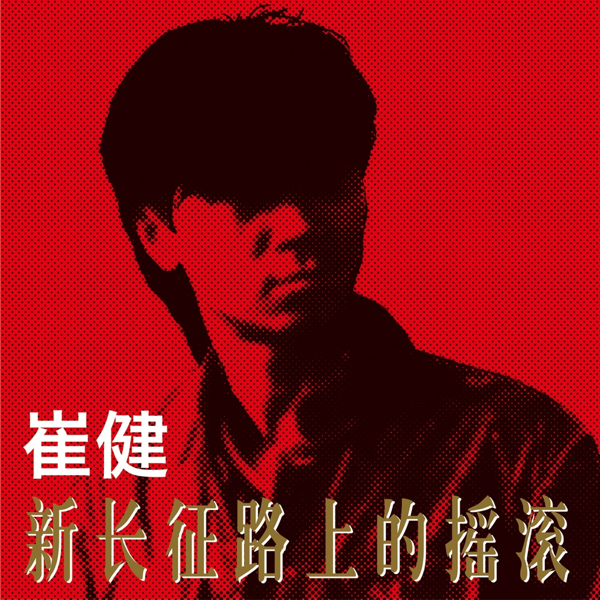
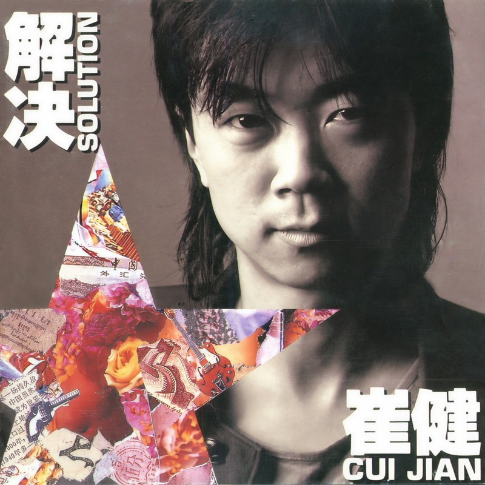
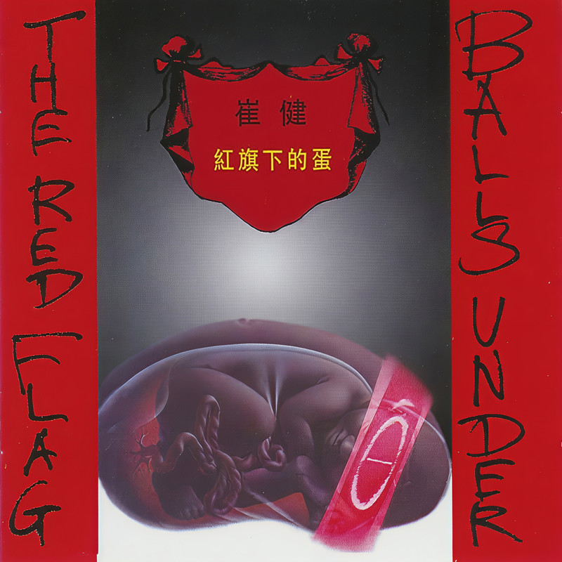
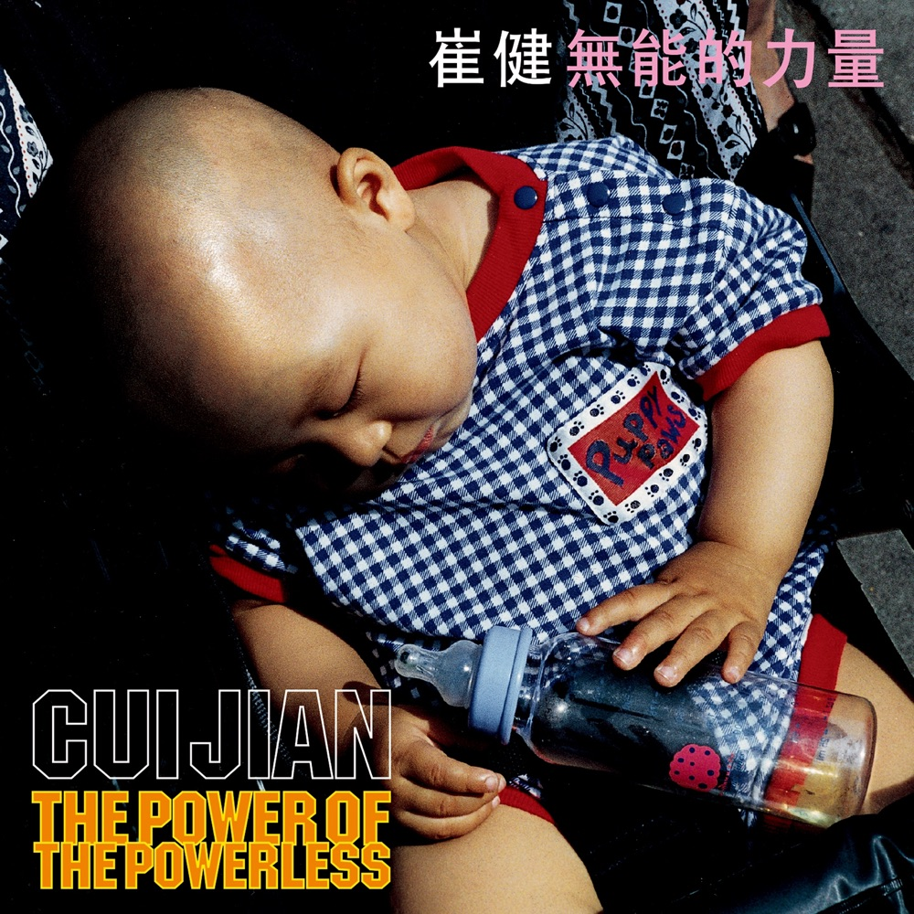
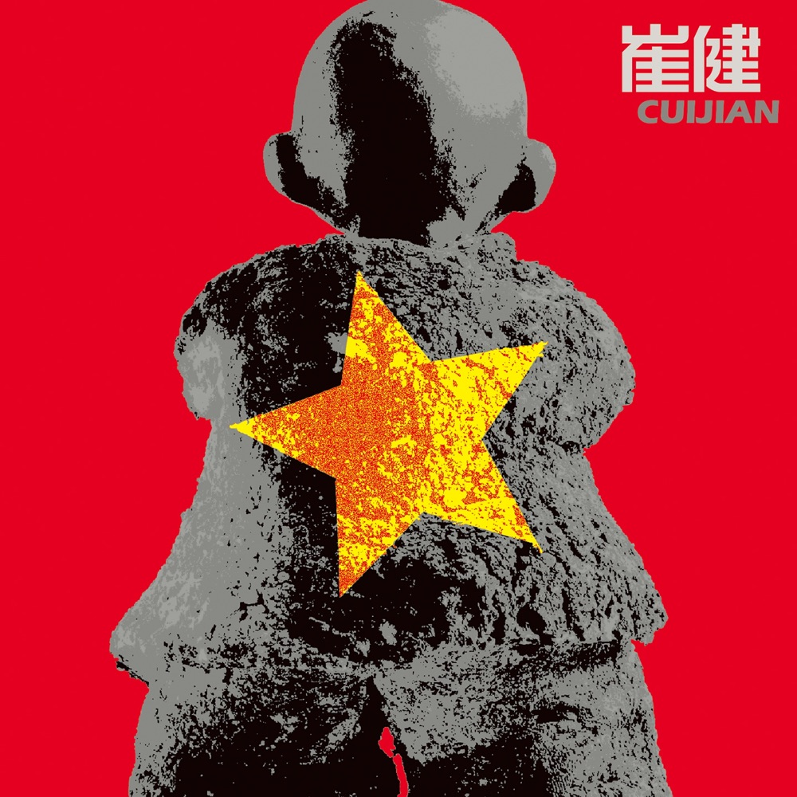
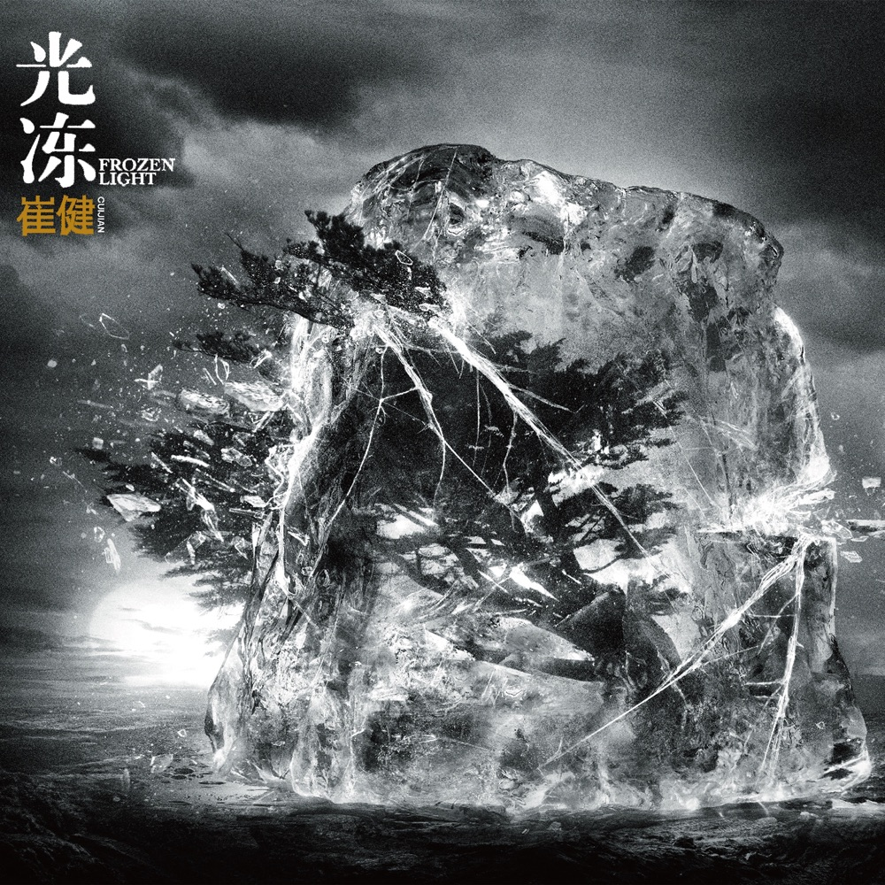
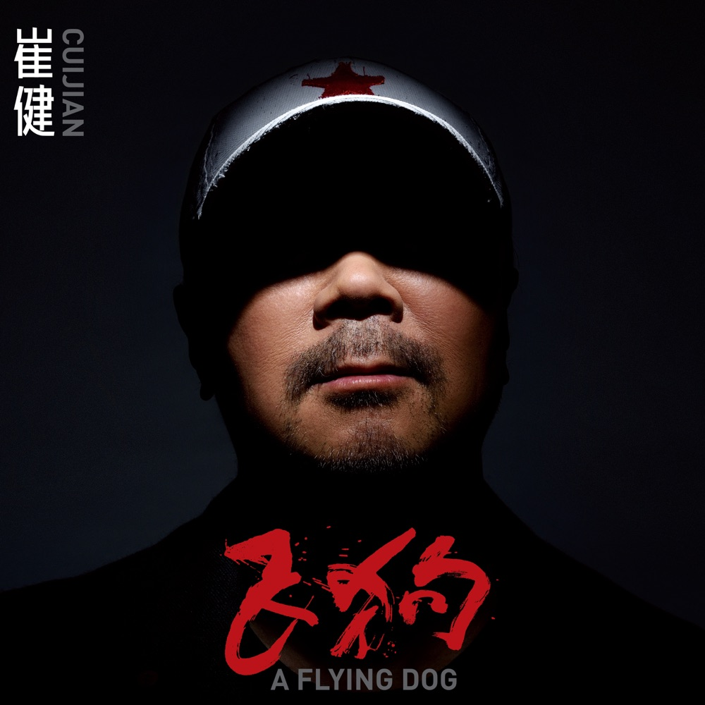

# 石头虽然坚硬，可蛋才是生命：崔健与红旗下的三十年

*图：《新长征路上的摇滚》（1989，中国国际广播音像出版社）封面。图片来源：[Apple Music](https://music.apple.com/cn/album/新长征路上的摇滚/1585625540)。*

一九八六年五月九日，北京工人体育馆。"百名歌星演唱会"正在举行，主题是献给国际和平年的《让世界充满爱》。百名当红歌手或挤公共汽车、或骑自行车赶来，唱的大多是温柔的歌。

二十五岁的崔健穿着一件开襟长褂，身背一把破吉他，两裤脚一高一低地蹦上舞台。台下观众还不知道发生了什么。音乐响起，他吼出那句：

"我曾经问个不休，你何时跟我走。"

十分钟后，歌曲结束，台下爆发出热烈的欢呼和掌声。这首歌叫《一无所有》。中国摇滚乐，从这一夜开始算起。

## 一、小号与破吉他

崔健一九六一年八月二日出生在北京，朝鲜族。父亲是北京交响乐团的小号手。崔健从小跟着乐团长大，十四岁学小号，后来进了北京交响乐团，端着一支铜管乐器，在古典乐的秩序里谋生。

但八十年代初的北京，收音机里开始漏进别的声音。崔健后来在访谈里说，从表层看，影响他的是早年的西方摇滚，比如披头士，"因为这些东西让我认识了这个类型的音乐，给我打开了一扇窗"。一支小号和一扇窗，这就是起点。

一九八七年，崔健离开北京交响乐团。同年，他和刘元、埃迪、张永光等人组成 ADO 乐队——这支乐队的萨克斯手刘元，此后伴随崔健走过了几乎全部的音乐生涯，直到二〇二四年去世。从古典乐团的谱架到摇滚乐的现场，中间只隔着一个决心。

一九八九年二月，崔健的第一张专辑《新长征路上的摇滚》出版，由中国国际广播音像出版社发行。豆瓣上三万七千多人给这张专辑打出 9.5 分。它收录了《新长征路上的摇滚》《不再掩饰》《花房姑娘》《假行僧》《从头再来》——几乎每一首后来都成了中国摇滚的底色。

一九八七年二月，崔健在北大办了第一次个人演唱会，倾倒了一批大学生。一九八九年三月，他在北京展览馆剧场的"新长征路上的摇滚"演唱会轰动京城。一九九〇年，他开始以亚运募捐的名义做全国巡演。一个穿长褂背吉他的人，把摇滚这个词从字典里拽了出来，按在了中国的土地上。

那张专辑里的歌，后来成了中国摇滚的语法。`花房姑娘`是温柔的，`假行僧`是决绝的——"我要从南走到北，我还要从白走到黑，我要人们都看到我，但不知道我是谁"。这四句被后来的无数乐队翻唱过，成了中国摇滚最常被引用的一段独白。

*图：《解决》（1991）封面。图片来源：[QQ音乐](https://y.qq.com/n/ryqq/albumDetail/002wzwbE0sL6fs)。*

一九九一年，《解决》出版。如果说《新长征路上的摇滚》是冲破束缚找到感觉，《解决》就是告诉人们找到了怎样的感觉。豆瓣上，一万多人给它打出 9.4 分。

## 二、红旗下的蛋

一九九四年八月，崔健的第三张专辑《红旗下的蛋》出版，北京北影录音录像公司出品，京文唱片发行。

*图：《红旗下的蛋》（1994）封面。图片来源：[QQ音乐](https://y.qq.com/n/ryqq/albumDetail/002PXabV2HU3Qr)。*

这张专辑是崔健最具先锋性、也最富争议的一张。他放弃了前两张的路数，转向 Jazz 和 Funk，大量使用民乐与打击乐，突出多声部打击乐的编配——其中甚至包括油桶。萨克斯手刘元、吉他手艾迪对这张专辑的制作起了重要作用。

专辑共八首歌：`飞了`、`宽容`、`红旗下的蛋`、`北京的故事`、`盒子`、`最后的抱怨`、`误会`、`彼岸`。

标题曲《红旗下的蛋》是一首长近八分钟的作品，节奏密集、说唱化——但说"向说唱衍变"其实不够准确：崔健自己就是中文说唱最早的源头。一九八九年专辑里的《不是我不明白》，被广泛认为是国内第一首说唱歌曲。到了《红旗下的蛋》，这条线索长成了主干。《北京的故事》里，刘元用唢呐模仿鸡鸣、北京站的时钟音，混入街头车辆、鞭炮和人声的采样，是九十年代北京具体而生动的声音景深。

大众网的一篇评介写得好：那些并不整齐的打击乐声，描摹的正是一个"热热闹闹、充满可能性、欲望四起又必然掺杂着混乱的时代"。崔健没有拒绝这些声音，而是置身其中——但他也没有在其中乱奔狂舞。于是专辑里的他呈现出二重角色：他既是时代的参与者，又是时代的注视者和反思者。他是万千身影中的一员，却因独立思考而孤独。

乐评人郝舫后来评价这张专辑："对九十年代中国的认识，有多少能超过崔健的这张专辑呢。"（见《比零还少》）

豆瓣条目里有一段再版说明，记载了一个关键事实："由于某种原因，这张专辑刚刚上市就被停止销售了，使得这次再版尤为珍贵。"

一张专辑的命运，就这样被写进了它的档案里。豆瓣上一万三千多人给《红旗下的蛋》打出 9.3 分。

"红旗还在飘扬，没有固定方向"——这首歌的第一句，唱的是一代人的处境。现实像个石头，精神像个蛋。石头虽然坚硬，可蛋才是生命。

## 三、时代在变，他也在变

一九九八年，《无能的力量》出版。崔健把说唱、电子、采样全部收进摇滚里，走得比所有人都远。豆瓣 8.8 分。

二〇〇五年，《给你一点颜色》出版。说唱、电子、民间取样、布鲁斯，他把能装进一张专辑的东西都装了进去，写《网络处男》《农村包围城市》。豆瓣 8.3 分——一个不低的分数，但对一个曾经定义时代的人来说，评论界开始说他"晦涩"了。

*图：《无能的力量》（1998）封面。图片来源：[Apple Music](https://music.apple.com/cn/album/无能的力量/1590971366)。*

*图：《给你一点颜色》（2005）封面。图片来源：[Apple Music](https://music.apple.com/cn/album/给你一点颜色/1590999610)。*

二〇〇六年的一次访谈里，崔健说："摇滚，确实要承载历史的厚重，这种厚重是建立在对现实的关注度上的，这是作为艺术的基本要求。"他还说："音乐是我的一种生活方式，我不存在从音乐的'岗位'上退休的问题。我会一直唱下去，20年？30年？都有可能。"

他没有食言。

## 四、光冻：一把刀变成了什么

二〇一五年十二月，暌违十年，崔健发行《光冻》。

*图：《光冻》（2015）封面。图片来源：[Apple Music](https://music.apple.com/cn/album/光冻/1590267898)。*

这张专辑的评价分裂了。豆瓣 7.7 分，是他录音室专辑里最低的一个。搜狐音乐请四位业内人士打分：陈贤江给三星，说"几乎没有什么尝试，风格比较朴实"；卢世伟给三星半，说"以前我们说崔健像一把刀子，这次我感觉像一根拐杖，有种廉颇老矣的感慨"；也有人给四星，说"因为他是崔健，可以找来最好的团队，可以有时间慢慢磨，所以不会差"。

二〇一六年六月，第二十七届金曲奖上，《光冻》获得最佳演唱录音专辑奖。一座来自台北的奖，给了一位北京的摇滚老歌手。这也是崔健第一次获得金曲奖。值得注意的是奖项的名字——不是"最佳专辑"，而是"最佳演唱录音专辑"。录音，恰好是这张专辑最被认可的部分：一支老乐队的现场感，被完整地刻进了唱片。

那一年，崔健还担任了综艺《中国之星》的推荐人，在电视上推广摇滚与民谣。有乐迷觉得这是他走下神坛的诚意，也有人看不惯他在台上满口"摇滚"。一把刀出现在综艺的灯光里，这件事本身就够争论。但崔健在更早的访谈里其实回答过这类问题："无论摇滚还是其他当代艺术门类，远离了艺术本身是一种耻辱，不和时代产生共鸣就是一种堕落。"上电视，也许就是他理解的那种共鸣。

## 五、飞狗：时代的B面

二〇二一年八月，崔健六十岁。新专辑《飞狗》出版，八首歌，不足四十分钟。

*图：《飞狗》（2021）封面。图片来源：[Apple Music](https://music.apple.com/tw/album/飛狗/1580691270)。*

有人说他变得随和、不愤怒了。他不认同。《飞狗》的歌词里有这样一句，被乐迷反复引用："庞然大物倾斜站立，大人无视小人颤抖。"豆瓣 8.1 分。这张专辑的评价仍然分裂：有人盛赞它是"年度最佳"，认为仅凭这一句歌词就值得鼓掌；也有人认为新歌水准不如往日——中新网的回顾文里转述了这种声音："崔健的时代过去了，从前他引领时代的浪头，现在他在时代的列车后面艰难地推搡着。"两种判断同时存在，这也许正是六十岁的处境。

二〇二二年，第三十三届金曲奖，《飞狗》获得最佳华语男歌手奖。六十一岁的崔健，第一次拿到这个奖。

二〇二二年四月十五日，疫情封控之中，崔健的"继续撒点野"视频号线上演唱会开唱，近三个小时，四千六百万人次观看。当唱到《快让我在雪地上撒点野》那句"别拦着我，我也不要衣裳，因为我的病就是没有感觉"时，无数隔着屏幕的中年人破防了。有歌迷跟着歌词吼出"老子根本没变"。

中新网后来写："不再'一无所有'的时代，谁还在听崔健？"这个问题没有标准答案。但那天晚上，四千六万人次给了一个答案。

## 六、不只是唱片

崔健不只是歌手。

一九九三年，他出演张元导演的电影《北京杂种》，那是中国独立电影最早的几部作品之一。二〇一三年，他自己执导电影《蓝色骨头》，摄影是杜可风。影片讲述一个音乐人拼凑父母记忆的故事，入围罗马国际电影节，并获得特别推荐奖。杜可风说："和崔健合作，友情比电影更重要。"

他也一直和 ADO 的老伙伴们在一起演出。二〇二四年，萨克斯手刘元去世。从一九八六年的舞台到二〇二四年的告别，刘元的萨克斯在崔健的音乐里响了将近四十年。

二〇〇六年四月，滚石乐队在上海开唱，崔健作为嘉宾登台同台。新浪当年的报道标题是：嘉宾崔健现场震惊失声。那个把摇滚引进中国的人，和自己音乐源头里的巨人站到了同一块舞台上。

至于影响，中新网那篇回顾文说得准确：在"泥沙俱下，众声喧哗，生气淋漓"的八十年代，扛起中国摇滚大旗的崔健，成为从"60后"到"80后"这三代人绕不开的文化符号。学者陈平原用这三个词形容那个年代，而崔健正是那个年代最响的一声。后来玩摇滚的人——无论是唐朝、黑豹、魔岩三杰，还是更晚的汪峰、万能青年旅店——都绕不开一九八六年工体那一声吼。这不是恭维，是坐标。

## 七、蛋还在

回到一九九四年那个问题：现实像个石头，精神像个蛋，石头虽然坚硬，可蛋才是生命。

三十年过去，石头还是石头。但蛋也还在。从工体的长褂破吉他，到视频号里四千六万人的屏幕；从《一无所有》的八六年，到《飞狗》的二〇二一年；从被停售的《红旗下的蛋》，到金曲奖的两座奖杯——崔健走了三十九年，换了乐器，换了舞台，没有换方向。

他在访谈里说过："远离了艺术本身是一种耻辱，不和时代产生共鸣就是一种堕落。"

这个一九六一年出生的人，还在唱。

## 唱片一览

| 唱片 | 年份 | 出版 | 豆瓣评分 |
|---|---:|---|---|
| 《新长征路上的摇滚》 | 1989 | 中国国际广播音像出版社 | 9.5 |
| 《解决》 | 1991 | — | 9.4 |
| 《红旗下的蛋》 | 1994 | 北京北影录音录像公司/京文 | 9.3 |
| 《无能的力量》 | 1998 | — | 8.8 |
| 《给你一点颜色》 | 2005 | — | 8.3 |
| 《光冻》 | 2015 | — | 7.7 |
| 《飞狗》 | 2021 | — | 8.1 |

奖项：第27届金曲奖最佳演唱录音专辑奖（《光冻》，2016）；第33届金曲奖最佳华语男歌手奖（《飞狗》，2022）。

## 推荐聆听路线

1. **从第一张听起：**《新长征路上的摇滚》——`新长征路上的摇滚`、`花房姑娘`、`假行僧`
2. **走进九十年代：**《红旗下的蛋》——`红旗下的蛋`、`飞了`、`北京的故事`、`宽容`（另：《一块红布》收录于《解决》）
3. **听他的实验：**《无能的力量》《给你一点颜色》
4. **听他的晚近：**《光冻》《飞狗》
5. **回看起点：**《一无所有》（1986年百名歌星演唱会版本）

## 资料与图片来源

- 豆瓣音乐：[《新长征路上的摇滚》9.5](https://music.douban.com/subject/1394742/)；[《解决》9.4](https://music.douban.com/subject/1395141/)；[《红旗下的蛋》9.3](https://music.douban.com/subject/1395110/)；[《无能的力量》8.8](https://music.douban.com/subject/1403985/)；[《给你一点颜色》8.3](https://music.douban.com/subject/1404360/)；[《光冻》7.7](https://music.douban.com/subject/26668161/)；[《飞狗》8.1](https://music.douban.com/subject/35398647/)
- 中国网：[1986年5月9日崔健首演《一无所有》](http://www.china.com.cn/v/cul/2014-05/09/content_32338739.htm)
- 大众网：[《红旗下的蛋》专辑介绍与乐评](http://www.dzwww.com/2011/cjjn/zj/201107/t20110707_6455555.htm)
- 中新网：[不再"一无所有"的时代，谁还在听崔健？](https://www.chinanews.com.cn/yl/2022/04-26/9739847.shtml)
- 搜狐音乐：[崔健《光冻》评鉴：摇滚斗士 or 廉颇老矣？](http://music.yule.sohu.com/20160105/n433573348.shtml)
- 新浪：[摇滚要承载历史，音乐要熔铸诚信——崔健访谈实录（2006）](http://news.sina.com.cn/o/2006-09-27/040510116559s.shtml)；[60岁崔健发布新专辑《飞狗》（2021）](http://k.sina.com.cn/article_2810373291_a782e4ab0200261lj.html)；[组图：滚石乐队上海开唱 嘉宾崔健现场震惊失声（2006-04-09）](https://ent.sina.com.cn/y/p/2006-04-09/13021043795.html)
- Apple Music：[崔健唱片目录](https://music.apple.com/cn/artist/崔健/388335540)
- 第33届金曲奖获奖名单：崔健凭《飞狗》获最佳华语男歌手奖（百度百科"第33届金曲奖"条目转述，2026-08-17 检索）
