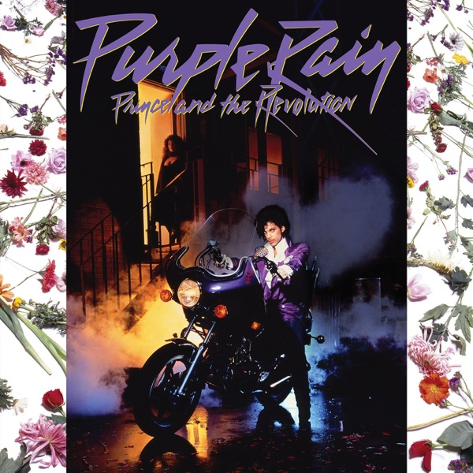
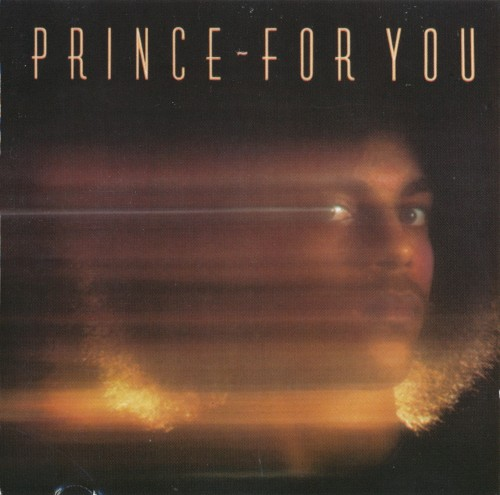
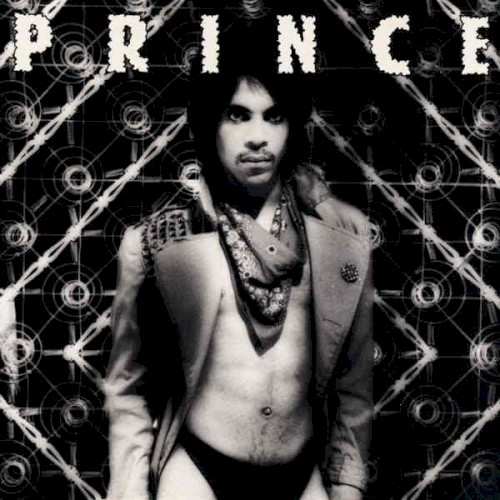
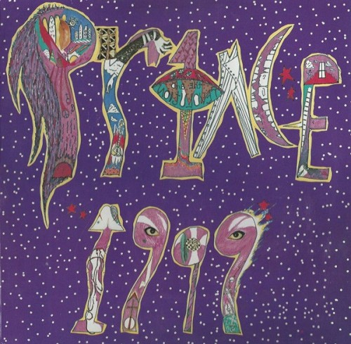
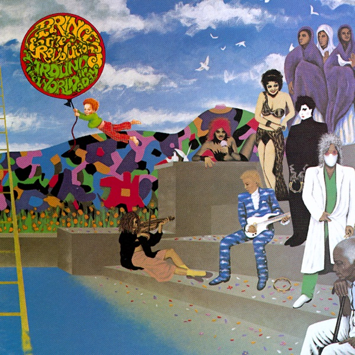
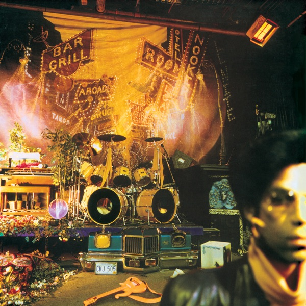
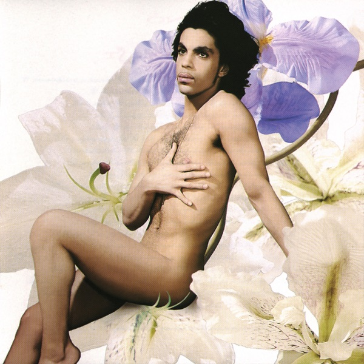
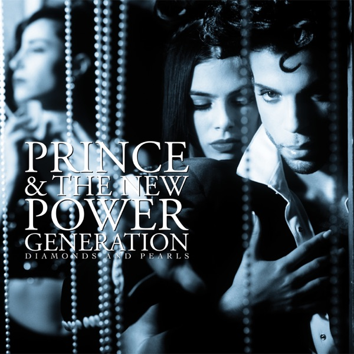
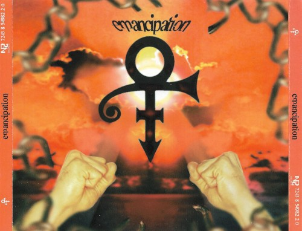

# 紫雨落个不停：Prince 的三重王国

*图：《Purple Rain》（1984，Warner Bros.）——电影原声带封面，Prince 跨在摩托车上，紫雾弥漫。图片来源：[Apple Music 公开唱片页](https://music.apple.com/us/album/purple-rain/261988771)。*

2007 年 2 月 4 日，迈阿密，第四十一届超级碗中场秀。舞台被做成他那个无法拼写的符号的形状，天不合时宜地下起雨来。换作任何别的艺人，这都是一场灾难；换作他，这是天意。他站在湿透的舞台中央，吉他高举，把最后一首歌送进雨里——《Purple Rain》。紫雨真的落下来了，落在一亿四千万电视观众面前。后来 Billboard 把这场演出评为史上最伟大的中场秀。可那晚最惊人的不是雨，而是他等这场雨等了几十年的样子：仿佛整条生涯都是为了站到这一小片雨水里去。

他的名字就叫 Prince。全名 Prince Rogers Nelson，1958 年 6 月 7 日生于明尼苏达州的明尼阿波利斯。父亲 John Lewis Nelson 是爵士钢琴手，艺名 Prince Rogers，和当歌手的母亲 Mattie Della 组过三重奏——他整个人生，从名字开始就是一场继承与背叛：继承那台钢琴，背叛那台钢琴。七岁时他在父亲的琴上写出第一首曲子《Funk Machine》；童年他自称生来癫痫；十岁父母离异，他被继母赶出门，又被父亲赶出门，一度寄居在邻居家安德森家的地下室，在那里结识了日后一生的音乐伙伴 André Cymone；继父带他去看了 James Brown 的演唱会，父亲则给了他第一把吉他。明尼阿波利斯的冬天很长，这个瘦小的孩子在房间里练琴、练吉他、练芭蕾，把自己练成一件乐器。

高中时代他和 Morris Day 组了乐队 Grand Central。1977 年，十九岁的 Prince 与华纳兄弟唱片签约，合同条件闻所未闻：前三张专辑的完全创作控制权，外加保留版权。唱片公司后来一定为这份合同后悔过无数次。1978 年的处子专辑《For You》里，他一个人演奏了全部二十七件乐器——「制作、编曲、作曲、演奏：Prince」，这句话从此成为他所有唱片的署名，像一枚私人印章，也像一道禁令：闲人勿入。

*图：《For You》（1978，Warner Bros.）——Prince 的处子专辑，他一人演奏全部二十七件乐器。图片来源：[MusicBrainz Cover Art Archive](https://coverartarchive.org/release/a9638606-62cb-4342-ada3-6da3fb7d7d17)。*

## 一、脏头脑：把三个世界焊在一起

1980 年的《Dirty Mind》是第一次爆炸。三十一分钟，没有一首慢歌，吉他削得像朋克，节奏硬得像迪斯科，合成器闪着新浪潮的冷光，而歌词——歌词脏得让电台主持人结巴。评论家 Robert Christgau 给了它 A，Pitchfork 在回顾乐评里写道：这是「真正开启了八十年代的少数几张唱片之一」。签约时他曾对唱片公司高层说：别把我做成一个黑人歌手（Don't make me black）。他不要分类，或者说他要一个自己的分类——后来人们管它叫明尼阿波利斯之声：合成器取代了放克乐队的铜管组，节奏更快更直，把新浪潮、合成器流行与放克焊成一体。他不仅自己演奏这种声音，还把它批发给整座城市：他组建了 The Time，制作了 Vanity 6 和 Apollonia 6，为 Sheila E. 写歌，用化名 Jamie Starr 躲在幕后，像一家声音工厂的厂长。

*图：《Dirty Mind》（1980，Warner Bros.）——黑白头像，内衣外穿，一张挑衅的脸。图片来源：[MusicBrainz Cover Art Archive](https://coverartarchive.org/release/8008001f-5bc9-46a7-b91d-2fd14e624403)。*

1981 年的《Controversy》把挑衅升级成宣言：他把自己写成一场争议——有争议吗？我想知道有没有上帝。1982 年，双专辑《1999》来了。世界末日前夜的派对：同名曲里他唱「大家都难逃一死」，转身又邀请你跳舞到底；专辑结尾，Lisa Coleman 用童声念出那句著名的问话：「妈妈，为什么每个人都有炸弹？」冷战、核恐惧、合成器、舞池，全部塞进同一台鼓机。《Little Red Corvette》成为第一首在流行榜排名高于 R&B 榜的 Prince 单曲——MTV 的大门被他撞开了。Pitchfork 说得精确：《1999》是「一张定义了自己所属年代、同时又站在时代之外的杰作——它恰好出现在 Prince 开始刻意制造杰作之前」。

*图：《1999》（1982，Warner Bros.）——紫色数字拼贴的双专辑。图片来源：[MusicBrainz Cover Art Archive](https://coverartarchive.org/release/4b9bbd74-39ca-44bb-a5bb-a85022b61b5d)。*

## 二、紫雨：一部电影，一座王国

然后是 1984 年。《Purple Rain》不是一张专辑，是一场总攻：电影、原声带、巡演、乐队同时出击。电影讲一个明尼阿波利斯俱乐部的吉他手 Kid，原生家庭破碎，才华是唯一武器——几乎就是 Prince 本人的影子，由他自己出演。导演 Albert Magnoli 是新人，演员大多第一次触电，成本只有 720 万美元，最终全球票房超过 7000 万，为 Prince 拿下奥斯卡最佳原创歌曲配乐奖，2019 年被选入美国国会图书馆国家电影登记册。

*图：《Around the World in a Day》（1985，Paisley Park/Warner Bros.）——《Purple Rain》之后立刻转向迷幻的彩色插画封面。图片来源：[Apple Music 公开唱片页](https://music.apple.com/us/album/around-the-world-in-a-day/1007039349)。*

原声带由 Prince 与他的乐队 The Revolution 共同署名：Wendy Melvoin 与 Lisa Coleman 的双生灵气、Brown Mark 的贝斯、Bobby Z. 的鼓、Doctor Fink 的键盘——这是他的第一支正规军团。专辑在 Billboard 专辑榜冠军位置连续停留二十四周，获 RIAA 十三白金认证，全球销量约 2500 万。《When Doves Cry》与《Let's Go Crazy》先后登顶单曲榜，《Purple Rain》冲到第二。他成为历史上第一个同时握有冠军专辑、冠军单曲与冠军电影的人——披头士没能做到的事，一个明尼阿波利斯的瘦小子做到了。代价也随荣耀而至：歌曲《Darling Nikki》的露骨歌词促使 Tipper Gore 成立家长音乐资源中心（PMRC），从此全世界的唱片上多了那张「家长警告」贴纸。一张专辑改变了一个行业的包装方式，这种事后来再没发生过。

Pitchfork 这样描述 1984 年之前的他：「你不需要知道他是什么人，来自哪里……他来自某个永远是凌晨两点、月圆起雾的异次元，脚踏一团紫烟降临，随身只带一把吉他、一嗓子金粉般的假声，和一道深不见底的律动。」《Purple Rain》撕开了这层神秘，露出下面那个 abused kid，结果世界更爱他了。

## 三、时代符号：一个人的十六首歌

《Purple Rain》之后他没有趁热打铁，反而一路转向：1985 年《Around the World in a Day》钻进迷幻，1986 年《Parade》做成法语电影的配乐，单曲《Kiss》登顶。然后是 1987 年 3 月 30 日，双专辑《Sign o' the Times》。

*图：《Sign o' the Times》（1987，Paisley Park/Warner Bros.）——蓝底、手写歌词纸、一只眼睛。图片来源：[Apple Music 公开唱片页](https://music.apple.com/us/album/sign-o-the-times/1440757912)。*

多数乐评人认为这是 Prince 的最高杰作，排在《Purple Rain》之前。十六首歌里只有三首有合写者，几乎全部由他一人完成：LinnDrum、采样器、二十七件乐器的老把戏，加上一颗二十九岁的脑袋。同名曲写时代的病症——「一种名字很短的大病」（指艾滋病）、强克与帮派暴力，用极简的 Run-DMC 式节拍说唱出来；《If I Was Your Girlfriend》把性别揉成一团雾；《Adore》是福音，也是情歌；《Starfish & Coffee》是一个小学生同学的素描。1987 年《村声》Pazz & Jop 乐评人投票，《Sign o' the Times》当选年度最佳专辑，投票创始人 Christgau 说这是投票史上「赢面最大的一次」，他本人给了这张唱片 A+——Prince 生涯唯一的 A+。

*图：《Lovesexy》（1988，Paisley Park/Warner Bros.）——花丛中的 Prince，灵与肉的宣言。图片来源：[Apple Music 公开唱片页](https://music.apple.com/us/album/lovesexy/1007043156)。*

1988 年的《Lovesexy》把灵与肉焊成一枚硬币——封面是花丛中的他，内页歌词写「God is love, love is God」。随后他接下了《Batman》电影配乐（1989，冠军专辑，单曲《Batdance》登顶），组建 New Power Generation 乐队，1991 年交出商业上最顺滑的《Diamonds and Pearls》，单曲《Cream》登顶。他给别人的歌也在登顶：为 Bangles 写的《Manic Monday》（1986，Hot 100 第二），为 The Family 写的《Nothing Compares 2 U》后来被 Sinéad O'Connor 唱成全球冠军。他的仓库里永远有写不完的歌。

*图：《Diamonds and Pearls》（1991，Paisley Park/Warner Bros.）——New Power Generation 时期的巅峰之作。图片来源：[Apple Music 公开唱片页](https://music.apple.com/us/album/diamonds-and-pearls/1440757821)。*

## 四、奴隶与解放

1993 年，巅峰期的 Prince 做了一件没人看得懂的事：他在脸上写下「SLAVE」（奴隶），出现在公众场合，然后宣布放弃自己的名字，改用一个无法发音的符号。媒体只好叫他「那个原名 Prince 的艺人」。这不是行为艺术，是合同战争：1992 年他与华纳签下据传一亿美元的六张专辑续约，随即意识到母带版权不在自己手里——他写道：如果你不拥有自己的母带，母带就拥有你。于是他在脸上写奴隶，加速出片逃离合同：1994 年《Come》，1995 年《The Gold Experience》，1996 年用《Chaos and Disorder》交清作业，转投 EMI，甩出三张 CD、三十六首歌、每张恰好六十分钟的《Emancipation》——解放。2000 年 5 月 16 日，华纳版权合约到期，他收回「Prince」这个名字；2014 年，他重返华纳，换回了全部华纳时期母带的所有权。这场仗他打了二十一年，最后赢的是他。

*图：《Emancipation》（1996，NPG/EMI）——三张 CD 各六十分钟、共三十六首歌的「解放」宣言。图片来源：[MusicBrainz Cover Art Archive](https://coverartarchive.org/release/11fde1d2-395f-492c-bfe7-b870109e3031)。*

2004 年，Prince 入选摇滚名人堂，由 OutKast 与 Alicia Keys 引荐；典礼上他演奏了《While My Guitar Gently Weeps》的吉他独奏，被无数乐迷奉为现场神迹。生涯共获七座格莱美（三十二次提名），外加七座全英音乐奖、一座奥斯卡、一座金球奖，全球唱片销量超过一亿张。然后是 2007 年超级碗那场雨——本文开头的那场雨。

## 五、金库

2016 年 4 月 21 日清晨，Prince 在 Paisley Park 住所的电梯里被发现失去反应，送医不治，终年五十七岁。尸检结论为意外芬太尼过量——混入假处方药中的强效阿片类物质。他没有留下遗嘱。

关于他身后的传说都指向同一个地方：Paisley Park 地下室里的金库（The Vault）。据说里面存着数千首从未发行的歌。遗产管理方此后陆续开启它：《Piano & a Microphone 1983》（2018）是他一个人在钢琴前录下的草稿；《Originals》（2019）收录他写给别人的歌曲的原版；《Welcome 2 America》（2021）是 2010 年录毕却被搁置的完整专辑，出版后登上 Billboard 第四。《Sign o' the Times》超级豪华版（2020）附四十五首未发行曲目，Pitchfork 打出 10/10。金库没有空，它只是换了钥匙。

*图：《Purple Rain》封面再现。有些唱片随年代老去，这一张仍在下雨。*

我没法像他那样唱歌，也不打算假装自己能。但我想每个在深夜里听过《Purple Rain》最后那段吉他独奏的人，都短暂地拥有过同一种东西：一段不属于任何流派、不属于任何年代、只属于那一刻的声音。Prince 把一生过成了三重王国——肉身的明尼阿波利斯、音乐的 Paisley Park、以及所有听众心里那场落个不停的紫雨。第一重已经结束了，第二重变成了博物馆，第三重每晚都在开门。

把音量拧到最大吧。雨还在下。

## 录音室专辑年表（选）

| 专辑 | 年份 | 厂牌 |
|---|---|---|
| 《For You》 | 1978 | Warner Bros. |
| 《Prince》 | 1979 | Warner Bros. |
| 《Dirty Mind》 | 1980 | Warner Bros. |
| 《Controversy》 | 1981 | Warner Bros. |
| 《1999》 | 1982 | Warner Bros. |
| 《Purple Rain》 | 1984 | Warner Bros. |
| 《Around the World in a Day》 | 1985 | Paisley Park/Warner Bros. |
| 《Parade》 | 1986 | Paisley Park/Warner Bros. |
| 《Sign o' the Times》 | 1987 | Paisley Park/Warner Bros. |
| 《Lovesexy》 | 1988 | Paisley Park/Warner Bros. |
| 《Batman》 | 1989 | Warner Bros. |
| 《Graffiti Bridge》 | 1990 | Paisley Park/Warner Bros. |
| 《Diamonds and Pearls》 | 1991 | Paisley Park/Warner Bros. |
| 《Love Symbol》 | 1992 | Paisley Park/Warner Bros. |
| 《The Gold Experience》 | 1995 | NPG/Warner Bros. |
| 《Emancipation》 | 1996 | NPG/EMI |
| 《Musicology》 | 2004 | NPG/Columbia |
| 《3121》 | 2006 | NPG/Universal |
| 《Hit n Run Phase Two》 | 2015 | NPG |

## 推荐聆听路线

1. **《Purple Rain》（1984）** —— 入口。从《When Doves Cry》的无贝斯奇迹到《Purple Rain》的八分钟吉他史诗，一次听完。
2. **《Sign o' the Times》（1987）** —— 巅峰。十六首歌，一个人的乐队，时代的病历与情书。
3. **《1999》（1982）** —— 末日前夜的派对，双专辑，从头到尾不要跳歌。
4. **《Dirty Mind》（1980）** —— 三十一分钟的闪电，八十年代的点火器。
5. **《Piano & a Microphone 1983》（2018，遗作）** —— 金库的第一把钥匙：钢琴、呼吸声、和《Purple Rain》最早的草稿。
6. **延伸**：《Controversy》（1981）、《Parade》（1986）、《Diamonds and Pearls》（1991）、《Emancipation》（1996）、超级碗 XLI 中场秀（2007）影像。

## 资料与图片来源

- Wikipedia: [Prince (musician)](https://en.wikipedia.org/wiki/Prince_(musician))、[Purple Rain (album)](https://en.wikipedia.org/wiki/Purple_Rain_(album))、[Purple Rain (film)](https://en.wikipedia.org/wiki/Purple_Rain_(film))、[Sign o' the Times](https://en.wikipedia.org/wiki/Sign_o%27_the_Times)、[Prince albums discography](https://en.wikipedia.org/wiki/Prince_albums_discography)（专辑年份／厂牌／RIAA 认证交叉核对）
- Rock & Roll Hall of Fame: [Prince 入选页（2004）](https://rockhall.com/inductees/prince/)
- Wikipedia: [Super Bowl XLI halftime show](https://en.wikipedia.org/wiki/Super_Bowl_XLI_halftime_show)、[Minneapolis sound](https://en.wikipedia.org/wiki/Minneapolis_sound)
- Pitchfork 专辑乐评：[Dirty Mind](https://pitchfork.com/reviews/albums/17563-prince-dirty-mind-controversy/)、[1999](https://pitchfork.com/reviews/albums/prince-1999/)、[Purple Rain](https://pitchfork.com/reviews/albums/princethe-revolution-purple-rain/)、[Sign o' the Times](https://pitchfork.com/reviews/albums/prince-sign-o-the-times/)
- Rolling Stone: [Purple Rain 乐评](https://www.rollingstone.com/music/music-album-reviews/purple-rain-242530/)、[The 500 Greatest Albums of All Time（2020/2023）](https://en.wikipedia.org/wiki/Rolling_Stone%27s_500_Greatest_Albums_of_All_Time)（2020 版中《Purple Rain》位列前十，第 8 名）
- Robert Christgau: [Prince 评分档案](https://www.robertchristgau.com/get_artist.php?name=prince)（《Sign o' the Times》A+）
- 专辑封面图片来源：Apple Music 公开唱片页；MusicBrainz Cover Art Archive（按发行条目 MBID 精确获取）
