# 菊花還在夜裡行軍：林生祥與庄頭的長歌

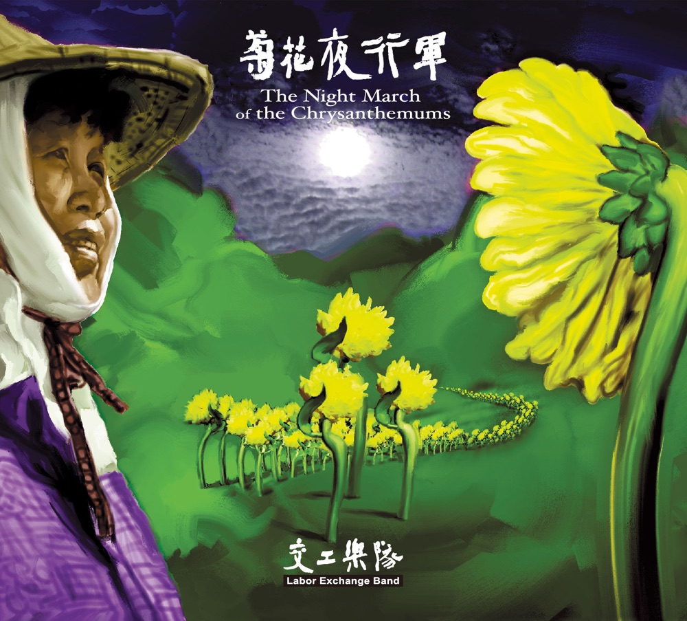

*图：《菊花夜行軍》（2001，交工樂隊）封面。一名戴草帽、缠白毛巾的农民仰首向天，夜空满月之下，山脊上一列菊花如行军队伍。图片来源：[Apple Music](https://music.apple.com/tw/album/菊花夜行軍/681818004)。*

二〇〇七年六月十六日，台北小巨蛋，第十八届金曲奖颁奖典礼。林生祥以《种树》拿下演唱类最佳客语歌手奖和最佳客语专辑奖。他上台了，发表了感言，然后拒绝领取奖座。

他说，音乐奖应该以音乐类型分类，而不是以种族语言分类。他把奖金平均捐给了美浓种树团队、美浓社区报《月光山》杂志、报道有机作物的《青芽儿》杂志，以及"白米炸弹犯"杨儒门。现场支持者举起"支持台湾农业"的标语。

这是金曲奖历史上第一次有人拒绝领奖。一个客家庄出身的音乐人，用拒绝领奖的方式，把"客家"这个标签从音乐上撕下来，又把它重新贴回到土地上。

要理解这个动作，得回到更早的地方。回到美浓，回到菸田，回到那座没有盖起来的水库。

## 一、庄头来的乐队

美浓在高雄东北角，一个客家庄。种菸草是这里几代人的生计。菸叶采收需要大量人力，于是有亲缘或地缘关系的几户菸农各出几个人丁，组成"交工小组"，轮流采收各家的菸叶。"交工"，就是交换工人的意思。

一九九二年十月，美浓获报消息：政府预备在美浓溪上兴建水库，供应高雄地区用水。坝址位在断层之上，会淹没黄蝶翠谷的热带母树林，也会冲垮这个客家村落维持已久的文化。一九九二年底，曾贵海、钟永丰等人筹组美浓爱乡协进会。一九九三年，美浓客家乡亲搭乘夜行巴士北上台北抗议。立法院在一九九三年和一九九四年连续两年删除了美浓水库的工程预算。

一九九八年四月，行政院长萧万长重启水库计画，宣布"美浓水库一年内动工"。那年秋天，一个从淡江大学毕业、在台北玩音乐的美浓青年决定回乡。他叫林生祥，一九七一年生，在美浓长大。

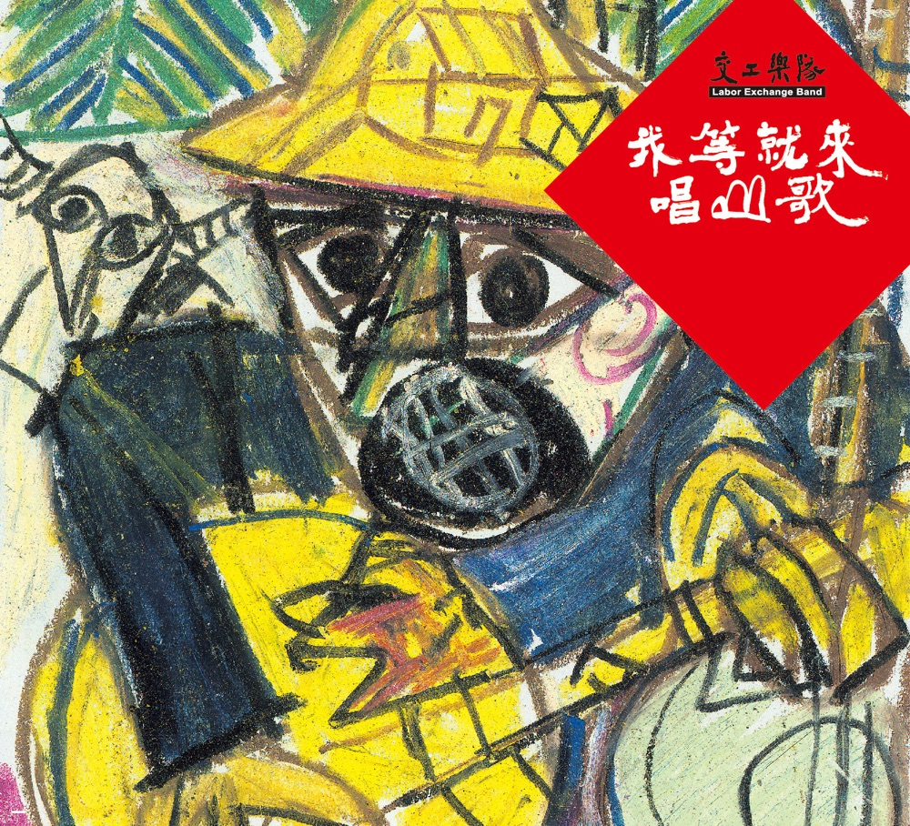

*图：《我等就來唱山歌》（1999，交工樂隊）封面。素人风格绘画，戴黄色斗笠的人物与红色菱形标签。图片来源：[Apple Music](https://music.apple.com/tw/album/我等就來唱山歌/681767575)。*

林生祥在淡江大学读书时组过一支乐队，叫观子音乐坑，"观子"是观音山下孩子的意思。一九九九年，观子音乐坑的大部分成员改组，成立了交工乐队。这个名字直接取自菸田里的劳动方式——乐队不是几个明星的乐队，是整个庄头交换劳力、一起做事的乐队。

交工乐队的成员：林生祥（主唱、吉他、月琴、三弦）、陈冠宇（贝斯、录音师）、钟成达（打击乐）、郭进财（唢呐）、钟永丰（笔手、诗人）。钟永丰比林生祥大七岁，出身菸草农家，曾是反水库运动的核心组织者，后来当过高雄县政府水利局局长、台北市文化局局长。他给交工乐队写词，用的是客家话。

他们的音乐以客家八音为底——锣、鼓、唢呐、月琴、三弦，这些在婚丧喜庆里响了一辈子的乐器——再叠上现代摇滚。一九九九年四月，交工乐队发行第一张专辑《我等就来唱山歌》。录制从一九九九年一月开始，地点是美浓一座菸楼改造的录音室，乡亲出钱出力，三个月录成——这本身就是"交工"。钟永丰说过一句话："反水库要成功，除非造一个文化上的原子弹。"这张专辑就是那颗原子弹的引信。

二〇〇〇年，这张专辑获得第十一届金曲奖四项提名，拿下最佳作曲和最佳制作人两个奖。同年三月，陈水扁当选总统，宣布任内不兴建美浓水库。水库没有盖起来。

但交工乐队没有停。水库不盖了，他们把目光转向农民和农村本身。二〇〇二年，林生祥在金曲奖台上说过一段话：罗大佑、崔健影响了他们，陈达的音乐告诉他们音乐要走入社会——"如果交工乐队是一支麦克风，我们希望递到农民、工人面前。"

## 二、菊花夜行军

二〇〇一年九月，交工乐队发行第二张专辑《菊花夜行军》。豆瓣上近一万一千人给这张专辑打出 9.7 分，五星占百分之八十七——在华语独立摇滚的评分谱系里，这个数字几乎没有对手。

这张专辑讲的是一个返乡青年的故事。一个在城市里读不进书、找不到位置的年轻人，回到美浓，跟着家里种菊花。菊花是美浓重要的经济作物，夜里要开灯照射花田，让菊花以为白天还没结束，继续生长。于是深夜的花田亮如白昼，一列列菊花在灯光下静静站着，像一支沉默的军队。

专辑里最著名的一首歌就叫《菊花夜行军》。林生祥唱一个青年开着拖拉机，在夜里穿过花田，对着满山的菊花喊话。那是他的军队，也是他的命运。钟永丰的客家话歌词把农村的困顿、青年的迷茫、土地的沉默，全部压进一首歌里。专辑写的是WTO冲击下的农业——钟永丰称之为"一首挽歌"。第十首《日久他乡是故乡》是写给外籍新娘识字班的歌，一个从别的地方嫁进美浓的女人，学着认字，也学着认这个新的家。

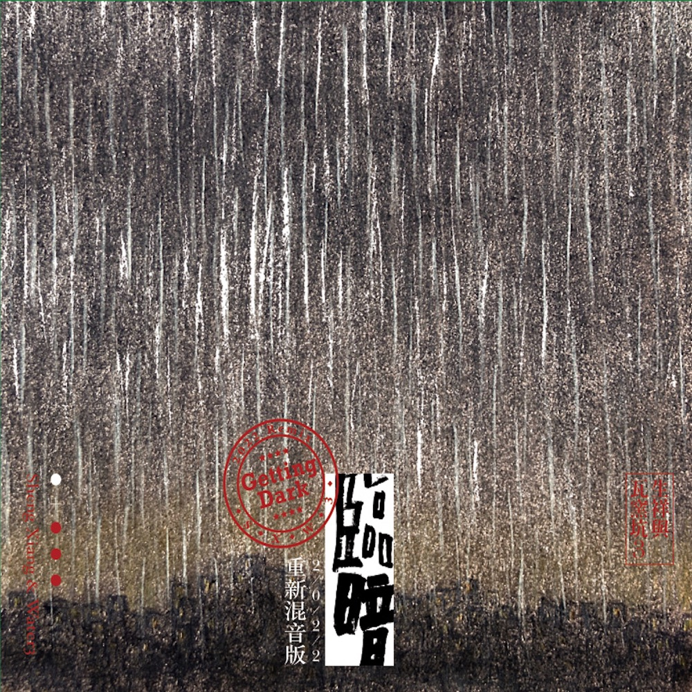

*图：《臨暗》（生祥與瓦窯坑3）封面。暗黑画面中垂直的灰白细条纹，如夜雨或炭笔擦痕，中央"臨暗"二字。图片来源：[Apple Music](https://music.apple.com/tw/album/臨暗-2022-重新混音版/1612914123)。*

《菊花夜行军》发行后，交工乐队被英国《民间草根》杂志专文介绍。二〇〇二年，交工乐队获得第十三届金曲奖最佳乐团奖。

二〇〇三年九月一日，交工乐队正式宣布解散。

解散的原因后来被反复讲述，但最准确的说法是：他们想做的事情做完了，该换一种方式继续。林生祥和钟永丰继续搭档词曲，加上新的乐手，组成了"生祥与瓦窑坑3"。其余成员则成立了好客乐队。

二〇〇四年，生祥与瓦窑坑3发行专辑《临暗》。"临暗"是客家话，意思是天快黑的时候。钟永丰凭这张专辑里的客家话歌词，获得第十六届金曲奖最佳流行音乐作词人奖。

## 三、种树的人

二〇〇六年，林生祥发行《种树》。这张专辑的合作者多了一个人：日本吉他手大竹研。从《种树》开始，大竹研成为林生祥最重要的音乐伙伴，两人亦师亦友，合作至今。

《种树》让林生祥在二〇〇七年拿下两座金曲奖。然后他拒绝了奖座。

这个拒绝不是姿态，是立场。金曲奖按语言设奖——国语、台语、客语、原住民语——林生祥认为音乐应该按类型分，不应该按族群语言分。把客家音乐单独框在一个"客语"格子里，等于告诉所有人：这是少数民族的东西，不是主流音乐。他不要这个框。

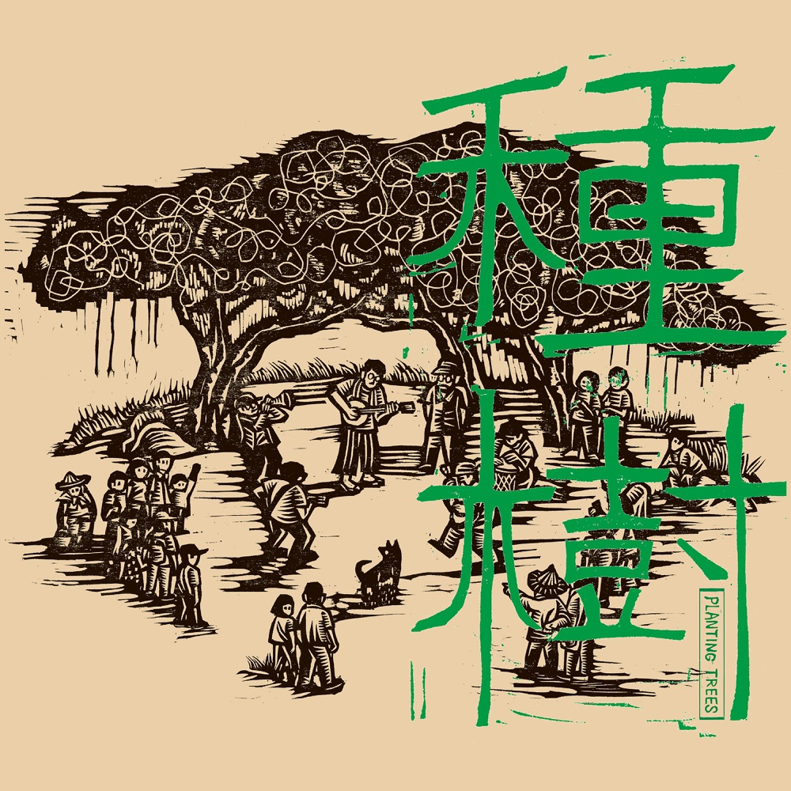

*图：《種樹》（2006，林生祥、大竹研 & Takashi Hirayasu）封面。卡其底色上，一棵枝繁叶茂的大树，树下众多小人像劳作。图片来源：[Apple Music](https://music.apple.com/tw/album/種樹/1802599307)。*

他把奖金捐了出去。捐给种树的人，捐给社区报，捐给报道有机农业的杂志，捐给那个往稻田里扔白米炸弹的农民杨儒门。这些钱没有变成奖杯，变成了土壤里的东西。

二〇〇九年，林生祥与大竹研发行《野生》。二〇一〇年，经大竹研推荐，贝斯手早川彻加入团队，发行《大地书房》。二〇一一年夏天，打击手吴政君加入。二〇一二年七月，因为一个乒乓球友算笔画，说"生祥乐队"这个名字大吉，团队正式更名生祥乐队。

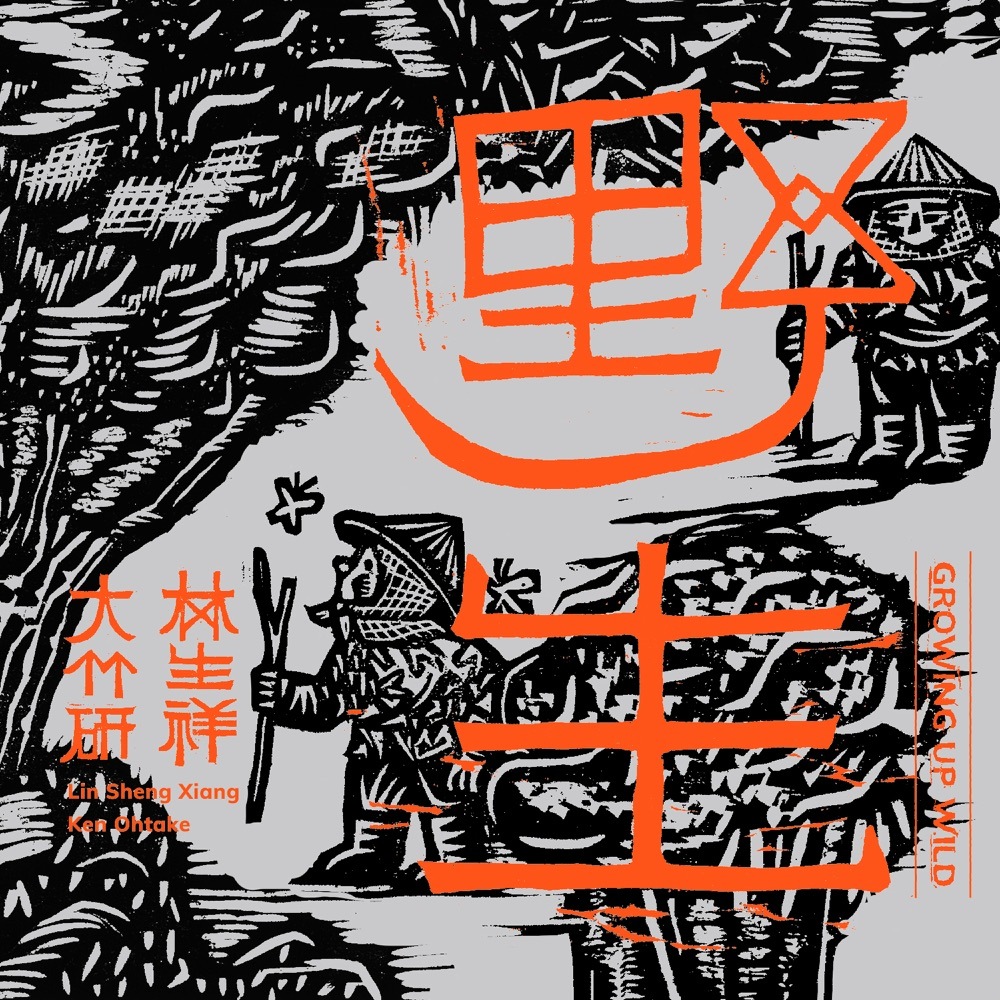

*图：《野生》（2009，林生祥 & 大竹研）封面。黑白木刻版画风格，旋卷云纹之下，戴斗笠扛农具的人像，叠印橙红"野生"二字。图片来源：[Apple Music](https://music.apple.com/tw/album/野生-2025-重製版/1843256315)。*

## 四、我庄三部曲

二〇一三年五月，生祥乐队发行第一张正式专辑《我庄》，由风潮唱片发行。

《我庄》讲现代农村的实况：课本里从没教过的农村、书读得越多离乡越远、除草剂让农人又爱又恨、美浓把某类人叫"仙人"、7-11打击传统杂货店、黑道与地方政治。九首歌，九个农村的切面。这张专辑在第四届金音奖未开奖就直接拿下评审团大奖，又抱走最佳专辑奖和最佳乐手奖。

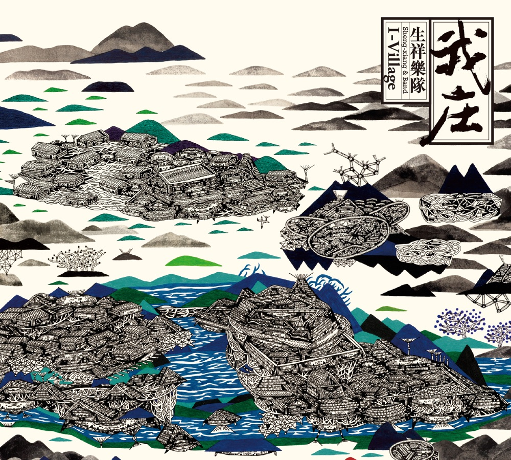

*图：《我庄》（2013，生祥樂隊）封面。米白底民俗风插画，满版三角纹样如山如浪，间有黑线团块与蓝色水带。图片来源：[Apple Music](https://music.apple.com/tw/album/我庄/651387542)。*

二〇一五年，生祥乐队录制反空污概念双专辑《围庄》，包括"我庄三部曲"的二部曲《围庄》和三部曲《动身》。《围庄》讲的是石化工业对农村的包围——烟囱、堤岸、被污染的水面。这张双专辑没有唱片公司愿意投资，于是林生祥在网路上发起募资。二〇一六年五月，《围庄》双专辑出版。

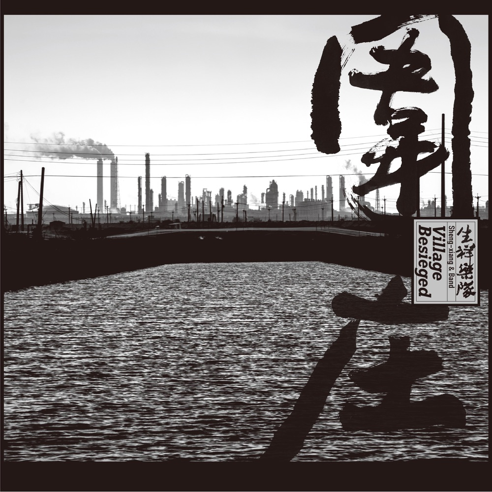

*图：《圍庄》（2016，生祥樂隊）封面。黑白摄影构图，上半为冒烟的工厂与成排烟囱，中部一道深色堤岸，下半灰色水面，右侧巨大毛笔直排"圍庄"。图片来源：[Apple Music](https://music.apple.com/tw/album/圍庄/1590089959)。*

二〇一七年，第二十八届金曲奖将评审团奖颁给《围庄》。评审团奖不以客观标准评判，需三分之二以上评审通过，常出现从缺，是金曲奖里最接近"全体共识"的一个奖。

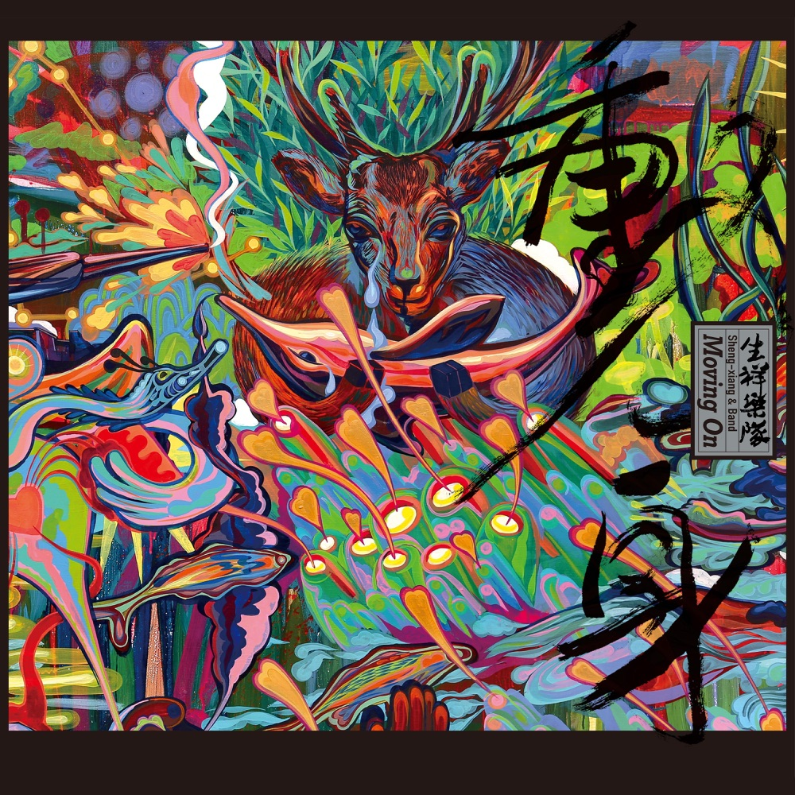

*图：《動身》（2016，生祥樂隊）封面。高饱和迷幻彩绘，中央蓝紫色鹿形动物，四周旋卷植物，右侧毛笔直排"動身"。图片来源：[Apple Music](https://music.apple.com/tw/album/動身/1590820390)。*

## 五、野莲出庄，江湖卡夫卡

二〇二〇年十一月，生祥乐队发行《野莲出庄》。"野莲"是美浓一种水生植物，也是客家人在艰难岁月里从野外采回来吃的东西。"出庄"是离开村庄。这张专辑讲农村的人往外走，也讲外面的世界涌进农村。二〇二一年，《野莲出庄》获颁中华音乐人交流协会年度十大专辑。

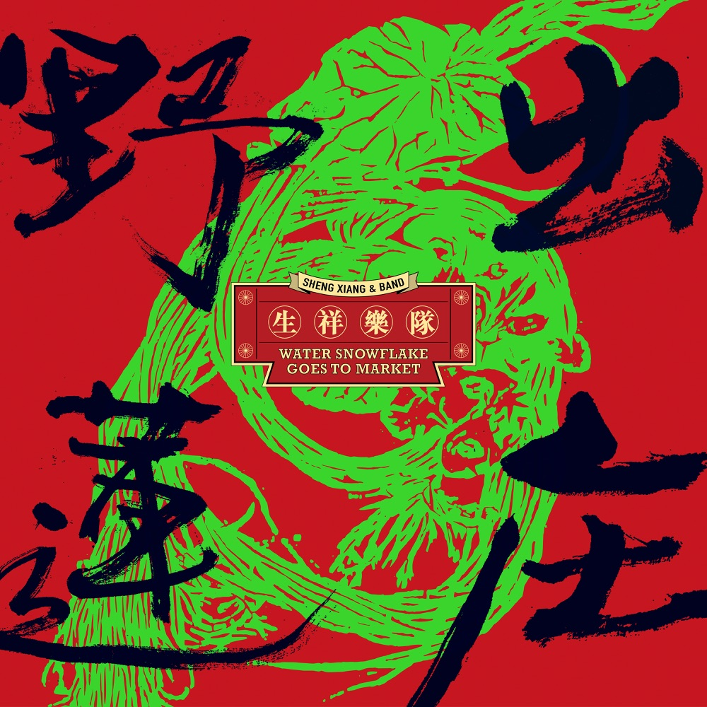

*图：《野蓮出庄》（2020，生祥樂隊）封面。大红底，四角毛笔大字"野出蓮庄"，中央绿色线描藤蔓盘成涡状。图片来源：[Apple Music](https://music.apple.com/tw/album/野蓮出庄/1542183322)。*

二〇二二年十月，生祥乐队发行《江湖卡夫卡》。封面是一块形似蝶翅的墨色图形，内含白色圆斑，左下角落款"生祥乐队"。这张专辑是"我庄三部曲"之后的又一次出发——从庄头走向江湖，从具体的农村走向更广阔的、卡夫卡式的荒诞人间。

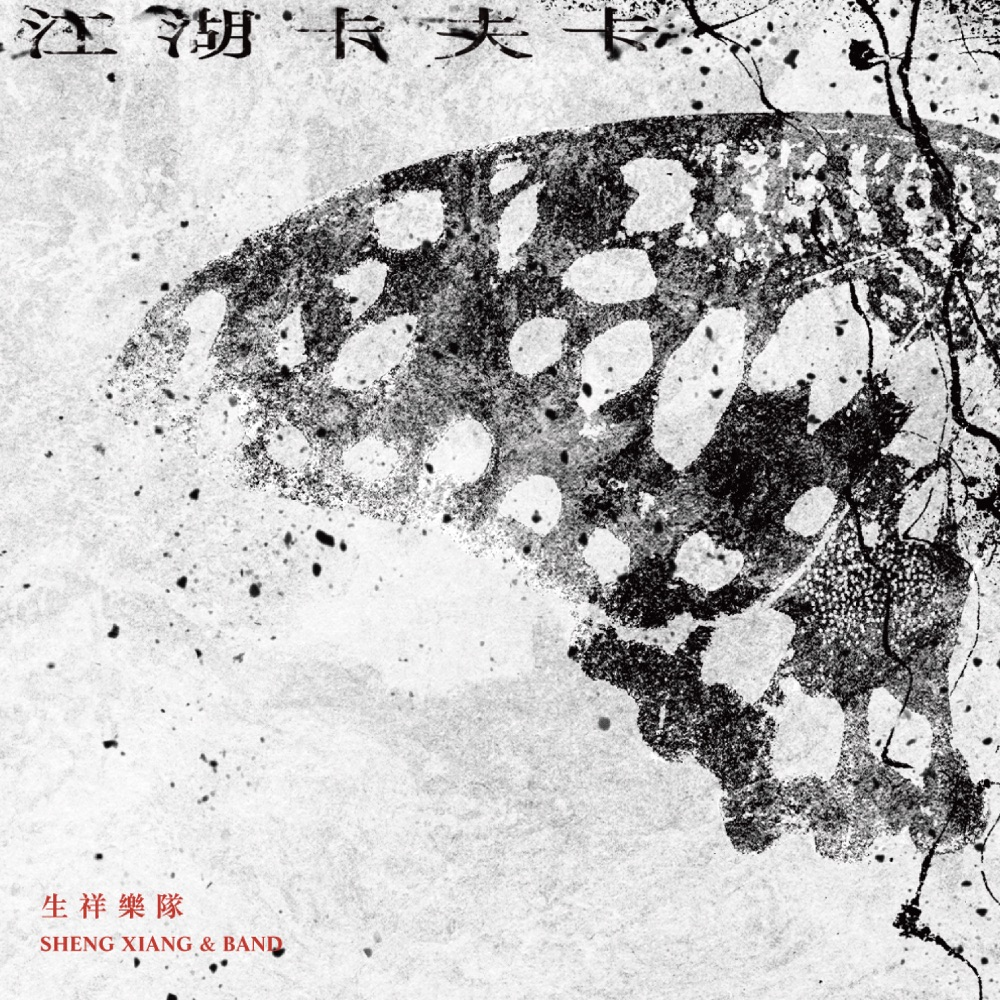

*图：《江湖卡夫卡》（2022，生祥樂隊）封面。白底水墨，顶部手写"江湖卡夫卡"，主体为蝶翅形墨色图形，左下红字"生祥樂隊"。图片来源：[Apple Music](https://music.apple.com/tw/album/江湖卡夫卡/1650712802)。*

二〇一七年五月，生祥乐队在台北国际会议中心举行"菊花夜行军十五周年纪念演唱会"。距离那张专辑发行，已经过去十六年。当年在夜里行军的菊花，如今被重新种在舞台上。

## 六、配乐与远行

林生祥不只写自己的歌。他给电影写配乐。

二〇一七年，林生祥和王昭华合作制作电影《大佛普拉斯》原声带，获得金马奖最佳原创电影歌曲、金曲奖最佳单曲制作人。之后他又为《阳光普照》《男人与他的海》等电影配乐。这些配乐让他的声音走出了客家庄，走进了更远的银幕。

但林生祥的根始终在美浓。他给美浓广兴国小写校歌，给高雄市消防局写歌，给毛豆同业写歌，给返乡青少年做客语专辑。他做童谣专辑《头摆头摆》，做青少年客语专辑《x+y系几多》。他让客家话不只是怀旧的语言，而是还在生长的语言。

钟永丰也在写。二〇二二年，他出版散文集《菊花如何夜行军》，获得台湾文学奖金典奖及蓓蕾奖。书名直接呼应那张二十一年前的专辑。菊花还在夜里行军，只是写它的人换了方式。

## 七、歌要唱给谁

回到开头那个问题：音乐奖应该按什么分类？

林生祥拒绝的不是奖，是分类方式。把客家音乐框进"客语"这个格子，等于承认它是边缘的、需要被特别照顾的。他要的是：客家音乐就是音乐，跟所有音乐平起平坐，按类型而不是按血统站在一起。

这个立场贯穿了他所有的创作。交工乐队用唢呐、月琴、三弦做摇滚，不是要做"传统音乐"，是要做属于这个庄头的摇滚。生祥乐队用客家话唱歌，不是要做"母语复兴"，是因为这些人就是这样说话的。钟永丰写词，用客家话，因为那是他思考的语言。

从一九九九年《我等就来唱山歌》到二〇二二年《江湖卡夫卡》，林生祥和他的乐队走了二十三年。他们唱反水库、唱农村、唱农民、唱除草剂、唱7-11、唱黑道、唱菸田、唱菊花、唱野莲、唱一个村庄如何被时代围住，又如何从围困里走出去。

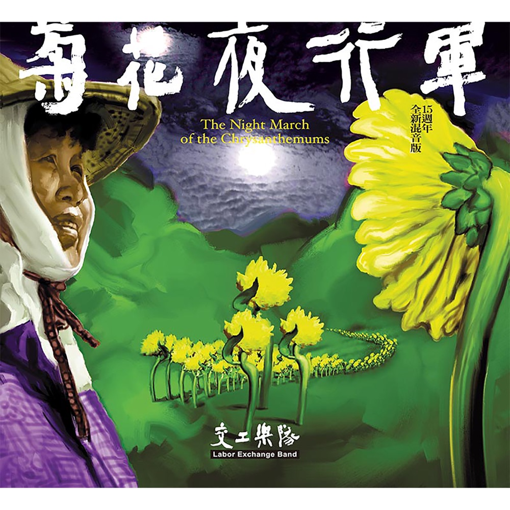

*图：《菊花夜行軍：15週年全新混音版》（2017）封面。与2001年原版同一主视觉，农民、菊花、夜空、行军的菊花列。图片来源：[Apple Music](https://music.apple.com/tw/album/菊花夜行軍-15週年全新混音版/1240790450)。*

美浓水库最终没有盖起来。菸田渐渐少了。年轻人还是往外走。但林生祥还在唱，钟永丰还在写，大竹研还在弹吉他。菊花还在夜里行军。

他们唱给谁？唱给那个开拖拉机穿过花田的青年，唱给被水库差点淹掉的家，唱给所有在课本里读不到自己村庄的人。

唱给土地。土地听得懂客家话。

## 唱片一览

| 唱片 | 乐队/艺人 | 年份 | 备注 |
|---|---|---:|---|
| 《我等就來唱山歌》 | 交工樂隊 | 1999 | 第11届金曲奖最佳作曲、最佳制作人 |
| 《菊花夜行軍》 | 交工樂隊 | 2001 | 第13届金曲奖最佳乐团 |
| 《臨暗》 | 生祥與瓦窯坑3 | 2004 | 钟永丰获第16届金曲奖最佳作词人 |
| 《種樹》 | 林生祥、大竹研 | 2006 | 第18届金曲奖最佳客语歌手/专辑（拒领） |
| 《野生》 | 林生祥、大竹研 | 2009 | |
| 《大地書房》 | 林生祥、大竹研、早川徹 | 2010 | |
| 《我庄》 | 生祥樂隊 | 2013 | 金音奖评审团大奖、最佳专辑、最佳乐手 |
| 《圍庄／動身》 | 生祥樂隊 | 2016 | 募资出版；第28届金曲奖评审团奖 |
| 《野蓮出庄》 | 生祥樂隊 | 2020 | 2020年度十大专辑 |
| 《江湖卡夫卡》 | 生祥樂隊 | 2022 | |

另：《菊花夜行軍：15週年全新混音版》（2017）；电影配乐《大佛普拉斯》（2017，金马奖最佳原创电影歌曲）、《阳光普照》（2019）、《男人与他的海》（2020）。

## 推荐聆听路线

1. **从故事开始：**《菊花夜行軍》——`菊花夜行軍`、`愁上愁下`、`阿成想耕田`、`日久他鄉是故鄉`
2. **回到起点：**《我等就來唱山歌》——感受交工乐队最原始的庄头声音
3. **转折处：**《臨暗》——天快黑的时候，乐队解散后的第一口气
4. **拒绝领奖的那张：**《種樹》——理解林生祥为什么不要那个奖
5. **农村切面：**《我庄》——`我庄`、`課本`、`7-11`、`秀貞介菜園`
6. **围困与出发：**《圍庄》《動身》双专辑
7. **远行：**《野蓮出庄》《江湖卡夫卡》

## 资料与图片来源

- 维基百科：[林生祥](https://zh.wikipedia.org/wiki/林生祥)；[交工樂團](https://zh.wikipedia.org/wiki/交工樂隊)；[生祥樂隊](https://zh.wikipedia.org/wiki/生祥樂隊)；[觀子音樂坑](https://zh.wikipedia.org/wiki/觀子音樂坑)；[鍾永豐](https://zh.wikipedia.org/wiki/鍾永豐)；[美濃反水庫運動](https://zh.wikipedia.org/wiki/美濃反水庫運動)；[好客樂隊](https://zh.wikipedia.org/wiki/好客樂隊)；[第18屆金曲獎](https://zh.wikipedia.org/wiki/第18屆金曲獎)；[《我庄》](https://zh.wikipedia.org/wiki/我庄)
- Apple Music：[林生祥](https://music.apple.com/tw/artist/林生祥/651387655)；[生祥樂隊](https://music.apple.com/tw/artist/生祥樂隊/651387650)；[交工樂隊](https://music.apple.com/tw/artist/交工樂隊/681767580)
- MusicBrainz：[林生祥（1971-11-25—，台湾）](https://musicbrainz.org/artist/a6802fa4-84e0-48cc-8b16-d501a4ffae83)；[交工樂隊（1999—2003，高雄）](https://musicbrainz.org/artist/5a24e49a-433f-4ba4-a999-c0a6ac1768f4)；[生祥樂隊](https://musicbrainz.org/artist/4d668604-473d-4eb2-8317-503e1273bf18)
- 豆瓣音乐：[《菊花夜行軍》9.7](https://music.douban.com/subject/1920130/)；[《我等就來唱山歌》9.1](https://music.douban.com/subject/1920129/)；[《臨暗》9.1](https://music.douban.com/subject/1783006/)；[《動身》9.1](https://music.douban.com/subject/26957007/)
- 媒体报道：[央视娱乐 2007-06-17 拒领事件当日报道](https://ent.cctv.com/special/C18594/20070617/100908.shtml)；[《南风窗》2007 年长文（林生祥/钟永丰访谈）](http://news.sohu.com/20070910/n252062264.shtml)
