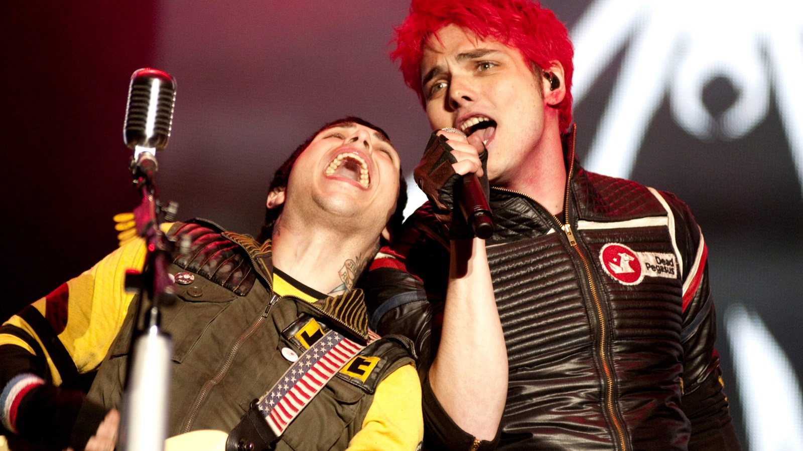
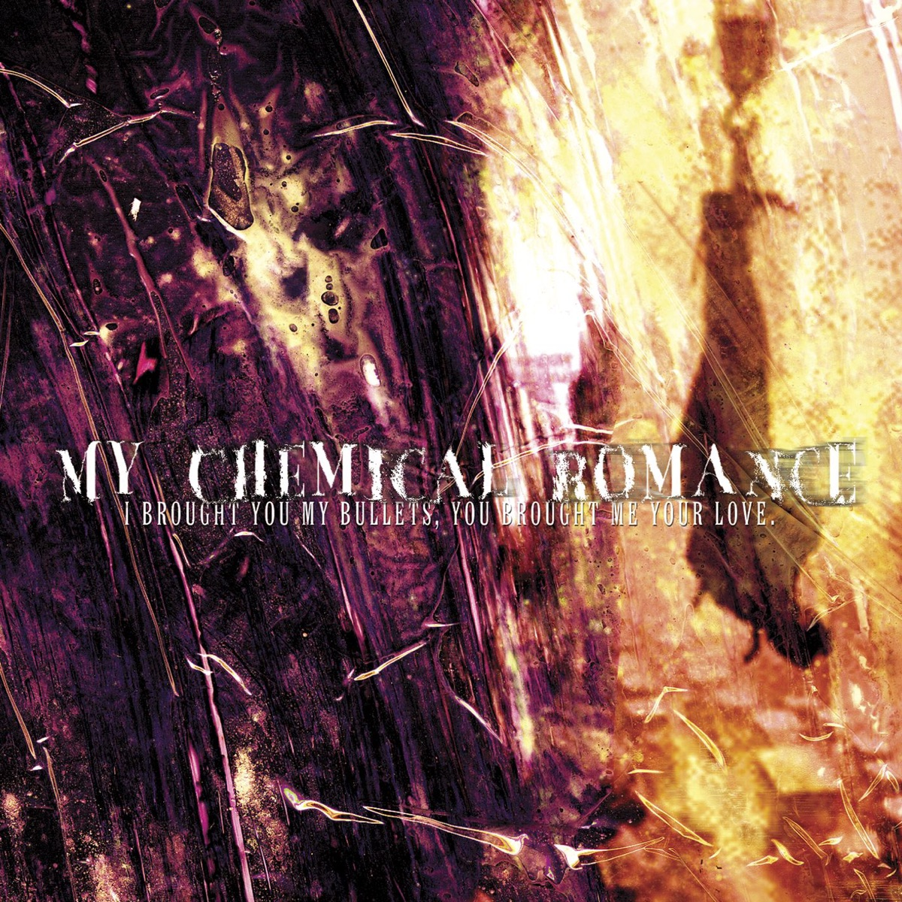
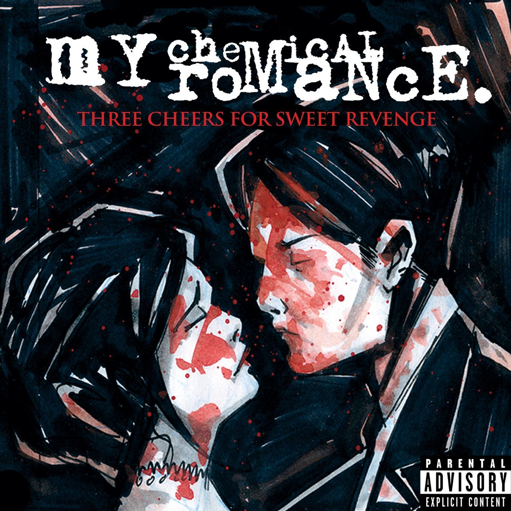
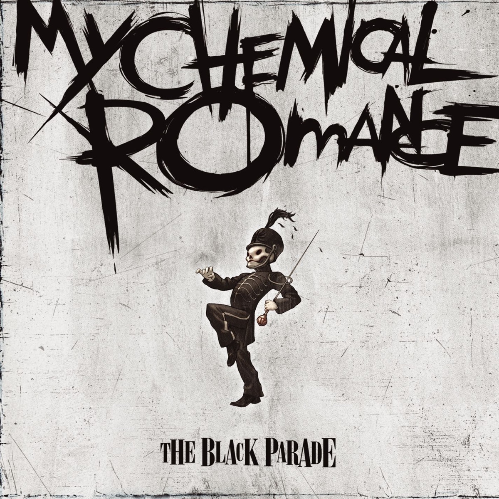
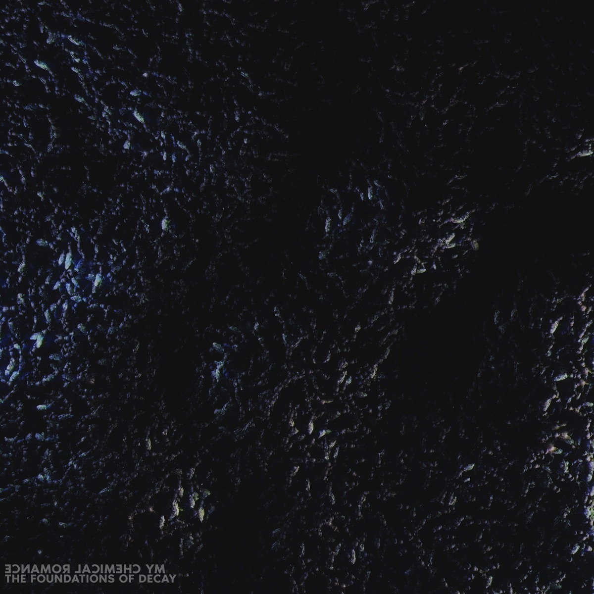

# 阵痛My Chemical Romance

*图：My Chemical Romance 演出现场。图片来自 [Rolling Stone 2019年重组报道](https://www.rollingstone.com/music/music-news/my-chemical-romance-reunion-show-906464/)，原图为历史现场资料照，并非2019年重组演出当天所摄。*

有些乐队从地下室里诞生，有些从酒吧、大学宿舍、廉价排练房里诞生；My Chemical Romance 像是从一场城市创伤的余震中诞生。2001年9月11日以后，杰拉德·威（Gerard Way）看着纽约天际线冒烟，忽然意识到时间不是一张可以无限续费的车票。他放下原本的人生安排，开始写歌。最早的作品之一叫 `Skylines and Turnstiles`：天际线与旋转门，灾难与日常，一座城市刚刚受伤，人们仍必须排队、上班、回家，像什么也没有发生。

于是 My Chemical Romance 出现了。不是为了替时代止痛，而是为了证明疼痛可以被唱出来，可以化妆、穿上制服、点亮舞台，在几千个人的喉咙里获得另一种形状。

## 新泽西的孩子：把恐惧接上电吉他

乐队2001年在新泽西州纽瓦克一带形成。核心成员是主唱杰拉德·威、吉他手雷·托罗（Ray Toro）、吉他手弗兰克·伊埃罗（Frank Iero）、贝斯手迈基·威（Mikey Way）；鼓手位置在生涯中多次变化，早期首张专辑由马特·佩利西尔（Matt Pelissier）参与，后来鲍勃·布莱亚（Bob Bryar）成为《The Black Parade》时期的重要鼓手。乐队名称来自迈基在书店工作时看到的欧文·威尔士小说 *Ecstasy: Three Tales of Chemical Romance*。

他们常被归入“emo”，但只用这个词会把门关得太早。My Chemical Romance 的根系更杂乱：后硬核的尖锐，朋克的速度，金属吉他的重量，皇后乐队式的戏剧摇滚，恐怖电影、漫画、歌剧和百老汇般的角色表演。杰拉德不是站在那里唱歌，他会变成吸血鬼、复仇者、病人、亡灵游行的领队、末日荒原上的 Killjoy。每张唱片像一部更换布景和服装的电影，可镜头深处总有同一个人：他害怕，受伤，觉得自己不合群，却还想活下去。

## 子弹与爱：第一阵疼痛

2002年，乐队通过新泽西独立厂牌 Eyeball Records 发行首张专辑 **《I Brought You My Bullets, You Brought Me Your Love》**。制作人是 Thursday 主唱杰夫·里克利（Geoff Rickly）。这是一张边缘粗糙、呼吸急促的唱片，像凌晨两点录在潮湿地下室里的犯罪爱情片：吸血鬼、公路、枪、失败的恋人和来不及擦掉的血迹挤在一起。

*图：《I Brought You My Bullets, You Brought Me Your Love》（2002），常简称《Bullets》。封面取自 [Apple Music 公开唱片页](https://music.apple.com/us/album/i-brought-you-my-bullets-you-brought-me-your-love/1157609234)。*

`Vampires Will Never Hurt You` 是这张唱片的核心之一。吉他像警报器，节奏一面坍塌一面向前，杰拉德的声音还没有后来那种大剧院般的控制力，却有一种真实的窒息感。`Early Sunsets Over Monroeville` 借僵尸电影的影子讲述爱与不得不杀死爱人的恐怖。那时候他们并不完美，但所有真正重要的东西已经在那里：死亡意象不是终点，而是一面黑色背景，让求生欲显得更亮。

## 三声复仇：青春穿上黑西装

签约 Reprise Records 后，My Chemical Romance 于2004年推出 **《Three Cheers for Sweet Revenge》**。专辑的松散概念围绕一对死别的恋人：男人若想与爱人重聚，就必须为魔鬼带回一千个恶人的灵魂。这个故事未被每首歌严格执行，却为整张唱片染上一层血红色戏剧感。

*图：《Three Cheers for Sweet Revenge》（2004）封面。图片取自 [Apple Music 公开唱片页](https://music.apple.com/us/album/three-cheers-for-sweet-revenge/1156311431)。*

`I’m Not Okay (I Promise)` 把青少年最难说出口的句子变成一次集体喊叫。它不端庄，也不提供成熟建议，只是承认：我不好，我没有你们以为的那么好。`Helena` 写给杰拉德和迈基去世的外祖母，葬礼在音乐录像中变成黑伞、红领带和舞蹈；悲伤不再关在卧室里，它被搬到礼堂中央，让所有人围着棺木一起唱。`The Ghost of You` 则把失去放进战争影像，让私人哀悼扩展成海滩上无法回头的告别。

2005年的 Warped Tour 将他们推向更大人群。黑衣、眼线、红色领带和汗水形成一种时代肖像。台下的孩子并非都想成为悲剧人物；他们只是第一次看见有人把羞耻、孤独与愤怒写得如此巨大，巨大到可以盖过学校走廊里的嘲笑声。现场因此像临时搭起的避难所——扩音器轰鸣，陌生人彼此推撞，却知道副歌到来时该在哪里一同举手。

## 黑色游行：让死亡走在最前面

2006年发行的第三张专辑 **《The Black Parade》** 是他们最完整、也最野心勃勃的作品。专辑围绕一个临终病人展开：死亡以他最强烈的记忆——父亲曾带他观看的游行——前来迎接。钢琴、军鼓、双吉他、合唱和戏剧化转场让唱片像一台摇滚歌剧；它借死亡谈论的，却是人在最后时刻如何回望爱、恐惧、失败和尊严。

*图：《The Black Parade》（2006）封面。图片取自 [Apple Music 公开唱片页](https://music.apple.com/us/album/the-black-parade/209388277)。*

`Welcome to the Black Parade` 从一个G音开始，钢琴单薄得像医院走廊尽头的一盏灯，随后军鼓进入，整支乐队和亡灵队伍一起穿城而过。`Cancer` 几乎放弃华丽，只留下病床边的虚弱陈述；`Mama` 把战争、罪责和丽莎·明奈利的客席演唱塞进一场疯狂歌舞；`Teenagers` 用跺脚节拍嘲弄社会对年轻人的恐惧；`Famous Last Words` 最终把唱片推向一句倔强宣言：即使独自走下去，也仍不害怕活着。

黑色制服时代的演出把这种概念推到极致。2006年 Reading Festival，他们面对部分观众投掷杂物，仍完成演出；2007年10月7日，乐队在墨西哥城 Palacio de los Deportes 为黑色游行举行了一场带有告别意味的演出，后来成为现场影像 **《The Black Parade Is Dead!》** 的主体。那一夜，杰拉德以“病人”身份被推上舞台，整支乐队像从棺材里站起的军乐队；谢幕后，他们换回普通MCR身份继续演奏。角色死了，乐队还活着——至少当时如此。

## 荒原的颜色：拒绝永远参加自己的葬礼

他们没有继续复制黑白世界。2010年的第四张专辑 **《Danger Days: The True Lives of the Fabulous Killjoys》** 把镜头转向2019年的加州荒漠：艳色皮夹克、射线枪、漫画反抗军、电台DJ和邪恶企业。音乐也变得明亮，混入车库摇滚、流行朋克和电子色彩。

*图：《Danger Days: The True Lives of the Fabulous Killjoys》（2010）封面。图片取自 [Apple Music 公开唱片页](https://music.apple.com/us/album/danger-days-the-true-lives-of-the-fabulous-killjoys/396793722)。*

`Na Na Na` 像一辆涂满油漆的车冲出废墟；`SING` 把反抗写成大合唱；`The Kids from Yesterday` 回望那些一路同行、终将长大的年轻人。它证明MCR并不迷恋黑色本身，他们迷恋的是变身：当一种制服变成牢笼，就把它烧掉，换上另一种颜色继续逃亡。

然而长年巡演、创作压力和对下一步方向的困惑逐渐耗尽乐队。此前录制但被搁置的一批作品后来以五组双单曲的形式发行，统称 **《Conventional Weapons》**。2013年3月22日，乐队宣布结束。那不是一首歌里的戏剧性死亡，没有军乐队，没有烟火，只是一段共同生活走到了无法再继续的位置。阵痛真正残忍的地方就在这里：它不一定表现为尖叫，也可能只是某天打开网页，看见曾陪你活过青春的乐队说，他们不再是一个乐队了。

## 归来以后：伤口不会按原样愈合

2019年10月31日，My Chemical Romance 宣布重组；12月20日，他们在洛杉矶 Shrine Expo Hall 举行2012年以来的第一场演出。六年的空白没有被抹掉，台下的人也不再是从前的自己。有人已工作、结婚、成为父母，有人终于活过了当年以为无法跨越的夜晚。那些旧歌再次响起，不是时间倒流，而是现在的人回去拥抱曾经的自己。

疫情延迟了后续巡演，但乐队最终在2022年重新上路。同年5月12日，他们突然发行长达六分钟的 **`The Foundations of Decay`**。歌曲从噪声、低语和腐朽意象中缓慢爬起，随后爆发成沉重的后硬核洪流。它没有假装MCR仍是二十岁的新泽西青年，也没有交出一首安全的怀旧单曲；它谈废墟、信念和重新站起来的困难——回来并不等于痊愈，地基里仍有腐烂，身体仍记得疼痛。

*图：`The Foundations of Decay`（2022）单曲封面。图片取自 [Apple Music 公开唱片页](https://music.apple.com/us/album/the-foundations-of-decay-single/1623205268)。*

归来没有停在2022年。2024年，他们在 When We Were Young 音乐节完整演奏《The Black Parade》；随后把这场旧梦扩展为 **Long Live The Black Parade** 体育场巡演。2025年7月26日的洛杉矶演出中，乐队首次公开演唱尚未正式发行的 `War Beneath the Rain`，杰拉德说明它来自解散前那张未完成唱片的创作时期；2026年，黑色游行继续驶向更广阔的世界巡演版图。但必须说清楚：豪华再版、旧作重演和一首未发行曲都不等于第五张录音室专辑已经问世。截至本文写作时，他们正式发行的完整录音室专辑仍是四张。MCR的归来因此不是补交青春作业，而像一群已穿过中年的幸存者，再次检查旧伤下面的地基。

## 阵痛

My Chemical Romance 最容易被误解的地方，是人们只看见他们唱死亡。其实他们一直在唱如何穿过死亡的想象继续生活。吸血鬼、枪手、病人、亡灵、Killjoy、废墟中的幸存者，都是同一个问题换上的不同面具：当世界拒绝你，当身体和头脑成为敌人，当爱无法留下，你还能不能向前一步？

他们的答案从来不温和。答案是电吉他，是眼线被汗水冲花，是站到椅子上把 `I’m Not Okay` 喊到破音；是承认自己害怕，却仍随黑色游行穿过城市；是多年以后听见那个钢琴G音，忽然想起校服口袋里的耳机、深夜亮着的电脑屏幕，以及那个曾以为孤独只属于自己的少年。

成长不是疼痛消失，而是学会辨认它的节奏。一次收缩，一次呼吸，一次漫长的停顿，然后生命把你推向新的地方。My Chemical Romance 就在那阵痛里演奏：鼓点像心脏撞击胸骨，吉他像街灯在雨夜里一盏盏掠过，杰拉德站在舞台中央，举起麦克风，把一句“不好”唱成千万人共同的回答。

然后游行继续。

我们也继续。

---

## 文中涉及与推荐聆听的唱片

### 四张核心录音室专辑

- *I Brought You My Bullets, You Brought Me Your Love*（2002）
- *Three Cheers for Sweet Revenge*（2004）
- *The Black Parade*（2006）
- *Danger Days: The True Lives of the Fabulous Killjoys*（2010）

### 延伸聆听

- *Life on the Murder Scene*（2006，现场／纪录片合集）
- *The Black Parade Is Dead!*（2008，现场专辑及影像）
- *Conventional Weapons*（2012—2013，五组双单曲）
- *May Death Never Stop You*（2014，精选集）
- *The Black Parade / Living with Ghosts*（2016，十周年纪念版）
- `The Foundations of Decay`（2022，单曲）

## 主要资料与图片来源

1. [My Chemical Romance 官方网站](https://www.mychemicalromance.com/)
2. [MusicBrainz：My Chemical Romance 艺人及发行数据](https://musicbrainz.org/artist/c07f0676-9143-4217-8a9f-4c26bd636f13)
3. [Apple Music：My Chemical Romance 艺人页面](https://music.apple.com/us/artist/my-chemical-romance/14748659)
4. [Rolling Stone：2019年重组及洛杉矶演出公告](https://www.rollingstone.com/music/music-news/my-chemical-romance-reunion-show-906464/)
5. [Rolling Stone：2019年洛杉矶重组演出现场报道](https://www.rollingstone.com/music/music-live-reviews/my-chemical-romance-reunion-show-los-angeles-928097/)
6. [Pitchfork：2022年新曲《The Foundations of Decay》报道](https://pitchfork.com/news/my-chemical-romance-share-first-new-song-since-2014-listen/)
7. [GRAMMY.com：《Danger Days》十周年回顾](https://www.grammy.com/news/my-chemical-romance-danger-days-10-year-anniversary/)
8. [Rolling Stone：乐队早期深度访谈重刊](https://www.rollingstone.com/music/music-features/my-chemical-romance-three-cheers-interview-1235034488/)
9. [Pitchfork：2019年重组公告及2013年结束活动背景](https://pitchfork.com/news/my-chemical-romance-announce-reunion-show/)
10. [Billboard：2025年巡演及完整演奏《The Black Parade》](https://www.billboard.com/music/rock/my-chemical-romance-2025-tour-dates-1235826748/)
11. [Billboard：未发行曲《War Beneath the Rain》现场首演](https://www.billboard.com/music/music-news/my-chemical-romance-unreleased-song-war-beneath-the-rain-1236032210/)
12. [Billboard：The Black Parade 2026 巡演扩展](https://www.billboard.com/music/rock/my-chemical-romance-17-new-2026-black-parade-tour-dates-1236071670/)
13. [NME：My Chemical Romance 新闻与资料索引](https://www.nme.com/artists/my-chemical-romance)

> 图片用于音乐史评论、作品识别与资料说明。专辑及单曲封面来自 Apple Music 公开唱片页；现场图片来自正文标注的媒体报道页面。