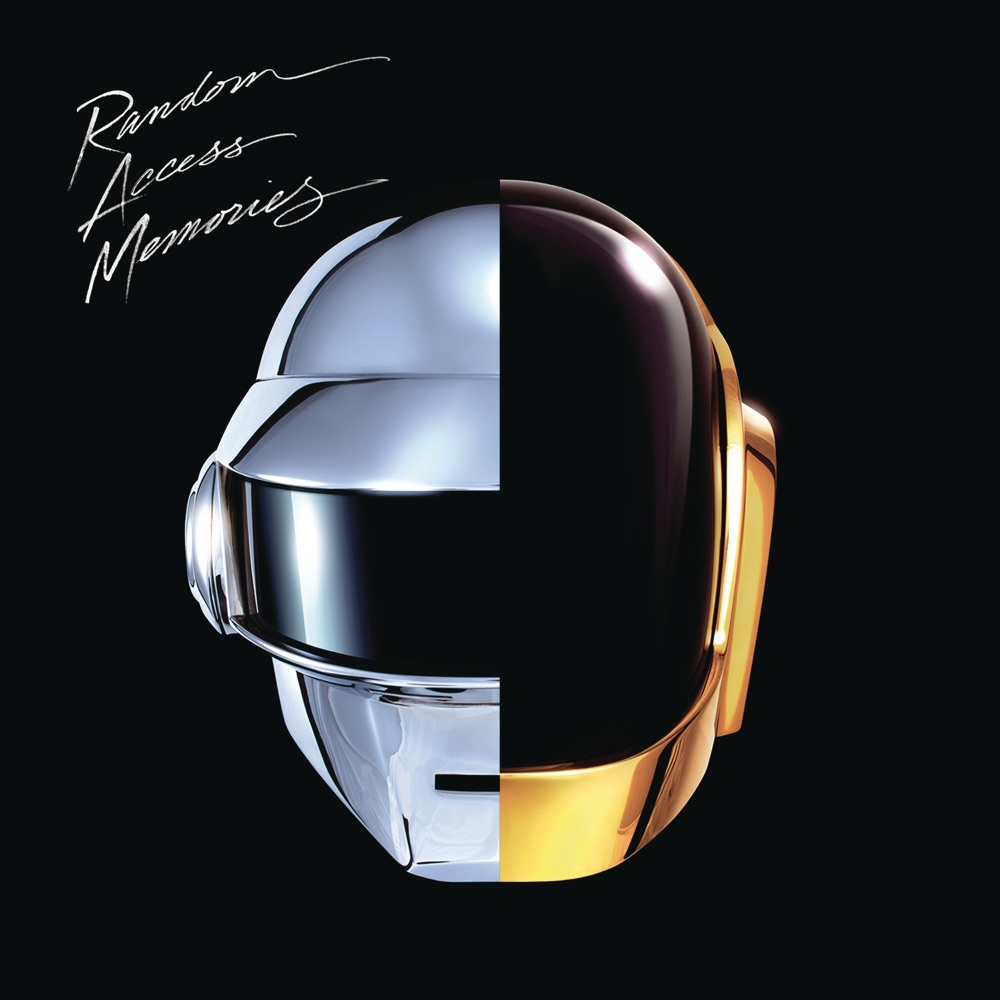
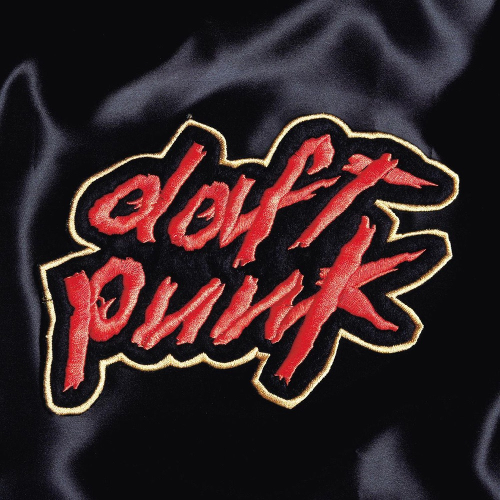
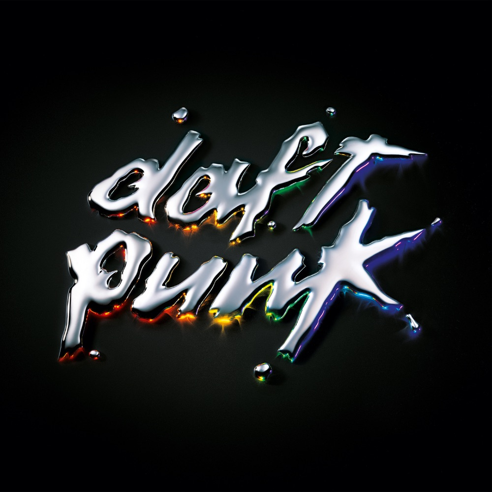
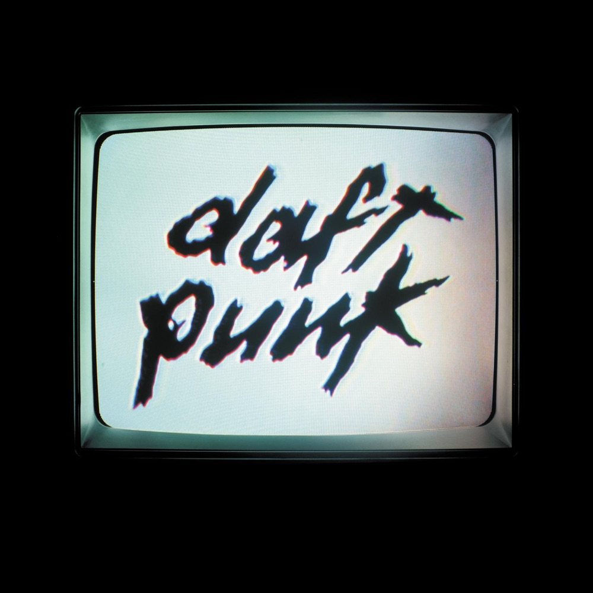
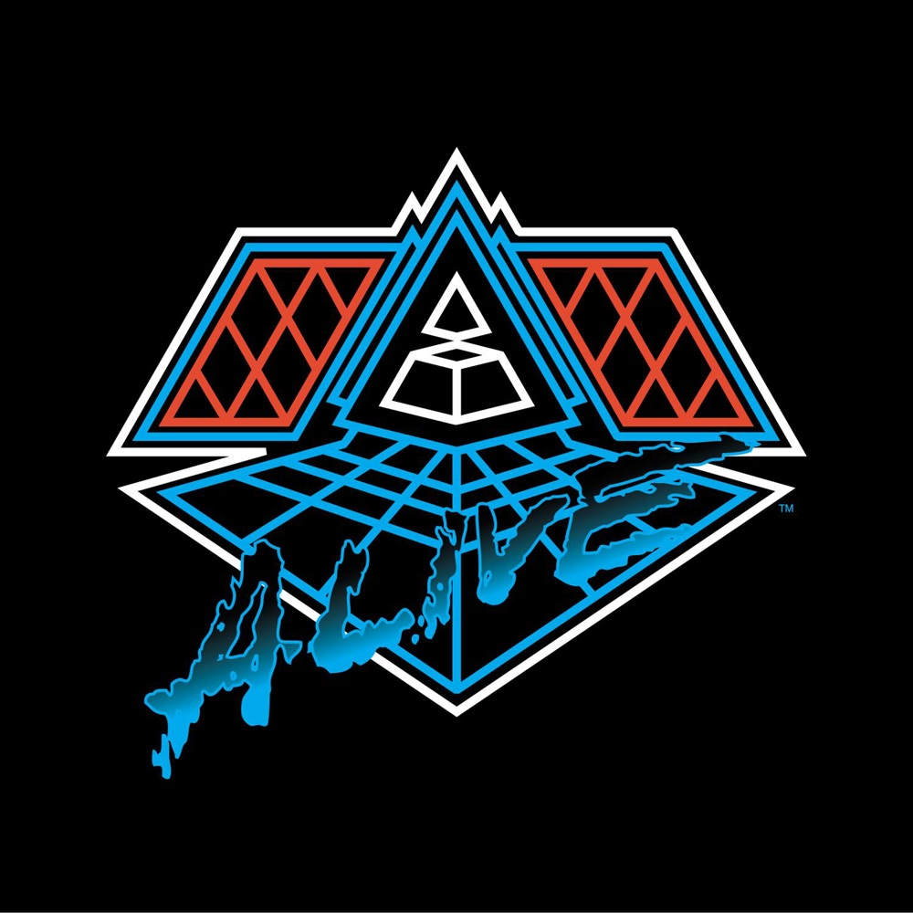
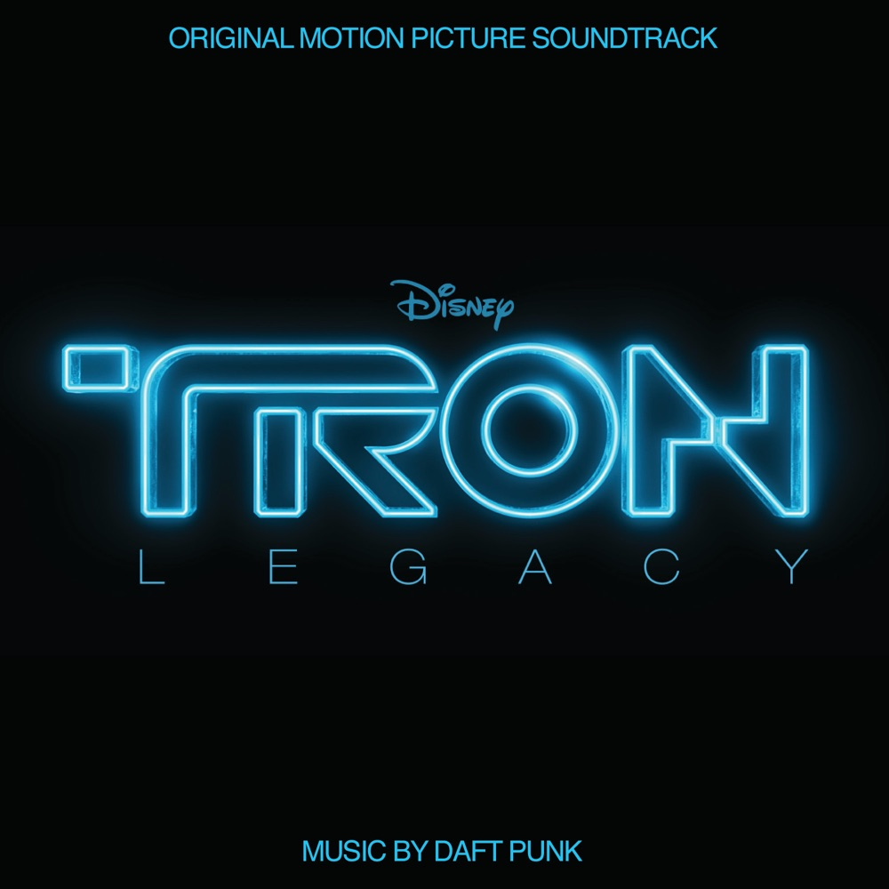
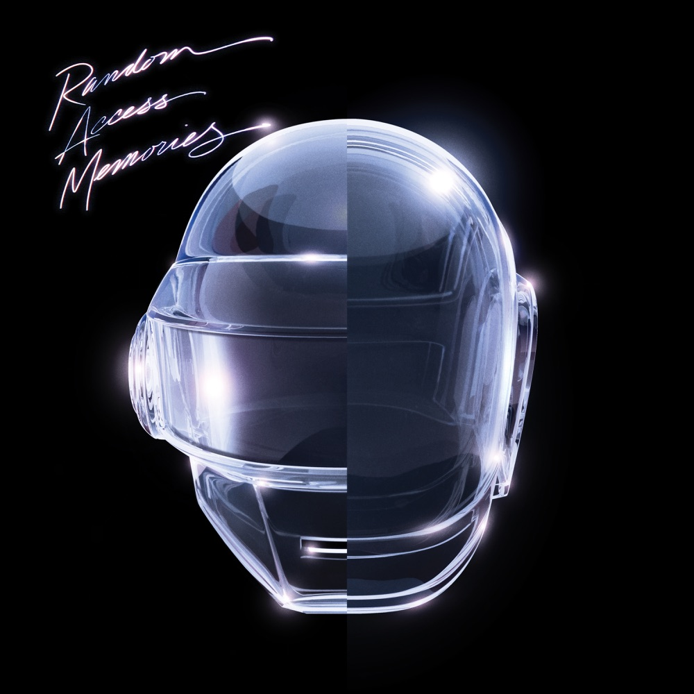

# 随机存取的记忆：Daft Punk 如何教机器回忆

*图：《Random Access Memories》（2013，Columbia）封面。银色与金色两颗头盔在中线处合成一体，黑底之上，左上是手写体专辑名。图片来源：[Apple Music](https://music.apple.com/us/album/random-access-memories/617154241)。*

一九八七年，巴黎一所中学的走廊里，两个十三岁的男孩相遇。一个后来戴银色头盔，另一个戴金色头盔。他们那时还不会制作音乐，只是喜欢同一些唱片。

多年后，Thomas Bangalter 与 Guy-Manuel de Homem-Christo 把脸藏进金属面具，用一台机器人替身活了三十年。二〇二一年二月二十二日，一段八分钟的影片出现在网络上：两个机器人走进沙漠，其中一个按下引爆器。画面结束，屏幕显示 1993—2021。

没有告别信，没有解释，没有最后一场演唱会。这是他们的方式——机器决定停机。

但停机之前，他们留下一张专辑，试图回答一个奇怪的问题：如果机器有记忆，那些记忆是什么声音？

## 一、从"傻朋克"到机器人

Daft Punk 的名字来自一次侮辱。

早年他们组过一支独立摇滚乐队 Darlin'，成员里有后来加入 Phoenix 的 Laurent Brancowitz。英国音乐杂志 Melody Maker 听了他们的歌，写下"a bunch of daft punk"——一群傻朋克。

两个年轻人没有生气，反而觉得这句话很适合：把贬义捡起来，做成身份。一九九三年，Daft Punk 在巴黎成立。

最初几年，他们以真面目示人。一九九九年，这对回避媒体的组合戴上了头盔，从此以沉默的机器人形象出现。Thomas Bangalter 后来解释，这套形象更像 Marina Abramović 式的"行为艺术装置"，并强调"我们始终站在人性的一边，而不是技术的一边"。头盔不是伪装，是他们给音乐搭建的舞台。

九十年代末，法国电子乐正在经历一场静默革命。Air 制造平滑、爵士化的 downtempo，St Germain 把 house 推向咖啡馆，Cassius 在迪斯科与 funk 之间摇摆。这些声音共同构成了所谓的"French touch"——一种精致、复古、带有巴黎沙龙气质的电子乐。

Daft Punk 不属于这个沙龙。他们的《Homework》（一九九七年一月发行）给出粗粝、坚硬、几乎带着暴力感的 house。`Da Funk` 的贝斯像一条被踩住的蛇，`Around the World` 把一句歌词重复到听众自己成为节奏，`Revolution 909` 用警笛与鼓点模拟一场被警察驱散的派对。这不是咖啡馆音乐，是地下室、是仓库、是凌晨四点还亮着灯的非法舞池。

Pitchfork 后来给《Homework》9.2 分，称它是"a study in contradictions"——在电子乐商业化浪潮里，一张既拥抱舞池又拒绝讨好主流的唱片。Daft Punk 的起点不是优雅，是蛮力。他们证明了 French touch 不必精致，也可以野蛮。

二〇〇一年，《Discovery》发行。风格突然转向：更明亮、更流行、vocoder 人声像塑料玩具。`One More Time` 把"celebrate"这个词重复到近乎催眠，Romanthony 的声音被机器处理得只剩快乐的空壳。Pitchfork 当年只给 6.4 分，认为重复过多、缺乏深度。但时间改变了评价：《Discovery》后来被视为流行电子乐的分水岭，一张用过度重复本身作为主题的唱片。

《Discovery》还催生了一部动画电影《Interstella 5555: The 5tory of the 5ecret 5tar 5ystem》。整部电影没有对白，全部由《Discovery》的音乐驱动，由日本动画师松本零士（Leiji Matsumoto）监制。一支外星乐队被绑架到地球、被迫成为流行明星的故事，成为 Daft Punk 对音乐产业最尖锐的隐喻。这部电影后来成为 cult 经典，也让《Discovery》超越了单纯的听觉体验，成为一部完整的视听作品。

二〇〇五年，《Human After All》。Pitchfork 给 4.9 分，写道这张"recorded in two weeks"的专辑"feels like not just a failure, but a heartbreaker"。吉他更脏、歌词更口号化、制作更匆忙。那是他们第一次真正被批评界抛弃。

然而，正是这张"失败"的专辑，为后来的转折埋下伏笔。Daft Punk 决定不再依赖电脑屏幕制作音乐——他们要去找真人。

## 二、金字塔与活着的机器

二〇〇六年到二〇〇七年，Daft Punk 带着"Alive 2007"巡演回归。舞台中央是一座巨大的 LED 金字塔，两个机器人站在里面，被光与声音包裹。

那场演出没有 DVD。Thomas Bangalter 后来对 Pitchfork 说："互联网上的成千上万片段，比任何我们可能发行的 DVD 都更好。"这是一种奇特的决定：一支以视觉著称的乐队，选择让现场只存在于观众的劣质手机录像里。

《Alive 2007》现场专辑把三张录音室专辑的歌混成连续体，像一台完美校准的流行音乐机器。Pitchfork 称之为"the most exuberant LED-laden music blowout ever staged"。二〇〇九年，这张现场专辑为 Daft Punk 拿下两座格莱美：最佳电子/舞曲录音（`Harder Better Faster Stronger`）与最佳电子/舞曲专辑（《Alive 2007》）。

机器人证明了自己可以"活"。但接下来的问题更尖锐：机器人能不能"回忆"？

## 三、Tron：机器的孤独练习

二〇一〇年，Daft Punk 为迪士尼电影《Tron: Legacy》配乐。八十五人管弦乐团，二十二段曲目，大部分不超过三分钟。Pitchfork 的评价不客气："This is not the new Daft Punk album... it's also not a surprise... almost undeniably disappointing."

配乐本身并非毫无价值——它展示了 Daft Punk 处理宏大音响的能力，也让他们第一次与真实管弦乐团合作。但乐评界和听众都清楚：这不是他们的主场。格莱美给了它一个"最佳影视配乐"提名，仅此而已。

《Tron》是一次必要的弯路。它让 Daft Punk 意识到，机器可以模拟情感，但真正的情感来自真实的人类乐手、真实的录音室、真实的失误。

## 四、随机存取的记忆

二〇一三年五月十七日，《Random Access Memories》发行。

这是他们第一次在 Columbia Records 旗下发片，也是第一次完全抛弃采样。他们去最好的录音室，请最好的乐手，加入合唱团和管弦乐团，几乎完全避免使用采样——那个曾经定义他们声音的核心工具。

合作名单像一张七十年代的通讯录：Nile Rodgers 的吉他，Pharrell Williams 的人声，Giorgio Moroder 的自述，Paul Williams 的词曲，Todd Edwards 的碎拍人声，Panda Bear 的和声，Chilly Gonzales 的钢琴。

`Get Lucky` 是门面。Nile Rodgers 的吉他 riff 干净得像刚擦过的铜器，Pharrell 的声音在副歌里滑翔。它冲到 Billboard Hot 100 第二位，成为当年全球最热的舞曲之一。Rodgers 后来回忆，Daft Punk 告诉他他们想要"chic"——不是时尚品牌，而是那种七十年代末迪斯科里既克制又性感的律动。Rodgers 用一把 Fender Stratocaster 和 Nile Rodgers 式的十六分音符扫弦，给出了答案。

但专辑真正的核心是 `Giorgio by Moroder`。九分钟的曲子里，这位迪斯科先驱用自己的声音讲述从意大利来到慕尼黑、用第一台合成器制作 `I Feel Love` 的经历。Daft Punk 把这段访谈采样进音乐，让 Moroder 的自述成为节奏的骨架。这不是致敬，是招魂——他们把一个活人的记忆直接缝进机器。

`Instant Crush` 是另一颗宝石。Julian Casablancas（The Strokes 主唱）的声音被 vocoder 处理成金属质感，唱一段关于初恋与错过的故事。这首歌证明 Daft Punk 可以用机器人声音表达最脆弱的人类情感——失恋。

`Touch` 是专辑的情感中心。Paul Williams 的声音在弦乐与合成器之间漂浮，唱"I remember touch"——我记得触碰。这是整张专辑最接近自传的时刻：两个机器人回忆他们曾经拥有过的身体感觉。

`Lose Yourself to Dance` 把 Pharrell 与 Nile Rodgers 再次拉到一起，但这次节奏更慢、更沉，像一场凌晨三点还没结束的派对。`Beyond` 用管弦乐铺陈出一段史诗般的旅程，`Motherboard` 则回归 Daft Punk 标志性的电子脉冲。

Pitchfork 给《Random Access Memories》8.8 分，写道 Daft Punk "leaving behind the highly influential, riff-heavy EDM they originated to luxuriate in the sounds, styles, and production techniques of the 1970s and early '80s"。这是一张慢、长、昂贵的专辑，七十五分钟，几乎没有可以剪成单曲的段落。它不试图讨好当下，而是试图重新定义"当下"应该听起来像什么。

这张专辑的制作过程本身就是一场宣言。Daft Punk 拒绝了现代电子音乐的制作方式——没有 laptop，没有 DAW 里的剪贴拼接，没有采样。他们请来几十位乐手，用模拟磁带录音，反复重录直到每个音符都对。这种"反效率"的做法，在二〇一三年的音乐工业里近乎叛逆。

二〇一四年格莱美，《Random Access Memories》拿下四座奖：年度专辑、年度制作（`Get Lucky`）、最佳流行双人/团体表演（`Get Lucky`）、最佳电子/舞曲专辑。这是 Daft Punk 职业生涯的顶点，也是格莱美历史上罕见的电子音乐全面胜利。当晚他们戴着头盔上台领奖，Pharrell 与 Nile Rodgers 站在身旁。那是机器人第一次站在格莱美舞台中央，接受人类世界的最高致敬。

《Random Access Memories》空降 Billboard 200 榜首，并蝉联两周冠军，在榜五十六周——这是 Daft Punk 第一次拥有美国冠军专辑。据报道首周销量约三十三万九千张。

## 五、停机之后

二〇一六年，Daft Punk 与 The Weeknd 合作 `Starboy` 和 `I Feel It Coming`，把机器人声音带入当代 R&B。`Starboy` 冲到 Billboard Hot 100 第一位，成为 The Weeknd 的又一首冠军单曲。Daft Punk 的制作——那种冷冽、精确、带有复古未来感的电子脉冲——完美适配了 The Weeknd 黑暗、性感的声线。

更早之前，Kanye West 的《Yeezus》（2013）公开承认受到 Daft Punk 影响，尤其是《Human After All》里那种工业、重复、不妥协的声音。Skrillex、Disclosure、Justice 等电子音乐人也都把 Daft Punk 视为启蒙。Daft Punk 的声音已经渗入流行音乐的底层结构，成为无数后来者的 DNA。

二〇二一年二月二十二日，Epilogue 影片上线。两个机器人走进沙漠，一个按下引爆器，另一个化为碎片。屏幕显示 1993—2021。

二十八年的组合就此结束。没有最后一场演出，没有最后一张专辑，没有解释。这是他们一贯的方式：机器决定何时关机。

这段影片本身就是 Daft Punk 式的作品。它不解释、不煽情、不回顾。它只是陈述一个事实：结束了。这种克制让他们成为音乐史上少数真正"善终"的组合——没有在巅峰后勉强维持，没有为了巡演而重组，没有用一张平庸的告别专辑毁掉传奇。他们选择在最好的时候停下。

停机之后，Thomas Bangalter 开始个人项目。二〇二三年四月，他发布芭蕾舞剧配乐《Mythologies》（Warner Classics/Erato），该作品二〇二二年七月已在波尔多大剧院首演。这是他在《Random Access Memories》之后又一次证明：真正的创造力不在于重复成功的公式，而在于不断追问"接下来是什么"。Guy-Manuel de Homem-Christo 相对安静，偶尔以 Daft Punk 名义发布混音或合作。

二〇二三年五月，《Random Access Memories》十周年纪念版发行，加入三十五分钟未公开素材，包括 `Infinity Repeating (2013 Demo)` 等当年未收录的歌曲。这张十周年版让专辑重回 Dance/Electronic 专辑榜榜首，并重新进入 Billboard 200 第八位。同年十一月，又发行"Drumless Edition"——把整张专辑的鼓全部移除。Pitchfork 对鼓移除版的评价毫不留情："What are we doing here?... a largely superfluous album."但这张"多余"的专辑恰恰印证了原作的力量：即使去掉节奏骨架，那些旋律和编曲仍然成立。

机器人停机了，但 Daft Punk 的世界仍在运转。二〇二四年，《Interstella 5555》在全球四十多个国家的影院重映。二〇二五年九月，Fortnite 上线"Daft Punk Experience"，收录三十一首曲目；十一月，`Contact` 发布全新动画音乐录影带。二〇二五年十月，Bangalter 在巴黎蓬皮杜中心献出十六年来首次 DJ set。截至二〇二六年夏天，没有任何官方重聚公告——二〇二三年巴黎奥运会的演出传闻已被团队否认，"只是传闻，并非事实"。他们选择在停机后继续以作品存在，而不是以复活存在。

## 六、机器人留下了什么

Daft Punk 的四张录音室专辑——《Homework》《Discovery》《Human After All》《Random Access Memories》——构成一条完整的弧线：从蛮力到流行，从失败到回忆。

他们不是最早使用机器人的电子音乐人，也不是最早戴面具的艺人。Kraftwerk 早在七十年代就用机器人形象，Kiss、Alice Cooper、Slipknot 都用面具隐藏或夸张身份。但 Daft Punk 把"匿名"变成一种创作方法：当脸被藏起来，音乐本身成为唯一的作者。这让他们可以横跨 house、disco、rock、R&B、管弦乐，而不被任何一种风格绑定。

他们的匿名也改变了音乐产业的逻辑。在一个越来越依赖名人面孔、社交媒体、个人品牌的时代，Daft Punk 证明了一个反直觉的事实：你可以不提供任何个人信息，仍然成为全球最著名的音乐人之一。头盔不是隐藏，是声明——音乐不需要解释，不需要面孔，不需要故事。它只需要被听见。

《Random Access Memories》是他们最完整的答案。当整个行业都在用电脑制作越来越响、越来越快、越来越压缩的音乐时，Daft Punk 做了一张慢的、贵的、依赖真人乐手的专辑。它不怀旧，因为它试图证明：记忆可以被重新制作，而不只是被播放。

这张专辑也重新定义了"电子音乐"的可能性。在 EDM 主宰音乐节、drop 成为唯一结构的年代，《Random Access Memories》用七十五分钟的耐心、真实乐手的呼吸、模拟磁带的温暖，证明了电子音乐不必是冷的、机械的、无情的。它可以是温暖的、人性的、充满记忆的。

机器没有记忆。但 Daft Punk 教会机器如何假装记得。

而他们留下的最大遗产，也许不是任何一张专辑、任何一首歌、任何一场演出。他们留下的是一种可能性：在这个一切都被记录、一切都被消费、一切都被加速的时代，你仍然可以选择慢下来，选择用真实的双手制作音乐，选择把脸藏起来，让作品自己说话。

机器人停机了。但他们留下的记忆，仍在随机存取。

*图：《Homework》（1997，Virgin）封面。黑底之上，红色手写体"daft punk"与奶黄色描边，像一张被烟熏过的作业纸。图片来源：[Apple Music](https://music.apple.com/us/album/homework/696884422)。*

*图：《Discovery》（2001，Virgin）封面。纯黑背景上，银色铬金属浮雕手写体"daft punk"，字缘带彩虹色反光。图片来源：[Apple Music](https://music.apple.com/us/album/discovery/697194953)。*

*图：《Human After All》（2005，Virgin）封面。黑底中央一台老式 CRT 电视机，泛白屏幕显示黑色手写"daft punk"。图片来源：[Apple Music](https://music.apple.com/us/album/human-after-all/693748807)。*

*图：《Alive 2007》（2007）封面。蓝白霓虹线勾勒的菱形金字塔舞台图形，中心小金字塔图标。图片来源：[Apple Music](https://music.apple.com/us/album/alive-2007/717067737)。*

*图：《TRON: Legacy》电影原声（2010）封面。蓝色霓虹描边"TRON"，下排"LEGACY"，底部"MUSIC BY DAFT PUNK"。图片来源：[Apple Music](https://music.apple.com/us/album/tron-legacy-original-motion-picture-soundtrack/1440617583)。*

*图：《Random Access Memories》10 周年纪念版（2023）封面。黑底，粉白手写标题，中央透明水晶质感机器人头盔。图片来源：[Apple Music](https://music.apple.com/us/album/random-access-memories-10th-anniversary-edition/1673536063)。*

## 四张录音室专辑

| 专辑 | 年份 | 厂牌 | 主要方向 |
|---|---:|---|---|
| 《Homework》 | 1997 | Virgin | 粗粝、暴力感的 French house |
| 《Discovery》 | 2001 | Virgin | 明亮流行、vocoder、Interstella 5555 |
| 《Human After All》 | 2005 | Virgin | 脏吉他、口号式歌词、两周录制 |
| 《Random Access Memories》 | 2013 | Columbia | 真实乐手、七十年代 disco/funk/soft rock |

## 其他重要发行

| 作品 | 年份 | 类型 |
|---|---:|---|
| 《Musique Vol. 1 (1993–2005)》 | 2006 | 精选集 |
| 《Alive 2007》 | 2007 | 现场专辑 |
| 《TRON: Legacy》 | 2010 | 电影配乐 |
| 《Random Access Memories (10th Anniversary)》 | 2023 | 纪念版 |
| 《Random Access Memories (Drumless Edition)》 | 2023 | 去鼓重制版 |

## 推荐聆听路线

1. **从蛮力开始：**《Homework》——`Da Funk`、`Around the World`、`Revolution 909`
2. **进入流行：**《Discovery》——`One More Time`、`Digital Love`、`Harder Better Faster Stronger`
3. **见证现场：**《Alive 2007》——建议完整播放，感受金字塔的能量
4. **抵达回忆：**《Random Access Memories》——`Get Lucky`、`Instant Crush`、`Giorgio by Moroder`、`Touch`、`Lose Yourself to Dance`
5. **补充合作：**The Weeknd `Starboy`、`I Feel It Coming`
6. **停机之后：**Thomas Bangalter《Mythologies》

## 资料与图片来源

- Daft Punk 官网：[daftpunk.com](https://www.daftpunk.com/)（唱片目录、周边、最新动向）
- Recording Academy：[Daft Punk Grammy Awards and Nominations](https://www.grammy.com/artists/daft-punk/8207/)（6 次获奖、12 次提名；《Random Access Memories》四座奖）
- Billboard：[Daft Punk 解散报道（Epilogue）](https://www.billboard.com/music/music-news/daft-punk-break-up-9529272/)；RAM 首周 339,000 空降 Billboard 200 榜首（见 Recording Academy 与 Apple Music 记录）
- Pitchfork：[《Homework》9.2](https://pitchfork.com/reviews/albums/daft-punk-homework/)；[《Discovery》6.4](https://pitchfork.com/reviews/albums/2134-discovery/)；[《Human After All》4.9](https://pitchfork.com/reviews/albums/2137-human-after-all/)；[《Random Access Memories》8.8](https://pitchfork.com/reviews/albums/18028-daft-punk-random-access-memories/)
- MusicBrainz：[Daft Punk artist record](https://musicbrainz.org/artist/056e4f3e-d505-4dad-8ec1-d04f521cbb56)（1993—2021）；[《Random Access Memories》release-group](https://musicbrainz.org/release-group/aa997ea0-2936-40bd-884d-3af8a0e064dc)
- Apple Music：[Daft Punk 官方唱片目录](https://music.apple.com/us/artist/daft-punk/5468295)（本文九张封面与发行元数据）
