# 雾、口红与失落的世界：The Cure 的悲情三部曲与情绪摇摆

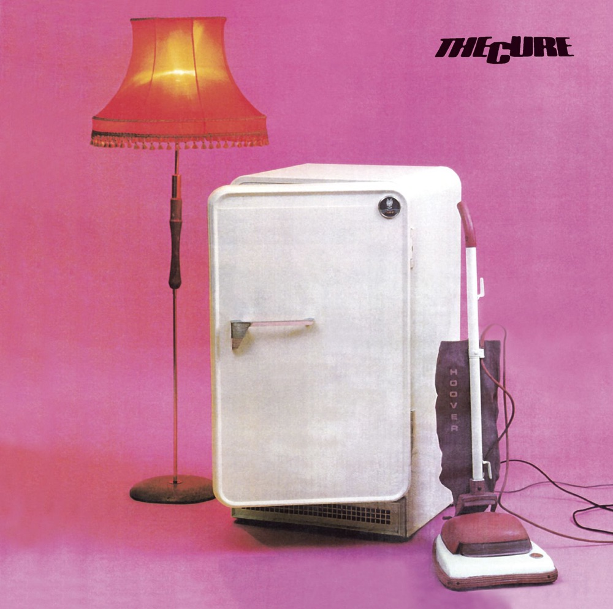

*图：《Three Imaginary Boys》（1979，Fiction）封面。品红底色上，一盏落地灯、一台冰箱、一只吸尘器并排而立——三个假想的人。图片来源：[Apple Music](https://music.apple.com/us/album/three-imaginary-boys/282971238)。*

一九七三年四月，英格兰南部小镇 Crawley，一所中学的年末演出。一支临时乐队登台，钢琴手叫 Robert Smith。这支乐队只存在了一次，名字叫 Obelisk。

三年后的一月，同一群人在 St Wilfrid 中学组了一支真正的乐队，叫 Malice，在当地的教堂大厅里排练 David Bowie 和 Jimi Hendrix。之后他们改名 Easy Cure，再之后，把 Easy 删掉，只剩 Cure——治愈。

这支后来卖掉超过三千万张唱片、二〇一九年入选摇滚名人堂的乐队，从名字开始就埋着一个悖论：他们唱的大多是无法治愈的东西。

## 一、十七秒的雾

一九七九年五月，首张专辑《Three Imaginary Boys》发行。封面是品红底色上三件并排的家用电器——灯、冰箱、吸尘器，三个假想的男孩。

但 Robert Smith 真正想做的声音，在下一张。

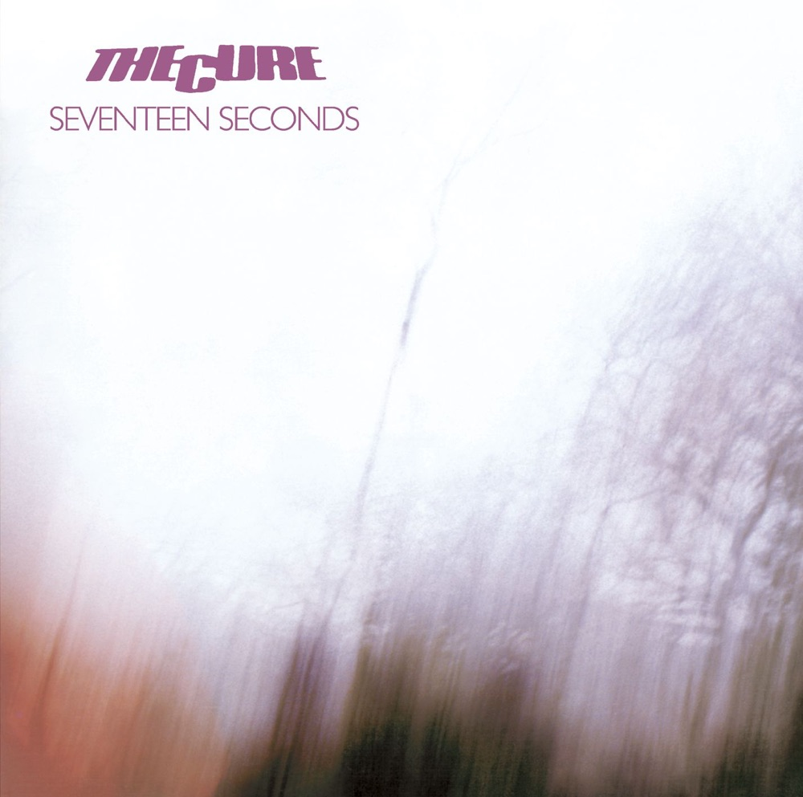

*图：《Seventeen Seconds》（1980，Fiction）封面。一片失焦的光晕，像隔着雾看一间空房子。图片来源：[Apple Music](https://music.apple.com/us/album/seventeen-seconds/286646354)。*

一九八〇年四月，《Seventeen Seconds》发行，制作人是 Mike Hedges。这是一张被 Pitchfork 后来称为"躺着做梦的唱片"的专辑——吉他不再区分流行乐的脉搏、摇滚的宣泄和氛围的空间，三者同时发生。封面是一片明亮而失焦的光晕，像隔着雾看一间空房子；音乐也是。`A Forest`从这张专辑里长出来，成为他们第一首真正的代表作：一片吉他回声构成的森林，Smith 的声音在里面喊，没有人应。

Pitchfork 在三部曲豪华版回顾评论里写道：这张专辑的声音"像一间空房间，四个穿黑衣服的人只占据刚刚好的空间，好让你自己游荡进去"。

唱片公司老板 Chris Parry 听过`A Forest`后说："如果你把它做得适合电台播放，你就有一首大热单曲了。"Smith 的回答是："但它听起来就是这样。这就是我脑子里的声音。"这句话大概是 The Cure 全部生涯的说明书。

## 二、信仰的轮廓

一九八一年四月，《Faith》发行，仍是 Mike Hedges 制作。

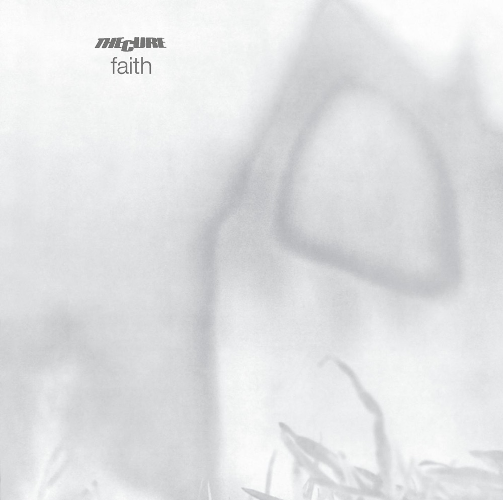

*图：《Faith》（1981，Fiction）封面。几乎全白的雾中，隐约一个教堂屋顶的轮廓——这是官方原貌，不是褪色。图片来源：[Apple Music](https://music.apple.com/us/album/faith/288790073)。*

这张专辑的封面是摇滚史上最大胆的设计之一：几乎全白。雾里只有一个极淡的教堂轮廓，顶部一行小字。它故意把自己做成一张需要凑近才能看清的唱片。

音乐上，《Faith》从`Primary`的尖锐流行感，走到`All Cats are Grey`的合成器低吟，再走到`Doubt`的撕咬。Pitchfork 说，The Cure 在这里"第一次成形为那支贯穿之后二十多年的独特乐队"——他们做了一件独立吉他乐队不太擅长的事：把强烈的情绪渲染成另一个强烈的状态，把重度抑郁与彻底的狂喜之间的界线抹掉。《The Funeral Party》缓慢的合成器音墙，预示了后来的《Disintegration》，甚至预示了《双峰》的主题曲。

"悲情三部曲"的说法，就是从《Seventeen Seconds》《Faith》这两张开始累积的。它们与下一张一起，构成了 The Cure 的第一阶段：雾、教堂、葬礼、和十七秒就散的东西。

## 三、色情文学：地狱里的 Phil Spector

一九八二年五月，《Pornography》发行。制作人换成了 Phil Thornalley 和 David M. Allen——不是 Mike Hedges，这是常被弄错的细节。

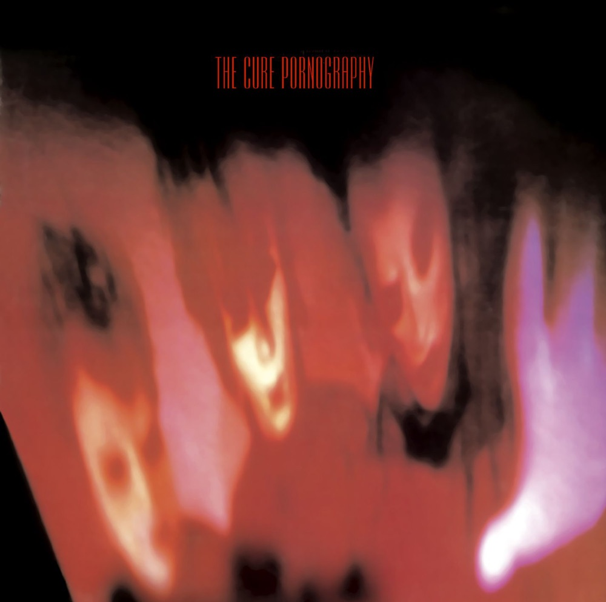

*图：《Pornography》（1982，Fiction）封面。暗底上三团相连的红橙色扭曲光影，像三张正在融化的脸。图片来源：[Apple Music](https://music.apple.com/us/album/pornography/286646425)。*

三部曲到了终点，雾变成了火。《Pornography》是情绪的全面强攻。Pitchfork 用了"all-out emotional assault"来形容它。专辑首周冲到英国专辑榜第八，但评论几乎是灾难性的：Rolling Stone 给出一星半（满分五星），NME 的 Dave Hill 说歌词"令人厌倦地自我剖析"，Village Voice 给了 C。但也是这位 Dave Hill，写下了那句著名的判词——这张专辑是"Phil Spector in Hell"：地狱里的 Phil Spector。

Robert Smith 后来解释这张专辑的参照系：The Psychedelic Furs 的首张专辑，"有一种声音的密度，非常有力"；还有 Siouxsie and the Banshees，"他们把我引向了《Pornography》，他们从我身上挖出了某种东西"。

巡演结束后，乐队几乎散掉。Smith 和键盘手 Lol Tolhurst 的关系、与贝斯手 Simon Gallup 的矛盾，在药物和酒精里发酵。"悲情三部曲"到此为止——不是因为做完了，是因为人快撑不住了。

专辑首周冲到英国专辑榜第八，在榜停留九周。Fiction 的老板 Chris Parry 认为只有`The Hanging Garden`够格当单曲，经 Thornalley 和 Smith 打磨后于七月发行，拿到英国单曲榜第三十二。一张被乐评人骂作"地狱"的专辑，仍然卖得动——这已经预告了 The Cure 日后那种古怪的命运：越黑暗，越被需要。

## 四、从门里探出头

一九八二年到一九八四年是断裂带。《The Top》（1984）是 Smith 几乎一个人的专辑，迷幻、杂耍、孤独。然后 Simon Gallup 回来了。

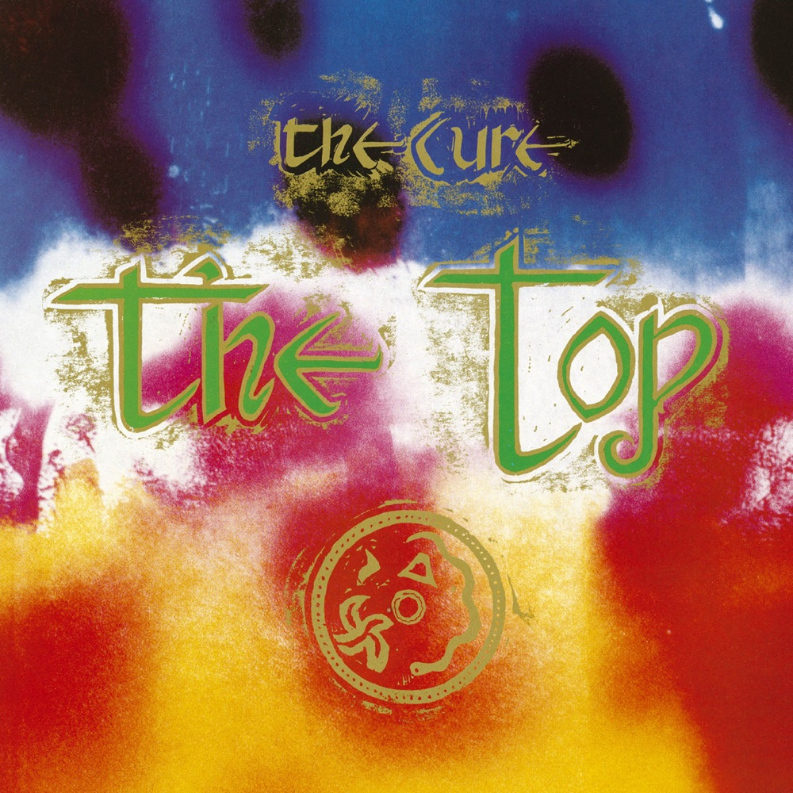

*图：《The Top》（1984，Fiction）封面。蓝红黄黑扎染底色上手写"the Top"。图片来源：[Apple Music](https://music.apple.com/us/album/the-top/286646424)。*

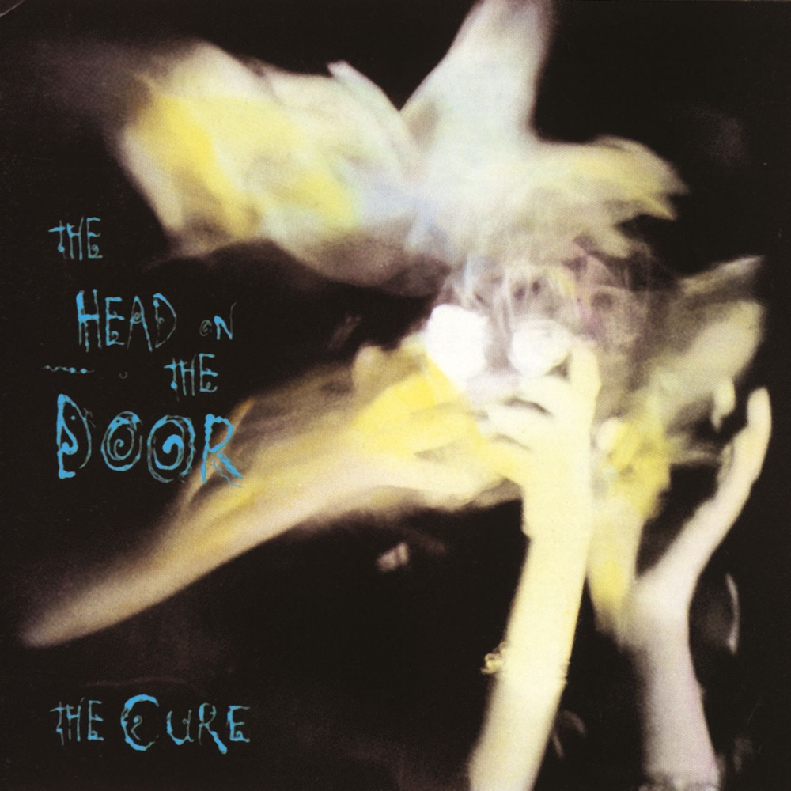

*图：《The Head on the Door》（1985，Fiction）封面。黑底上一团晃动的黄白光迹，左侧蓝色手写体专辑名。图片来源：[Apple Music](https://music.apple.com/us/album/the-head-on-the-door/282971465)。*

一九八五年八月，《The Head on the Door》发行。Melody Maker 的评语很朴素："一堆流行歌。"先行单曲`In Between Days`打进了英国单曲榜前二十。悲情的乐队学会了写阳光下的东西——虽然那阳光底下仍然垫着阴影。

一九八七年五月，双专辑《Kiss Me, Kiss Me, Kiss Me》发行，在法国 Correns 的 Miraval 录音室录制。Smith 说这张专辑"像过去十年我们所做之事的终结，一张回顾式的单曲合集"。它里面同时住着`Just Like Heaven`的眩晕和`One Hundred Years`的漫长黑暗。

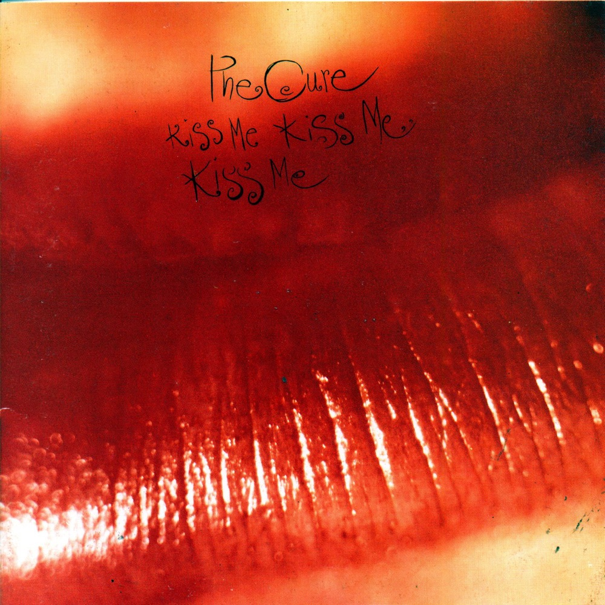

*图：《Kiss Me, Kiss Me, Kiss Me》（1987，Fiction）封面。满幅红橙色嘴唇特写。图片来源：[Apple Music](https://music.apple.com/us/album/kiss-me-kiss-me-kiss-me/31739756)。*

## 五、Disintegration：海洋般绝望，又完全闪烁

一九八九年五月，《Disintegration》发行，David M. Allen 联合制作。这是 The Cure 的第八张录音室专辑，也是他们把"悲情"做到极致、又第一次被主流世界完全接住的一张。

Pitchfork 的三部曲回顾评论里有一句话，常被引用：The Cure 后来做出了《Disintegration》——"一张既海洋般绝望、又完全闪烁美丽的专辑，你会想象幽灵情侣在上面跳华尔兹"。

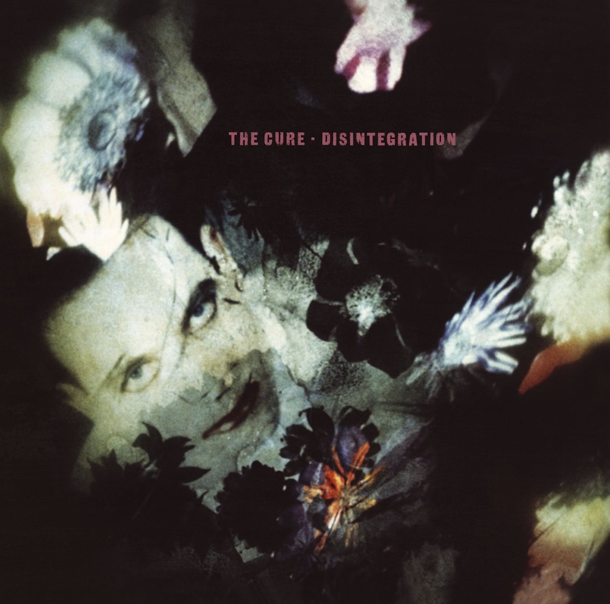

*图：《Disintegration》（1989，Fiction）封面。灰白花朵簇拥中一张苍白模糊的脸，头发融进花影。图片来源：[Apple Music](https://music.apple.com/us/album/disintegration-2010-remaster/372100016)。*

`Lullaby`成为他们在英国本土榜单位置最高的单曲——第五名；`Lovesong`冲进美国 Billboard Hot 100 第二，是乐队在美国排名最高的歌；`Pictures of You`成为一代人关于失去的背景音乐。也是在这一年，键盘手 Lol Tolhurst 离队——之后他和乐队打了官司，又和解。这个乐队聚散的方式，和他们写歌的方式一样：激烈、漫长、最后留下一个温柔的回声。

一九九〇年十一月，他们在两张录音室专辑之间发行了混音专辑《Mixed Up》，收录新单曲`Never Enough`。Smith 说这张唱片是"《Disintegration》的阴郁之后的一点乐子"。

一九九二年四月，《Wish》发行，英国榜第一、美国榜第二，是他们商业上最成功的专辑。`Friday I'm in Love`成了流行文化的一部分。悲情乐队写出了世界上最快乐的歌之一——这不矛盾，这就是 The Cure。

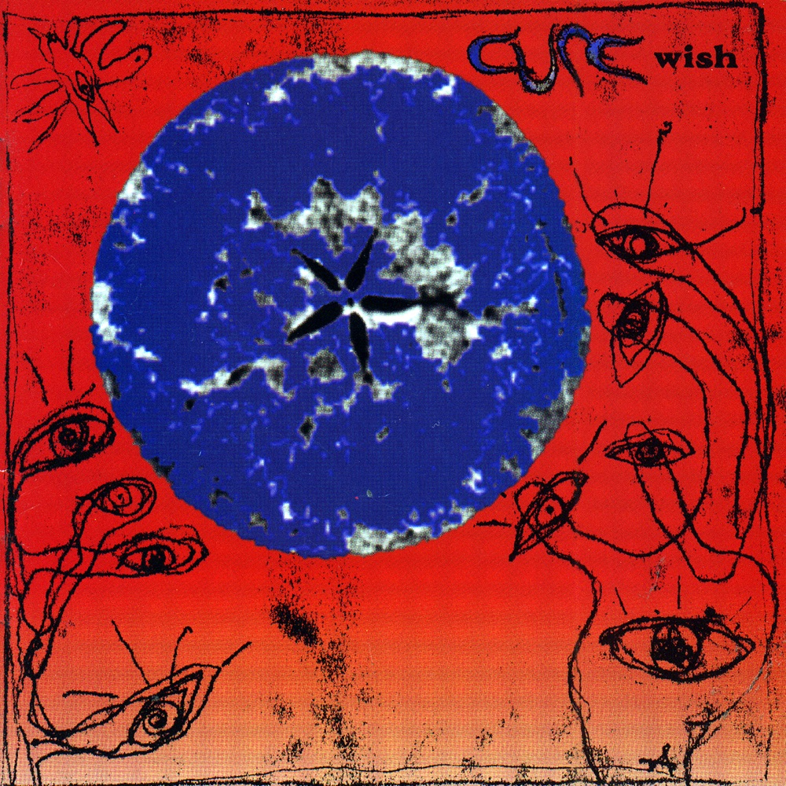

*图：《Wish》（1992，Fiction）封面。橙红底上蓝色圆盘，四周画满潦草的眼睛。图片来源：[Apple Music](https://music.apple.com/us/album/wish/301011929)。*

## 六、Wild Mood Swings：一次盛大的失手

然后是一九九六年五月六日，《Wild Mood Swings》。

这张专辑是 The Cure 生涯里被谈论得最多的一次失手。录音从一九九四年末开始，制作人 Steve Lyon 和 Smith，地点在 Bath 附近的 St Catherine's Court——一座都铎庄园，The Cure 是第一支在这里录音的乐队，几年后 Radiohead 在这里录了《OK Computer》。鼓手 Boris Williams 已经离队，新鼓手 Jason Cooper 还没站稳——整张专辑用了四位鼓手。2004 年 Smith 对 Rolling Stone 回忆："我们每周换一个鼓手。我常常记不住那天打鼓的人叫什么名字。"专辑里有真实的弦乐四重奏、铜管、印度乐团和墨西哥小号——Smith 说："这张专辑里的一切都是真的。"

专辑在英国榜第九、美国 Billboard 200 第十二。单曲依次是`The 13th`、`Mint Car`、`Strange Attraction`、`Gone!`。`The 13th`带着一种"疯掉的 salsa 感"（Smith 自己的话），乐迷不买账。

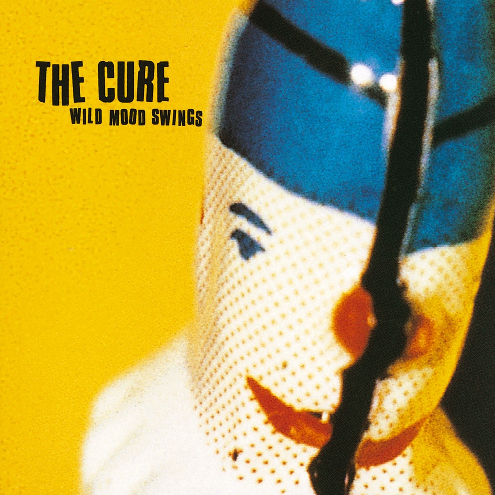

*图：《Wild Mood Swings》（1996，Fiction）封面。亮黄底上一个波普小丑脸，红鼻头、笑唇、蓝帽，一条黑线贯穿。图片来源：[Apple Music](https://music.apple.com/us/album/wild-mood-swings/300954542)。*

但最值得记下的是 Smith 自己的态度翻转。一九九六年专辑刚发行时，他说："我们对《Wild Mood Swings》的分歧评价感到惊讶，因为我觉得它真的很好"，甚至说它是"我们做过的最好的东西"。他还说英国媒体再次恨他们，反而让他觉得自在："《Wish》发行时我们突然成了英国记者的最爱，那才让我们有点不安。"

八年后的二〇〇四年，在 Rolling Stone 的回顾访谈里，他改了口："这张专辑的毛病是太长，而且不连贯。我想用不同的风格写作，想让乐队听起来像不同的乐队……它发行的时候被痛骂，乐迷也讨厌它。这是我唯一一次大失所望。"

同一张专辑，两种完全相反的评价，出自同一个人，隔了八年。这也许比专辑本身更接近"wild mood swings"这个标题的本意。

## 七、血色花与失落的世界

二〇〇〇年二月，《Bloodflowers》发行。Smith 说这是"三部曲"的第三部——《Pornography》《Disintegration》《Bloodflowers》。之后乐队一度打算解散。

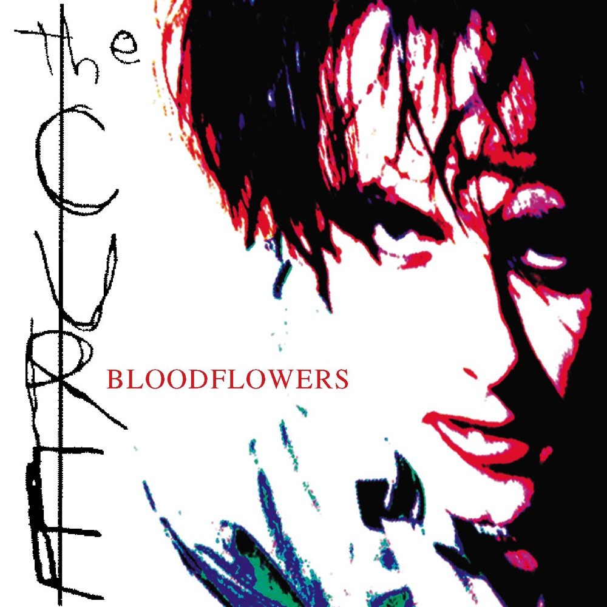

*图：《Bloodflowers》（2000，Fiction/Polydor）封面。黑底上一张过曝感的人像，红色阴影。图片来源：[Apple Music](https://music.apple.com/us/album/bloodflowers/154235718)。*

二〇〇四年六月，同名专辑《The Cure》发行，Ross Robinson 制作，更硬、更直接。二〇〇八年，《4:13 Dream》。然后，是十六年的沉默。

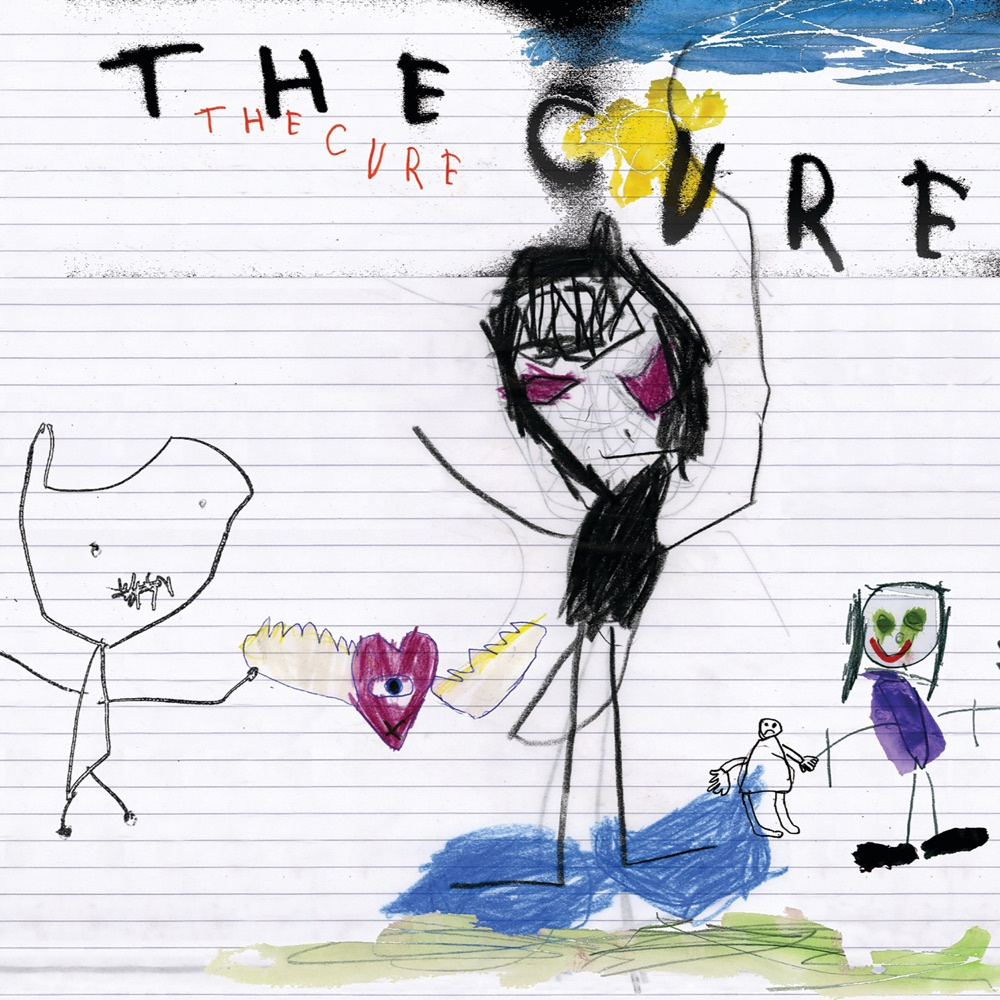

*图：《The Cure》（2004，Geffen）封面。白纸上的儿童涂鸦与剪贴大字。图片来源：[Apple Music](https://music.apple.com/us/album/the-cure/1449750728)。*

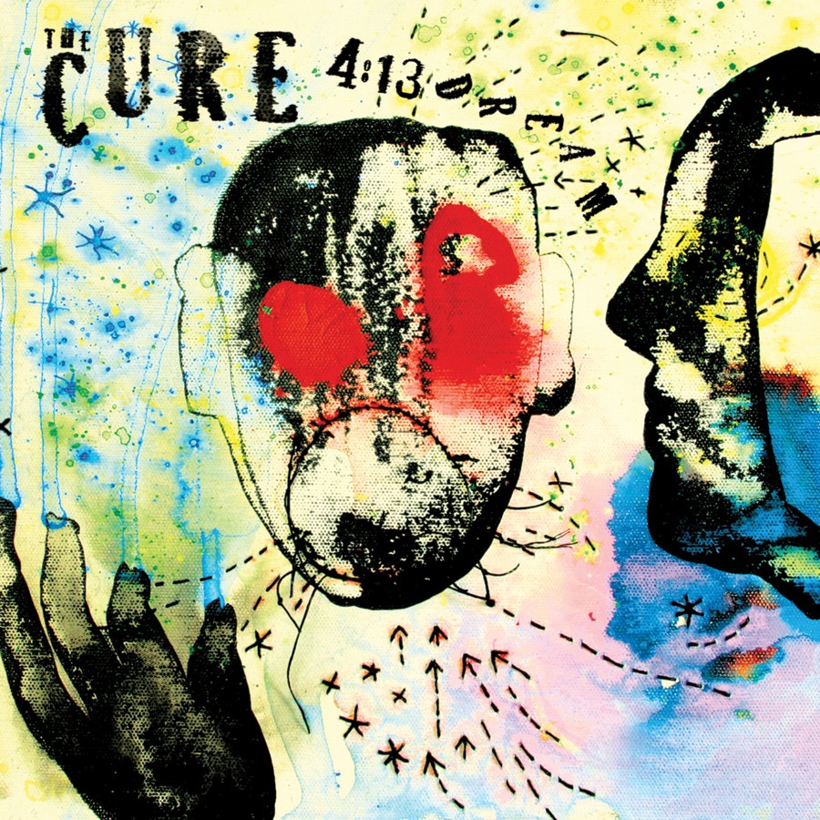

*图：《4:13 Dream》（2008，Suretone/Geffen）封面。米白底上的稚拙涂鸦脸孔与手掌印。图片来源：[Apple Music](https://music.apple.com/us/album/4-13-dream/1443618164)。*

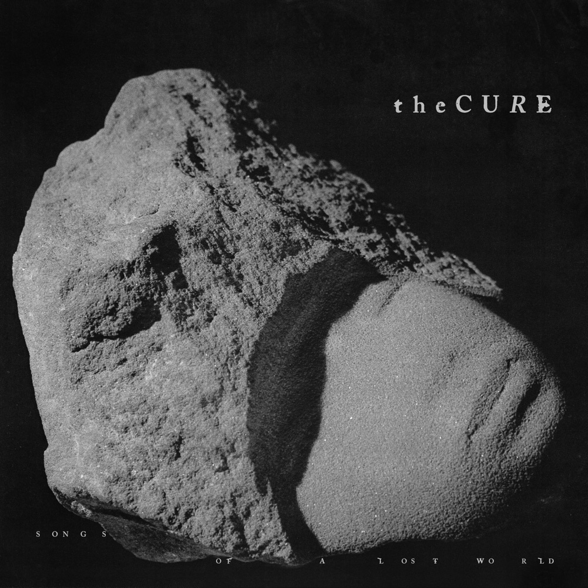

*图：《Songs of a Lost World》（2024，Fiction/Lost Music）封面。黑布上躺着一尊粗糙的石雕人头。图片来源：[Apple Music](https://music.apple.com/us/album/songs-of-a-lost-world/1768728131)。*

二〇二四年十一月一日，《Songs of a Lost World》发行——十六年来第一张全新专辑，所有歌曲由 Robert Smith 独立作曲，这是多年来的第一次。这一次没有失手：Metacritic 93 分，AllMusic 四星半，Clash 给了九分。专辑在多国登顶。二〇一九年，他们入选摇滚名人堂；二〇二六年二月，第68届格莱美把最佳另类音乐专辑（《Songs of a Lost World》）和最佳另类音乐演奏（`Alone`）都给了他们——乐队成立五十年，第一次拿到格莱美。这一年 Smith 六十五岁，仍然画着标志性的黑色口红和晕开的眼睛。

从十七秒的雾，到失落的世界，四十四年。

## 八、口红之下

人们总在问 Robert Smith 是不是 goth。他多次否认这个标签——他们从不自称哥特乐队，是外界把教堂、雾、口红和黑衣服归在一起，造出了这个词。但不管标签贴不贴，The Cure 给了无数人一种许可：悲伤可以是美的，脆弱可以大声，男孩可以化妆。

从 Obelisk 到 Malice 到 Easy Cure 再到 The Cure，Smith 和他的同学在一座小镇的教堂大厅里排练 Bowie 和 Hendrix。五十年过去，那个在钢琴前第一次登台的中学生，变成了画着黑色口红、头发乱得像爆炸的摇滚偶像，又在六十五岁交出一张 Metacritic 九十三分的专辑。这支乐队横跨了几代人的青春期，却始终在做同一件事：把说不出口的难过，唱成可以跟着点头的节奏。

他们影响了 Placebo、Interpol、Muse、The Smashing Pumpkins、Deftones、My Chemical Romance——这份名单可以很长。但最准确的描述也许是：The Cure 没有发明黑暗，他们只是第一个把黑暗唱得让人想跟着跳舞的人。

悲情三部曲问的是绝望的形状；Wild Mood Swings 问的是快乐的形状；《Songs of a Lost World》问的是，当一个人失去了一切之后，歌还能不能唱。

答案在二〇二四年十一月的榜单上，也在每一个跟着`A Forest`的回声哼唱的人嘴里。

## 唱片一览（录音室专辑）

| 唱片 | 年份 | 厂牌 |
|---|---:|---|
| 《Three Imaginary Boys》 | 1979 | Fiction |
| 《Seventeen Seconds》 | 1980 | Fiction |
| 《Faith》 | 1981 | Fiction |
| 《Pornography》 | 1982 | Fiction |
| 《The Top》 | 1984 | Fiction |
| 《The Head on the Door》 | 1985 | Fiction |
| 《Kiss Me, Kiss Me, Kiss Me》 | 1987 | Fiction |
| 《Disintegration》 | 1989 | Fiction |
| 《Wish》 | 1992 | Fiction |
| 《Wild Mood Swings》 | 1996 | Fiction |
| 《Bloodflowers》 | 2000 | Fiction/Polydor |
| 《The Cure》 | 2004 | Geffen |
| 《4:13 Dream》 | 2008 | Suretone/Geffen |
| 《Songs of a Lost World》 | 2024 | Fiction/Lost Music |

另：《Mixed Up》（1990，混音专辑）、现场专辑《Concert》《Entreat》《Show》《Paris》《Bestival Live 2011》、精选《Galore》《Greatest Hits》。

## 推荐聆听路线

1. **悲情三部曲按顺序听完：**《Seventeen Seconds》→《Faith》→《Pornography》——从雾到教堂到火
2. **转折：**`A Forest`、`Primary`、`The Hanging Garden`、`One Hundred Years`
3. **学会流行之后：**《The Head on the Door》《Kiss Me, Kiss Me, Kiss Me》
4. **巅峰：**《Disintegration》——`Pictures of You`、`Lullaby`、`Lovesong`、`Closedown`
5. **快乐的那一面：**《Wish》——`Friday I'm in Love`、`High`
6. **那次失手：**《Wild Mood Swings》——`Mint Car`、`The 13th`（自己判断它到底好不好）
7. **四十四年后的回答：**《Songs of a Lost World》——`Alone`、`A Fragile Thing`

## 资料与图片来源

- 维基百科：[The Cure](https://en.wikipedia.org/wiki/The_Cure)；[《Seventeen Seconds》](https://en.wikipedia.org/wiki/Seventeen_Seconds)；[《Faith》](https://en.wikipedia.org/wiki/Faith_(The_Cure_album))；[《Pornography》](https://en.wikipedia.org/wiki/Pornography_(album))；[《Wild Mood Swings》](https://en.wikipedia.org/wiki/Wild_Mood_Swings)；[《Disintegration》](https://en.wikipedia.org/wiki/Disintegration_(The_Cure_album))；[《Songs of a Lost World》](https://en.wikipedia.org/wiki/Songs_of_a_Lost_World)
- Pitchfork：[三部曲豪华版回顾（7.5）](https://pitchfork.com/reviews/albums/11706-seventeen-seconds-faith-pornography/)；[《Songs of a Lost World》](https://pitchfork.com/reviews/albums/the-cure-songs-of-a-lost-world/)
- Rolling Stone：[1982《Pornography》乐评（J.D. Considine）](https://www.rollingstone.com/music/music-album-reviews/pornography-198684/)；[Robert Smith 回顾目录访谈（2004，Bill Crandall）](https://www.rollingstone.com/music/music-news/the-cures-discography-robert-smith-looks-back-246129/)
- Apple Music：[The Cure 唱片目录](https://music.apple.com/us/artist/the-cure/566519)
