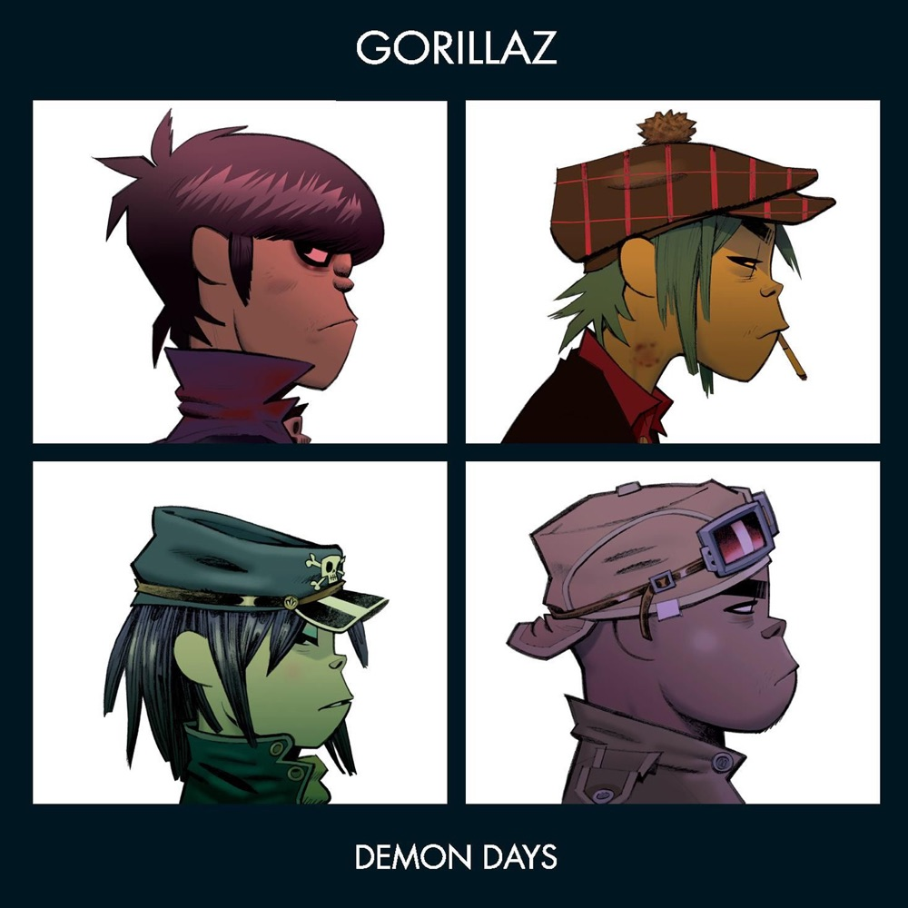
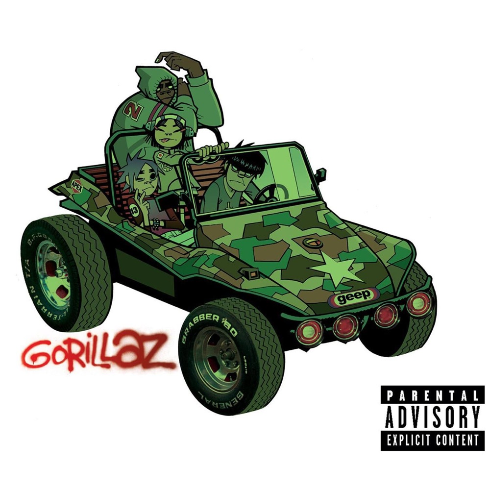
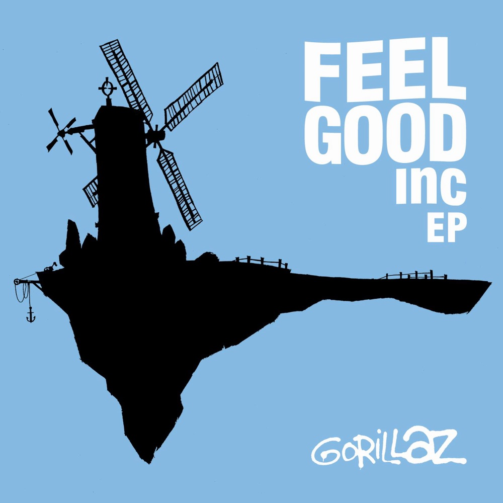
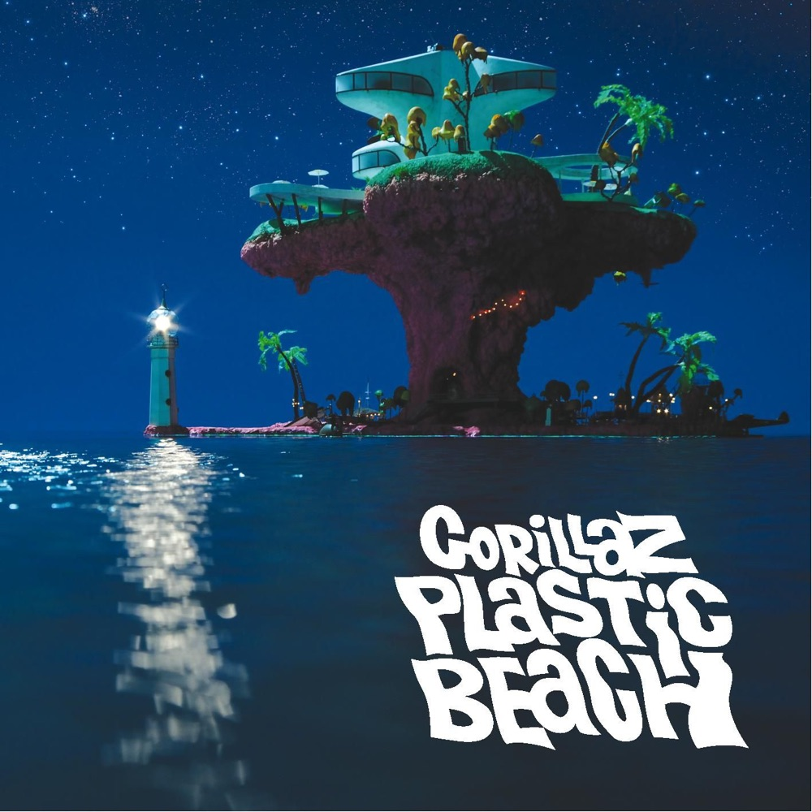
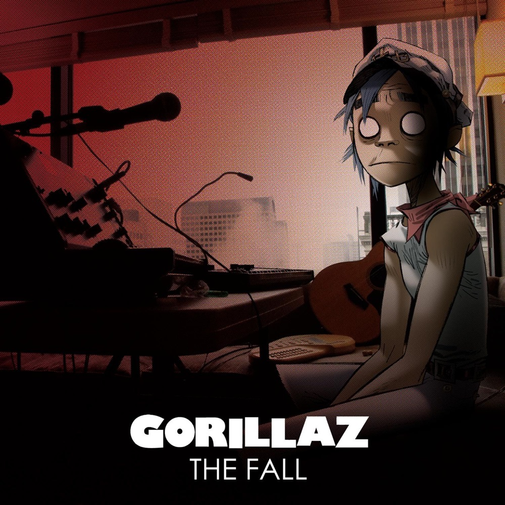
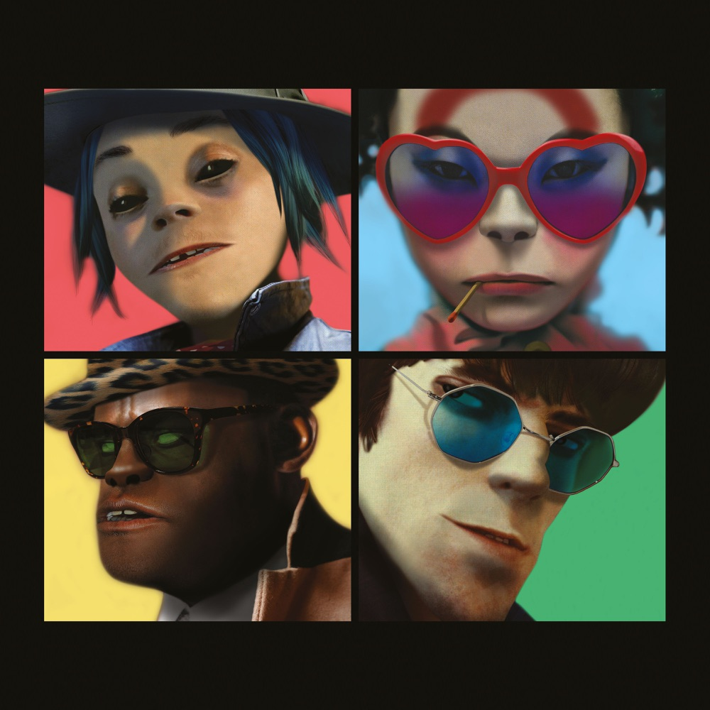
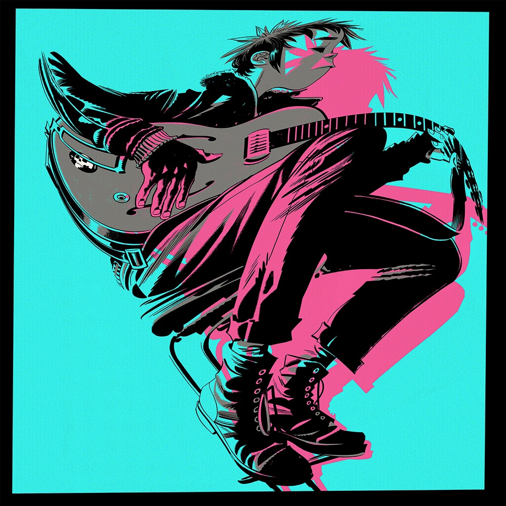
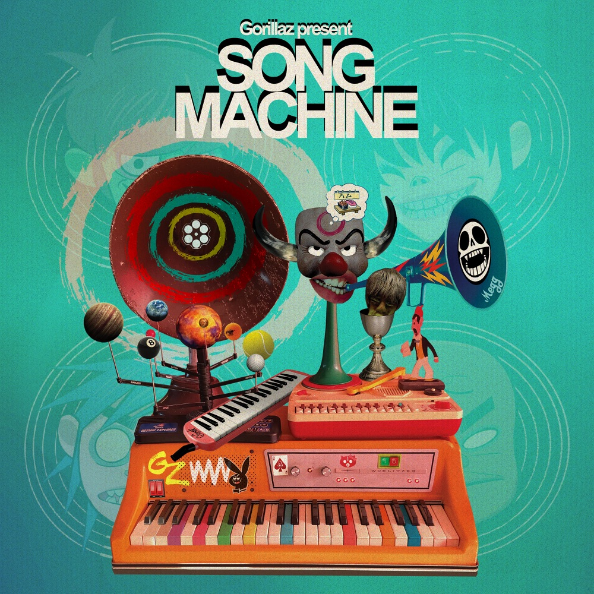
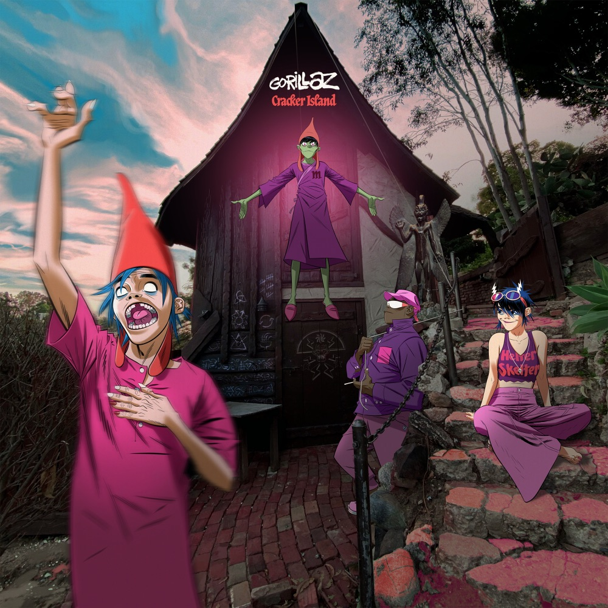
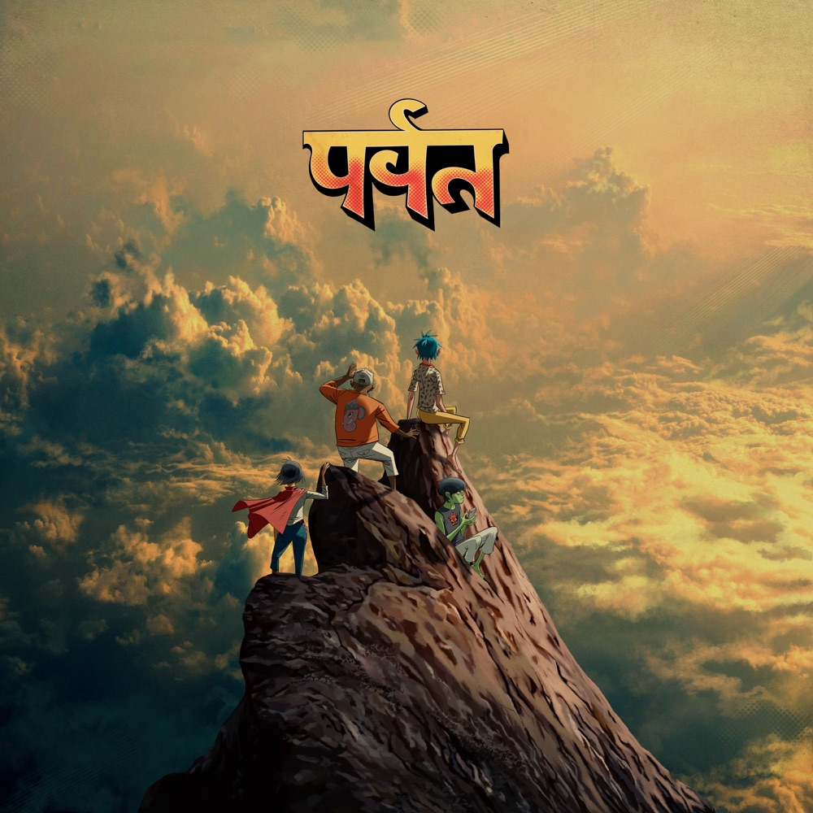

# 风车悬在坏天气里：Gorillaz 的虚拟世纪

*图：《Demon Days》（2005，Parlophone／Virgin）封面。2-D、Murdoc、Noodle 与 Russel 被置于四格肖像中，像一支从唱片架背面凝视现实的乐队。图片来源：[Apple Music](https://music.apple.com/us/album/demon-days/850571319)。*

先是一阵笑。

不是朋友见面时的笑，不是舞池里突然认出熟人的笑；它低沉、夸张、带着扩音器和电视节目主持人的质地，像高楼顶端有人按下罐头笑声按钮，命令整座城市开心。随后贝斯出现，短促、黏稠、循环不止。Damon Albarn 借 2-D 的声音唱世界如何在风里打转，De La Soul 从另一扇门撞进来，笑声更大，节拍更紧。忽然，原声吉他把墙面划开，远处有浮岛，有风车，有一小块似乎尚未被商品和屏幕占领的蓝天。

这就是 `Feel Good Inc.`。歌名叫“感觉良好股份有限公司”，音乐却从不真正让人放松。它把快乐做成一间公司，把舞蹈做成强制劳动，又在副歌里留下逃跑路线。二〇〇五年，它随《Demon Days》进入广播、电视、MP3、iPod 广告和刚开始扩张的视频网络；二十多年后，那条贝斯线依旧像城市地下的电缆。

Gorillaz 的故事也从这种矛盾开始：一支不存在的乐队，做出了异常真实的音乐；四个没有血肉的角色不断老去、换衣、受伤、失踪，而站在他们背后的真人反而可以隐藏、交换位置、邀请陌生人进入。

虚构不是逃避现实。

虚构是他们用来拆现实的工具。

## 一、看了太久的 MTV

一九九〇年代末，Damon Albarn 已因 Blur 成为英国流行文化中极易辨认的脸；Jamie Hewlett 则以漫画《Tank Girl》闻名。两人在伦敦同住，经常看 MTV。Guardian 2017 年的访谈回顾，Gorillaz 的最初念头一方面来自他们觉得许多流行乐队接受采访时乏味，另一方面来自 Albarn 想匿名尝试 Blur 无法容纳的嘻哈。于是，一个反讽式问题出现了：既然流行工业本来就在生产人物，为什么不直接制造一支乐队，并让制造过程本身成为作品？

Gorillaz 于一九九八年形成。Hewlett 画出四名虚拟成员：蓝发、黑眼的主唱兼键盘手 **2-D**；绿色皮肤、尖牙和危险自恋的贝斯手 **Murdoc Niccals**；从日本来到英国、携带吉他与神秘过去的 **Noodle**；身形巨大、被幽灵和嘻哈记忆包围的鼓手 **Russel Hobbs**。

这些是角色，不是真实传记。2-D 没有在录音室里真正唱歌，Murdoc 没有独自弹完贝斯，Noodle 与 Russel 的人生事件也属于跨媒体叙事。现实中的 Gorillaz 以 Albarn 的作曲、演唱与制作劳动为音乐轴心，以 Hewlett 的人物、封面、动画、场景和艺术指导为视觉轴心，再向制作人、乐手、说唱者、灵魂歌手、合唱团、管弦乐团不断打开。角色资料、音乐录像、官网房间与官方读物共同制造“乐队历史”，但不能把那套故事误写成真人经历。

*图：首张专辑《Gorillaz》（2001）封面。四名动画成员挤在军绿色越野车中；Hewlett 的漫画世界与音乐第一次以专辑规模结合。图片来源：[Apple Music](https://music.apple.com/us/album/gorillaz/850576570)。*

二〇〇一年，首张同名专辑发行。制作人 Dan the Automator 带来地下嘻哈、dub 和采样结构，Kid Koala 处理唱盘，Del the Funky Homosapien 在 `Clint Eastwood` 与 `Rock the House` 中说唱。`Clint Eastwood` 以低速鼓组、melodica 和空旷的副歌让声音像荒废的西部片布景；Del 的说唱紧张、灵活，Albarn 的旋律却疲惫得几乎懒得睁眼。两种意识住进同一具卡通身体。

Pitchfork 当时给专辑 7.0 分，批评“虚拟乐队是真正作者”这一幻觉并不成立，因为 Albarn 与 Dan the Automator 的痕迹太清楚；评论甚至判断项目可能只是一次性的时髦副业。这个误判如今很有意思：它准确看出作者无法完全隐身，却低估了角色可以持续改写作者关系。二十五年后，Gorillaz 不但没有消失，反而证明“乐队”可以是一套不断换乘员的交通系统。

首专时期的现场演出把真人乐手藏在幕布后，观众主要面对投影角色；官网中的 **Kong Studios** 则允许人进入房间、看物件、玩游戏、发现故事碎片。在成熟社交媒体出现之前，他们已经把唱片、音乐录像、游戏、网站和粉丝考据连接成可探索的世界。

## 二、黑夜开始：《Demon Days》

首张专辑的成功之后，Albarn 找来 Danger Mouse 共同制作第二张专辑。他听过后者将 Beatles《白色专辑》与 Jay-Z《黑色专辑》混合而成的 *The Grey Album*，看中的是一种把互不相干的材料放进同一空间、仍能保持方向的能力。

《Demon Days》比首专更暗，也更集中。它不是严格讲述单一故事的摇滚歌剧，却有清楚的夜行曲线：从不祥的 `Intro` 进入枪支、战争、消费、孤立和资源掠夺构成的城市；经过 `Dirty Harry`、`Feel Good Inc.` 与 `DARE` 等公共高峰；再由寓言 `Fire Coming Out of the Monkey’s Head` 转向 `Don’t Get Lost in Heaven`，最终落到 London Community Gospel Choir 唱出的标题曲。像一辆车穿过没有路灯的区域，直到天边出现不确定的亮色。

Billboard 在二〇〇五年发行前报道中确认，专辑由 Albarn 与 Danger Mouse 共同制作，并收纳了 De La Soul、MF DOOM、Bootie Brown、Roots Manuva、Martina Topley-Bird、Shaun Ryder、Ike Turner、Dennis Hopper 等完全不同的声音；San Fernandez Youth Chorus、弦乐与伦敦社区福音合唱团也进入曲序。这不是客席名单的炫耀，而是一套角色系统：每个人只在最合适的门口出现。

`Kids with Guns` 用冷低音和儿童武器意象制造缓慢恐慌；`Dirty Harry` 让儿童合唱的明亮声部与 Bootie Brown 的士兵视角相撞；`Every Planet We Reach Is Dead` 把 Ike Turner 的键盘推向破败灵魂乐；MF DOOM 在 `November Has Come` 里戴着另一副面具走进动画宇宙；`DARE` 则让 Shaun Ryder 粗粝的口号式人声与 Noodle 的明亮重复共同点燃霓虹舞池。

*图：《Feel Good Inc.》EP（2005）的 Apple Music 地区版封面：蓝天中悬着黑色浮岛，风车在上方转动。图片来源：[Apple Music](https://music.apple.com/us/album/feel-good-inc-ep/693620734)。*

## 三、快乐公司如何运转

`Feel Good Inc.` 于二〇〇五年五月九日在英国等地发行。De La Soul 参与录制；歌曲后来进入十七个国家或地区的前十，在美国 Billboard Hot 100 排至第十四。Recording Academy 的当前资料显示，Gorillaz 共获得一次格莱美、十二次提名；唯一获奖作品就是这首歌——二〇〇六年最佳流行演唱合作奖。它同时获得年度制作与最佳音乐录像提名。

但是数字只说明传播规模，不说明它为什么留下。

听觉上，这首歌由三块互相排斥的空间组成。

第一块是**贝斯牢房**。riff 很短，切分、循环，几乎没有发展；吉他和鼓不把空间填满，反而让每次重复都更明显。它像一条企业宣传片的背景音乐被卡在同一秒钟，快乐必须准时、稳定、可复制。

第二块是**De La Soul 的闯入**。Trugoy the Dove 的笑声先于说唱出现，像主持人、老板、马戏团领班，也像有人看见这套荒谬机制之后笑得停不下来。Albarn 当年告诉 Billboard，这首歌原本并非为 De La Soul 准备，但三人听见节拍就开始跳舞，那种顽皮感正适合歌曲。说唱段更响、更具身体性，与 2-D 薄、倦、近乎失重的声线形成压迫者与内心独白般的对位。

第三块是**风车天空**。原声吉他突然出现，旋律打开，2-D 唱“风车为这片土地转动”。音乐录像中，Noodle 坐在悬浮岛上，风车缓慢旋转；地面的城市则被高塔、屏幕、笑声和追逐包围。那个天空是真正的自由，还是公司给员工播放的自由广告？歌曲没有回答。副歌每次打开，贝斯牢房随后又回来。

所以 `Feel Good Inc.` 不是简单的反消费口号。它更准确地模拟消费机制：让批评本身也好听，让你一边理解快乐可能被制造，一边仍然无法停止跳舞。

Pitchfork 在《Demon Days》原评中给出 6.9 分，认为专辑高低不齐，却承认 Danger Mouse 色彩浓密的制作让各种迷恋经常成功拼合，并特别注意到 `Feel Good Inc.` 的焦虑贝斯线与 De La Soul 的突入。Guardian 给出 4/5，NME 为 8/10，AllMusic 则给予满分评价。它在当时并非毫无争议的神作，后来却越来越像时代文件：枪支、战争、石油、媒体偶像和被强迫的快乐并没有过期，反而变得更贴身。

*图：《Demon Days》封面再次出现。四格布局明显令人联想到经典流行乐队肖像，但人物的黑眼、尖牙与侧脸让它更像媒体档案里的通缉照。*

## 四、不是反战宣言，而是战时天气

《Demon Days》发行于九一一之后、阿富汗与伊拉克战争、二十四小时新闻循环和“为石油而战”公共争论构成的时代。可以把它读成一张战时唱片，但不宜把每首歌机械配给某条新闻，也不能声称 Albarn 为反对某一场战争而写下全部内容。

更准确的说法是：战争成为空气。

`Dirty Harry` 的沙漠影像、儿童合唱和士兵说唱让童真与军事机器同框；`Fire Coming Out of the Monkey’s Head` 由 Dennis Hopper 讲述一群陌生人闯入幸福山谷、挖掘地下资源，最终遭到巨山报复；`Kids with Guns` 担忧儿童与武器越来越接近；`O Green World` 则在受损自然与失效关系之间摇晃。专辑没有政策主张，只有世界正在变坏的身体感觉。

Albarn 把曲序描述为穿过黑夜、面对个人恶魔的旅程。末尾两首歌因此重要：`Don’t Get Lost in Heaven` 以近似 Beach Boys 的和声把人从寓言废墟里抬起，`Demon Days` 的福音合唱则不承诺问题解决，只反复要求“振作起来”。救赎不是胜利，而是在坏天气里仍愿意向他人发出声音。

这也是 Gorillaz 比一般“概念项目”耐久的原因：他们的政治不是角色站出来发表演说，而是不同音乐传统被迫同处。儿童合唱、地下说唱、英伦旋律、福音、灵魂乐、dub 与电子节拍在一张大众唱片里相遇，本身就是对类型边境的拆除。

## 五、塑料岛上的豪华晚宴

*图：《Plastic Beach》（2010）封面。夜色中的人造岛漂在海上，垃圾、建筑、灯塔与棕榈树堆成一处过度美丽的废弃物奇观。图片来源：[Apple Music](https://music.apple.com/us/album/plastic-beach/850569437)。*

二〇一〇年的《Plastic Beach》把隐约的环境焦虑变成完整地理。Albarn 曾在住处附近海滩观察沙里的塑料，也在马里看到动物生活于腐烂塑料形成的新生态；这促使他思考一个矛盾：塑料并非来自自然之外，它由地球材料制造，却以人类难以控制的方式回到环境。

于是，海滩不再是净土，而是消费文明的垃圾汇流点。音乐也使用同一种构造：Snoop Dogg、Bobby Womack、Mos Def、Lou Reed、De La Soul、Little Dragon、Mark E. Smith、Mick Jones、Paul Simonon，加上阿拉伯乐团、Sinfonia Viva 与 Hypnotic Brass Ensemble，像不同年代和地区的漂流物被冲到一座岛上。

`Stylo` 的冷硬电子低音被 Bobby Womack 的灵魂声线撕开；`Superfast Jellyfish` 把速食早餐广告变成说唱拼贴；`Empire Ants` 前半像海面薄光，Little Dragon 的 Yukimi Nagano 在中段把它推入电子潮汐；`On Melancholy Hill` 则以温柔合成器写一首无法完全实现的情歌。甜美没有解决生态灾难，只是在塑料岛上临时搭起私人避难所。

Pitchfork 给《Plastic Beach》8.5 分，称它是 Gorillaz 最动人、最独特而亲切的专辑，并写道此时动画噱头已不再重要——“Gorillaz 变成了真的”。Guardian 同样给出 4/5，肯定 Albarn 的万花筒式雄心。分歧主要在于后半段究竟是丰富还是拥挤；但这两种感受恰好都符合一座由过量物品构成的岛。

现场也在变化。早期真人躲在幕布后，《Demon Days Live》以剪影和上方影像维持角色幻觉；二〇〇六年格莱美使用 Musion Eyeliner 技术，让 Gorillaz 与 Madonna 以“伪全息”方式同台。二十年后，Albarn 与 Hewlett 回忆：电视上效果惊艳，现场却很糟，因为透明幕无法承受足够响的低音和鼓。到《Plastic Beach》巡演，完整真人乐队走到灯光下，动画不再假装替代乐手，而成为与演出并行的叙事层。

## 六、旅途中做成的《The Fall》

*图：《The Fall》（2010／2011）封面。2-D 坐在旅馆与临时录音设备之间，画面像长途巡演后的疲惫自拍。图片来源：[Apple Music](https://music.apple.com/us/album/the-fall/850585388)。*

《Plastic Beach》之后的《The Fall》规模突然缩小。Albarn 在二〇一〇年北美巡演途中主要使用 iPad 录制，每座城市、酒店和道路都留下片段；它在圣诞节先向 Gorillaz 粉丝俱乐部成员开放，之后正式发行。

这不是《Plastic Beach》那种巨型客席盛宴，而像公路日志：机场、沙漠、城市灯光、应用程序音色和失眠混成低分辨率明信片。把它列为第四张录音室专辑很重要，因为它证明 Gorillaz 不只等于昂贵动画与明星网络；项目也可以只是一个人在移动中，用当时最新的消费电子设备记录漂移。

## 七、世界结束前的派对

相隔多年，《Humanz》（2017）把 Gorillaz 重新设计为一场世界崩塌前的派对。Vince Staples、Popcaan、Pusha T、Mavis Staples、Grace Jones、Kelela、Danny Brown、Benjamin Clementine 等声音轮流进入，Albarn／2-D 有时反而退到边缘。专辑设想一个政治灾难已经发生、但不直接说出事件名称的夜晚：不同人如何在同一栋楼里跳舞、恐惧、争吵和寻找出口。

*图：《Humanz》（2017）封面。四名角色再次进入四格构图，却以更接近三维渲染和社交媒体头像的面貌出现。图片来源：[Apple Music](https://music.apple.com/us/album/humanz/1215772681)。*

Guardian 和 NME 均给出 4/5，Pitchfork 为 6.9。正面评价肯定多声部政治共同体，保留意见则指出它更像散射的歌曲集合，动画四人组与 Albarn 的核心存在感变弱。这种争议碰到 Gorillaz 最根本的问题：如果任何人都能加入，Gorillaz 到底是谁？

答案可能不是人，而是方法。

紧接着的《The Now Now》（2018）缩减客席，重新把 2-D／Albarn 放到中心。`Humility` 有 George Benson 的吉他，`Tranz` 以重复合成器和处理人声制造恍惚，`Kansas`、`Souk Eye` 则让巡演疲惫与情感距离慢慢显影。它比《Humanz》精简、连贯，也因此少了角色碰撞产生的危险。

*图：《The Now Now》（2018）封面。2-D 在青蓝、粉红与黑色线条里弹吉他，人物重新成为孤独中心。图片来源：[Apple Music](https://music.apple.com/us/album/the-now-now/1387814084)。*

## 八、把专辑变成频道

二〇二〇年的 *Song Machine* 不先宣布一张完整专辑，而按“剧集”逐月发布歌曲与音乐录像。Robert Smith、Beck、Schoolboy Q、Fatoumata Diawara、Elton John、6LACK、St. Vincent、JPEGMAFIA、Peter Hook 等人像来宾一样进入节目。最终形成《Song Machine, Season One: Strange Timez》。

*图：《Song Machine, Season One: Strange Timez》（2020）封面。人物、喇叭、机械和控制台构成一台会不断接入客席的“歌曲机器”。图片来源：[Apple Music](https://music.apple.com/us/album/song-machine-season-one-strange-timez/1530806008)。*

这种格式可能比传统唱片更适合 Gorillaz：他们从来就像一个频道，而不是封闭阵容。每首歌可以更换类型、城市和客席，Hewlett 的动画则确保频道仍有共同视觉。`Désolé` 中 Fatoumata Diawara 与 Albarn 的呼应从道歉与离别扩展成共同歌唱；`Aries` 让 Peter Hook 的贝斯进入明亮公路；`The Pink Phantom` 把 Elton John 与 6LACK 放进同一间幽灵舞厅。

《Song Machine》在 Metacritic 获得项目后期最高的一批综合评价。它不是靠回到首专或《Demon Days》的声音，而是把二〇〇一年建立的互联网连续剧基因转译为流媒体时代的发布机制。

## 九、邪教岛与算法回音室

*图：《Cracker Island》（2023）封面。角色站在好莱坞山麓般的宅邸与道路间，现实布景和动画人物互相渗透。图片来源：[Apple Music](https://music.apple.com/us/album/cracker-island/1641561652)。*

《Cracker Island》（2023）把舞台移到洛杉矶式邪教社区。Thundercat 在标题曲中用弹跳、繁密的贝斯托住精整 synth-funk，歌词写一个团体制造自己的真相，最后发现教义本来就不存在。它很适合算法时代：人不是被强行关进回音室，而是因那里舒适、重复、不断确认自己正确而主动进入。

Bad Bunny、Tame Impala、Stevie Nicks、Beck 等客席让唱片更像精密流行专辑。Guardian 与 NME 给出 4/5，Pitchfork 为 6.5；评价分歧集中在它究竟是有效提炼 Gorillaz 的长处，还是过度依赖旧招。无论如何，它成为 Gorillaz 第二张英国冠军专辑，并获格莱美最佳另类音乐专辑提名。

## 十、二〇二六：山仍在升起

*图：《The Mountain》（2026，KONG）封面。人物攀在冲出金色云海的山峰上方，天城文“पर्वत”（山）悬在天空。图片来源：[Apple Music](https://music.apple.com/us/album/the-mountain/1837237742)。*

如果在二〇二三年结束 Gorillaz 的唱片史，文章现在已经过时。二〇二六年二月二十七日，他们发行第九张录音室专辑《The Mountain》，也是自有新厂牌 **KONG** 的首张专辑。Billboard 的发行前资料显示，唱片横跨伦敦、德文郡、孟买、纽约、大马士革等地录制，十五首歌连接 Omar Souleyman、Yasiin Bey、Sparks、IDLES、Black Thought、Johnny Marr、Anoushka Shankar、Asha Bhosle、Trueno 等在世合作者，也让 Bobby Womack、Dave Jolicoeur、Tony Allen、Dennis Hopper、Mark E. Smith、Proof 等已故朋友的档案声音重新出现。

这需要谨慎理解。档案声音不是让死者“复活”，而是让项目公开承认自己的历史由许多已经离开的人共同构成。《The Mountain》不再只是一座四名动画角色居住的建筑，而像一条穿过语言、地域、生死与录音年代的山路。

专辑发行后登上英国 Official Albums Chart 第一，成为 Gorillaz 继《Demon Days》《Cracker Island》之后第三张英国冠军专辑。Billboard 引述 Official Charts Company 数据称其英国首周约三万个单位，并成为当时二〇二六年规模最大的独立发行。

二十五年前，Pitchfork 曾猜 Gorillaz 可能是一项短命副业。二十五年后，他们不但还在，而且换了自己的厂牌，把“虚拟乐队”从笑话变成一种可以容纳档案、全球合作与长期记忆的制作制度。

## 十一、谁才是真正的 Gorillaz

如果把答案写成“Damon Albarn 和 Jamie Hewlett”，当然没错，却不完整。

没有 Albarn，缺少持续写歌、唱歌、组织声音和邀请合作者的音乐轴；没有 Hewlett，缺少人物、图像、动画、房间、车辆、岛屿和不断老去的脸。但没有 Del、De La Soul、Danger Mouse、Shaun Ryder、Bobby Womack、Little Dragon、Fatoumata Diawara、Tony Allen 以及数不清的乐手，Gorillaz 也不会是今天这支乐队。

因此，Gorillaz 的真实不在角色是否真的演奏，而在合作是否真的发生。

2-D、Murdoc、Noodle、Russel 是面具，但面具不是谎言。它允许著名主唱暂时放下名人的脸，允许漫画家与音乐家拥有同等作者位置，允许说唱、dub、英伦流行、灵魂、电子、非洲音乐、阿拉伯乐团与印度古典乐器不必先争夺类型所有权。动画让边界看起来柔软，合作才真正把边界推开。

回到 `Feel Good Inc.` 的风车。地面仍有高塔、屏幕、笑声和公司；浮岛仍在远处，并不保证谁都能抵达。可是风车一直转，原声吉他每次仍会划开贝斯牢房。那不是廉价希望，而是一种结构上的坚持：即使快乐被出售，仍要在出售快乐的歌曲里留下一块不归公司所有的天空。

Gorillaz 最终没有摧毁流行工业。

他们只是画了一扇门，然后请所有奇怪的声音从那里进来。

## 九张录音室专辑

| 专辑 | 年份 | 主要方向 |
|---|---:|---|
| 《Gorillaz》 | 2001 | dub、嘻哈、另类流行与首代网络世界 |
| 《Demon Days》 | 2005 | Danger Mouse 制作；末世夜行、战争天气与跨类型群像 |
| 《Plastic Beach》 | 2010 | 生态寓言、管弦乐与豪华漂流物拼贴 |
| 《The Fall》 | 2010／2011 | iPad 与北美巡演途中完成的公路日志 |
| 《Humanz》 | 2017 | 世界崩塌前的多声部派对 |
| 《The Now Now》 | 2018 | 缩减客席、回到 2-D／Albarn 的孤独中心 |
| 《Song Machine, Season One: Strange Timez》 | 2020 | 以连续“剧集”适应流媒体时代 |
| 《Cracker Island》 | 2023 | 网络邪教、算法回音室与精整 synth-funk |
| 《The Mountain》 | 2026 | KONG 厂牌；跨地域、跨语言与档案声音的山路 |

## 推荐聆听路线

1. **从动画车库开始：**《Gorillaz》——`Clint Eastwood`、`19-2000`、`Tomorrow Comes Today`
2. **进入核心夜路：**《Demon Days》——建议完整播放；重点 `Feel Good Inc.`、`Dirty Harry`、`DARE`、`El Mañana`
3. **登上塑料岛：**《Plastic Beach》——`Stylo`、`Empire Ants`、`On Melancholy Hill`、`Rhinestone Eyes`
4. **听公路上的低分辨率日记：**《The Fall》
5. **比较扩张与收缩：**《Humanz》的 `Andromeda` →《The Now Now》的 `Tranz`、`Souk Eye`
6. **把乐队当频道：**《Song Machine》——`Désolé`、`Aries`、`The Pink Phantom`
7. **进入算法邪教：**《Cracker Island》——标题曲、`New Gold`、`Silent Running`
8. **抵达最新山路：**《The Mountain》——`Damascus`、`The Happy Dictator`、`The Empty Dream Machine`

## 资料与图片来源

- Gorillaz 官方：[gorillaz.com](https://gorillaz.com/)（九张录音室专辑目录、Kong Studios 与《The Mountain》当前阶段）
- Recording Academy：[Gorillaz Grammy Awards and Nominations](https://www.grammy.com/artists/gorillaz/10597/)（1 次获奖、12 次提名；`Feel Good Inc.` 奖项）
- Billboard：[《Demon Days》发行前制作与曲序资料](https://www.billboard.com/music/music-news/gorillaz-battle-demon-days-on-new-album-63769/)；[Albarn 谈 `Feel Good Inc.`、Danger Mouse 与剪影演出](https://www.billboard.com/music/music-news/gorillaz-gearing-up-for-live-shows-62917/)；[Gorillaz 经典歌曲回顾](https://www.billboard.com/music/music-news/gorillaz-songs-best-hits-list-7857110/)
- Billboard：[《The Mountain》发行、录音地点与合作名单](https://www.billboard.com/music/rock/gorillaz-the-mountain-new-release-damascus-1236132083/)；[英国冠军专辑报道](https://www.billboard.com/music/chart-beat/gorillaz-the-mountain-bruno-mars-number-1-uk-album-1236194068/)
- Billboard：[2025 经典专辑驻演与早期现场形态](https://www.billboard.com/music/pop/gorillaz-london-residency-albums-in-full-tickets-1235981440/)；[Albarn／Hewlett 回顾 2006 年“全息”格莱美演出](https://www.billboard.com/music/rock/gorillaz-talk-2006-hologram-grammys-performance-daft-punk-1236211223/)
- Pitchfork：[《Gorillaz》7.0](https://pitchfork.com/reviews/albums/3524-gorillaz/)；[《Demon Days》6.9](https://pitchfork.com/reviews/albums/3526-demon-days/)；[《Plastic Beach》8.5](https://pitchfork.com/reviews/albums/14008-plastic-beach/)；[《Humanz》6.9](https://pitchfork.com/reviews/albums/23146-humanz/)；[《The Now Now》6.8](https://pitchfork.com/reviews/albums/gorillaz-the-now-now/)；[《Cracker Island》6.5](https://pitchfork.com/reviews/albums/gorillaz-cracker-island/)
- Guardian：[《Demon Days》评论](https://www.theguardian.com/music/2005/may/13/popandrock.shopping3)；[《Plastic Beach》评论](https://www.theguardian.com/music/2010/mar/04/gorillaz-plastic-beach-cd-review)；[Damon Albarn／Jamie Hewlett 2017 访谈](https://www.theguardian.com/music/2017/apr/30/damon-albarn-and-jamie-hewlett-we-fight-over-everything-gorillaz-humanz-interview)
- MusicBrainz：[Gorillaz artist record](https://musicbrainz.org/artist/e21857d5-3256-4547-afb3-4b6ded592596)；[`Feel Good Inc.` 英国发行记录](https://musicbrainz.org/release/f2f131f6-058e-467d-be23-37b8cfb43fef)
- Apple Music：[Gorillaz 官方唱片目录](https://music.apple.com/us/artist/gorillaz/567072)（本文十张封面与发行元数据）
